# 2024B站最值得看的黑客教程 ｜ 网络安全／渗透测试／内网渗透／漏洞挖掘／web安全／kali linux／红队靶场／CTF／信息安全 - P65：DVWA之SQL注入漏洞 - 网络安全免费学 - BV1uBsTetEow

我们下面来看那搜库注入我们应该如何利用呢？还是用到我们昨天所拿到的靶场DVWI来给大家讲解。我们打开我们在第一节课中安装的PHP study把它启动。启动之后啊，我们打开浏览器，访问DVWI啊。

访问DVWI。好，我们访问一下，访问之后呢，可能会出现登录的操作。那默认的用户名是啊这个admin密码是password在昨天安装DVWI的时候，啊，老师已经给大家讲过了。

如果不清楚的同学可以在回头看腾讯课堂的录播啊，这个课程是有录播的那在这边呢我们首先第一步就是把DVWI的 security，它的安全设置为漏，就是最低级别的一个防御。

因为我们肯定要一步一个脚印呢去学习啊，我们点击low去然后点击socle injectionject就是socle注的英语点击它啊，我们会获得一个输入框。那这个输入框中就存在socle注漏洞。

你可以先随便输个东西试一试。比如说我输入一，点击提交哎，它就会显示几串英语。哎，它就是这个意思啊。那在这个情况下，我们应该如何利用呢。我们首先我们都知道DVWI啊是可以查看源码的。

我们第一步要做的操作就是来看开发人员是怎么写的这一条circle语句。文划到最下面，点击vio source。啊，这边呢就会出现它的源代码，这个代码呢还是PHP写的。

但是我们并不需要关心它怎么去编写这个代码。你要关心的地方就是cicle语句select啊在这个地方。就是这一句啊这一句这一句我们把它拿下来。我在之前呢已经放到了PPT中。

放到了PPT中来给大家讲解一下circle注物漏洞的利用啊，怎么攻击它。这个do了 IDD呢就是我们用户输入的内容啊，就是do了 IDD就是你输入的。我刚刚输个一，这个do了 IDD它就变成了一。

就是你可以随便输，你输个长津湖，它就变成长津湖。Okay。Yeah。这个是用户输入的内容。那这个时候我们怎么去判断它有没有cicle住漏洞呢？执行一个简单的语句就可以了。

大家注意这个语句呢我们输入记住我标红色的地方代表我输入的内容。蓝色的地方代表开发人员已经写好的内容，它写好的内容也是不能变的，不能改的。但是红色的地方我们可以随便随便输入啊，在那个输入框中。

来看一下这个时候我们做了什么事情呢？哎，这个时候我们用户输入了。一按引号and一等于一井号，这个是什么意思？先给大家讲。这个时候scle语句发生了变化，它在执行原有的查询，原有的查询应该是什么？

应该是一是吧？就是select first namelast name from user whereus IDD等于一，执行完之后它还会再执行一个语句，就是判断一等于一就判断一是否等于一。

你说一等于一不肯定对，是吧？就一等于一肯定是对的，也就是说呢一如果等于一，那这个sqcle语句就成立，我们就会有正确的输出。这个井号是什么意思？井号的意思为移除后续的搜cle语句。

就因为它这个搜cle语句哈，那后面可能还有东西，你看它还多个单引号，看到没？还多个点得多个分号，我给它。删掉就是这个意思啊。这个井号，如果你记不住的话，你就要记住这一点，你加井号。

就是把后面可能会造成影响的搜cle语句给它删掉。你现在不会改它，你就把它删掉，非常简单，就跟防御一样，我现在不知道怎么防，我就把用户输入的这些危险的语句，我都给你删掉，就跟昨天我们讲命令执行一模一样啊。

这个地方就是啊用户我们来演示一下，好吧，演示一下，就是输入这个一啊，单引号按一等于一。怎么去利用呢？在这个地方打开，我们输入一。冒号and一等于一减号，我们点击s meet，大家看到是不是有输出结果。

有同学说这种没用啊，还是有输出啊，那没关系，我们先来看这个确实是正常输出。下面一个内容是什么呢？我们再来改它哈，现再来改我们改成一等于2，改成一等于2，就是我们输入的是一单引号and一等于2井号。

那这个时候我们搜cle语句像前一步一样发生了变化，并且在执行完正常的思cle语句之后，它会判断一等不等于2。你说一等不等于2一不等于2。那所以说一等于二是错的。它是错的，就代表我们整个的搜狗语句。

你是错误的。那搜狗语句错了，还能查到数据吗？还能查到数据吗？就像你查那个呃电影票房啊去查一个电影，你这个搜狐语句查询语句都错了，它肯定就没有办法再从数据库中取出正常的数据了。

所以说你会得到一个错误的输出，或者是没有输出。我们下面来看给大家输入一下，你看一下。我们一。and一等于2井号，看好我点s meet，没有任何输出。这个时候就代表什么？

代表我们刚刚改变的这个scle语句啊，它出现了错误。那这两个东西一等于一就说明了，这就是一个判断方法，如果你输入的时候，一等于一是正确的，正常输出而一等于二明显是错误的。

它就会错误输出就代表我们输入的一等于一生效了是吧？生效了，它有在判断就证明我们输入的scle语句确实已经生效了，那就存在socle注入，能理解吗？如果不理解的话。

你按照老师的步骤打开DVWI把这两个语句，你一输看一下结果你就懂了啊，一等于一明显是正确的，正确的，它还是正确的是吧？那一等于二本来就是错的，那它还是错的。就是有搜后注入。

但是这样一个语句只能为我们判断它是否有漏洞。现在有怎么利用呢，怎么打它呢？数据库里面保存着啥。在昨天的课程一开始我讲过了数据库中保存了，比如说啊一些敏感数据，以用户注册之后。

你注册的用户名和密码都会保存在里面。你想拿到这些用户数据怎么去拿呢？我们下面就来看它的利用。大家啊先仔细听一下。首先我们判断利用的第一个步骤，就一般的步骤啊，就是如下面的所示。

第一步要判断这个数据库的列数。如果你不清楚数据库的列数是什么？大家没用过mysqcle，你是不是用过excel表格，excel表格中一个表中是不是有很多的列。这是第一列，比如说姓名是第一列。

年龄是第二第二列，身份证号是第三列，这些就叫做一列一列的列数。我们第一步就是要判断这样一个表中就相当于一个excel表中有几列数据，有几列数据。几列数据怎么判断。

就是用我们刚刚第一步演示的out by这个语句啊。有同学他不知道搜索语句，你不用知道你记住它就行。al by啊，你都给保存下来，用的时候复制粘贴就行。那比如说我们输入一单引号al by一井号啊。

我们在这书看一下，给大家看一下结果。在输入这个时候，我们点击sub meet，你会发现啊这个网站正常输出就证明它第一列是存在的。我们改成2。也正常输出，说明第二列它也在现在我们在依次的增加这个数据。

改成3。我们再点击subit，你会发现嗯网页直接没了。网页直接没了，他告诉你了，他不知道第三列是要干啥。他不知道第三列是什么意思。就是这个表就相当于是个excel表格，它只有两列，它没有三列内容。

所以说我们这时候就得到了这个数据库的表有两列，这是第一步。我们在用户输入依次增加这个out bug后面的数据，增加到三之后，你会发现网页出现报错，就证明该数据库的表有两列或者是两个字段。

它代表是一个意思啊一个意思。那下面判断为列数之后，下面就是要查看这样一个用户以及数据库。我们先来给大家演示，好吧。用union select就是联合查询。但是大家啊就是你不知道搜库语句，也不用担心。

也不需要知道。select比如说我们加上一个函数叫user，一个函数叫做daabb。我们千万不要忘记在后面加个井号，因为后面的这个scle语句可能会破坏原有的结构啊，可能会破坏原有的结构。

所以说我们要把它呢去去掉一下啊，加个井号就可以把它去掉。这时候我们点击subme，你会发现啊这网页它多了一些东西，我们来看多的是啥，多的是啥？首先多的这个地东西啊，你看这个是我们输入的scle语句是吧？

看后面两个结果。第一个root atlook host，这个是什么呢？哎，这个其实就是user这个my circlecle内置函数执行的结果返回当前数据库连接的用户。连接为管理员超级用户root。

第二个显示DVWI它执行的这个结果就是我们刚刚输入dabbase这样一个mysqcle内置函数所得到的返回结果。DVWI证明我们当前网站连接的数据库名字叫做DVWA这样一个数据库。好，我们来看一下。

总结一下，这是第一个查询其他信息。那这个地方我们可以看到user它是属于mysqcle的一个内置函数，它的作用就是查询数据库连接用户dabbase同样是查询当前数据库的名称。如果你不清楚的话。

我相信这两个英语，每个人都能看懂吧。就是大家不会这个搜cle搜狗语句的话，就这英语应该能看懂吧？没有人看不懂吧。我相信每一个人都能看懂啊这个啊我们把它翻译一下就行，翻译成中文你就能理解了。

然后在执行完查询数据库名字之后，我们想干啥呢？你想一下，你现在都知道这个网站在连DVWI数据库了，你难道不想去读一下DVWI里面有什么东西吗？我想读我下面啊就是读一下它DVWI数据库里面到底有什么数据。

就叫做第一步查询表。1个DVWI一个数据库啊，就相当于一个excel表格，一个excel表格中不止只有一个表，大家一定要清楚一个微软的excel表格中可以有很多个表。

所以说我们首先查看它有哪些表啊怎么查怎么查还是用我们的union select啊，加上呢啊一些从information，这个东西叫。做简要概要，就是在马里 circleq中有一个固定的数据库。

叫做information care码，它是什么意思？概要是什么意思？它就是保存了我们mysqcle的信息，包括你所所有的数据库名字，数据库表明都在这个cama这样一个数据库中。这是啥意思？

就相当于你们学校有一个表格，这个表格它是什么叫学校概要信息，它保存了你们每一个班级的名称。就是这个意思，以及班长的名称。就是这个意思，我保存了大概的信息，懂了吧？

那这个information camera呢，它是保存了数据库的名称，以及每一个数据库的表的名称，就是保存了这些东西。我们就可以向里面查询。这些呢大家要做到，你要知道这些东西，并且把它记住，记不住的话。

copy下来复制粘贴，就这么简单。OkayOkay。我来给大家运行一下这个语句啊，这个不要不需要死记硬背啊，不需要死记硬背的。我直接呢从PPT上复制下来，然后放在这里给大家看一下结果。那在这边呢。

我们可以看到，哎它出现了这个地方叫gue book，这地方叫users，出现了两个结果，就代表现在DVWI这个数据库中有两个表有两个表格，一个表格的名字叫做guebook。

一个表的名字叫做users用户。现在你就是要有黑客的思维，你要把自己带进来，你就是黑客。你现在想看哪一个表的内容，你想看谁？你想看gas book吗？你想看电子书吗？我不想看是么？我想看是吧？

我想看用户，我想看用户有没有输有没有密码在啊，我想看用户，就是看userers表，那怎么去读取userers表中的内容呢？哎，怎么去读取它的内容呢？其实呢我们可以自己去猜测。

当然你也可以把它的列先给读取出来，给大家快速演示一下，这些并不需要你去主动的记忆，并不需要你去主动的记忆。我们在这边给他粘贴过来。好，这边是有个地方输错了。好，稍等一下。Okay。啊。

这个地方应该有个空格。过是。Yeah。啊，我们先放置在这里啊，这个语句我之前之前写错了，我们先放置在这里。一会儿呢啊我们回头再给大家讲。那这个地方呢它是查询到了DVWI的数据库表。拿到表之后。

我们现在想看看user表用户表里面保存了什么？很可能保存了用户的密码。那么下面呢就是尝试读取一下，怎么读取，还是用我们的select语句。你现在想我想查询用户名和用户密码。

从这个DVWI的user表中就我说的这个中文，你给它翻译成英语，基本上就是我们的scle语句。来看我翻译成selectus用户， passwordssword密码from users。

就我从users表中去查询用户和密码。哎，就是这个意思。啊，前面呢要加上uni代表联合查询，就是我一次查两个，我不想查一个，我一次查两个东西。OK那我们下面呢来给大家运行一下这个语句，来看一下结果。

Yeah。Okay。可以看到我们直接拿到了用户名addme，它的密码哈希。那这个哈希纸呢是MD5加密的，你可以到MD5一些破解网站尝试破解。啊，这边呢是第二个用户，他的一个密码哈希。第三个用户。

他的密码哈希可以看到成功的读取了在这个网站中用户的信息以及他的密码，成功读取了。那有同学说啊，大家听到这里，我看到很多同学都走了，真是意料之中的。因为scle to漏洞它虽然很简单，但是它可以把你劝退。

因为这些语句你可能记不住，记不住的原因很简单，就是你英语不好。我们下面呢来看你记不住啊，没关系，因为这些漏洞啊它利用起来比较复杂，那怎么办呢？有工具可以自动的自动的帮你跑。就是circle map。

circle map大家都听说过吧，circle map一把说，你即使说看个电影，年大致啊能听说过这个circle map它的作用就是把我们刚刚那些复杂的语句去自动化的利用，怎么自动化。

首先我们要知道circle map怎么下载。第一个方法，你直接访问它的官网cicle map点ORG就是这样一个官网，你把它下载下来，它本身是一个python脚本，你用python运行一下就行。

有同学说我不想运行，怎么办？你下个卡里卡里我之前看有同学在群里说了，说明大家还是知道的。如果你不知道很简单，你把 KALI复制一下，输入到百度里面回车出现的第一个就是卡里的官网。

然后点download就可以把它下载下来。不知道怎么安装的话，那个官网也有解释，不过它是英语，你可以把它翻译过来就。这么简单，这卡里中啊已经自带了circle map。

我们可以直接的去执行circle map。那我现在采用第一种方法使用python去运行它。现在来看circle map如何把我们刚刚那些难以记忆的语句进行自动化的利用。有同学说啊。

这个circle map我也记不住，那就没办法了是吧？那就没办法了。你说你这也记不住，那也记不住。哎，那你就要多练啊，多尝试。第一步叫检测漏洞，怎么检测呢？我们首先打开circle map。

你再从官网下载之后，你打开之后啊，就是这样一个东西，你把它解压之后，就是这样一个情况。那这里面啊有个叫做circle map点PY，它就是python脚本python的前两个字母，我们现在就是要运行它。

在这个地方打开CMD。

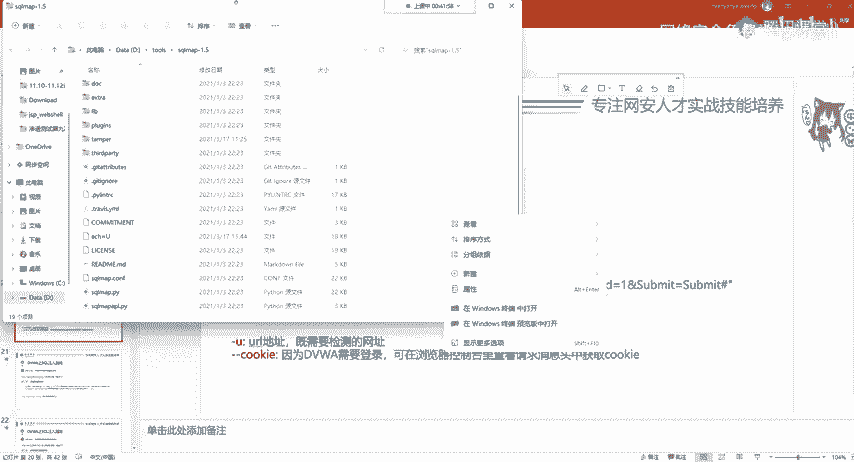

就打开我们的命令提示服务，然后输入python。cicle map点PUI回车就可以运行它。如果你没有python。你的机器上没有python的话，你可以选择安装一个pyython，或者是安装一个卡里。

都可以解决这个问题。关于这些软件的安装，我是不会讲的，大家既然来听课，应该都会安装软件，不然你的腾讯课堂是怎么装上去的，是吧？OK都是一样的。首先我们第一步判断漏洞，判断漏洞手工的时候是怎么判断的。

是不是一单引号and一等于一井号是这样判断的是吧？那circle map有自动的功能能够帮我们判断我们pyython circlecle map。点PY加杠UU的意思为URL地址。

意思就是你要检测的网址，我要检测哪一个网址啊？

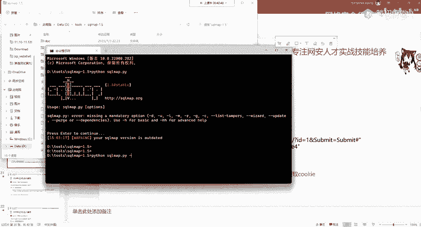

我检测拿忘址。

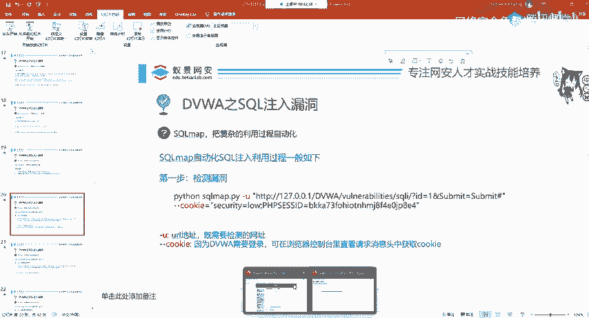

我检测上面的这个网址，我直接的给它复制过来。

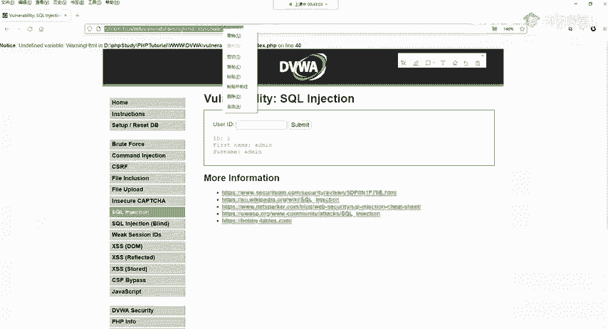

Okay。用双引号包裹给它粘贴到这里地方。

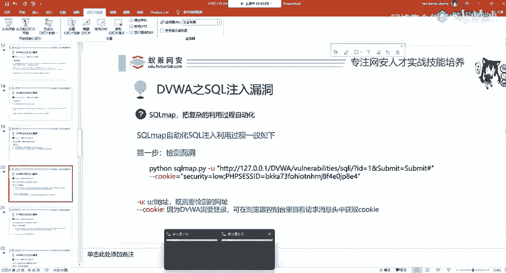

好，这是第一步。这第一步我们在指定我们想检测的漏洞之后，你就可以直接运行吗？告诉大家，大部分情况你是可以直接运行的。但是这里我们使用的是DVWIDVWI有什么特点，大家能记得吗？是不是他要登录呀。

他要登录是吧？如果你不登录的话，你能打开这个搜狗注入吗？还打不开。所以说我们要告诉soco map，我已经登录了，你不要再登录了，我登录过了。那怎么告诉呢？

在HGTP协议就是网站的传超文本传输协议中规定了一个东西叫做coie曲奇饼COOKI就coie呢就能够告诉soco map，我已经登录了，你不要再瞎搞了，不要再登了，你直接帮我跑这个搜狗注入就行了。

所以说我们跟上杠杠cookie。有同学说为什么要跟刚刚coK啊，这是socle map的开发者给你写好的，那你得你就得这样写，不要疑问啊不要疑问你开发的工具啊，你想怎么写怎么写。

那这cokey怎么获取呢？我们打开浏览器打开浏览器，打开浏览器，按F12开发者公式。😊。

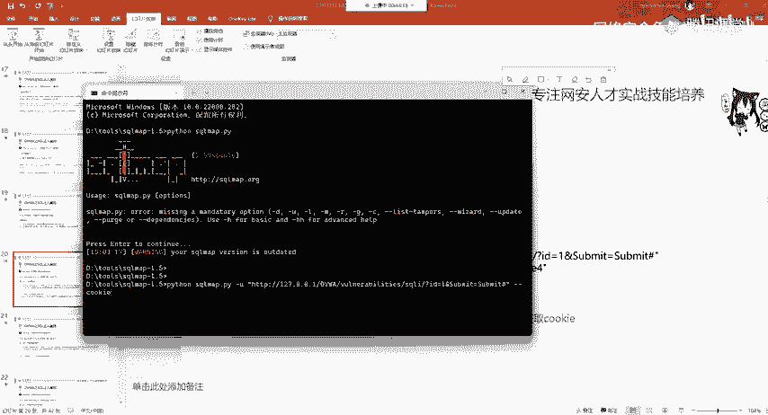

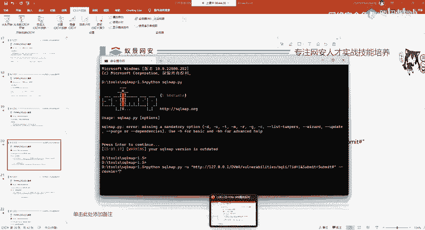

进入开发者模式之后，有一个东西啊叫网络网络。来可以看到它请进行至少一项请求或者重新载入。那我们就乖乖的点一下，重新载入。重新载入之后，第一个地方啊第一个地方我们点击它在最右边。

我们看这个最右边这个显示啊，它肯定有个coookie，在请求头，有个地方叫coookie。在这是不是cookie啊，曲奇饼在这个地方，我们把它给复制过来。你选中之后，contrl C给复制过来。

然后粘贴到这个地方就行了。

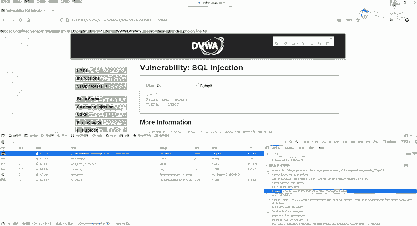

我们下面回称一下。

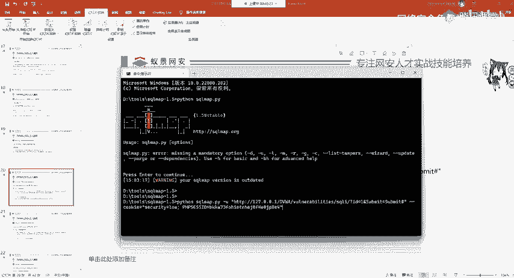

Okay。好，它会帮我们自动检测这个网站有没有cicle注物漏洞。我们现在能够清楚的看到它有cicle注物漏洞，并且呢告诉你啊，这个数据库是myCcle，它现在并且呢有搜cle注物漏洞，那它有漏洞。

怎么利用呢？可以看到这个检测是非常方便的，它可以自动帮你检测。如果你说你这还是听不懂，那你可以补一下英语，这个没有办法啊，这个没有办法，这里也不会教英语啊。啊，这是第一个去检测它的漏洞。呃。

第二步呢就是去获取它相应的数据库。数据库呢我们跟上在刚刚的检测命令后面跟上杠杠BBSDBS也是英语简写叫做dtab level数据库服务。他的意思就是获取所有数据库的名称，所有数据库你叫啥。

我就是要获取这个。啊，都是英语简写啊都是英语简写。

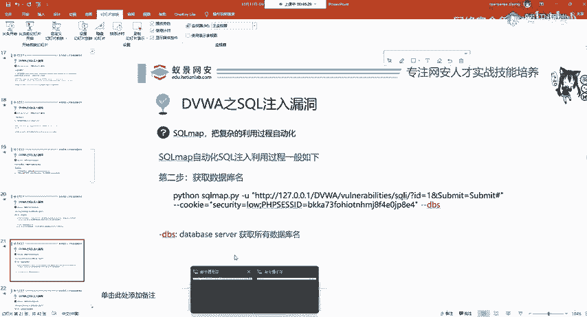

Yeah。在这个地方，我们跟上杠杠DBS大家记不住的话，你就把这些保存下来，整理成笔记，避免重复学习，提高学习效率。啊。第二次呢你用到了直接翻开笔记来看就行。

那这边呢我们就能看到在当前的数据库中有9个数据库。我们使用的是哪一个DVWI是吧？DVWI那其他的比如说像什么test呀，包括我们的information camera呀，也都能看到，也都能看到。

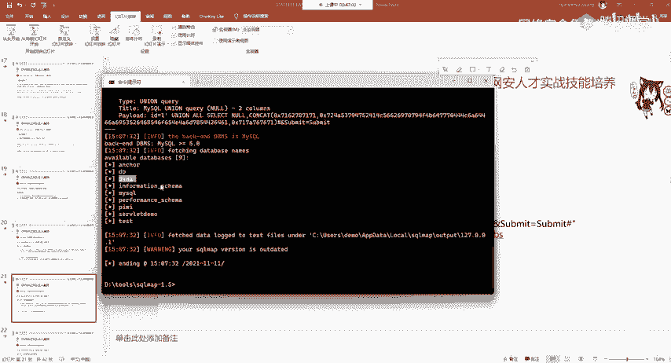

我们下面呢继续来，现在你只是获取了数据库的名字，我想获取数据库的内容怎么办呢？你想获取哪一个数据库，比如说我老师现在想获取DVWI这里你可以随意改，你想获取哪一个。

你就获取哪一个我想获取DVWI跟上这两个东西，记住前面的这些是不变的啊。前面的这些是绝对不变的，前面这些都不变，你只要跟上后面的这些就行了。这个是啥意思？

杠D还是英语简线还是英语杠D意思为dabb就是告诉scle map，你想要获取哪一个数据库，我想获取DVWI数据库的内容，杠杠tables就是你想获取啥这DVWI它是数据库，你想获取它的是啥呀？

你想获取它的数据还是想获取它的表，还是想获取它的信息，我想获取它的表名就是杠杠tabless表。

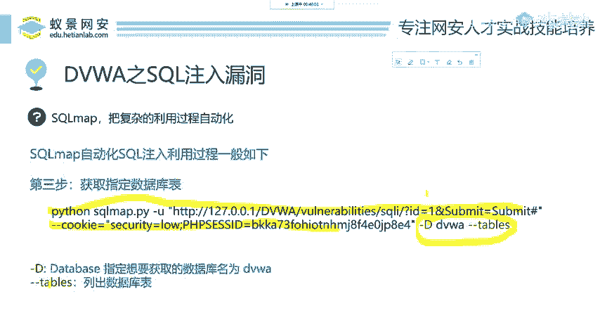

英语。好，我们加上杠D。No。

来看在这边加上杠D指定我想获取DVWI的数据。获取他的啥呢？获取他的表。回车一下，看一下两个表ges the book，还有users跟我们手工注入是不是完全一样。不过它这里显示的稍微好看一点是吧？

能够很直观的告诉你啊，这个dabb是叫DVWI有几个表有两个表，他会告诉你你说你这看不懂，那没办法是吧？他告诉你的两个表。然后我们下面呢再来讲在获取我是不是只能获取数据库表呢？并不是。😊。

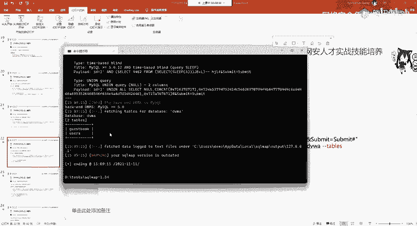

现在呢我还能读取读取表中的内容。比如说我这样一个命令，这个命令是什么呢？首先杠D叫做dtavis就是你想你现在想获取哪一个数据库，我想获取DVW数据库杠T意思为tables。

你想获取这个数据库中的哪一个表，我想获取users表，你也可以获取gas book表，随便你选你想选哪一就选哪一个？然后杠杠conoms，这个是什么列像列的英语economs，那这个东西啊。

就是我获取这个user表的列，它有哪些？我给大家快速执行一下，看结果。

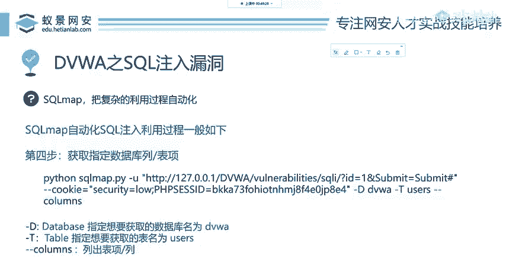

他の。

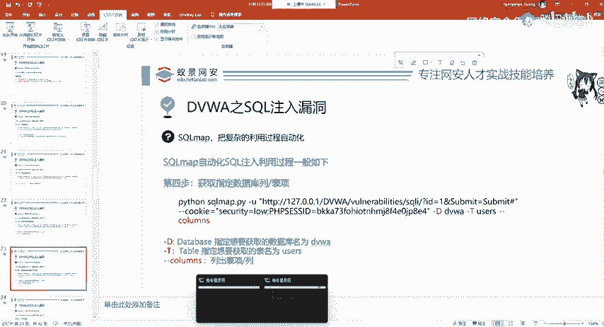

在这个地方，我们跟上杠T，我们比如看users，看users。我们回车啊，就能看到它里面有哪些列，有user，有password，你现在想看哪两个列？我想看用户名和密码是吧？想看用户名和密码。

有同学说啊，老师这个cons这个英语太难了，我记不住，不会拼。怎么办？那没关系，我直接来干脆的，我把它整个的数据库都给他读去。我不论你哪个列，我全部给你拿到怎么怎么拿。

加上杠杠dumpDUMP这dump的意思，我来看PPT给大家过PPT。

这个dump的意思就为读取数据。我想读取users表中的所有数据就跟上杠杠dump就行了。我们下面来运行一下，看结果。

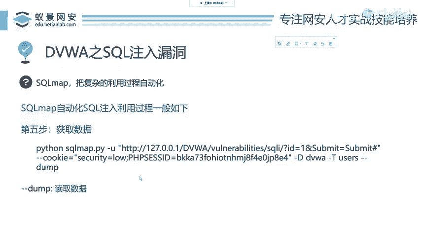

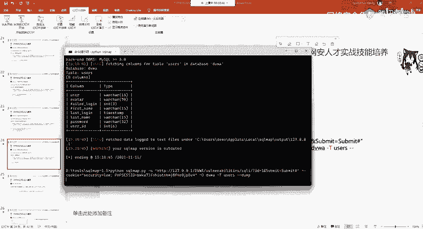

Okay。这啊。这个时候他会告诉我们。你是否要去破解这些密码？因为在手工注的时候，我们会发现这些密码是加密的，你可以进行利用soco map里面自带的这些彩虹表去尝试爆破，或者是你这里不去爆破。

这里有三个选项。首先why就是yes，我想去爆破，是默认选项。no，我不想爆破，你直接给我显示密码哈希，下面一个Q一组为cute，我啥也不想干，你给我退出，就是这个意思。所以我选no，我不想让它爆破。

啊，直接出现这就是数据库的内容，看有优色的ID有优色的名称，用户的名称，有用户的密码，还有用户用户的头像，看用户的头像。就在这里，这个时候我们就能够泄露这个数据库，就能够拿到它相应的敏感信息。

或者是你还可以把这个数据库给删掉啊，这些怎么操作，大家可以自行研究circle map的语句。那我们现在啊这个cicle住的利用。你好像懂了，不懂的话，实践出真理，自己操作一遍，肯定没问题。

那ciircle注入你最起码的要求就是你要用circle map一把缩，你这个缩都缩不动啊，你手工注入也就别想了啊，也就不要再呃先看手工注入了。我们先把cicle map给它用好。下面我们来看防御。

这个搜cle map不是搜狗输入怎么防御呢？其实这个大家想我相信听到现在你想你也知道了，防御啥，我不是执行select吗？后面不是执行一等于一吗？我现在不让你执行，我发现等于号，我给你干掉，不就行了吗？

就是过滤用户输入的内容，我不让你输入搜cle语句，你整那啊 on那容select就是select是这select那个我不让你去select，你就得给我输入个数字，这样就行，啊，就是将特殊符号替换成空。

或者是判断用户输入的是搜cle语句，我就把你终止。或者弹个窗告诉你，你再入侵该网站啊。那，我们下面来看DVWI他是怎么写的。把我们的等级调为medu。应该要是这。把这个等级。调为 medium。开。

调为m之后，我们先不去利用，好吧，我这里不讲利用，只讲防御利用啊，刚告诉大家了，我们来看它的代码，代码你要看哪些。后面有同学说，哎，老师这后面太难了，我根本看不懂，你不要看懂你看它关键点。

你看它怎么防御的。他这个相相对于漏，就是没有防御的，多了哪一句，多了这一行东西就多了它，其他的都没变，就多个这个东西。来给大家解释。你现在不会PHP也没关系啊，不不会。不会PHP也没关系。

我们下面来来看。Oh。第一步，它是将用户输入的值复制给这个变量ID复制给变量ID这个地方有点调错了啊，变量ID。就我们输入的内容啊都在这个do IDD这个里面。

然后下面它多了这一句叫做my circle i will escape string这个东西叫什么意思？这个东西啊是PHD的一个内置函数。现在你知道一下他就知道就行。它的作用就是转移字符串中的特殊字符。

比如说NR单引号双引号，现在不懂是吧？你现在不懂没关系，我们下面继续来看，看这个scle语句，它写的是不是好好的，我们srcle注入就是要改变这个后端开发开发人员已经写好的sqcle语句。

通过这个do IDD是我们可控的地方，你可以输入的地方去改变这个语句，现在来看。

