# 2024B站最值得看的黑客教程 ｜ 网络安全／渗透测试／内网渗透／漏洞挖掘／web安全／kali linux／红队靶场／CTF／信息安全 - P66：DVWA之命令执行漏洞 - 网络安全免费学 - BV1uBsTetEow

我们在第一步在大家手工利用的时候，是不是输了这样一条语句，叫做select first namelast name from user user IDD然后呢联合查询它DVWI数据库中的表象。

这个作用是什么？这个作用是什么？我们翻到之前的PPT叫做查询数据库的表，查询DVWI数据库的表，它叫啥？

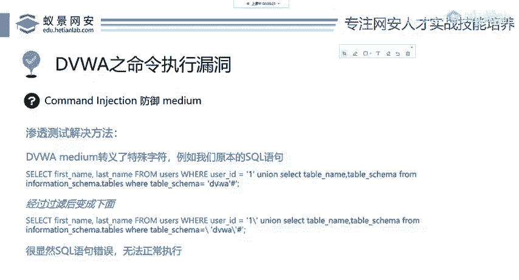

Okay。那这个时候我们通过这个函数的过滤之后，这个搜后语句变成了什么呢？大家看第二条，它给每一个单引号，就你输入的地方，你输入的单引号都给你加了一个反斜杠。

那你现在看第二条就经过过滤之后的这个语句，它还是个色Q语句吗？搜狗语句中有反斜段吗？根本没有，那说明你这个搜狗语句啊就错了，但都错了，他还能再为你查询到DVW的表吗？肯定不行。

所以说这里啊它就相当于防御了cicle住漏洞。但是它防住了吗？我们来看它的等级medium，你就知道他们得防住。那在渗透测试中，我们怎么解决这个办法呢？大家听到这里你也能想出来怎么解决。我输入的地方。

我不带单引号不就行了吗？你单引号被过滤了，你又没过滤过其他的是吧？我把这个单引号，我想办法不要输不要输入它，那怎么不输呢？有两种解决办法，大家可以记忆一下。😊，第一个办法就是还是这条语句啊还是这条语句。

我们把DVWA这个地方换成dabb这个函数dtab这个函数它会返回DVWA这四个字，我们给它做等价替换。就是把带双引号的地方进行等价替换就可以了。第一个是把单引号包裹的DVWI替换成datab。

就可以绕过这样一个防御。第二个方法是将单引号DVWI替换成十6进制的数据。在马蚁搜克中有一个非常好的个性，就是对于查询的这样一个数据。

就是查询的这个where它的一个值可以用十六进制去表示我们把DVWI这个字符串进行十六进制编码怎么编，大家百度一搜。

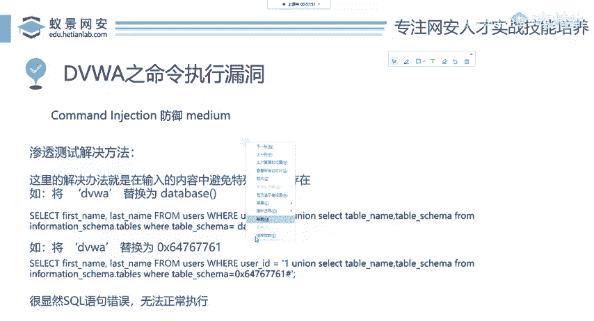

hax就是字符串转这个16进制hax的意思为16进制。我们在这输DVWA这后面就出来了，64767761就是DVWA的16进制格式。我们在前面呢加上1个0X。

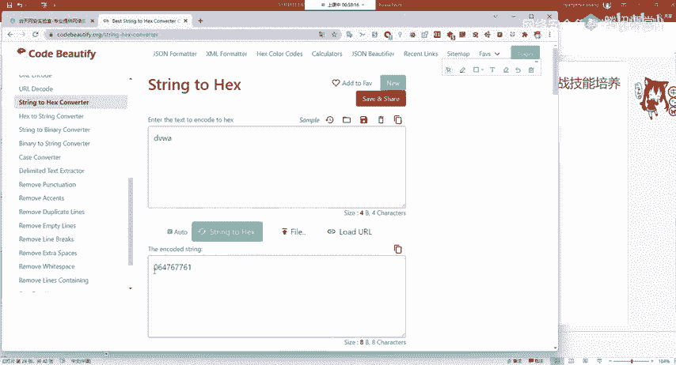

就行了，就会拿到这个数据是等价的关系，大家要清楚。OK那这个时候呢我们就解决了这个办法。medium终极被我们解决了。那高级我们再来看怎么防御，我们把DVWI的等级调为高级。

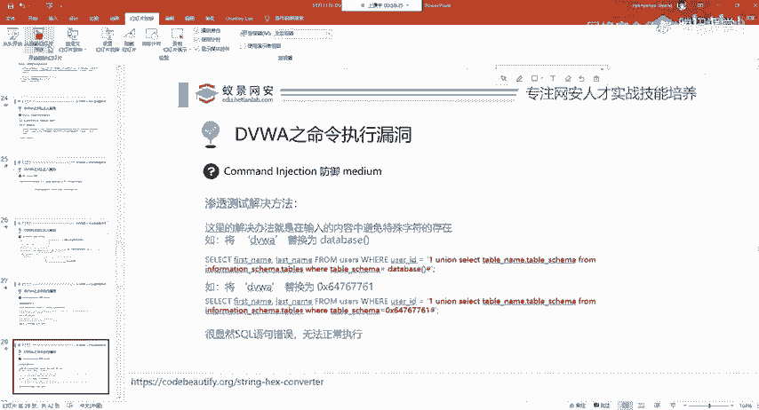

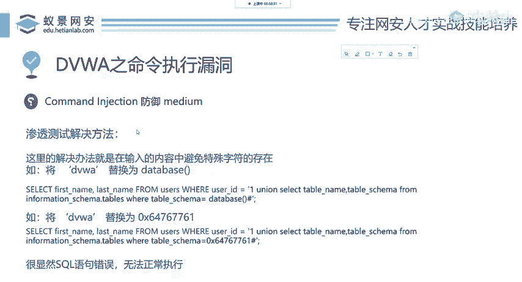

有没有同学听不懂听不懂，你可以扣个2，好吧，听不懂，你可以扣个2。

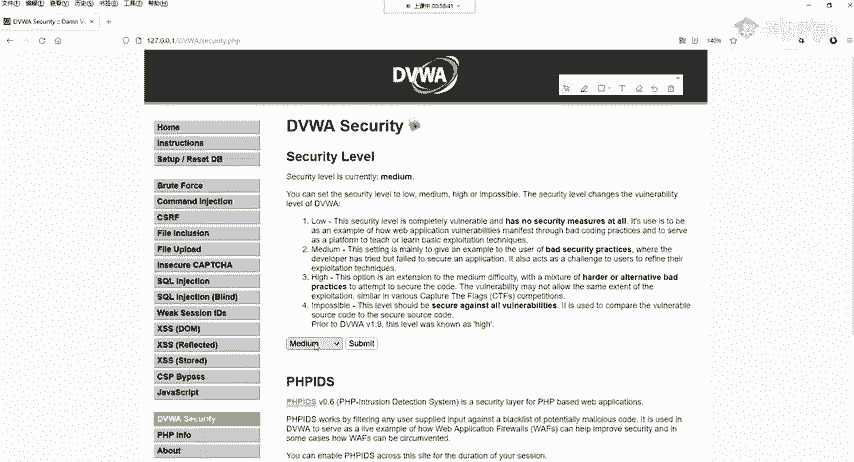

I。在我们输入hi之后，我们点击vivo source，大家能听懂吗？听懂了也可以给个回应啊，可以跟我交互没关系的。

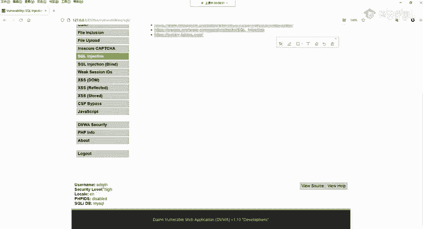

啊，在这边我们点击汉语之后来看他前面做了哪些判断，就是看前几句就行了，后面的你都不要看，那没有关系。

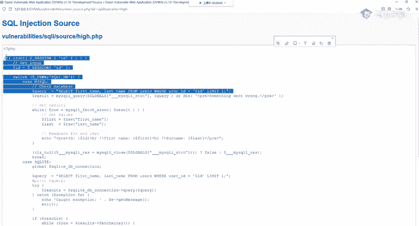

啊，没有关系，那为什么听不懂呢？你可以告诉我哪里听不懂啊，哪里听不懂。

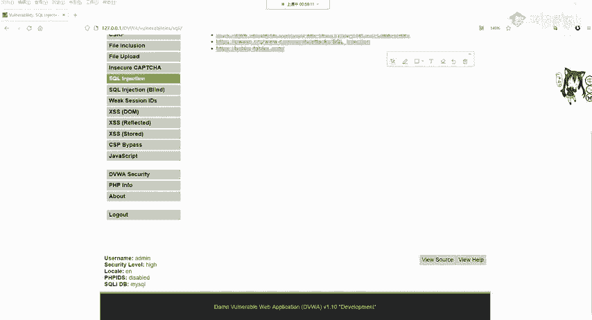

Okay。

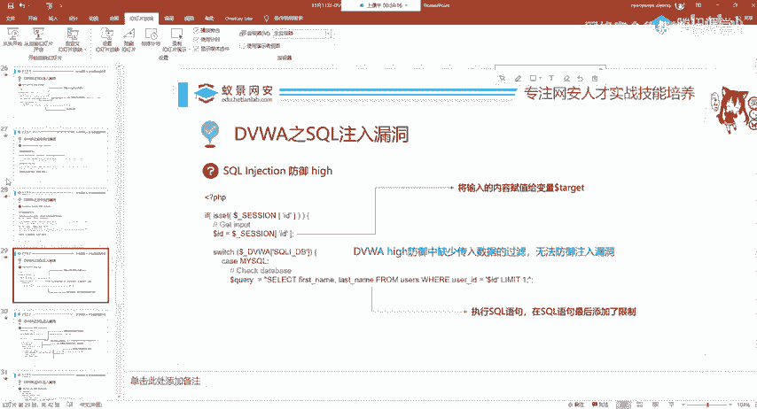

对。好，我们来看它执行的语句，等价等价就是等于。1块钱人民币跟嗯6块美元呃，不是6块人民币，跟一个美元就是等价的，懂了吧？就是等价的。就是等于的意思啊，这个问题你可以随便问，没关系的啊，没关系。

就这个同学非常好，他不知道等价什么意思，等价就是相同相同价格就是完全一样的东西啊，懂了吧？啊，我们这里啊这里啊你可以看。😊，这个select它这个地方没有对我们输入的内容做限制。

它是改了这个scle语句，它在后面加一个limit一limit什么限制。我限制一你现在不懂cicle语句，你也知道它是对cirqcle的查询做了限制。我告诉大家，对于在sqcle语宙中。

你直接改你要记住cicle注的防御方法是过滤你输入的内容，这里有过滤输入的内容吗？我们输入的ID最后有变化吗？没有过滤，说明你这个啊你就是。呃，叫什么啥用都没有啊，这个就属于是啊多一道子啊。

就是光着屁股出裤裤腰带啊，这个就是多一道子啥用都没有啊，就是它防御缺少对传入数据的过滤，无法防御注入入洞。我们用搜co map同样能够正常的跑出它，不过他跑的这个语法稍微有点不同啊，在这里我不会过多讲。

因为有同学前面的可能啊理解都不是太深了，还是告诉大家这个搜co注入的东西非常多。我们一节课就是把这个DVWI怎么去利用怎么去防御给大家讲清楚啊，后面啊还需要大家自己深入学习，或者是啊其他的方法。

一会儿也会给大家讲。好，这是hi。我们现在知道高级怎么防御了，这其实med我们跟hi都没有太大关系。我们要关注的就是imppoible看不可能的就是开发的典范。

我们把cicle把DVWI的这个security安全调制imposible不可能的。再来看它先给大家，我把那个源代码已经复制粘贴到了PPT上面，粘粘贴到了PPT上面，现在我们来去看，首先前面都没变啊。

我们还是把输入的内容给了到了ID啊，下面它做了两个认证。第一个它做了格式验证。第二个，你看他这个scle语句，它写的好像什么跟以前的不一样是吧？以前的不一样。那这个地方呢它是做了circle的预处理。

那我们下面呢就来具体分析一下这个算法。这个预处理叫做PDOPDO的全称叫做PHPdata objectives。那这个PDO技术大家也不知道不会写的话，你记住这个名词啊。

记住这个名词怎么防御cicle住入漏洞。你就说配合正确的过滤和circle语句啊，配合就使用PDO并且配合正确的过滤和正确的cicle语句就能够避免socle注漏动的产生。

而且这个避免是嗯完全避免我们来看它怎么写的。首先这个过滤我们就分析这两点啊，就看它怎么过滤的。分析这两点。首先第一步叫做is network。我们在昨天讲过了，就是判断你输入的内容，它是不是一个数字。

就像判断IP地址一样，你不要乱输其他的，你输入个select，你输是等于号，他们都不是数据，它们都不是数字，都是符号或英语，直接就给你干掉啊，它不是数字。然他验证了第一遍之后。

又使用了intervalueint整形value值，又再一次从我们输入的内容中把这个整形给取出来，就再次判断你到底输入的是不是数字，你有没有乱输其他的东西，再次判断。第三个。

它是使用PHP中的1个PDOprepare叫预处理。可以看到它第一步在写的时候，他并没有把doll了 IDD给写进去。他先把语句呢进行了预处理，然后最后才进行参数的绑定，就是四个步骤。这四个步骤做之后。

第一是限制了我们输入的内容必须是数字，你不能乱输。不能乱数。第二个就是我在参数绑定中，我避免了其他搜Q语句的产生，是双重防御。那在这个地方呢，我们是imposible的三次验证啊，并且它绑定参数的时候。

还又加了必须是int，就是整形在impossible的三次验证，加上PDO的预处理，可以说在这个impossible中是完全解决了scle注的隐患。那其他的后端语言呢也有相关的算法。

可以实现socle的预处理以及数字整形的判断啊，都是。基本相同的啊，都是所有的语言都是相通的那这里呢就是DVWI的circle助漏动。

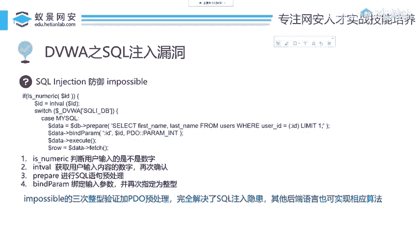