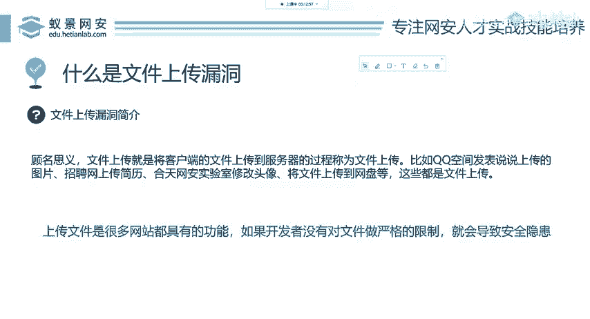

# 2024B站最值得看的黑客教程 ｜ 网络安全／渗透测试／内网渗透／漏洞挖掘／web安全／kali linux／红队靶场／CTF／信息安全 - P67：什么是文件上传漏洞 - 网络安全免费学 - BV1uBsTetEow

来讲这个文件上传。首先我们要知道文件上传它到底是个什么东西，以及上传要上传什么，怎么上传，怎么利用，以及呢我们要学习怎么上传之后，会对目标网站产生什什么样的危害。

还有我们从DVWI这样一个靶场来看OWISP这样一个组织，它是提供了哪些解决方案来提供给开发人员防御文件上传漏洞的产生。

好，我们首先呢来带领大家了解什么是文件上传漏洞。如果你现在完全没听说过没关系。首先上传和下载是相对的。下载呢就是你从网站上下载一个图片下载一个音乐视频到你本地的磁盘上面。那上传呢就是相反着来。

把你本地磁盘上面的内容上传到别人的网站上面，顾名思义那文件上传呢就是把我们本地的文件上传到服务器，就比如说QQ空间的这个上传说说，招聘网站上面上传简历，各种网站，各种客户端去修改头像，上传头像上传主题。

以及将文件上传到网盘等等，这些都叫做上传操作。那我们可以看到呢在互联网中，很多的网站都具有上传文件的功能。那如果这个网站的开发者没有对文件做严格的限制，就会导致文件上传。漏洞的安全隐患。那这个就是简介。

我相信大家现在应该都能听懂，因为就是简单的一个汉语表述。

