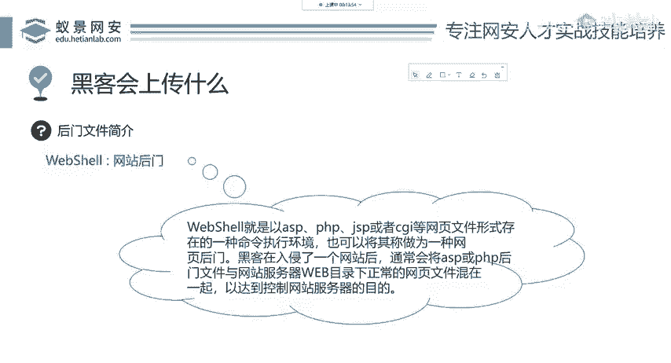
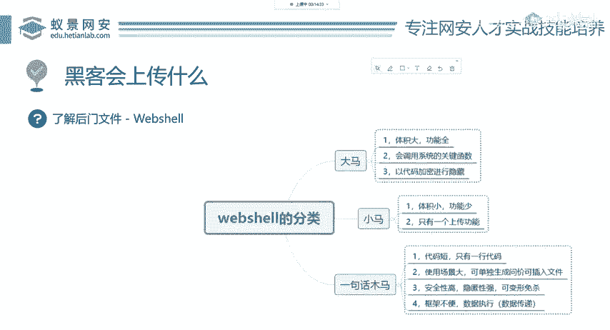
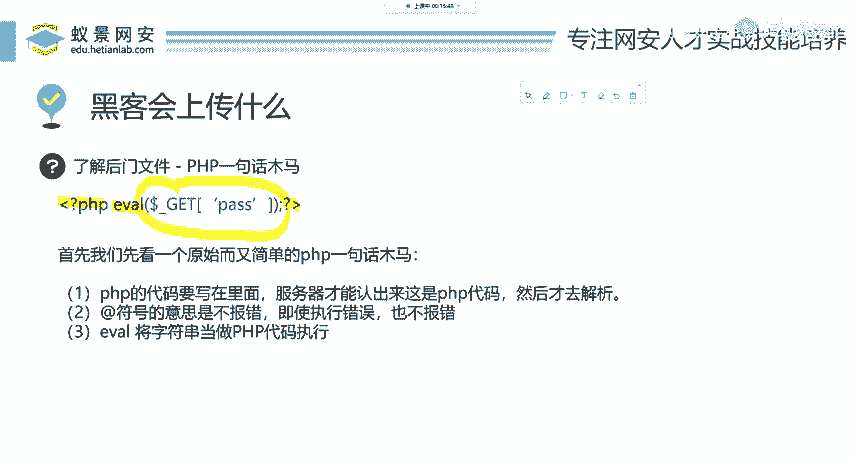

# 2024B站最值得看的黑客教程 ｜ 网络安全／渗透测试／内网渗透／漏洞挖掘／web安全／kali linux／红队靶场／CTF／信息安全 - P68：黑客会上传什么 - 网络安全免费学 - BV1uBsTetEow

那在黑客利用这样一个上传漏洞，黑客会怎么做呢？我们先来看一个正常的一个上传过程。我们先了解一个东西叫做web shareweber share是在渗透测试中对于网站木马后门的一个简一个简称叫做weber share。

那weber share是啥呢？它其实啊就是户端开发，它经常开发网页使用的一些脚本语言。比如说像ISP像导net像PHP像JSP等等。这些网页的一种命令执行环境，也就是说针对于网站的木马程序啊。

就这样记住就行。就是一个新的名词叫weber share，大家如果了解过安全，应该都听说过它啊，不了解，那你今天又掌握了一个新的名词。那我们下面呢来看weber share有哪些分类。

那这些分类档其实是比较模糊的我们。

通常来把它分为一句话，木马、小马还有大马。他们的分别呢就是根据字面意思来分一句话木马就是它只有一行代码，而小码呢就是它体积比较小，代码量也相对较小一些。大码就是它的体积非常大，占用内存空间非常大。

功能齐全，而且呢就是代码行数也比较多啊，就是这个简单的分类，我相信大家也都能够理解。

好，那我们下面呢先讲啊这样一个一句话，木马，就讲这个最简单的这一句话木马呢实际上只有十几个单词去组成的。比如说针对一个非常常用的这个后网站后台编成语言PHP来说。

它的一句话后门就像PPT里面蓝色的部分所标识的这一行代码啊，PHP ever啊，do了下划下划线get，然后中间加一个字母。这样简单的一条语句就能构成一个杀伤力非常大的木马。

那我们现在先了解一下这个木马是什么意思。首先前面的这样一个间问号PHP。

这些东西啊是PHP固定写的，就是所有的PHP语言都要有它。然后下面呢，ever ever的意思就是把我们后面的这些东西当做PHP代码去执行。你可以简单这样去理解。如果你说我不会PHP没关系。

我们一会儿把它应用起来，你就知道它的作用是干什么了。哎，我们现在。

