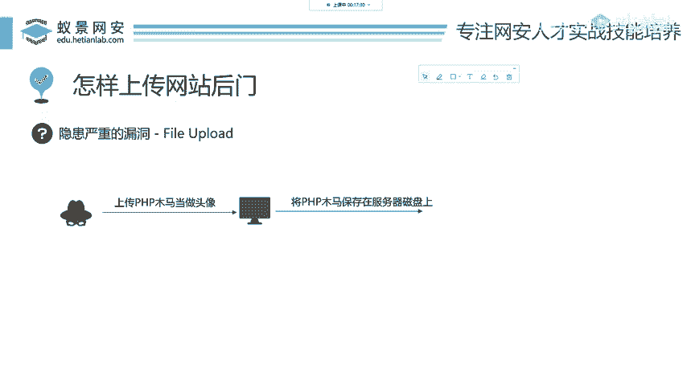
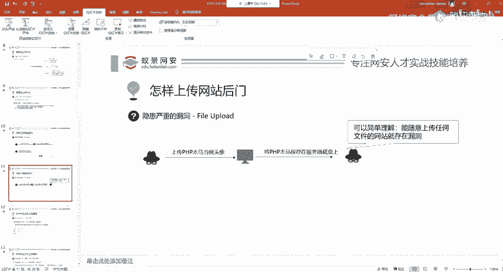
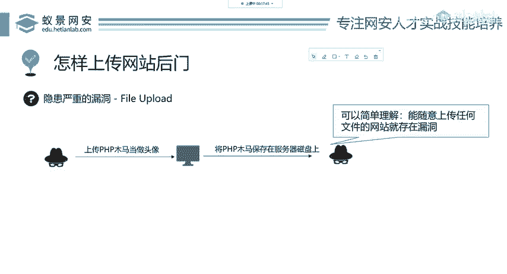
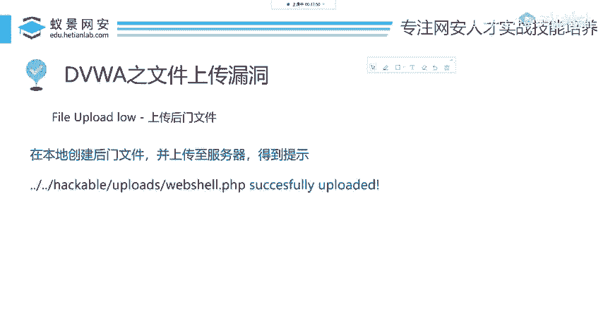
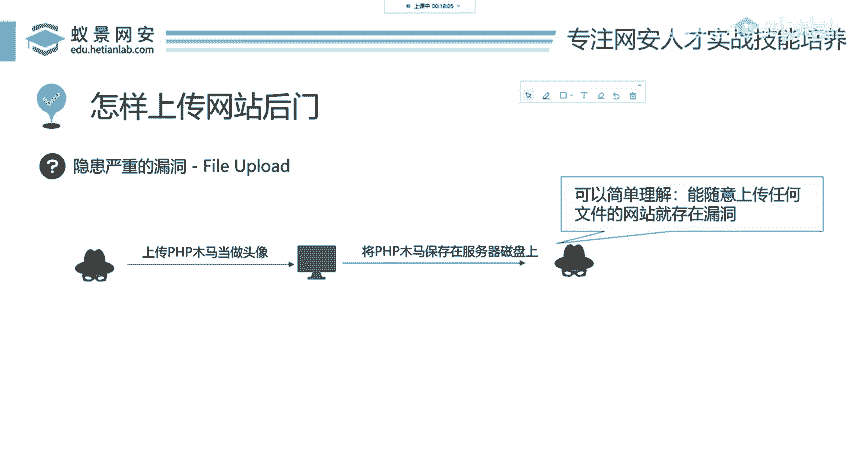

# 2024B站最值得看的黑客教程 ｜ 网络安全／渗透测试／内网渗透／漏洞挖掘／web安全／kali linux／红队靶场／CTF／信息安全 - P69：怎么上传网站后门 - 网络安全免费学 - BV1uBsTetEow

来看下一面一步，我们知道了黑客要上传什么，现在就要解决我怎样去把这个网站后门上传到目标想攻击的网站呢？我们来看一个正常的操作。比如说和天网安实验室的上传头像功能。

这个这个用户呢从本地的磁盘选取一张PNG图片，把它当做头像上传给和天网安实验室。那网安实验室呢这个网站就会把用户的这个PNG文件保存在服务器磁盘上面。啊，这是一个正常的操作。很多网站都有这个功能。

那在这种情况下，黑客应该如何利用攻击这个网站呢？其实大家想都能想出来，就是我现在非得上传图片吗？渗透测试黑客攻击网站的操作就是反行其道。我们之前讲命令执行，搜狗输入都是他让你输入1个IP，你就输IP嘛。

我能不能输点其他的东西，他现在让你上传头像，你非得找个图片去上传吗？你就不能去呃整一个其他的东西嘛。就是我们刚刚讲的木马，我们可以上传一个PSHP木马当做头像，然后这个服务器再收到这个木马，这情况下。

如果开发人员没有做验证的话。没有做验证的话，那他同样的会把这个PHB木马保存在服务器的磁盘上。哎，我们来看这个时候怎么办？是不是这个网站啊就被植入了木马，就被植入了木马。也就是说我们可以简单这样理解。

能随意上传任何文件的网站就存在漏洞。就是我想上传什么，就是上传什么，就是存在这样一个漏洞的那下面呢我们就以DVWA这样一个靶场来做演示文件上传到底怎么去攻击啊，我们现在知道你要上传什么。

也知道怎么上传了，那上传之后要干什么呢？那就下面我们要讲的。首先我们。

