# 2024B站最值得看的黑客教程 ｜ 网络安全／渗透测试／内网渗透／漏洞挖掘／web安全／kali linux／红队靶场／CTF／信息安全 - P6：HTTP超文本传输协议—响应消息 - 网络安全免费学 - BV1uBsTetEow

下面呢我们来看向我们请求百度之后，百度需要把这个网站内容呢返回给我们的客户端。那怎么办呢？它怎么去返回呢？它要规定一个规范，就是规定一个格式。这个格式呢。

我们把它叫做响应或者是响应消息或者是respon。他们三个是完全一个意思啊，完全一个意思。下面我们来看一下这个服务器是怎么给浏览器的。响应消息对比请求消息来说，就简单太多了，就简单太多了。

那响应消息响应啥呢？比如说你刷抖音，我要去看这个抖音视频，那就是字节跳动的服务器，再把这个抖音视频，通过这个流数据响应来响应到你的手机APP客户端上面。那我们的浏览器呢，你访问百度去搜索内容。

那它会把你搜索的结果去返回到你的浏览器上面。

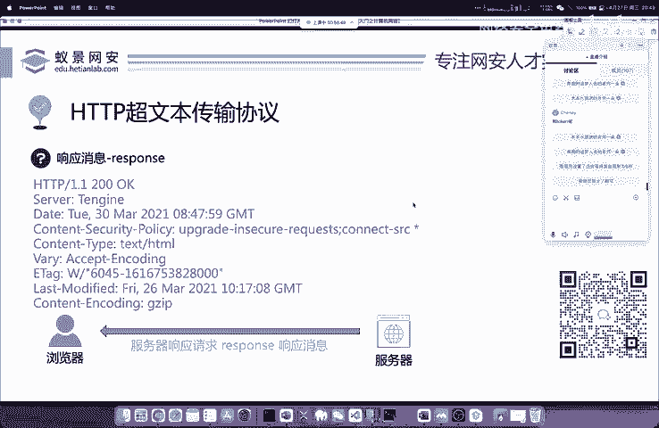

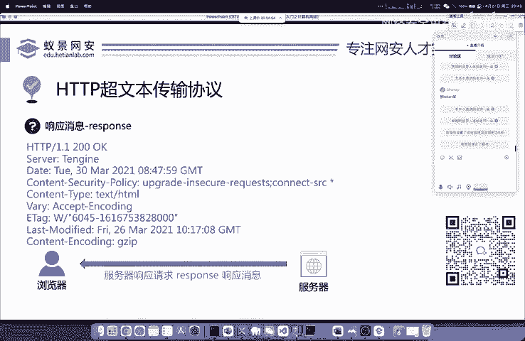

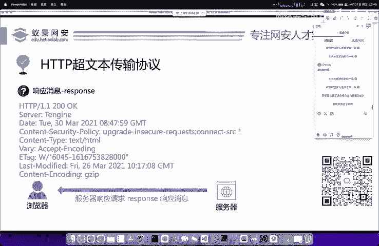

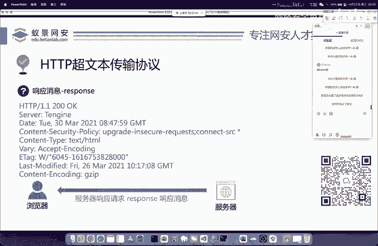

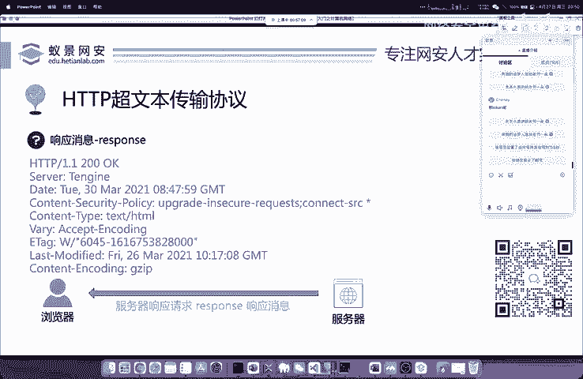

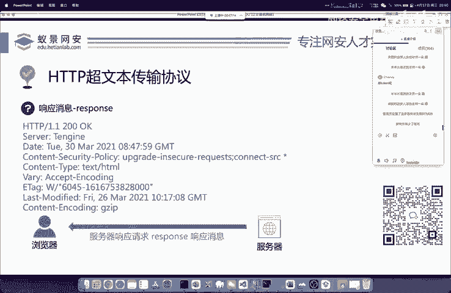

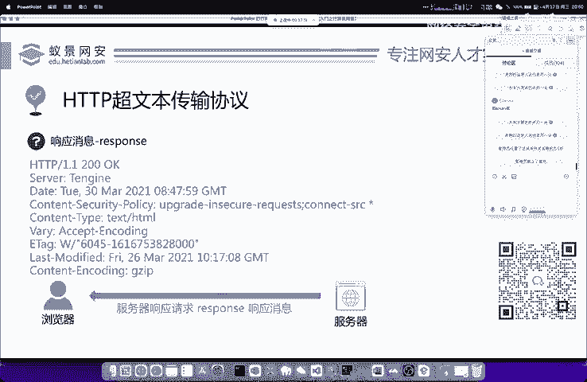

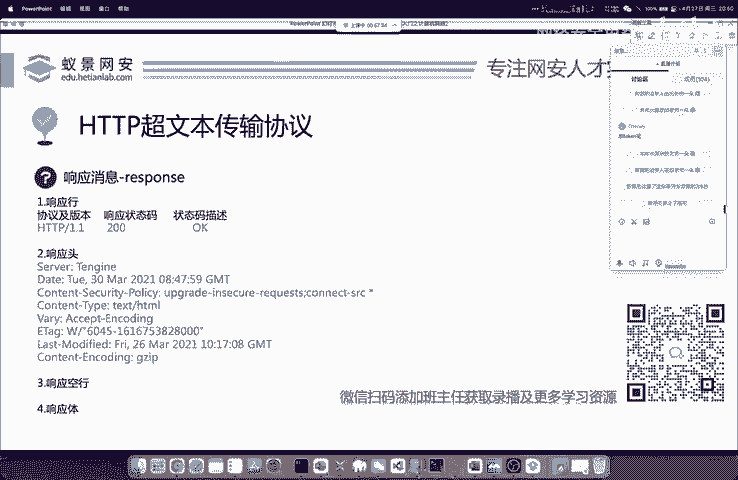

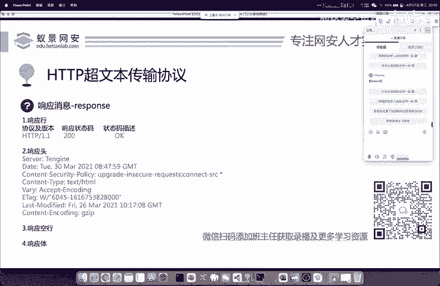

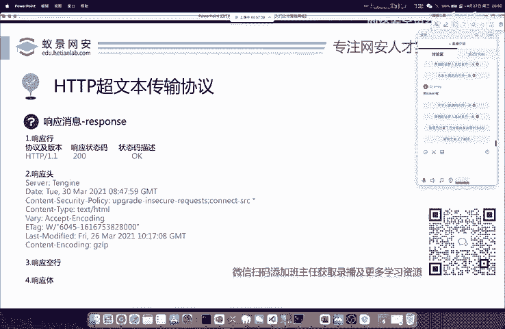

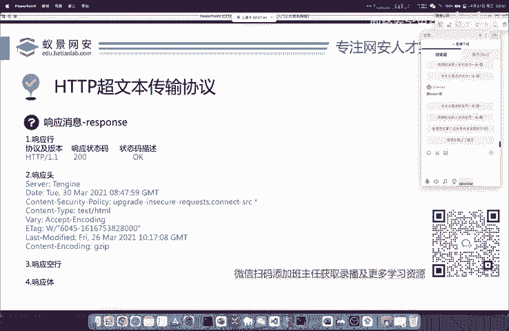

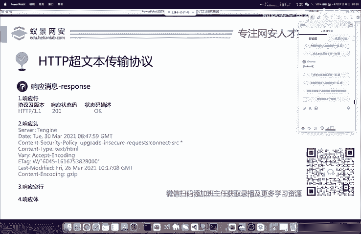

也就是说呢响应消息其实大部分就是我们访问的网站内容。比如说你打开的图片，打开的视频留数据，或者是你打开的一些网站新闻内容啊，这些啊都是属于我们的响应消息。那响应消息中分为哪些呢？我们分别来看一下。

首先呢是响应行响应头响应控行和响应体，响应行中也是非常简单的。首先呢第一个就是指定了我们使用的协议以及相应的版本，使用的是HTTP超文本承熟协议，相应的版本呢就是常见的1。1呀、1。2呀这些版本。

响应状态码是200200叫做正常，也就是如它的状态码描述OK一样。我们在成功访问一个网站之后，它的状态码默认就是200啊，这是一个正常的状态码。那这是一个正常的状态码。那第二点呢就是我们。

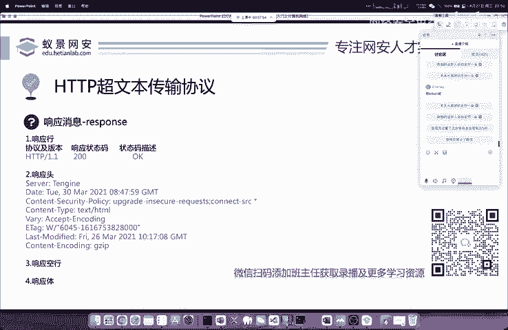

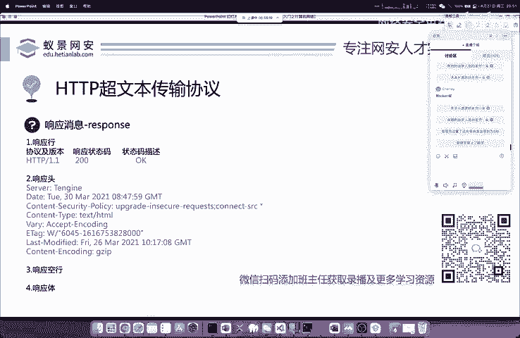

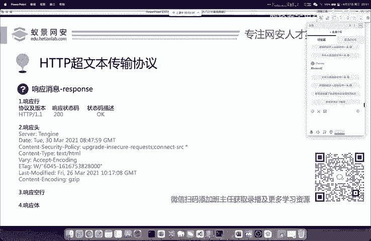

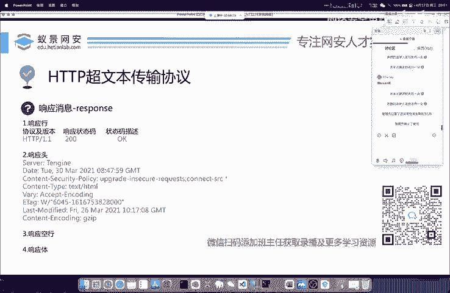

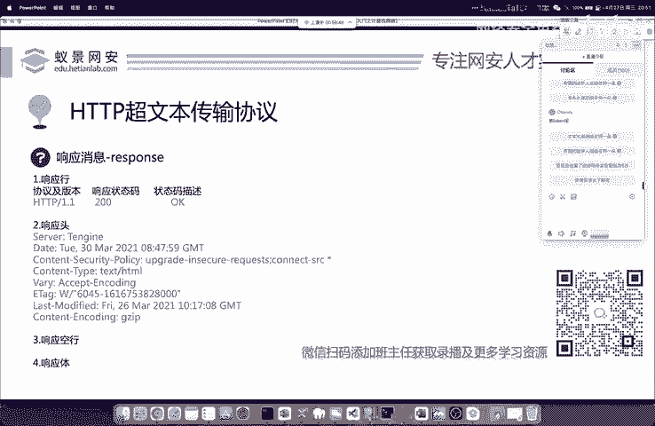

其他的状态码啊，大家应该也都听说过，比如说常见的404以及大家呢在学校里面去强课的时候，比如说啊每每个学期要去选课的时候啊，会把自己学校的网站啊给它选崩。

选崩的时候可能会出现一些像501啊、502呀、503呀这样的错误状态码。那这些错误状态码分别代表什么？是我们学习详应消息必须要掌握的。首先先给大家讲200呢代表访问成功。

404呢代表访问失败客户端错误not found就是指你访问的网站呢是不存在的。下面我们就具体来看一下这些状态码分别有哪些，大家来分别看一下，可能呢因为我的这个分辨率压缩的问题。你可能是看不清楚的。

没有关系。老师呢在这里给你讲出来啊。

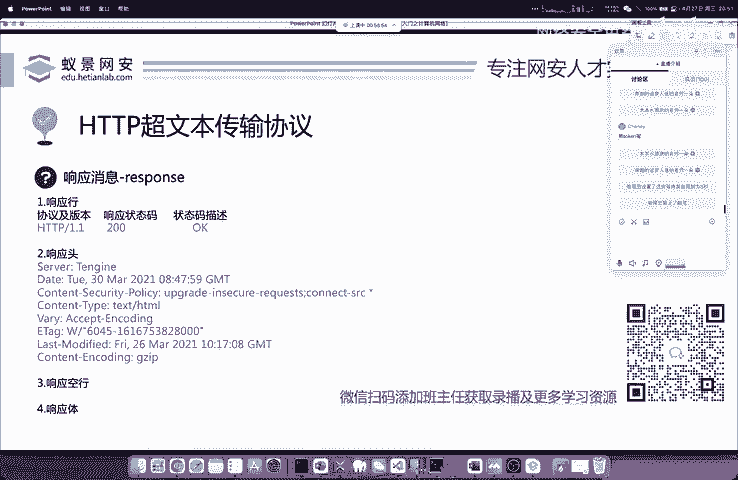

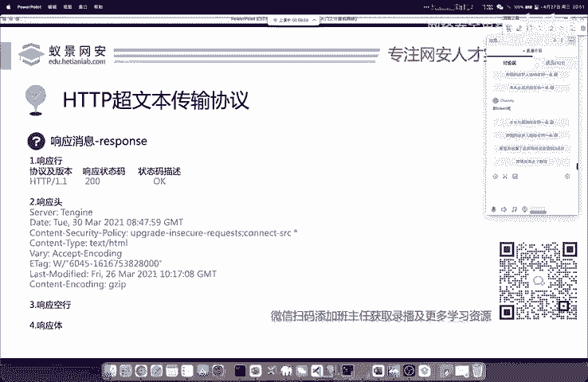

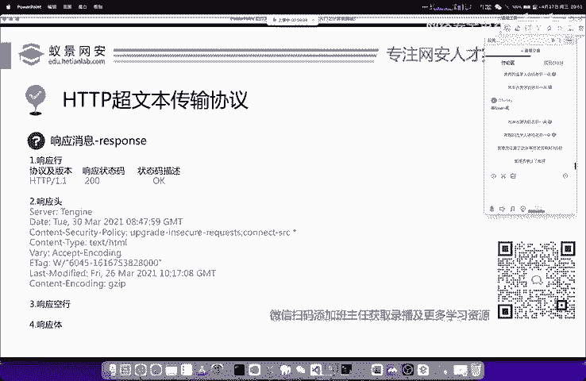

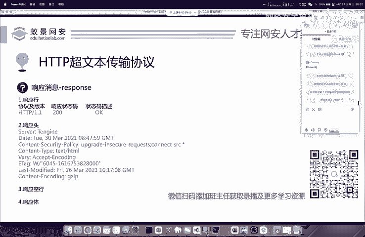

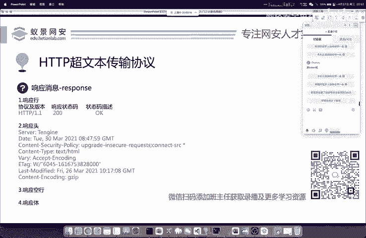

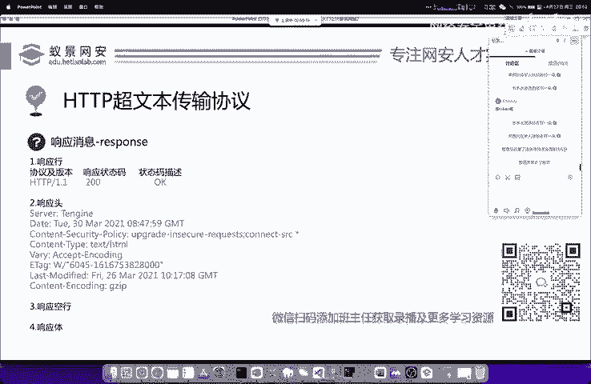

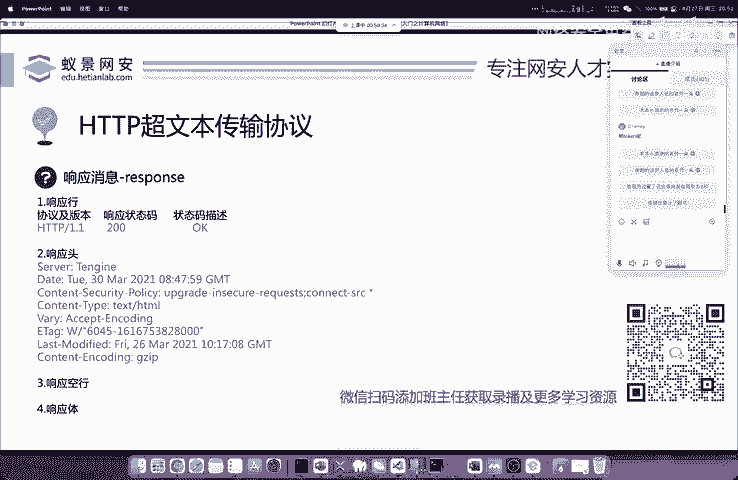

我保证你能听懂。首先呢这个成功是200，成功是200，然后是三开头，然后四开头五开头4开头的这个状态码叫做客户端错误，就是指你访问错了。比如说404，我们去访问一个不存在的网站。

或者是访问你无法访问的网站，比如说像谷歌像youtube这些网站，它就会显示404。因为为什么呢？404叫做没有找到对应的资源，因为你无法打开谷歌，所以说它会显示404，这样的时候你就知道整个的情况呢。

下面一个还有405405是指请求方法不会允许。我们刚刚讲了HGTP它实际上有几十种请求方法呢？那关于我们要使用哪种，是由开发者在后台后台代码中所定义好和规定好的。它让你使用什么，你就。必须要使用什么？

如果你不符合开发者的使用规范，那这个网站你同样也是无法访问的，会显示405报错，请求方式不被允许。好，这是常见的四开头的。下面我们来看55开头的叫做服务器错误，也是大家经常遇到的。

比如说淘宝双十一的时候抢货，我们在加入购物车，加入购物车之后，你会发现呢提交订单，无法提交。它到时候会显示，比如说啊503错误。503是啥意思呢？它就叫做服务器错误。

常见的比如说像500501502503都是的那这些呢都是因为大家在访问的时候，导致了服务器过度的拥挤阻塞，导致了服务器的崩溃。那这种情况下，你是没有办法恢复的。你要做的只是不断的刷新。

还有等待服务器的恢复，我们是无动于衷的，你要做的是只能不断的刷新。常见的500开头的错误。还有就是开发人员的代码写错了。比如说我们常见的一个数学运算除法运算0是。不能够作为分母的。

就是不能够作为这个除数的啊，这个零不能作为分母啊，这个分母。那如果这个程序员在写的时候，他把零啊当做了分母，那很明显这个程序就不符合数学逻辑。那不符合数学逻辑，这个代码这个网站就无法运行。无法运行。

它就会报501的错误，是指服务器出现了这个严重的错误，我们没有办法访问。那你要做的呢就是等待服务器的恢复。那下面呢大家看到的还有个三开头的啊，三开头的叫做重定向。

可能部分同学呢对重定向没有一个基础的概念。我这里呢给大家简单表述一下。首先重定向就是三开头和304开头的。先先讲两个啊，第一个叫做302302叫做访问控制啊，什么叫做访问控制啊，访问重定向啊。先。

再给大家讲一下，比如说我们去买火车票，买火车票呢，我们可以走携程上面卖。携程上面呢有卖飞机票的，有卖火车票的。比如说现在张三啊，他又来了。张三，他现在打开了携程卖飞机票的网站，想去买火车票。

那卖飞机票的网站能卖火车票吗？他显然不能，但是携程这个网站能不能卖火车票啊，可以，只是张三啊他访问错了。那携程啊为了收留住张三这个客户，不让他去其他的网站购买火车票，所以说张三啊这个卖飞机票的携程网站。

他这个时候就会告诉张三的浏览器。他说我卖不了火车票，请你去访问携程的火车票网站。这个时候我们浏览器，在收到服务器发回来的，请响应之后就会乖乖的跳转到我们的携程火。火车票购买网站去购买火车票。

这个叫做跳转或者是叫做重定向啊，叫302，叫302。那下面呢还有个叫做304的东西啊，304是什么？现在我先给大家讲一下，304呢叫做访问缓存。比如说大家去浏览APP的时候，你的浏览APP啊。

像国内的APP经常会有一些大家比较头疼的开屏广告。那这些开屏广告啊信心的同学可以在它的左上角或右上角告诉你一件提示信息就是无线网情况下呢已经进行了缓存。那这个时候它是咋来的。比如说一个网站。

它的广告页面或者是首页图片，可能很长时间啊它都不会变动，不会发生变动。那为了节省这个网络的资源，降低网络的冗余，提高网络的访问。速度一般情况下，这些开屏广告和这些缓存的图片都会保存在我们自己的电脑上面。

这就是为什么大家会看到你的这个网站啊都非常的臃肿啊，都非常臃肿，占的内存非常的大，都是这个原因。它缓存到你的本地之后啊，那它怎么去确定这个图片或者是这个广告有没有更新呢？也就是说它现在它就会访问。

比如说你的APP它现在向服务器发起访问，他访问问服务器问一下服务器，就是说哎服务器我的开屏广告有更新吗？然后服务器会告诉这个APP啊，他告诉你啊，我开屏广告还是这个没有更新。

还是原本的这个那服务器告诉我们的APP也就是告诉我们的客户端，你的广告没有更新，还是原本的这个它所产生的这个响应状态。码就是这个304访问缓存好OK那这里呢我们常见的响应状态嘛，你知道这些就完全足够了。

就完全足够了。啊。本地当然会自动清理啊，本地当然会自动清理的。你使用的一些像清理软件啊，像360啊、火容啊啊，包括一些第三方的杀毒软件，它都会对这些进行清理啊。

包括呢你的chrome如果进行了相应的配置，它也会自动清理的如果你的浏览器啊，你不去自动配置，它是不会清理的呀。啊，像国内的一些浏览器，它有清理功能，像一些什么360浏览器啊，像什么搜狗浏览器啊。

它是有这种功能的，是可以清理的。OK这是我们的请求和响应。其实呢我在这里讲，完全是就相当于给大家说相声一下啊，像说相声一样。但这个HTTP协议啊远不止这么简单。因为它可以独立成一本厚厚的书。

它所涉及的我们操作系统网络的一个传输以及操作系统的内核核心是非常复杂，也非常啊繁重的一个学习的任务。但是大家呢如果只是想做网络安全，想去打互网。其实你知道这些就足够了。

你没有必要对一个协议的底层做深入的研研究。不是说研究它不好啊。好，但是对于你现在要找工作，当前的这个状态啊，可以把它先放一放。那以后呢在进入了工作岗位，有具体的需求。

或者是自己想做协议安全相关的研究方向，再去学习，也不。迟啊，再去学习也不迟。