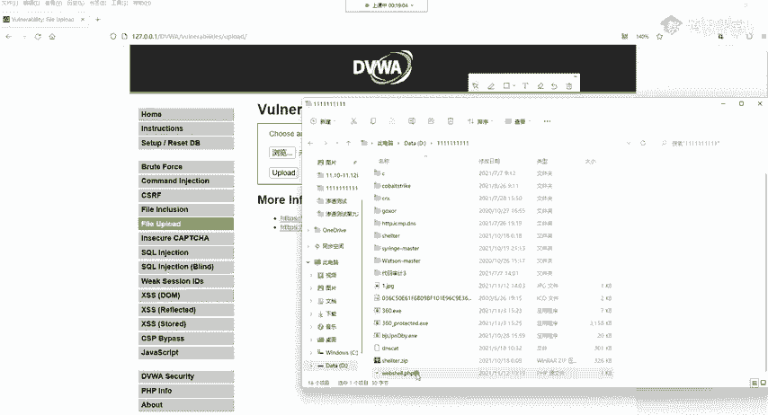
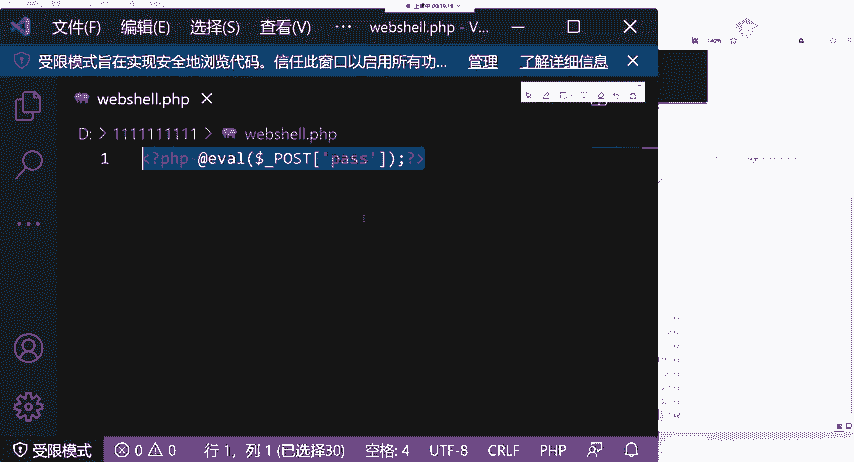
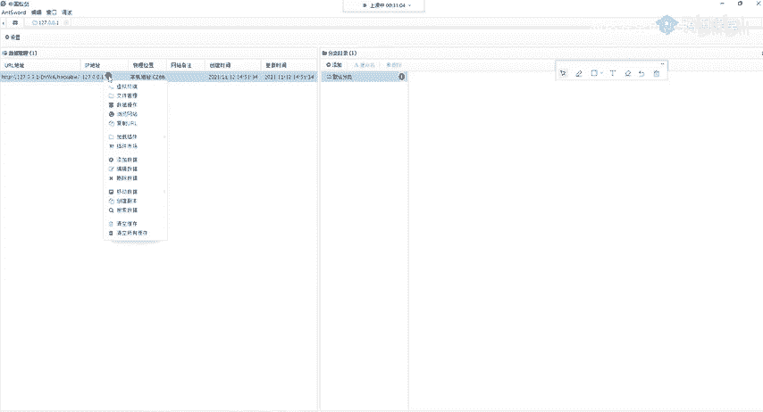
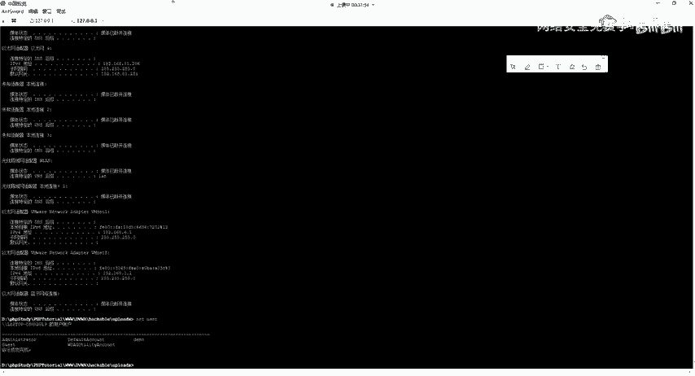
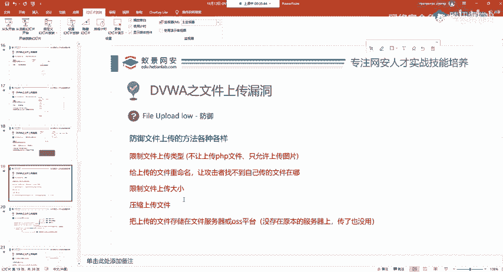
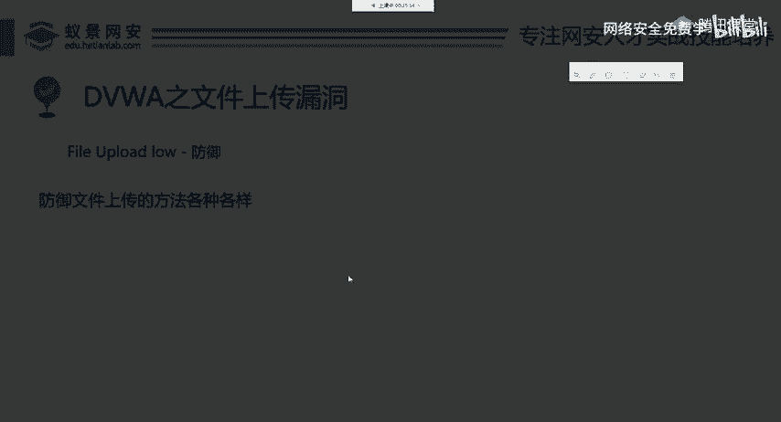

# 2024B站最值得看的黑客教程 ｜ 网络安全／渗透测试／内网渗透／漏洞挖掘／web安全／kali linux／红队靶场／CTF／信息安全 - P70：File Upload low - 网络安全免费学 - BV1uBsTetEow

先传一个啊，把我们的DVWY给打开。Yeah。登录用户addmin密码password。Okay。Okay。好，我们登进去登进去之后，将DVW的scurity。选择漏就是低级别的。然后在这边呢。

我们点击今天所要讲解的漏洞fi your upload就是文件上传的意思啊，就是文件上传的意思。这里我们把本地的后门去上传到网站中。我们首先需要在本地这个地方创建一个后门。怎么去创建呢？

你就新建1个TXE文档。然后把这个名字改成web share点PHP或者是其他的名字，以点PHP结尾就行。

看一下，这是我写入的这个遗嘱项目吗？Yeah。这我写出的一句话木马，就这一句话，大家你可以多敲几遍就记住它了，或者是你完全不要记，你把它保存成笔记，然后复制粘贴就可以。

我们选择这个文件把它传上去。浏览。选择weber shell点PHP打开点击上传upload，把它传上去。传上去之后，这个网站会显示一条信息，他告诉你web shell点PHP已经成功上传了。

那成功上传之后，我们应该如何去利用呢？如何去使用这个木马呢？首先我们要知道你上传一个东西，你上传一个木马，你首先要知道这个木马它在哪儿，你如果连这个都不知道，就是连自己的木马都不知道在哪儿。

那还怎么去操作呢？是吧？就根本没办法去操作了。那这里他已经告诉我们了？叫点点杠点点杠handnk uploads这个文件夹下。那这个点点杠意思为上级目录。什么是上级目录。这是当前目录。

它的上一级就是这里，再上一级就是这里。就是在这个目录中，如果有同学说啊，老师我我现在啊没没基础，我分不清这个什么相对路径，决对路径没关系，大胆的复制过来，你把它整个复制，复制一下，看直接粘到这里。

直接粘贴到这里，看这个URL会发生变化。大家看好，现在是。有upload，还有两个点点杠点点杠，看我回车访问。是不是自动跳转成我们weber share，就是这个上传的木马所在的路径了。

当大家打开发现这个网站变为空白。就说明你已经上传成功了。如果它显示的是这个东西，比如说我随便访问一个东西，好吧，随便访问一个，它显示not found，就是没有找到，就代表你没有上传成功。

或者是你访问的地址不对，就是你没有找到你上传的木马在哪个地方啊，你自己都没找到自己在哪儿，就是这个问题。我们现在找到自己在哪儿了。所以说我们直接就能访问。那访问之后，它是个空白的页面。

就怎么会对这个网站造成危害呢？我们下面就来讲怎么利用。先给大家回顾PPT啊，我一般是先讲实战，再给大家讲PPT那这边呢我们会收到一个地址。那真正的后门文件地址呢。

就是DVW的 upload shell点PHP这个地址就是我们上传的木马后门下面我们来看怎么去利用它。第一个方法，我们可以借助浏览器的插件。这个插件是在安全工作人员中用途非常广泛的插件叫做汉客 bar。

就是黑客菜单的意思啊，黑客菜单菜单。那这个插件应该怎么去下呢？我以火狐浏览器为例子，就像你平常下载浏览器插件是完全一样的。如果你告诉我，你不会下浏览器插件，那还请你对电脑啊啊就稍微完熟一些啊。

把自己的电脑先搞清楚啊，我们这里点击拓展和主题。在这边呢我们可以搜索附加组件，就是浏览器插件。我们输入hkerb，按int回车键好，我们就能搜到搜到之后啊，这会出现很多的。

你可以选择下载一个老师呢使用的是hkb V2。因为呢它是一个永久免费的，可以看到forever free永久免费的一个版本。那我们就安装它怎么安装。你点点进去，我这里已经安装过了。如果你没有安装的话。

这里是安装，你安装就可以装上去了。非常的简单，三个步骤就能安装一个浏览器插件。在安装完成之后，那如何使用它呢？大家看我操作，安装完成之后，在浏览器的当前页面，就是在你的木马这个页面。点击F12。

按键盘上面的F12调出浏览器的控制台。啊，浏览器的控制台把它拉拉上来一点。我们可以看到，在你安装完插件之后，这个控制台的最后就会出现汉克霸这个东西，我们点击它。点击它之后，大家看好，这是一个标准步骤。

首先加载地址就是loadUIL点击它点击它之后，点击下面的一个选项叫做post data。在post data里面，我们输入个指令叫PISS等于在PISS等于之后，我们添添加进我们想要执行的PHP代码。

比如PHP info就查看PHP的信息。点击execcuse执行。可以看到，我们就能够执行PHP in得到这个PHP的版本信息，以及其中的环境变量配置信息等等。如果我们想去执行系统命令的话。

只需要更改它下面的内容，改成system。一个括号，括号里面用引号包裹我们想要执行的命令。比如说我想执行who am I。点击excuse。可以看到，得到who am I的执行结果。可以切换其他命令。

比如说IP configurefi。Okay。同样能够得到命令的执结果。如果你将其替换为杀子 down。然后就是关机的命令，那目标的机器就会关机。所以说呢这时候我们就拿到了目标的命令执行权限。

但是有同学说啊，那这个使用起来好像很麻烦。有没有更方便的使用方法呢？啊，下面讲的第二种方法，就是在渗透测试中，我们通常使用的方法。先看第一个大家记住了吧，要安装汉霸插件F12，把它调出来。

然后load uL在这个post data里面输入PISS等于sstem，然后中间加上一要执行的命令，就可以实现命令的执行。有同学说执行命令能干啥？执行命令，你什么都能干啊，只要你能执行命令。

权限允许的话，你什么都能干。好，我下面第二种方法也是我们最常用的，就是使用weber share管理工具。Yeah。Yeah。外包现有管理工具呢有非常多。那我们今天只讲一个也是最方便使用的。

叫做中国引建。中国引建它是一个网站管理工具，它的作用呢就是使用我们上传的木马乃至对网站以及目标的操作系统产生一系列的控制操作。比如说让它关机，让它去读取它的文件都是可以的那已建应该如何下载呢。

大家可以在get up或者是百度中搜索and word，就是已键的英语去搜索它，或者是呢我这里已经把链接写出来了，给大家简单打开看一下。在这边呢已键它是有非常多的版本的。

比如说DIRWIN这个是mike版本，就是苹果电脑的版本，还有linux各种架构的版本，以及针对于windows操作系统的这些版本型号，它是应有尽有啊，应有尽有。那关于于它怎么下载，怎么下载它。

我们大胆的去点击下面的获取已键。点击它在这边它就会有中文的文档告诉我们已键应该如何下载和打开。如果这个地方你还看不懂的话，我是不相信的。因为这里全是中文啊，它会告诉你怎么去下载，以及怎么去打开。

以及你在安装的过程中可能出现的问题，比如说你发现运行不了啊，怎么什么问题呢？啊，大家呢可以看一下它下面的排错指南啊，排错指南。这里我就不多讲了，这个别人已经写的很好，我也不会再去读一遍啊。

这个念书没有太大的意思。好，我们在安装好引键之后，那下面呢就是怎样操控这样一个木马。我来给大家演示一下。首先我们打开一键。稍等一下，我找一下我的一键哈。找一下安装的地方。Okay。

双击and word就能打开它。我稍等片刻，等待他的开启。系。好，OK。我把之前的关掉，把之前的关掉，这也都删掉。这是我在课前呢做的操作啊，我们第一次打开已键呢就是这个样子，那下面怎么去连接这个木马。

右键空白区域，点击添加数据。添加数据的时候，它有两个加星号的代表B选项，就是你必须要填的内容。第一个叫做URL地址，就是你的木马在哪儿，我木马在哪儿？在这个地方是吧，你直接给它复制过来。哎，站到这里。

这是第一个。第二个叫连接密码，这个密码是什么呢？这个密码呀就是我们weber share，大家看一下这个web share这个weber share方括号里面框起来的这个字符，这里框起来的是啥？

PISS你这个可以改改成张三李四王5IDCD都无关，你改成什么，你密码就写什么，我这里是PISS所以说我们在一键中也去写PIS。这之后就是中文啊，你可以测试连接，它告诉你连接成功啊，你添加就行了。添加。

添加上去添加上去之后，你可以大胆的双击双击，大胆的双击它。你看到这是什么，这个东西就代表我们对目标的一个磁盘进行了接管。比如说我可以看它C盘下面有什么东西啊，B盘下面有什么东西啊。

你看你是完全就是呃操控了它的电脑啊，完全操控了它的电脑。这是第一个使用方法。第二个呢就是你可以右键它在这边有很多的功能，比如虚拟终端。

我们就直接打开了1个CMD的命令。在这边我们可以输入一些命令，比如who am IIP configurefi。等等。这些命令呢，我们都可以在这个地方。

类似于像windows真实的com曼的指令一样去执行。那这个时候我们已经对目标的操作系统进行了一个接管操作。啊，通过这简单的一行代码就能够产生如此大的危害，可以看到文件上传。

如果开发者水平不高或安全意识淡薄的话，就会造成很大的危害。大家不要觉得这个没有这个是有的啊，这个现在还是有网站有的。

嗯。Yeah。好，我们下面呢来看这个回顾一下PPT哎，再来回顾一下已键怎么去使用。它的使用方法非常简单。我还是告诉大家，在渗透测试的时候，一定要善于变化，以及大胆尝试，就你不要感觉你的鼠标点下去会爆炸。

它，什么事都没有。你勇敢的点下去，勇敢的双击点一点，看看会发生什么事情。OK右键添加数据，然后添加后门，这里后门呢要注意两个地方。第一个是URL地址，就是URL地址。这URL地址呢就是后门的地址啊。

就是后门的地址连接密码就是我们这个已键那个方括号中就是那we share方括号中所包裹的字符串这个同学问有公网链接嘛，目前是没有的啊。这个DVWVI我没有搭建在公网上，你可以在自己本地去搭建一下。

我们第一节课就讲过了5分钟的时间你绝对能够搭建好它这是很好搭建的，自己去尝试就行。公网的话，大家啊其实也能够找到啊这样的一些文件上传的点啊，文件上传的点。但我们现在先不讲这些东西啊。

我们先把这个文件上传，看它怎么利用怎么防御啊，怎么防御。这是第二个方法，在添加完数据之后，你就可以。双击进入到目标的磁盘，有C盘D盘，它有几个盘就有几个盘，然后呢也可以去执行命令啊，都是完全可以的。

这个就是已键的使用，其他的we shell管理工具大同小异。顶多是它的界面可能不同，或者是后门可能更高级一些，其他的基本一样，原理都差不多。OK所以说我们就拿这个最简单的引见来给大家讲解。

下面我们来看怎么防御。那关于文件上传的防御。现在我不去讲，我还是那句话，大家啊其实大致的你都能猜出来，你都能猜出来，防御怎么防御？我刚刚上传的是什么？上传的是后门，我上传的是PHP。我现在开发工作者。

我不让你上传PHP不就行了吗？我必须让你上传图片，其他的我一律不收。所以说这就是总结的几个防御方法。首先最简单的就是限制文件的上传类型。我一个头像上传的一个界面，我只能让你上传图片图片。

比如说像TNGJPGJPEG等等这些图片，其他的我一律不收啊，你上传可以，我给你干掉。我告诉你，你只能上传图片，你现在是非法上传。第二个方法是什么？我们来看文件上传漏洞的利用中，是不是有个关键点。

就是你要知道你上传的后门在哪个地方，你如果不知道的话，你是不是也没办法是吧？所以说呢还有一个限制方法，就是给上传的文件重命名让攻击者找不到自己传的在哪，那他也没办法利用。他也没有办法利用。

第三点就是限制文件的上传大小。这一点其实没有太大的用处。因为我们的后面它的是非常小的这个一句话木门这个上传文件的大小呢可能会仿御一些大码。但是对于一句话木马没有任何的用，可以看到一句话木马呀只有1KB。

只有1KB的一个存储空间。

下面一个叫做压缩上传文件，这也是一个方法。因为压缩会破坏原本的文件结构，导致你传入的木马已经被破坏了，所以说就无法连接。

最后一点也是各大厂商，包括大家在使用阿里等等一些软件的时候，你去上传头像，你会发现你上传的这些图片，它不在网站中它是在一个单独的文件服务器或者是OSS对象存储平台，也就是说呢你上传的东西跟原本的网站。

它不在一个地方，这个地方呢就能够防御。它没在原本的服务器上，你传点木马也没有用，没有用的。因为它你传的木马没没传到网站上是吧？你传到其他地方的，传到一个文件服务器。

一个文件服务器上一个PHE的木马有用吗？肯定没用啊，文件服务器又不是PHD服务器。他什么用都没有。所以说传着也没用，这是几个常见的防御方法。那现在呢我们知道这些原理之后，知道这些思路之后。

