# 2024B站最值得看的黑客教程 ｜ 网络安全／渗透测试／内网渗透／漏洞挖掘／web安全／kali linux／红队靶场／CTF／信息安全 - P71：File Upload 防御 medium - 网络安全免费学 - BV1uBsTetEow

我们来看DVWY他是怎么去写的。如果你看不懂PHP没关系，我告诉大家了，这些只需要把这些函数用英语翻译成中文就行了。如果实在不懂的地方，我会做二次的解释。我们先来看medium终极防御。

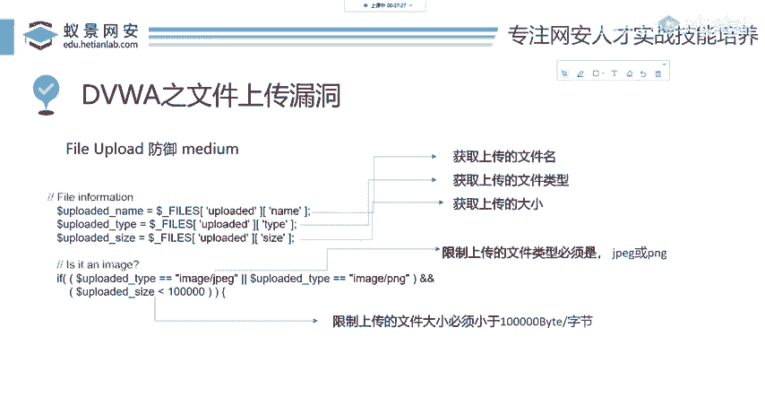

打开我们的DVWI将security调至med。

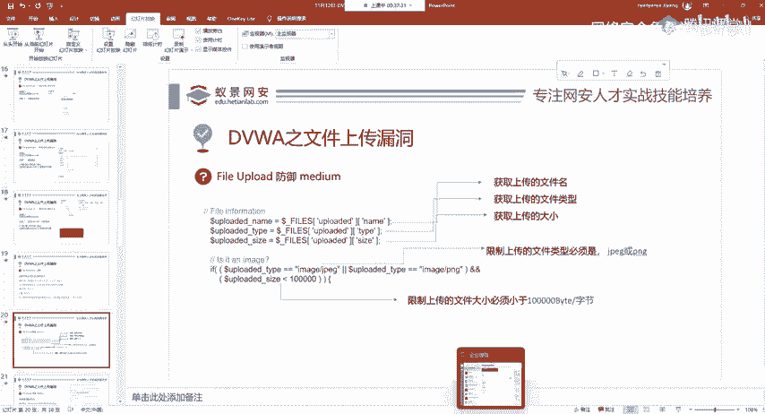

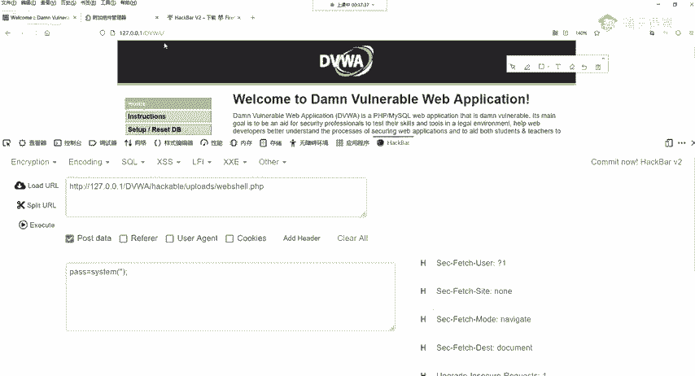

Yeah。Yeah。Okay。Okay。

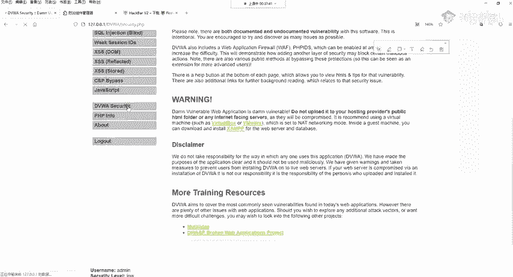

好，我们调到medium。再点击fi your upload，这是终极的防御。我们先不去上传来看一下它怎么防的啊，看它怎么防的。

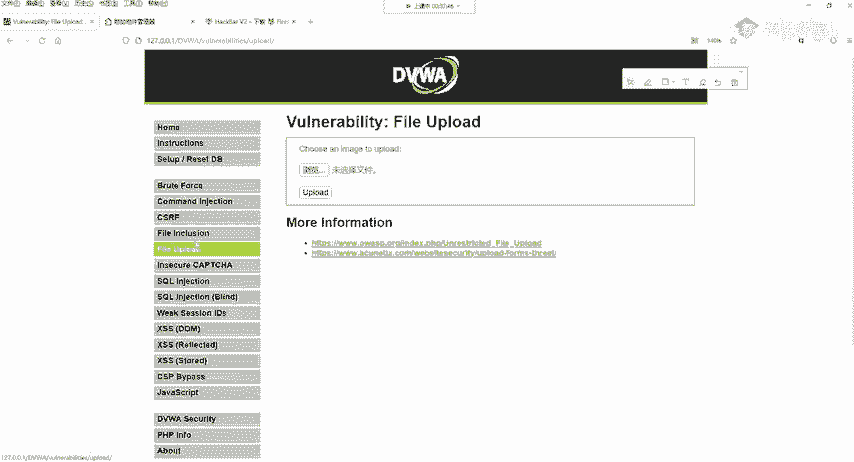

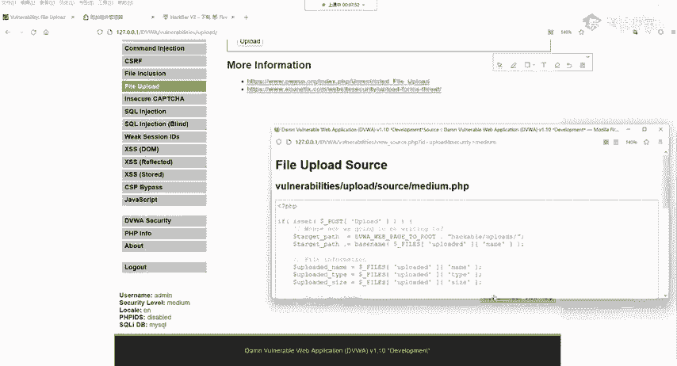

这个防御的关键内容我已经粘贴到PPT上面了。我们来看这关键的几行几行代码。因为不论是做开发还是安全，这个代码，你肯定不能是说从头从头阅读到尾啊，这个工作量太大，并且也没有必要。我们来看。

首先它做了三个内容的获取。第一个叫做upload name。你现在不懂PHP你能不能看懂它uped已经上传的name名字，它的作用就是获取上传的文件名。

比如说我们上传的是web share点THP那它这里获取的就是we share点PHP这几个字符。那下面一个是typepe类型，我获取上传的位类型，上传的文件类型，就是你是图片啊，还是音乐呀。

还是PHP啊，我获取你的类型，下面一个是获取size大小，获取上传文件的大小有多少KB有多少字节我去获取。啊在获取之后，他做了什么操作呢？他做了一个判断。

判断这个type类型是不是JPEG或者是这个类型是不是PNG。如果不是你就不要再传了。就是这个意思。所以说它的作用就是限制了上传的文件类型必须是JPEG或者是PNG这两个都是图片经常使用的文件类型。

第二步，它又做了一个限制，叫做size小于10万，这个是什么意思呢？就是限制上传的文件大小，必须要小于以10万byte就是10万字节啊，这个是最做大小的限制。可以说它限制了两个东西。那对于这种限制情况。

我们渗透测试人员应该如何绕过呢？因为我们讲了它是med既然是终级，就肯定有绕过的。

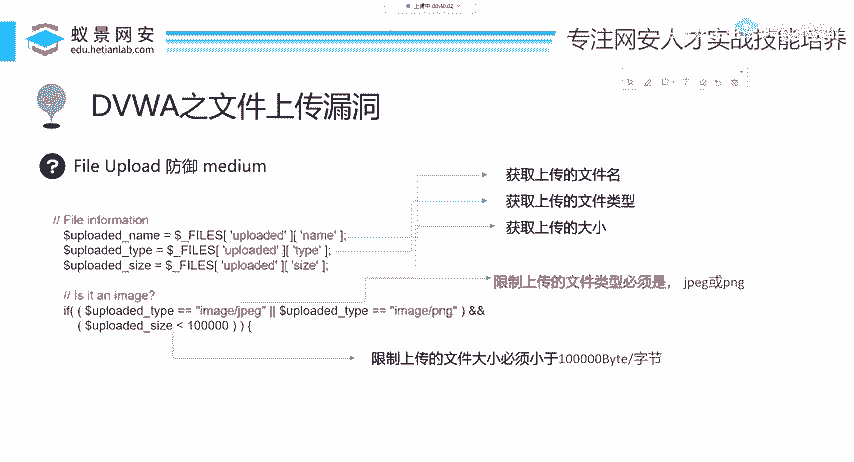

办法大家听我慢慢的讲解。这个解决办法呢就是通过一些抓包软件。比如说在渗透测试中，我们经常用到的抓包软件叫做bbsuit啊，bb suit的使用呢，你可以自行搜索网上非常多，并且它的下载也是非常简单的。

它就是一个普通的java应用程序，我们用它呢就能够拦截我们网站所发起的请求信息啊，就是这个意思，比如说我们上传，你就是什么意思呢？就是你上传一个图片到服务器是吧？本来就是这个上传过程是很流畅的。

现在这些抓包软件呢，它中间给你拦一下，就跟个收费站一样，你现在想上传图片是吧？这个bsuit一看，你别急，你先给我看看，先经过我一下，我看看你有没有什么东西，然后我再给你放行再上传到服务器。

那抓包就是这个意思。那下面呢我们来实际用一下。一个帮助的。如果你不会使用也没关系啊，它这个使用还是非常简单的。首先第一步我们先打开它。如果想需要帮助的，或者是啊你觉得网上下载的呃不实用的话。

你可以加班主任啊，跟我们班主任说啊，班主任会可能会发给你这些工具包。我们把buff呢启动开来启动开来。

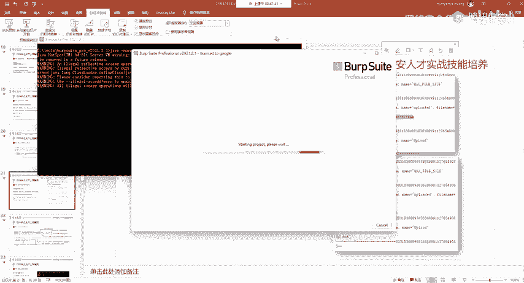

怎了。启动开之后，我们第一步要获取这个抓包信息，获取这个抓包信息怎么获取呢？啊，我把这个就上传一个文件，我把这个代理给开启了，我就上传一个文件。

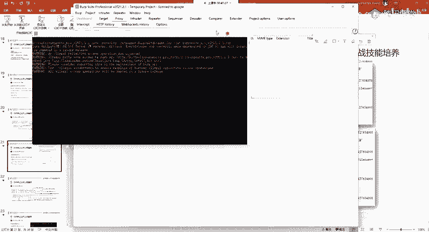

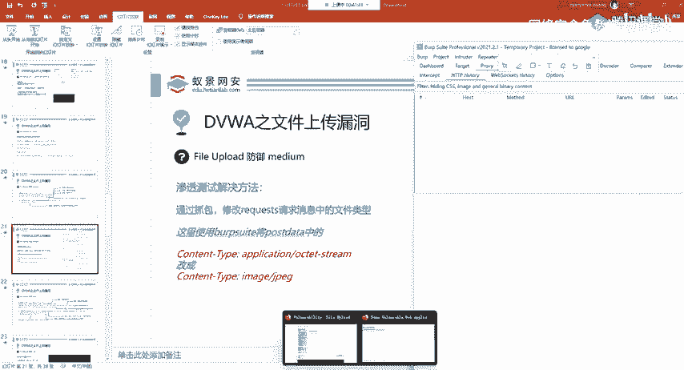

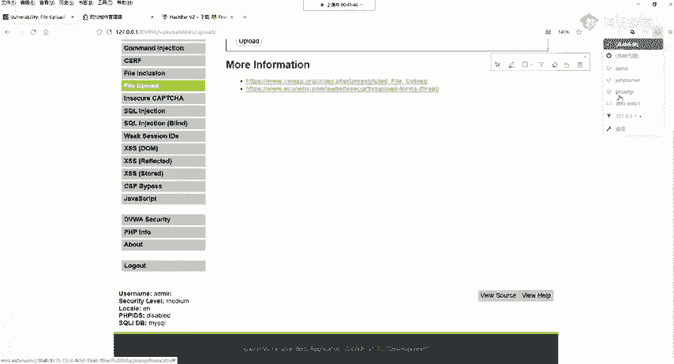

我上传一个正常的我上传一个啥呢？我上传我的web shell，我现在看行不行啊，我upload。他告诉我不行，为什么不行呢？他告诉我你的图片啊没有上传，为什么没有上传呢？

因为我们现在只允许JPEG或者是PNG的图片上传。那这上传的这个包这个数据有没有被抓包软件抓到呢？我们打开这边看一下。在这儿呢看到没？upload upload load上传在这儿呢给它抓住了。

抓住之后，我们下面可以去修改它。

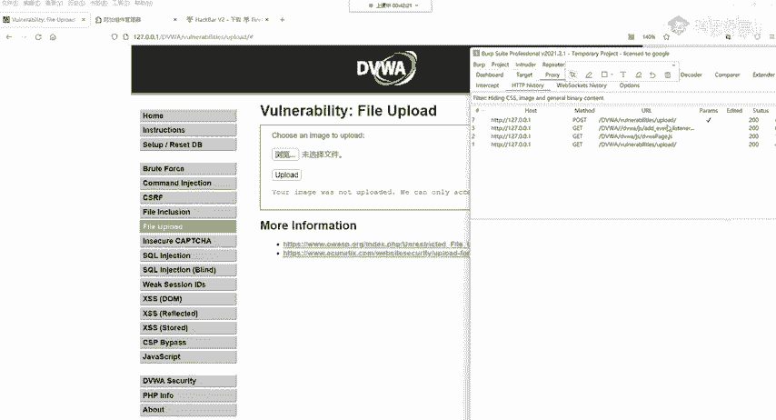

看一下这边就是它上传的一个文件，修改哪个地方呢？啊，这是一个标准的解决方法。大家啊你可以不需要记忆，还是就可以自己搭建一个操作一下，更改哪个地方呢？现在我直接上传肯定不行是吧？直接上传肯定不行。

因为这是一个PHP更改哪个地方呢？在这个数据包的下面有个叫做content type记住不是第一个是后面的这个啊后面的这个叫conent type。

它现在默认是application oTET stream这个留数据，我们现在给它改一下，改成什么呢？改成image就是图片。跟上PNG或者是JPEG改成它。改成它看就是做一个更改。

你可以用这个键盘直接改的，直接删，直接改。改好之后，我们现在把这个上传的数据给它发送出去。点击sad就是发送。发送出去之后，我们来看这边它有没有显示上传成功，来看一下这边你要找才告诉你。好。

这个web shell点PHP已经成功上传了。我们成功上传了，就这样就绕过了。如果你说哎这个地方我看着头疼，然后看不懂源代码，点这个readder分析。看。告诉你已经成功上传了，就这样一个简单的操作。

就可以绕过这一个对于文件类型的判断。

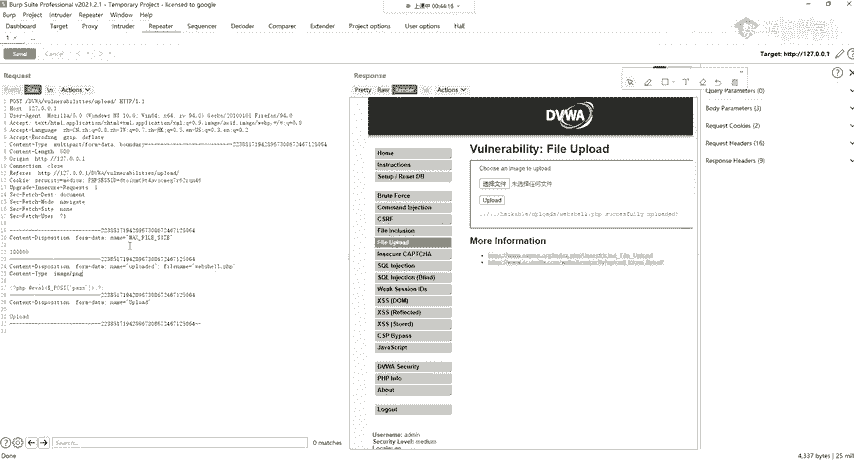

下面简单回顾一下PPT将post data就是最后面的一个conent type步，从默认的application OCTET stream改成imagage JPEG或者是imagePNG就能够成功上传。

上传之后，我们可以再次访问，然后连接一下，看看行不行。返问哪个地址啊？这个地址我们可以直接复制过来是吧，直接复制过来。

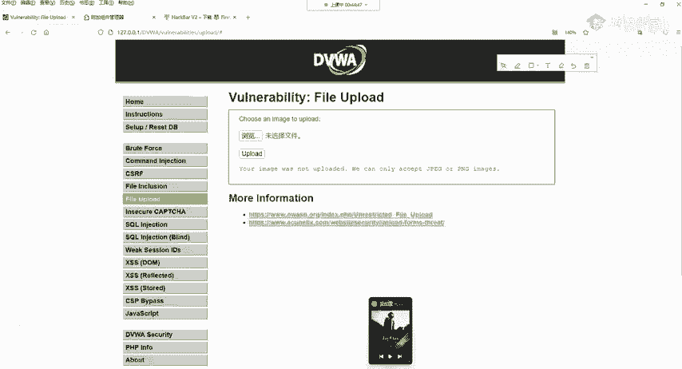

嗯。给他贴到这儿。Yeah。访问一下能访问成功。然后我们同样的可以使用已键去连接，我把之前的呢清除缓存。然后我给它删掉吧，这个连接的方法再重重复一遍。

添加数据UIL地址就是你木马的地址连接密码是木马里面那个方括号包裹起来的字符串啊，passpass看能够连接，能够执行。他能够执行。OK这是终极的防御，可以看到它几乎没有任何的作用。

因为抓包这个可能是做IT可能都了解过这个抓包解包的一个过程。啊，所以说我们可以对它进行简单的更改，绕过这样一个限制。那may我们不行那，开发人员要注意这样是不能够防御的。那们下面来看hi。更高一级。

首先，重新打开我们的DVWI将DVWSQity调至高级hisubit提交，再次点击fire upload文件上传。在这边我们点击vi source查看源代码。

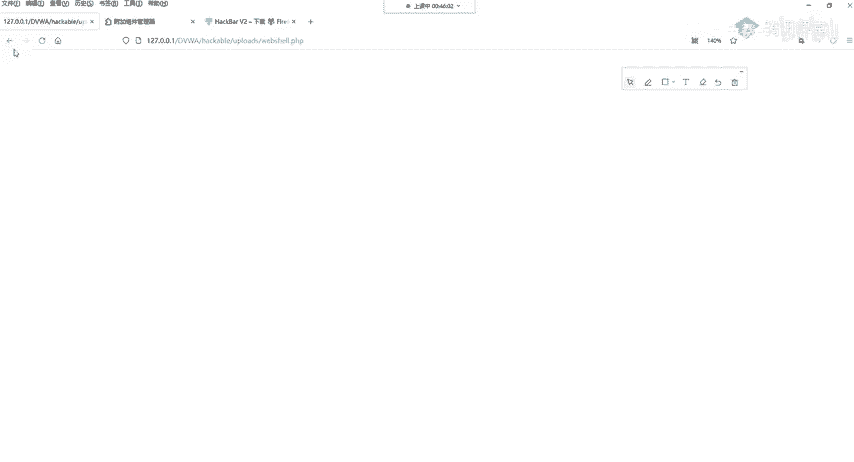

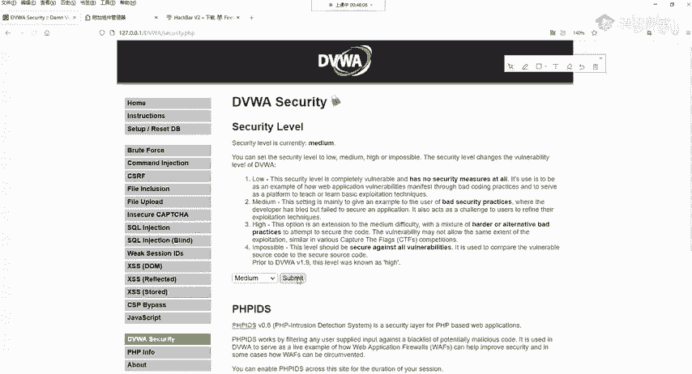

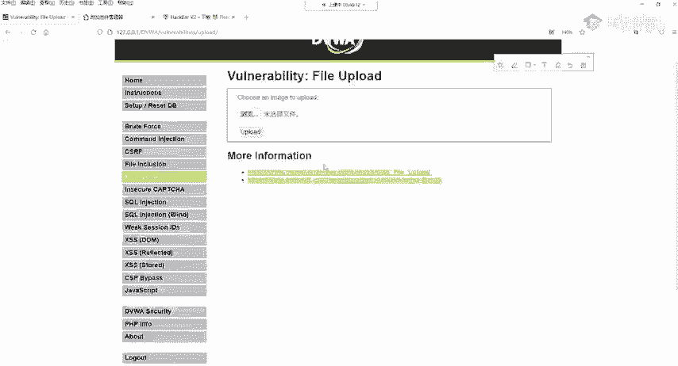

稍等一下。没改过来。我。Yeah。啊，在这边呢我们就能够看到高级的这个防御。这个防御的关键信息呢，我也给粘贴到PPT上面了。因为大家呢看的更清楚。这里我做了一些标注。首先第一步。

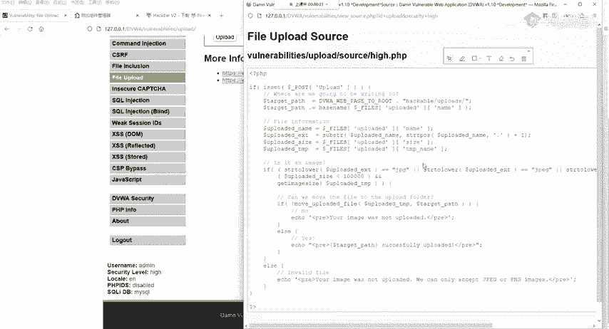

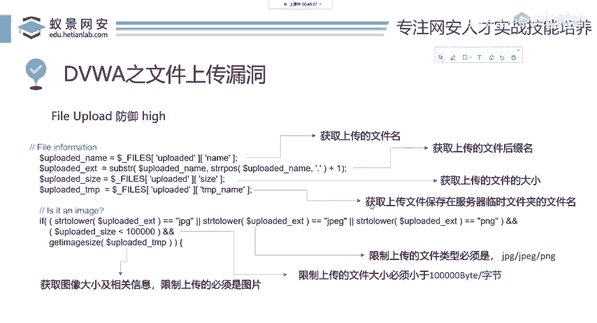