# 2024B站最值得看的黑客教程 ｜ 网络安全／渗透测试／内网渗透／漏洞挖掘／web安全／kali linux／红队靶场／CTF／信息安全 - P72：File Upload 防御 high - 网络安全免费学 - BV1uBsTetEow

获取上传文件的名称还在是吧？这个没变这个没变。然后下面做了一个什么操作呢？我们之前medium的这里是不是获取了文件的类型type，它这个地方它改了，把这一句改了，记住这是一个标准的改法。

大家如果你防御的话，要记住它，它改的是什么意思呢？它是把我们获取的上传文件名，以点为分格取最后一个啥意思啊？你上传的文件文件名以点号为分格，取最后一个啥意思啊？就是获取上传文件的后缀名。

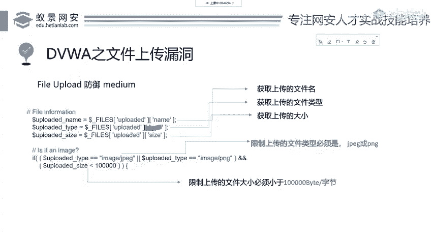

我现在不要你什么type类型不类型啊，我就想看你的后缀名，我拿到它后缀名，你上传木马后缀名就是PHP你上传正常的文件后缀名就是JPGJPEGPNG等等图片的后缀名。下面的都没变。

s一次获取上传文件的大小。然后下面呢它又做了一个操作，就是获取上传文件保存的临时文件。这个你先记住，先记住它是一个搭配操作。一会儿我们会讲，现在我们先看它对文件后缀名的判断，文件后缀名是EXD就exs。

这个后缀拓展的前三个字母。这个英语，我们就判断它的后缀名是否等于JPG是否等于JPEG是否等于PNG中的其中一个，如果都不等于拜拜，我直接把你干掉，不允许你上传。所以说这个时候他把我们后缀名给限死了。

也就是说他限制了上传文件的类型啊，文件的后缀名必须是JPGJPEG和BNG这三个后缀名。下面他又做了一个操作，叫做get获取imag图片size，获取文件大小。那有同学说啊。

老师他这个前面不是获取过一次大小了吗？他这里为什么还要再获取大小，大家看好有个区别啊，前面获取的是什么？前面获取的是上传文件的大小，不是图片的大小，懂吗？我上传一个音乐，它会获取音乐杂小，上传一个木马。

它会获取木马的大小，并没有讲是图片。但是这里的get image size它的作用就是获取图片的大小。如果你上传1个PHP后门，它能够获取图片的大小吗？不能为什么？为什么？因为后门它不是图片。

你或许从一个后门中你去获取图片的大小，那肯定会报错，肯定不行，执行失败。执行失败，获取不到，我也把你干掉，你就不要传了，就证明你传的不是图片好。OK其实这个哈漏洞它限制的还是非常严格的。

首先它限制了我们的后缀名必须是JPGJPEG和PNG。第二个它限制了我们必须要传上一个真实的图片，你假的不行，你改一个后缀可不行？有同学说我把web share，我把web share啊，我改一下后缀。

我改一下，大家看行不行啊，看我操作，给他看行不行？啊，有同学说这这改后缀是吧？那我改改成PNG。改好他现在是不是图片呢？他肯定不是的，你打打开打不开，你看看都看不了，但是你能不能上传呢？我们试一下。

好吧，试一下。

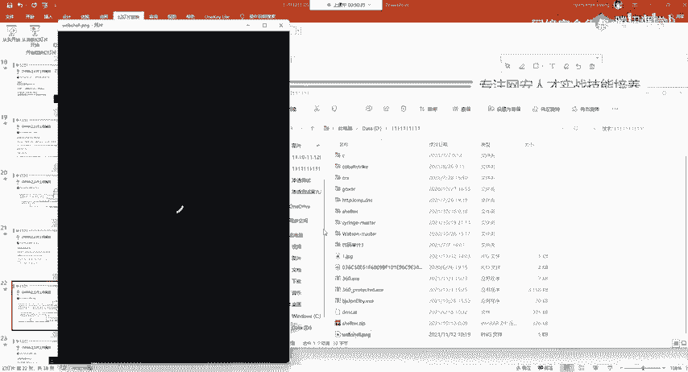

把这个PNG给传上去，行不行？不行。所以说改后缀名是不能够改变文件格式的。大家一定要清楚，就像有同学去做视频1个MP4的，他想改成一个其他的后缀，他直接的去改后缀名。我告诉大家，不行，没有这一说啊。

你改后缀名是没有办法改变文件的类型的。

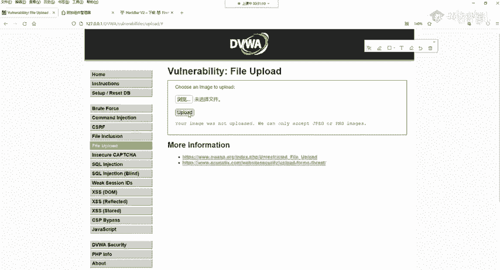

所以说这个东西行不通，我们再改回PHP改回PHP。那行不通怎么办呢？我们现在要做的就是要找一张真实的图片，真实的图片怎么找？这个解决方法我先告诉大家，如果这个防御是在PHP5。4版本以上。

并且这个目标机器没有除文件上传漏洞以外，其他漏洞的情况下，这个代码可以说是比较安全的，就是已经防御了，已经防御了。但是我们这里在DVWA中，我们可以去学习绕过。现在先创建一个图片，创建一个图片。

怎么创建图片？很简单，你从百度下载一个什么图片都行，或者是你直接截个图，看我用QQ截个小小的图，我保存下来，保存成一点JPG保存个一点JPG我存在这儿。现在一点JPG是不是图片，它肯定是个图片。

它就是真正的图片。虽然只有一点，它它一点儿，你也不能说它不是图片，它再小它也是图片。然后下面要做的事情就是把weber share这个木马给它加进这个图片里面怎么加啊。

有个非常简单的方法就是我们在当前的目录打开CMD。

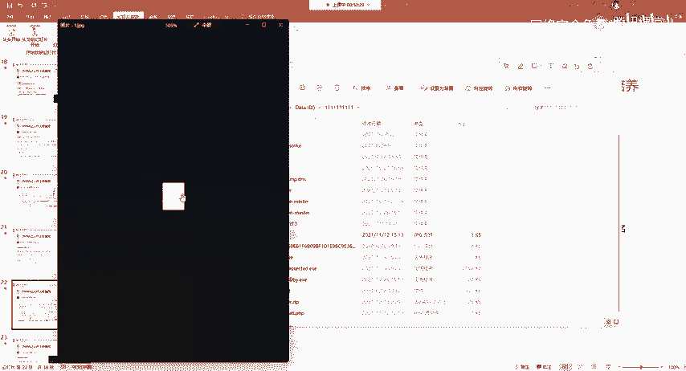

打开CMD打开CMD的方法，按住shift加上鼠标的右键，就有一个在当前目录打开命令行提示符的一个选项。windows11操作系统直接。睇。这种方法在上面的这个菜单栏中，你点击一下，把它删掉。

输CMD3个字母就能打开。这是三个方法，像下面呢我们输入一条命令叫copy复制复制什么呢？复制要加一个杠B这个B是啥意思啊？这个B叫做sary二进制的第一个字母banary二进制第一个字母。

代表呢我们现在想要添加编辑这样一个二进制文件，就是这个图片文件嘛，图片文件肯定是二进制文件，啊，我们要编辑它，现在怎么去把它加进去，一点阶PG。

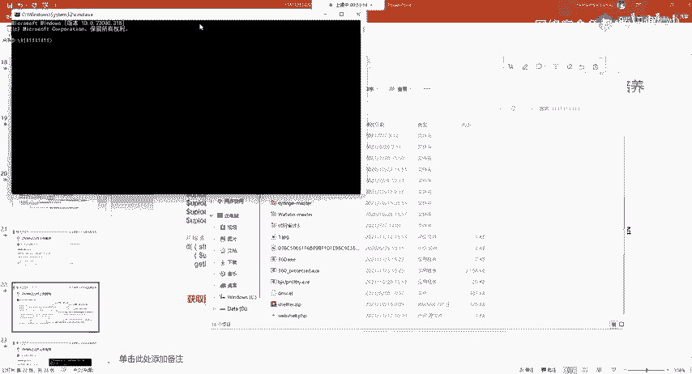

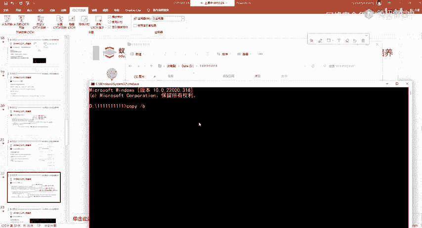

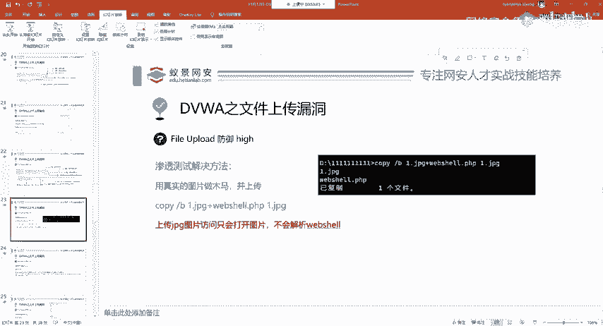

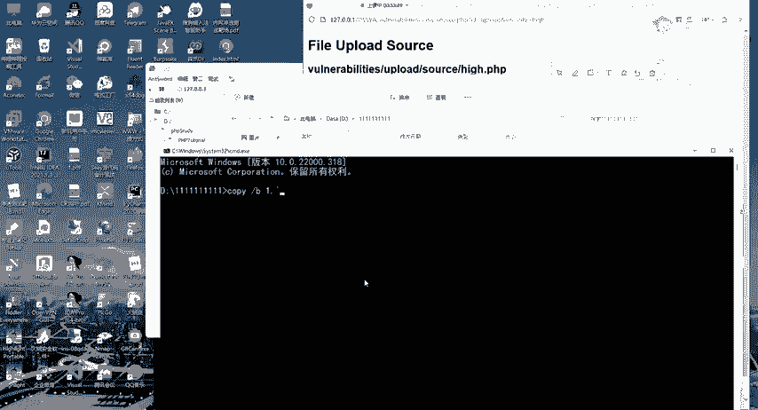

后面再跟上我们的we包 shell的名称。

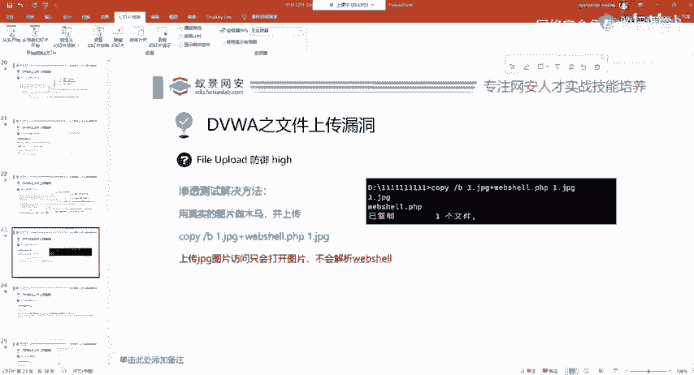

哎，稍等一下。好加加号一点加上we shell点PHE。然后最后面啊你输入你想生成一个新的新的图片的名称。比如说我还去生成啊，我生成个二点JPG吧，2点JPG。我回车。

这个时候我们就成功的把正常的图片和我们的木马做了一个合并，然后生成了2点JPG这个图片。那这个二点JPG它是不是一个图片呢？我们可以打开看一下。

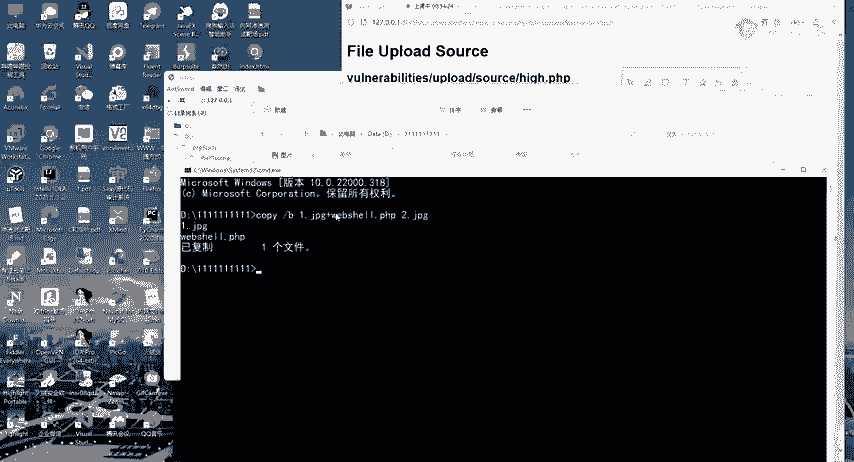

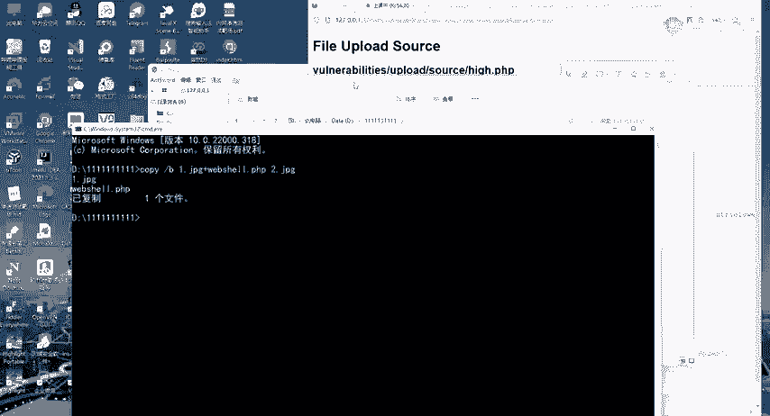

是不是一个图片？是的，同样是一个小白色的方框，它是个图片。那我们来看这个木马它在哪里呢？其实你可以用记事本或者是其他的编辑器去打开它。我们来看一下。

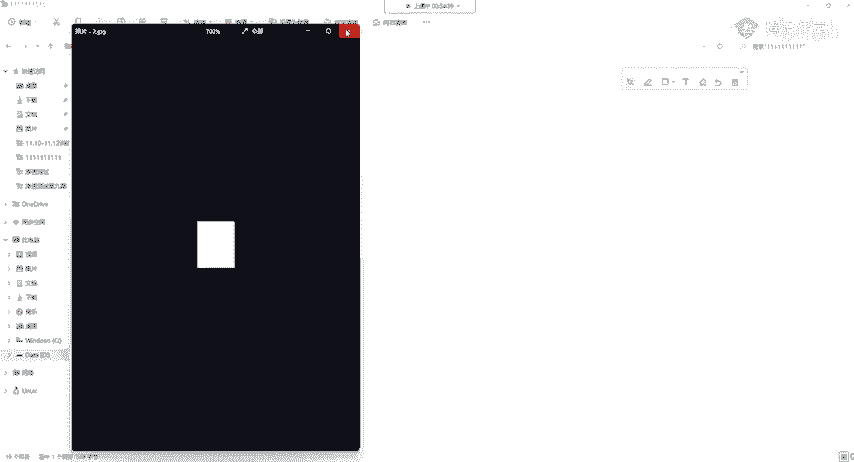

看好。还到最后。看到没？这个木马定在最后面了，这个木马放在了最后面，它并不会影响原本图原本图像的像素正常显示。一定要知道它现在放在最后面了，什么事都没有，不影响，不影响正常。正常不影响啊。

下面在这个情况下能不能上传呢？肯定能上传，为什么能上传？它是一个真实的图像嘛？我们来实际看一下浏览。点击2点JPG打开上传。他告诉我们上传成功，请问现在上传成功之后，我们能够使用一键去连接它吗？

我们先访问一下试试，先访问一下试试啊。在这边我们访问一下他。

还能访问到就是一个图片。那现在你可以用一键连接吗？我们可以试一下，我们可以试一下新建一个。

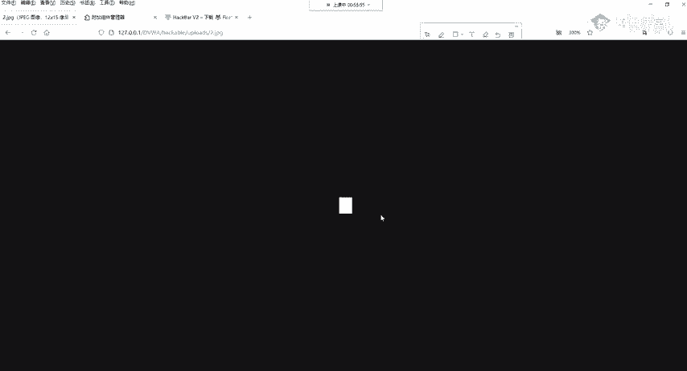

密码pass。添加我们回去看一下。回头看一下，有同学说能连接，我告诉大家，这是很多小白都会犯的一个错误。我告诉大家，不行，不能连接。你这里看到的链接它是假象，它是已键的缓存，懂了吧？就是已键你操作之后。

它会给你保存下来，这是缓存。比如说我们把之前的这个删掉，我把它删掉。再把他的缓存给清空掉，再来连接看一下行不行。不行，稍等一下。清除缓算。啊。连接不了。连接不了，那连接不了的原因是什么？那，非常简单。

因为它就是个图片，那一个图片你还能说它是木马吗？图片就是图片，没有它怎么改，它都不是木马。那在这个情况下怎么办呢？我们就需要找到其他的漏洞，比如说PHP的呃阶段，我们这里先不讲啊，不讲这个东西。

这是PHP的特性。我们先讲另外一个就是解决方法之一，我们利用其他的漏洞进行组合式的打击，这个在渗透测试中非常常见，一个漏洞可能不会产生太大的危害，一般是多个漏洞综合利用才会得到最大的效果。

我们要利用的漏洞叫做fire include文件包含。文件包含漏洞是PHP中一个非常特殊的漏洞，它会把我们包含。

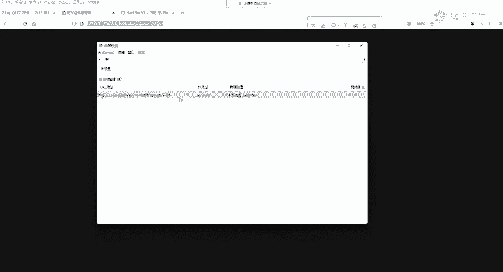

的任何文件，不论你是音乐也好，你是图片也好，它都会把你当做代码去执行。就是这个意思怎么包含呢？怎么包含呢？在后面加上我们文件的路径D盘PHPstar然后3WDVWI12点JPG啊。

我刚刚上传的是2点JPG，就是加上它就可以进行包含了。哎给大家演示一下，我快速演示一下，这里可能需要一些基础。如果你不知道，你可以根据老师的操作来看一下访问。访问之后，你会发现啊它出现了一些东西。

出现了一些哎奇奇怪怪的东西，就代表恭喜你你已经包含成功了。你现在这个二点JPG这个图片已经被当做PHP代码去推解了。就它文件包含中在文件包含漏洞中，它不会考虑你什么东西，它一切都是PHP代码，啊。

一切都是PHP代码，那现在我们就可以用已键去连它，怎么连大家看好右键。

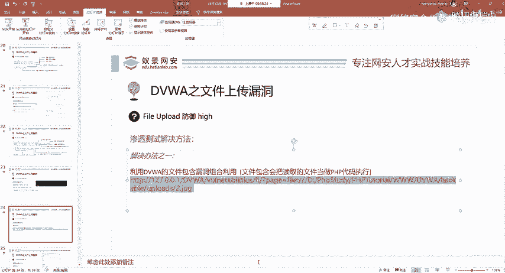

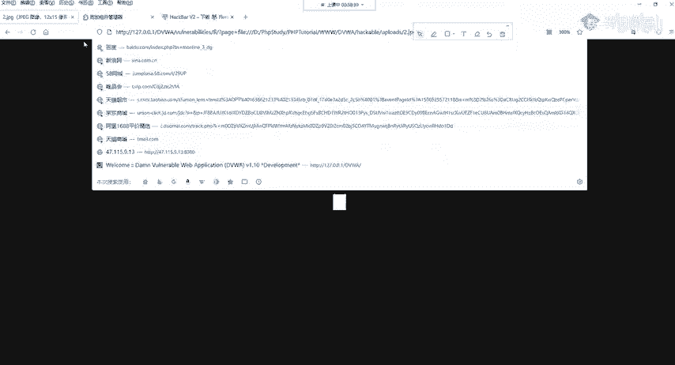

添加数据啊整个的都复制过来，你不要复制少了不要复制少了。整个的都复制过来，然后连接密码还是pass还是pass，大家能听懂吗？你可以和讨论区跟我交互啊，能听懂了，可以给我回应，听不懂。

请问出你哪里听不懂，哪一个名词听不懂，我可以再为大家做解释啊，我们选选择pass选择pass之后，现在是不能够直接这样连接的，为什么不能这样连接，大家还记得一个东西吗？我们的DVWI是需要登录的。

它需要登录，但现在已键有没有办法登录呢？它没有办法登录，怎么办？就让浏览器把它的令牌给到已键中就是它的coie给到已键就能够连接了。大家看操作。请求信息点击在这边呢要添加name和value。

name叫做cookie。就是令牌代表你已经登录的一个令牌value。这个value呢我们可以从浏览器的F12中找到它点击F12网络重新载入一下，点击第一个。

查看最右边请求头这个地方有个叫coki的东西，我们完整的把它复制过来。Yeah。粘贴到引进的value值中，点击测试连接，你会发现连接成功。啊，这个时候我们就能够操控它的机器了，这就是真正的啊木马。

真正的连接了木马。O。这是hi这是hi。那在解决完hi之后，我们来看最标准的写法应该是什么样子的。Yeah。Yeah。看imposible。Okay。imposible他的一个算法。

我就不给大家再打开DVWI就换了呀。因为我已经把这个源码给放在PPT上面了。首先我们来看它的防御。Yeah。第一步，UNIQID这个东西是个随机数据，它的作用就是更改文件名。就是现在我你上传东西是吧？

我把你的名字给改了，你weber share上传上来，它不叫weber share了。我给你改一下文件名。第二个还是和之前一样的处理，判断它的后缀，判断它的后缀。并且判断它的大小。

然后又判断了typepe，可以看到imppoal是medium和hyide全部内容，它都进行了判断。不仅判断了type还判断了后缀名和大小。其实到这里基本上来说你已经绕不过去了。

但它下面又做了一个很多厂商，很多网站就是大大家去访问那些呃QQ微信，都是这样，谢谢的。就是重新生成图像，又叫做压缩图像。我现在截一个图，我在本地找一个图片，通过QQ发给你。如果我不点击原图的话。

你收到的图片跟原本的图片，它的内容是不一样的。经过了压缩，压缩会破坏图像的内容，会导致你的木马就不在了就。不在了，懂了吗？他就不在了。那在这边呢，我们可以看到。😊，从这里我们算法是哪些？

我们具体分析使用了两个函数，一个叫做imagage JPEG，一个叫imagage JPNG。它的意思就是将原本你上传的图片，我重新给你编码创建一个新的JPEG图像。

然后这边呢你可以指定清晰度0到100就是越低，它的清晰度越差越高，它清晰度越好。那在这个情况下，我们原本你不论你在前期怎么去改。那到服务器之后，你这个图片都会被重新的编码。

也就是说你写的任何的木马都不会在新的图片中存在。懂了吧？那PNG就是创建一个新的PNG图像啊OK。这个imppoible是采用了hi和med的过滤验证，解决了上传不是图片的问题。

并且imppoible更是让服务器重新生成一个图片。它是从根本上完全避免了文件上传漏洞以及图片码或者是其他的并行木马，其他的后端语言以及程序也可以实现相应的算法。

OK那今天呢我们是通过DVWA给大家讲解了文件上传漏洞。从怎么发现怎么利用怎么上传，以及已键的使用，还有在开发中应该如何去防御这个文件上传漏洞。我们是以世界上最好的语言啊，打个引号呀。

PHP来给大家做了一个详细的讲解。

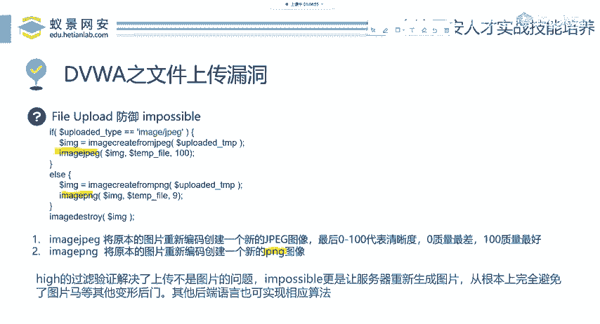