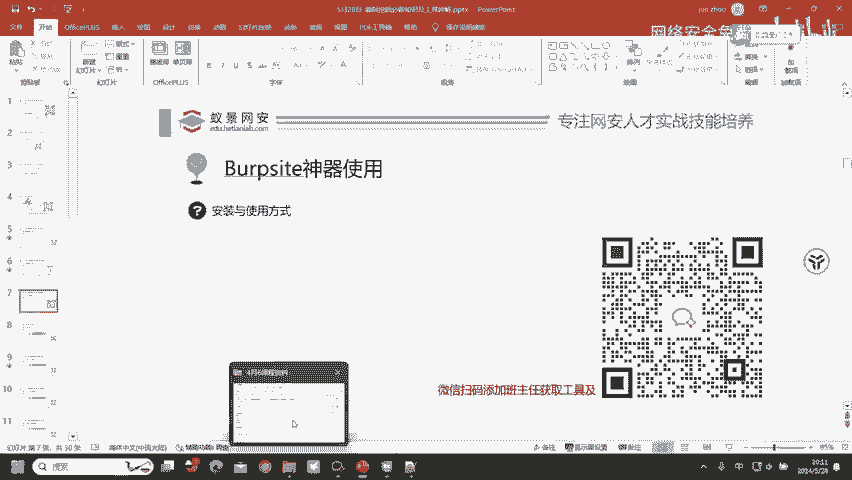
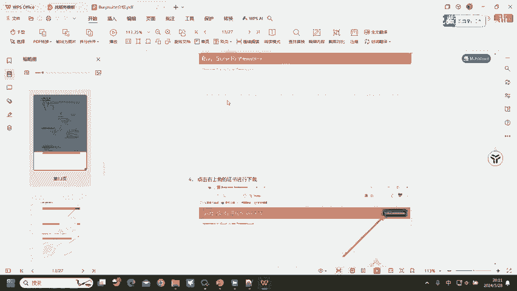
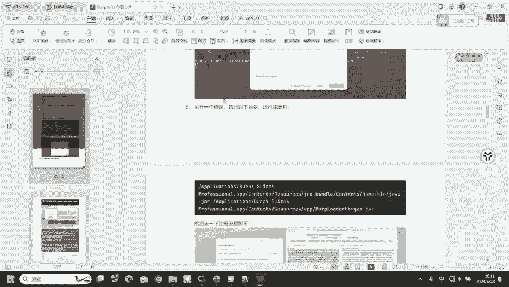
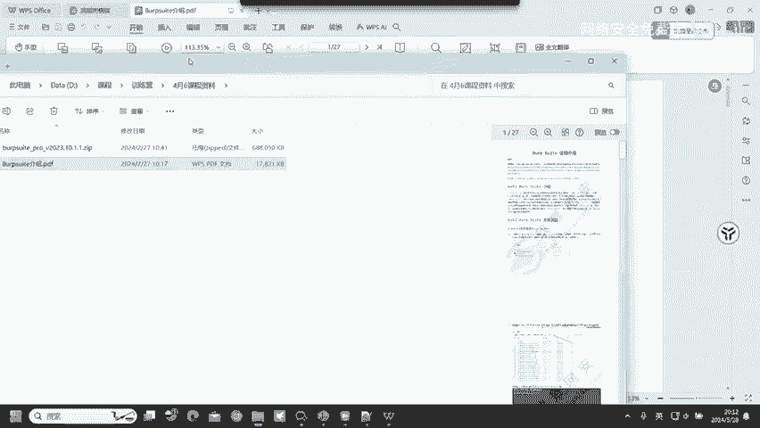
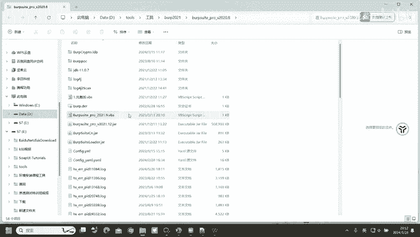
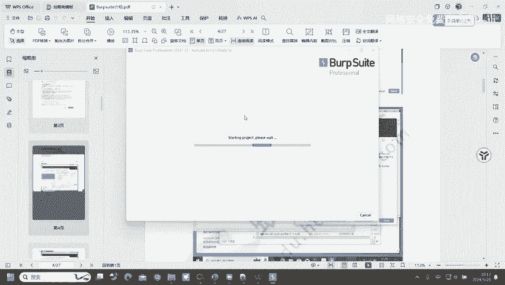
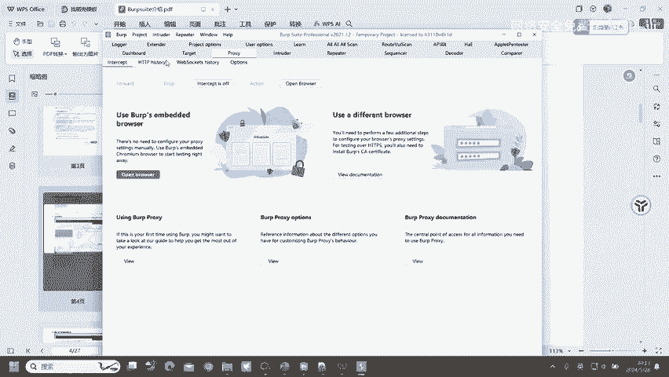
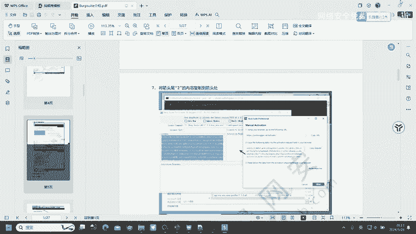

# 2024B站最值得看的黑客教程 ｜ 网络安全／渗透测试／内网渗透／漏洞挖掘／web安全／kali linux／红队靶场／CTF／信息安全 - P73：Burpsite神器的使用 - 网络安全免费学 - BV1uBsTetEow

首先呢我们去了解一下对应的一个工具，也就是挖掘漏洞会用到的工具。b布 suit这个b布 suit呢是我们去挖掘微波漏洞必备的工具，基本上90%的漏洞都可以通过b布 suit去进行发现去进行一个测试。

那巴不速他该怎么安装呢？

Yeah。这边有一个介绍文档，也是给大家去准备好了的一个介绍文档。在这里面呢就有bb suit的一个安装与基础使用。因为今天的课程呢就只有一个多小时的时间。如果说把b布 suit给大家讲一遍。

然后再把APPP协议给大家讲一遍，很明显。

时间就不够了，因为包括速字来安装的话，也需要花费很长的一个时间。嗯，所以说呢大家就跟着这样的一个文档去进行操作，基本上呢是不会有任何问题的。文档在哪里获取？在你们进群，或者说你们进入课堂的时候。

会给大家发一个预习文档。在预习文档里面的。百度网盘链接就存在有这一个b suit文档，就有这个文档告诉大家怎么安装，以及呢里面存在有我们会用到的b suit这一个工具也都会在里面。

然后我们就跟着这样的文档去进行安装使用就可以了。最后打开呢就是这样的一个界面。Yeah。没有。

嗯。嗯。😊，对。Oh。如果说同学们想要这种CAUD证书啊，其实呢。很好获取的CU技证书很好获取的。

很简单。事件型、通用型都很简单。尤其是事件型，事件型呢就随便的挖几个漏洞，就有事业行证书了。Mmhm。😊。

打开之后就是这样的一个界面，然后呢我们就可以去进行使用了。好，这里的一个巴布速的安装的话，我就不做过多的讲解了。大家跟着文档去进行安装即可。

