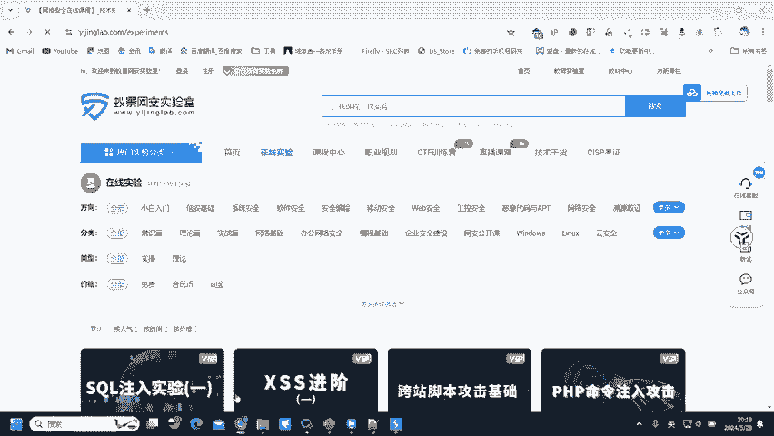
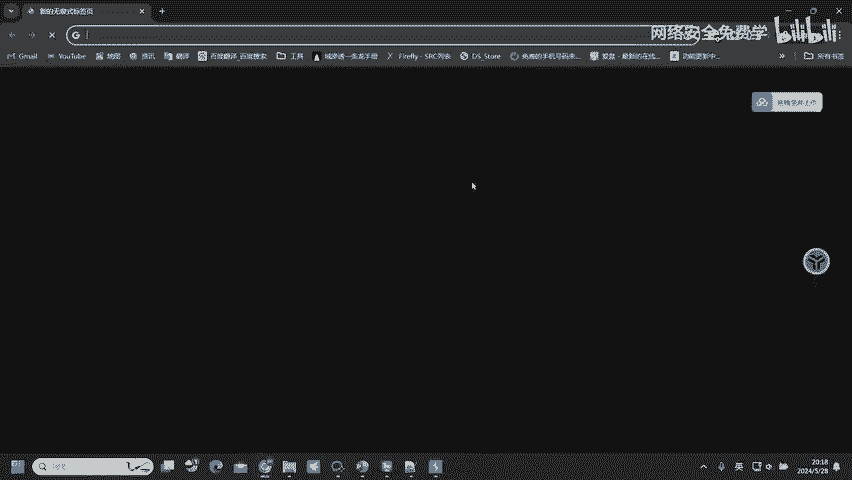
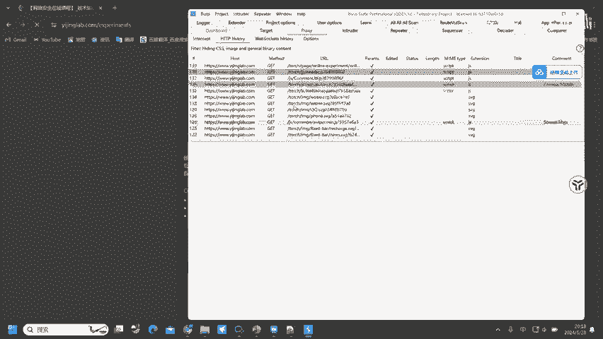
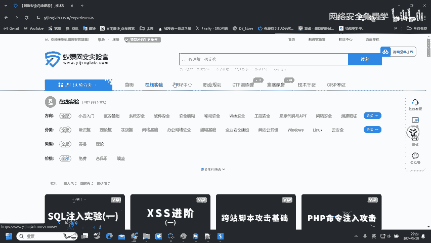

# 2024B站最值得看的黑客教程 ｜ 网络安全／渗透测试／内网渗透／漏洞挖掘／web安全／kali linux／红队靶场／CTF／信息安全 - P74：网站访问的实现 - 网络安全免费学 - BV1uBsTetEow

然后呢，主要我们就给大家讲解一下网站访问的实现。因为我们去挖掘漏洞，我们去挖掘漏洞啊，最主要的呢还是微博漏洞。因为网站它永远是站在所有的一个应用程序的。大范围的一个大范围之内呀。

因为网站现在占有现在的一个服务大概是80%左右，大80%左右的服务呢都是网站服务。所以说网站漏洞挖掘。😊，永远是最主要的。网站的漏洞挖掘永远是最主要的。嗯，大家可以看在腾讯它的网站呢可能有几十上百万个。

然后美团呢也有。几万个吧，十几万个。然后呢，京东呢也有几十万个，那其他的这一些平台呢起码都是有上万个的一个网站。所以说网站漏洞挖掘是必备的。嗯哈。必备的。然后网站动洞挖掘最主要的呢就是这一个工具。

发不速它。bb suit这个工具，它就能够去发现网站上面90%以上的漏洞，都可以通过bb suit这一个工具去进行一个挖掘。所以说我们最终去学习到这样的动洞挖掘，其实还是学的这个b布速的使用。

那网站是怎么去实现我们的一个访问的？网站呢是不是要通过浏览器去进行一个访问，你说你靠一双手能够去访问到网站吗？不行吧，我们也不是神仙，你靠自己的一双手就能去摸到网站不太现实。所以说我们是通过工具。

工具呢就是浏览器，比如说3W点移警lebel。点COM我们去访问到这样的一个站点，是通过浏览器里面输入到以警lebel以景网上实验室的域名，从而访问到的那这样我们才能够去看到网页的一个显示。

这就是网站访问的流程啊，通过BSDR购浏览器到服务器的过程。然后在这一个过程之中。他就简简单单的去访问了一下。就这样吗？肯定不是在他的一个访问过程之中，其实会触发非常多的一些流量。看了，在这里面呢。

我们去通过浏览器访问服务器。为什么服务器知道是浏览器访问了我，而为什么呢？他能够知道是访问到了哪一个资源，比如说我现在去点击在线实验，他怎么知道我点击的在线实验。他怎么知道我点击的在线实验。

因为是我们的浏览器告诉他的那浏览器和服务器通信呢，它就需要有一个统一的格式，也就是要拥有统一的语言。浏览器说的话，服务器呢要听得懂，他才能够把结果给到浏览器。那同样的服务器。

服务器想要知道浏览器在说什么，那肯定也要知道浏览器的语言，才能够知道浏览器在说什么。那浏览器呢也要知道服务器在说什么。所以说这其中呢他们就要制定统一的格式，也就是LTB协议。

传输协议定义了浏览器和客户端传输数据的格式，能够让他们两个进行友好的交流，就相当于两个外国人啊，然后你要他们去交流，怎么交流，我只会中文，他只会英文，那我们两个就无法交流。但是如果说啊我会中文。

他也会中文，那我们是不是就能够去友好的交流了。😊，那这一个中文呢就是定义的统一的格式。LTP协议呢就担任了这样的一个角色，来帮助他们去进行数据交互。那既然HTP协议是他们用来做交货的一个桥桥梁。

那HP协议是什么东西呢？我们来看。在ATP协议里面呢，它存在有两个数据包，一个是request的请求数据包，一个呢是re的响应数据包。那这两个数据包在哪里看？我们这边呢给大家去抓个包，给大家看一下。

这样干讲肯定没意思。所以说呢我们在这边直接给大家去做演示。🤧嗯哼。😊，Yeah。Okay。

Okay。

好，我们来看到在这里我们访问的过程之中，它会触发多个请求。

了这么多的请求。然后呢，我们来看。触发的这些请求内容里面，我们点击一下，它会存在一个resport request，然后存在一个resport，分别代表的呢就是请求数据包。这个呢代表的是响应数据包。

也就是我发送这个请求，它会给予我的响应是哪一些，至于请求数据包。这个呢就是响应数据包，可能这样大家看起来有点小，那没关系，我们给大家调大一点，给它去调大一点。Yeah。对。有。天啦。不开代理。

访问不了谷歌吧，可是开了代理又抓不到包。我们可以通过开全局代理的方式，然后呢去抓取浏览器上面的数据包，开了全局代理。那我们的浏览器挂上BP的代理，是不是可以通过BP去进行访问谷歌。然后呢。

我们的BP去访问谷歌呢，又是通过的全局代理去进行访问，是不是可以解决这一个问题，还可以通过上级代理的方式，我们开单个的一个代理，开1个s代理，然后让我们的浏览器走BP代理BP呢走ss代理就能够去。

访问到谷歌网站了，也能够抓到谷歌的数据包了。方法很多，大家自己去思考一下就行了。同学。😊，方法很多的。嗯，好，这里呢就存在两个数据包了，一个是request的请求数据包，一个是re box的响应数据包。

这些请求数据包是什么？😊，是我们告诉服务器，我们要去访问的资源是什么？那响应数据包呢就是服务器告诉我们浏览器它的内容，你请求的这个资源。是什么东西？我就要通过响应数据包来告诉你。

然后你得到响应数据包之后呢，是这样的一个界面，那可能看不方便，看起来呢就全是代码，看不懂。那浏览器在接收到这样的响应数据包之后，它就会从前端渲染渲染成这样的一个界面，那看起来就舒服多了。

如果说没有这样的一个渲染，它就是网页源码的形式，点击右击，点击查看网页源代码，就是这样的形式。这一个形式有几位同学能够看得懂，就基本上都看不懂了。所以说网所以说啊浏览器的作用就就在于这里。

它能够把对应的服务器返回的数据包去进行一个网页渲染。渲染之后呢，展示这样的渲染结果页面给我们进行查看。看起来呢就比较的舒适了。

这就是ATTP请求。