# 2024B站最值得看的黑客教程 ｜ 网络安全／渗透测试／内网渗透／漏洞挖掘／web安全／kali linux／红队靶场／CTF／信息安全 - P75：HTTP超文本传输协议—请求消息 - 网络安全免费学 - BV1uBsTetEow

然后这是request的请求数据包里面所包含的一个内容呢有这么多。那这么多的内容全是英文，是不是很多同学就看不懂了，觉得我不适合学习啊。我英我英语呢都没过三级，我能不能学的会。

是不是有同学就有这样的一个疑问啊？有这样的疑问的同学扣个一，看着全是英文的，就感觉好像。😊，哦，打不进去了，就不知道怎么去操作了，看不懂。是吧我就知道很多同学有这样的一个疑问。嗯，觉得全是英文的。

看不懂。其实呢。其实啊。这一些内容你说要全部看懂，我能不能看得懂呢？我现在能够看得懂。但是在之前我学习的过程之中，我也是看不懂的。因为我在大学毕业的时候，我的英语呢也没有过三级，我基本上就是。数学挺好。

但是英语呢10分、20分、30分，基本上没有上过60分。那我怎么能够学会的？因为它其实不需要你能够完全看懂，你不需要知道每一个单词是什么意思。你只需要知道它的每一个点是什么意思就可以了。

这里呢我们就给它去拆分一下。现在看着一团乱，看不懂。那我们把它去拆开，拆成四行，1234行，拆成四行之后，我们再来一一的去了解它是什么意思。首先第一个请求行。请求函里面呢有一个请求方式。

那请求方式这里呢总共就3个英文字母GETget。那请求方式是get，那请求的UI呢？UI是什么意思啊？UI呢我们可以称之为资源地址。

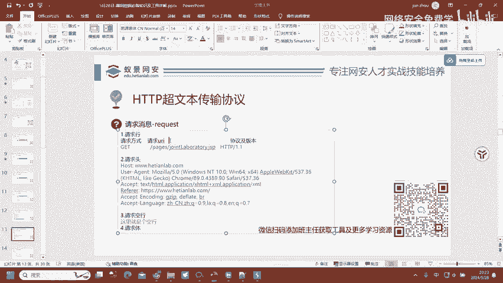

还记得刚才我所说的吗？服务器怎么知道我们要去访问到哪一个资源，怎么知道我要去访问到在线实验啊，他怎么知道我要去访问在线实验，怎么知道我要去访问课程中心。😡，就是这1个UII告诉他的。这个UI。

就是这个UII来告诉他的，告诉服务器我要访问的东西是什么。那这里呢就告诉的服务器，我要访问的资源呢是这一个点GSP文件。那服务器呢就会把。

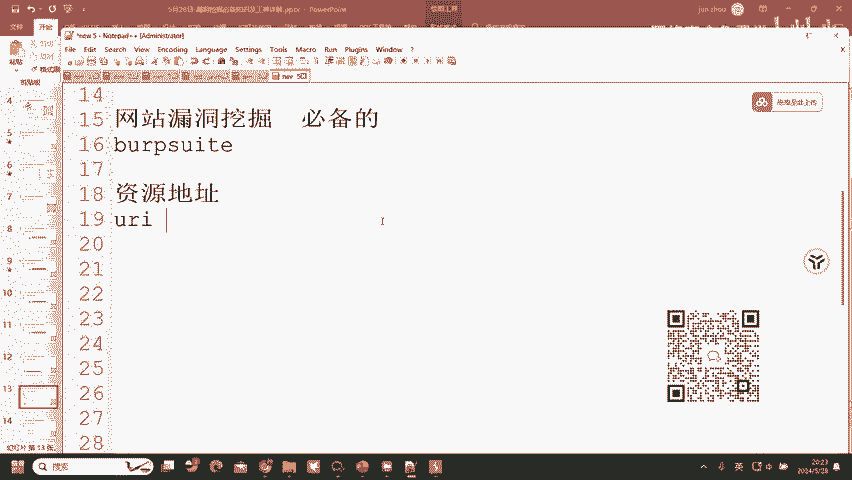

这个点GS文件反馈给予我们，你看这个英文单词看不懂怎么办？不用管，我们就不管它看不懂，那就不看。这里我也看不懂它是什么意思，但就不用管。然后就是HTP杠1。1。刚才我们给大家讲到了HTP协议。

可以看到这里就出现了。那HDHDP斜杠1。1了，1。1代表的就是版本号。HDP呢就是刚才我们所说到的协议类型，它的一个协议名字ADB协议。好，这就是第一行，是不是。😊，就稍微看得懂一点了。

但是还是有一点不知道嘛，就是这一个get什么意思，等会给大家讲。😊，这里呢总共是有四行哎，这一总共呢是有四行，这四行呢缺一不可。我们要明白这一点。

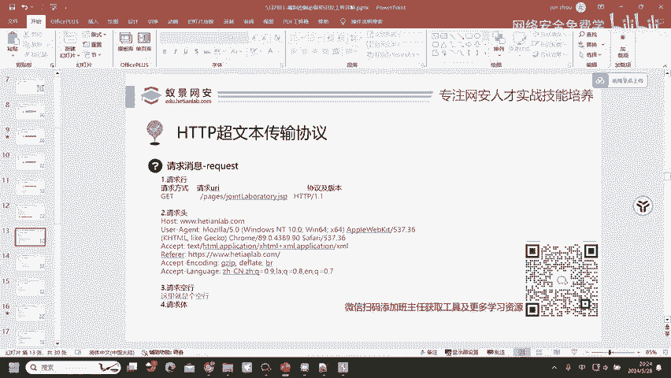

Okay。Okay。是的，请求方法get呢是请求方法。我们可以看到在这里呢，我们给它拆分成四行，这是第一行，这是第二行，这是第三行，这是第四行，这整个都是第二行啊。我们要去理解啊，这整个都是第二行。😊。

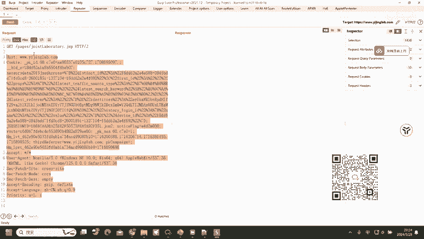

然后呢，这里总共是四行，它是一个完整的格式。那如果说我把第四行删除掉，这是第三行，这是第四行123，分别为第三行、第四行。如果说我把第四行删掉，然后点击发送，它能够正常请求，其实它是不能够正常请求的。

但是为什么能够请求到呢？能够显示出结果呢？因为巴布速后期提供了这个功能，也就是会自动帮你补齐这一行。原本。是四行，然后我给它删一行之后变成三行，然后发送完之后呢，又变成四行了。

因为它自动帮我补齐了这一行。如果说没有补齐，它是无法访问的这也是ATP协议完整性的一个问题。格式完整性。它必须是一个完整的数据包，那你才能够线。必须是一个完整的数据包，那你才能够去访问到目标。

一旦你的数据包不完整了，缺少了一行，那自然而然你肯定就无法访问。你就没有办法去访问到的。可以看到缺一行去请求，它会自动帮我补齐一行。如果说没有自动补齐，它是无法访问到的。这就是ATP协议要注意的点。

然后呢，我们现在就来看到刚才不理解的这一个getget呢它是一种请求方式，在ATP协议中呢，所有的请求方式不止8种，常用的呢是有8种，常见的是有8种，但所有的请求方式呢不止8种，大概有几十种。

最常用到的就是get请求和pos的请求。这两个请求呢是我们最容易去碰到的。因为我们随便的去访问到一个网站。比如说去访问到已请，它默认就是get请求。

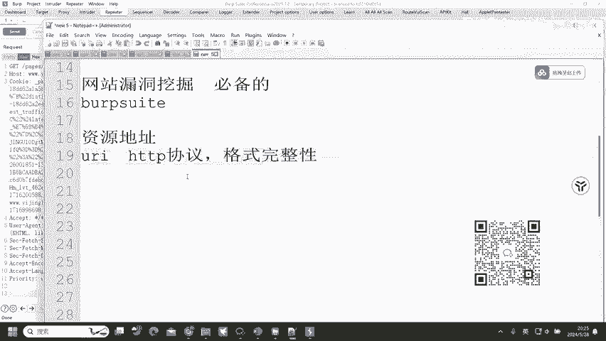

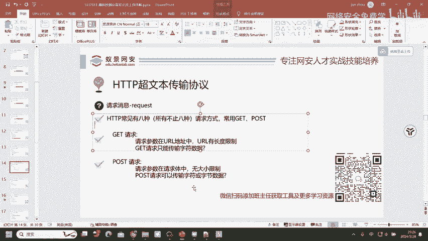

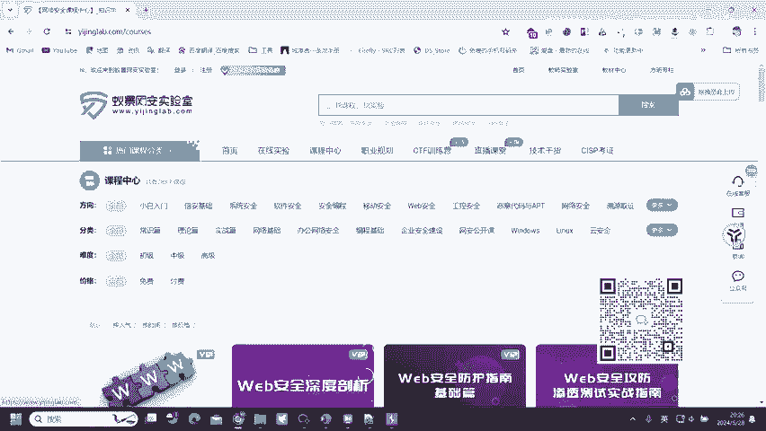

然后get请求请求参数在UIL地址中，UIL呢有长度限制，get请求呢只能传输字符数据。首先我们一个一个的去理解。请求参数在UIL地址栏之中，那这个UIL地址在哪里啊？

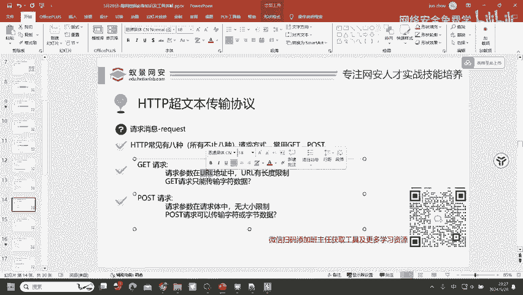

现在我有一个想法，我想去搜一个实验，实验名字呢叫做123123。我们来看123123跑到哪里去了。我在这里想要找123123的实验，然后访问之后呢，123123跑哪里去了？同学们。🤧嗯。😊。

有同学注意到了吗？这个123123跑哪里去了？😡。

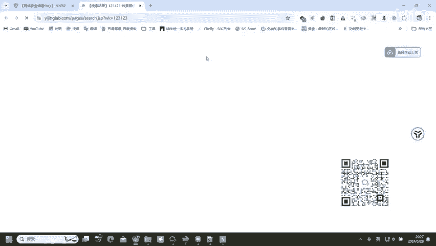

Okay。地址南是的，没错，就在这里面来了。呃，不需要什么编程语言，不需要的。因为我自己个人呢之前是没有学过任何的编程语言的。在上面是的，我们只要知道它在上面就行了。你都不需要说啊，我知道它在地址栏。

地址栏这个名词我都不需要知道，我只要知道它在上面，那它在上面显示它就是get请求。

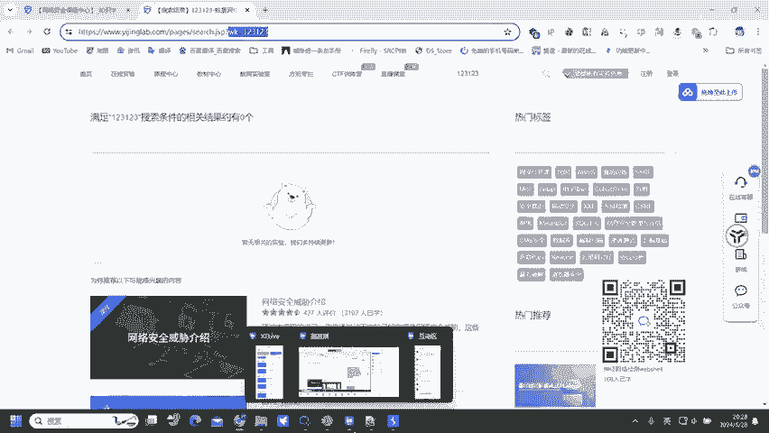

它只要在线面上面显示了，它就是get请求。那现在呢我们就能够看得到了。

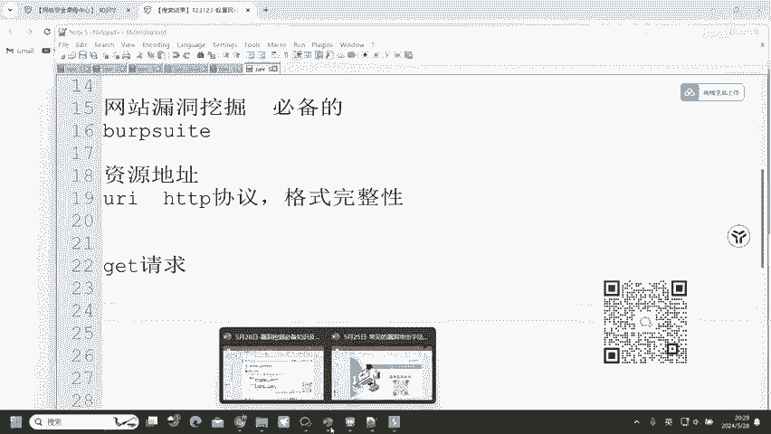

这就是get请求请求参数在UL地址栏之中，也就是会在这上面显示出来。然后呢，URL有长度限制，也就是在这里它有长度限制，你不能输入太长的一个字符。那我在这里呢只输入了123123。

那我要去输入到1到1万，那可能它就无法去接收了，就可能出现错误。

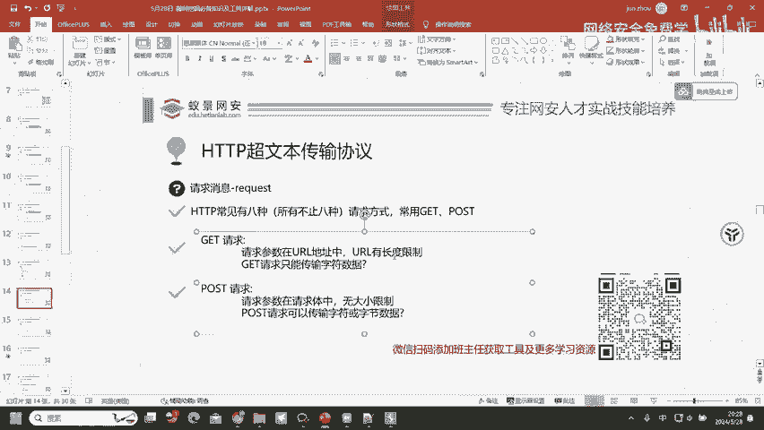

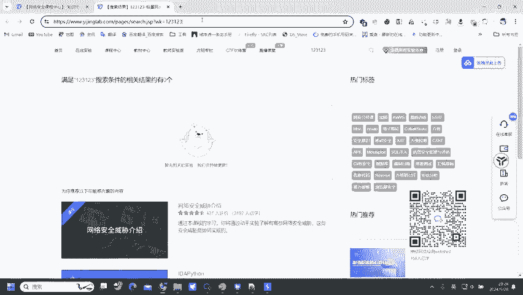

然后get请求呢只能传输字符数据，这里我们就需要去明白什么是字符数据，字符数据嘛字符串。

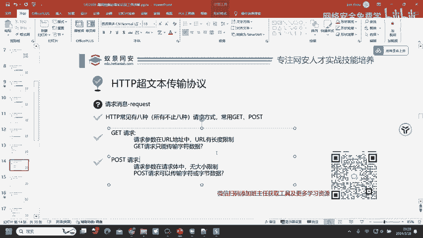

什么是字符串呢？123。英文字母。汉语。英文单词这些呢它都是字符串，这些呢都是字符串，然后也就称之为字符数据。所以说get请求它只能够传输纯数字，或者说纯字母形式的一个显示。

就只能通过这样的一个字符形式呃，英文单词汉语。

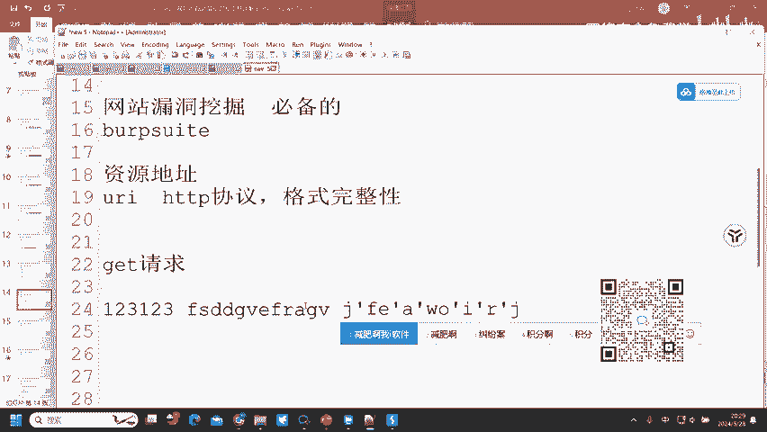

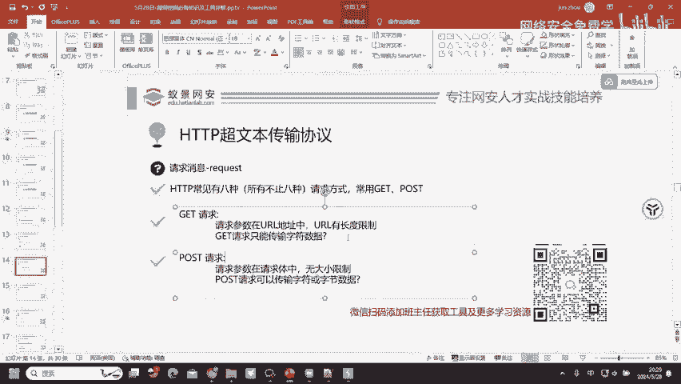

数字。等这一种形式去进行处理，这就是get请求。

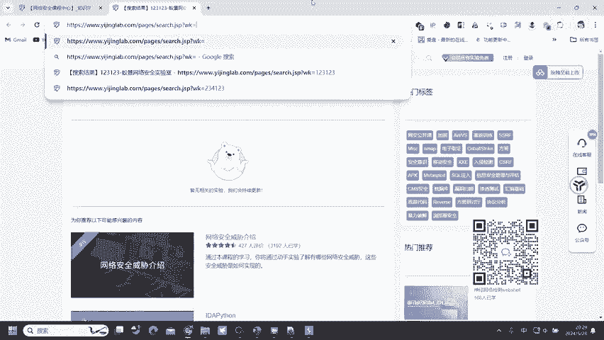

然后破损请求。pos请求请求参数呢是在请求体中无大小字节限制。那poss请求呢可以传输字符或字节数据。也就是poss请求呢，它的请求参数啊就不在这上面了。刚才123123在这里嘛。

但是poss请求呢它就不在这里了，它就换位置了，换哪里了呢？

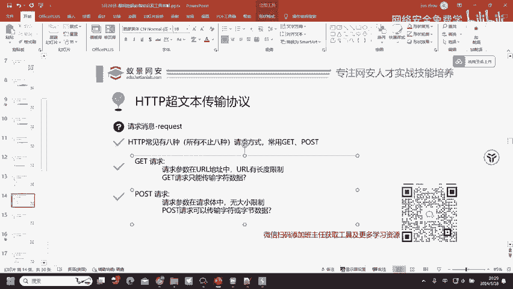

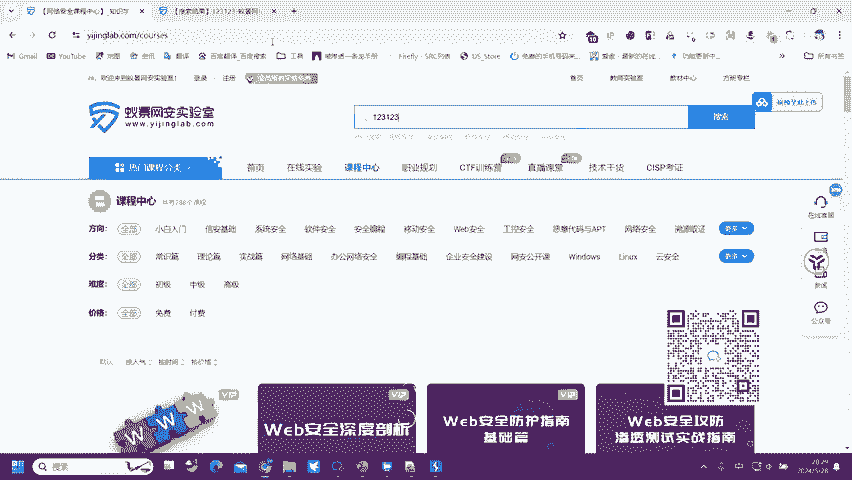

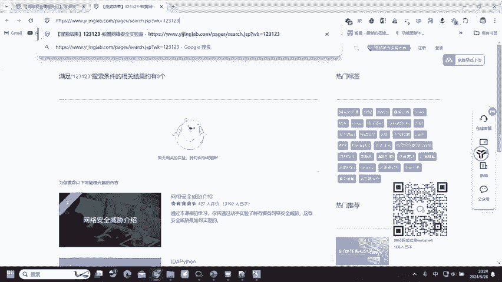

换到我们通过BRP才能够看到的位置了。Yeah。Yeah。比如说这里我们可以看到刚才我们搜索的123123到哪里来了？😡，到刚才出现的第四行这一个位置来了，天哪，在这里了。

所以说pos的请求和get请求最。本质的一个区别。get请求它的请求参数呢是在UIL地址之中，也就是在上面在UII上面UII。找一下刚才的那一个get请求。Yeah。第二的请求他的一个请求参数呢是在。

URR上面。稍微等一下，在这里。这是get请求，它的WK在这里在URI上面。

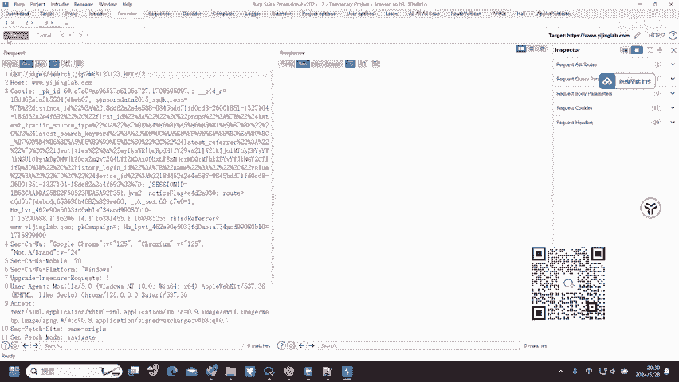

所以说这是get请求。然pos请求呢，它的一个请求参数呢在这下面。在对应的请求体制中，然后123123是不是在这里好，这就是get请求和posse请求的第一个区别。然后呢，pos请求无大小字节限制。

它是没有去限制大小的。UIL呢它是有长度限制，但是poss请求呢没有长度限制，也没有大小限制，只要你的机器能够背得动，只要你的机器能够去承载这么大的一个数据，它都能够去传输。

然poss请求呢可以传输字符或字节数据，这里的字符数据我们明白了，我们再来看到字节数据。什么是字节数据。😊，字符数据是字符串123英文单词等那字节数据呢其实就是文档二名制文件、软件，或者说一些。

图片等这些信息，它就是字节数据。

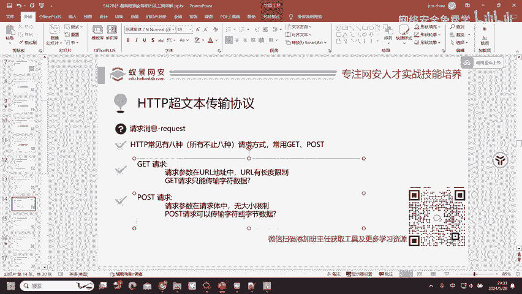

明白吗？字节数据图片。文档word文档、excel文档、软件APP。

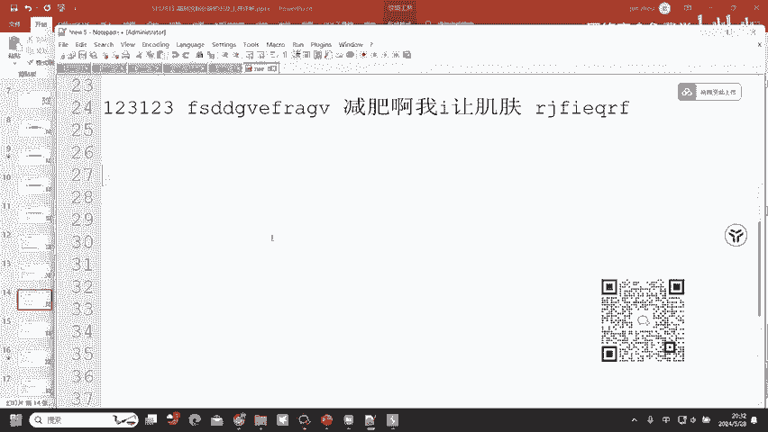

等这一些它都叫做字符数据啊，都叫做字节数据。那现在呢我们理解了。字符数据和字节数据的区别。我现在有一个题目考一下大家，我现在的QQ头像很久没换了，我想要换一个头像，大家觉得是get请求还是pos请求啊？

😊，有同学可以回答一下我这个问题吗？😡，啊，有同学收到了poss的请求。😡，好，有位同学收到了get请求。😊，好，大部分同学还是回答的pos啊。😊，这里呢我们就需要抓住一个关键点。换头像换的是什么？😡。

同学们换头像换的是什么？😡，图片没错，那get请求能传输图片吗？不行吧。😡，啊pos请求能不能传图片？😡，是不是能传，因为它支持字节数据，get请求，它只能够去传输字符串，那字符串包含图片吗？

图片是字符串吗？不是吧，所以说呢它只能通过poss请求去进行传输。这里呢我们弄懂了就能够明白get请求和posse请求一个区别了。😊，好，OK。😊，大部分同学还是跟着来了的，都听懂了。😊。

OK那我们继续。😊，这里呢是两个请求数据包，它们的区别分别在哪里啊？第1个WK等于11在上面，第2个WK等于11呢，在下面，这就是get请求和po请求。然后get请求呢。它会比po请求少一行。

我们来数一下。1234567899行，123451234567891010行。为什么get请求？它的请求头只有9行，但是pos请求有十0行啊。为什么会有这一个问题呢？🤧嗯哼。😊，挖洞get请求。

pos请求都会用到。😡，为什么会有这个问题啊？😡，是不是很多同学就思考不明白。其实刚才已经给大家讲到了，poss请求，它能够支持多种方式的一个传递，可以支持字符串，可以支持文档，可以支持图片。

可以支持I进制文件，可以支持软件，还可以支持一些其他的东西都能支持。那这一些东西它要怎么去告诉服务端。我这个是什么呢？😊，他就需要有一个请求头去描述我们所传递的这一个数据的类型。

也就是count type字段。这个con type字段呢它的作用就是描述poss请求传输的请求题里面的内容。如果说是字符串。字符创的话就是叉杠3W杠fUIL equalal的。如果说它是图片。

那可能就是偏接。GPG。如果说是二进制文件呢，文档wordexcel可能就是word excel，然后呢，ch mail或者说呢就是PDF等。这一个看t呢就会随之变换，用的就是来去描述请求体的信息。

请求体的内容。

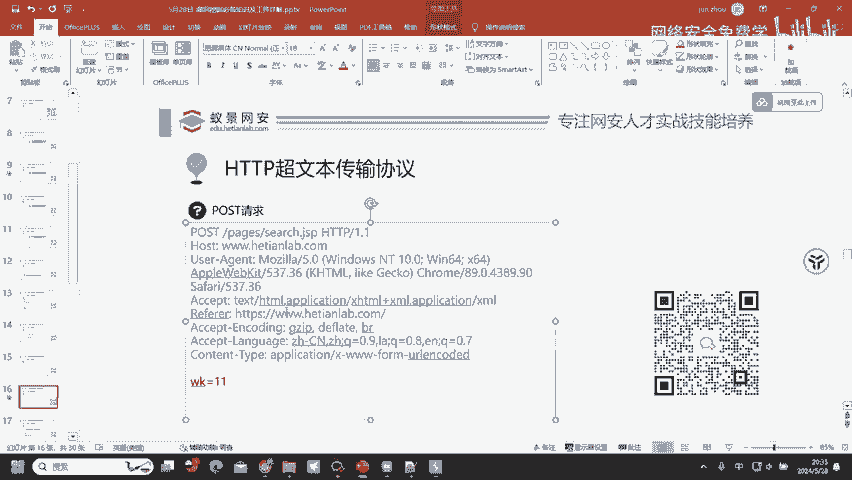