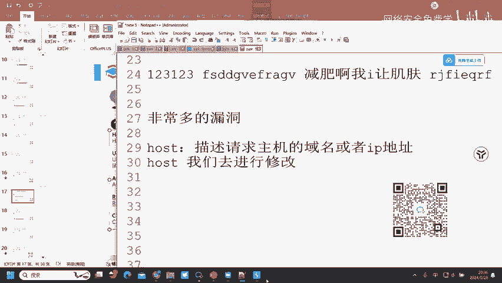
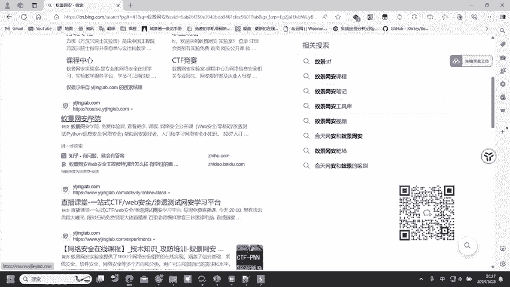
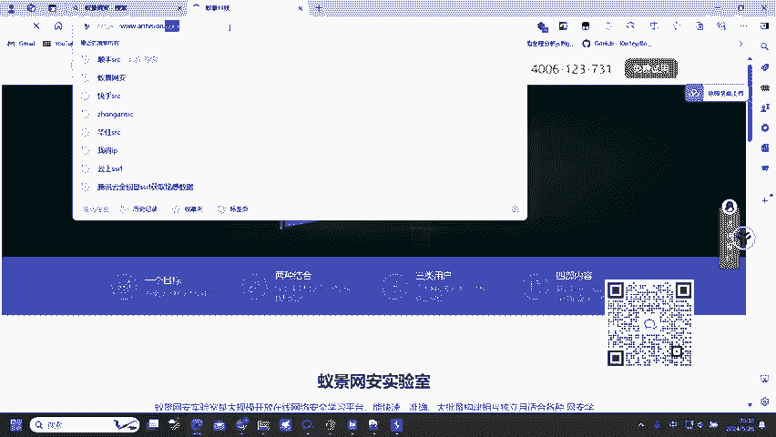
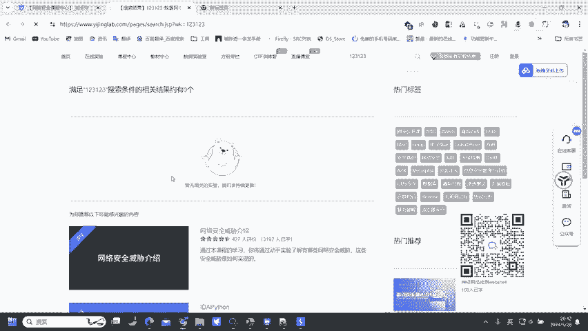
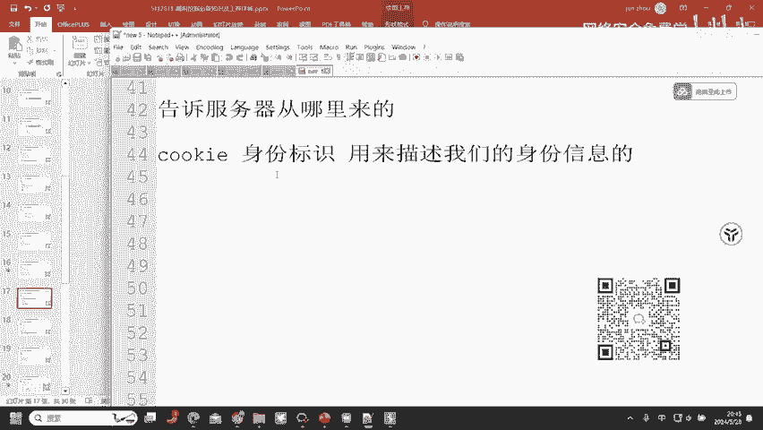
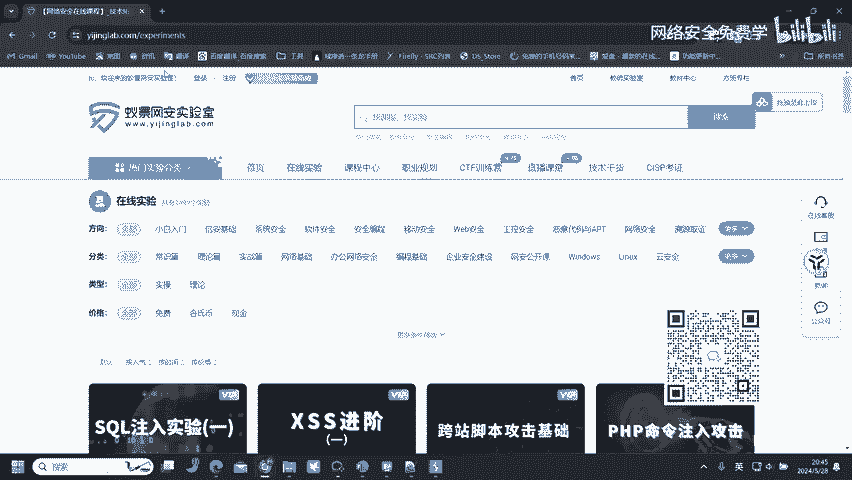
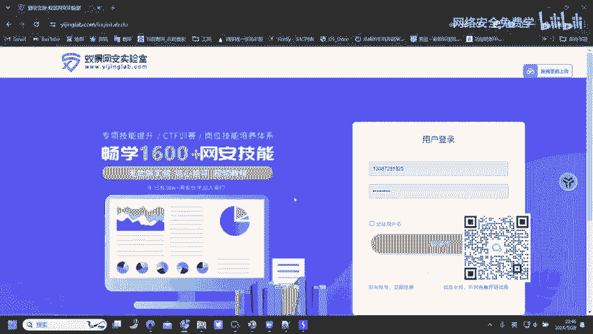
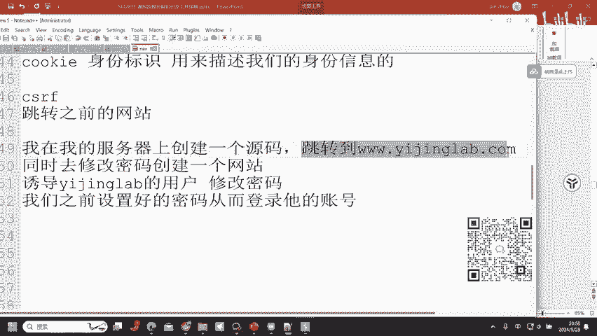
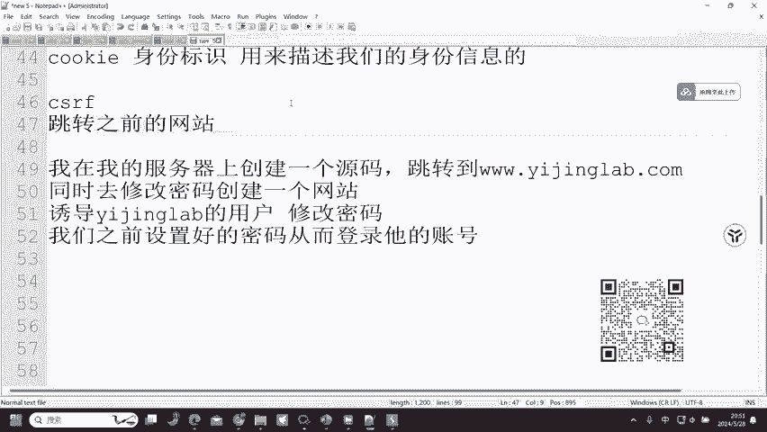
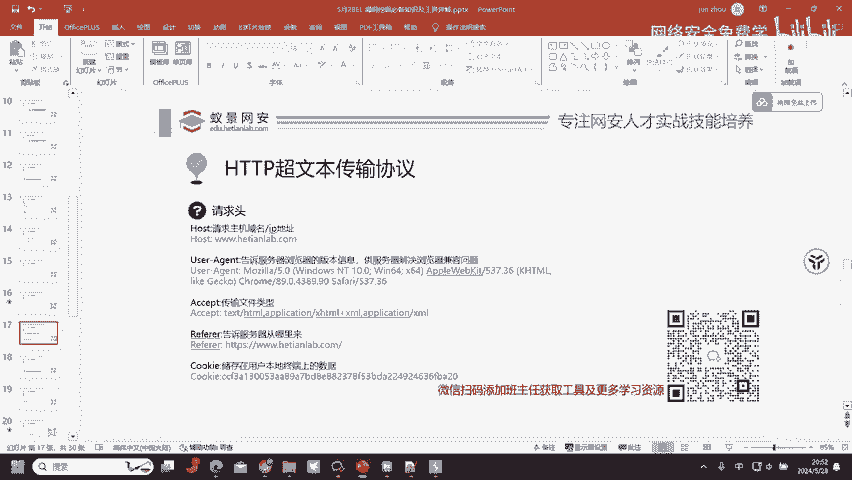

# 2024B站最值得看的黑客教程 ｜ 网络安全／渗透测试／内网渗透／漏洞挖掘／web安全／kali linux／红队靶场／CTF／信息安全 - P76：HTTP超文本传输协议—请求头 - 网络安全免费学 - BV1uBsTetEow

然后我们就来到关键点了。请交头。关键点这里呢大家一定要认真听，这里涉及到了非常多一个漏洞，非常多的漏洞。嗯，也就是我们赚钱的东西啊，漏洞。请求头这里呢我们来看到第一个一的给大家讲解。第一个host。

他的作用呢。house需不需要会读，不需要，我们只要知道它是什么意思就可以了。它的作用呢是描述。😡，请求主机的。域名或者IP地址。他是用来去描述这一个信息的。那我们来看。我们现在访问的是何天。哇。

访问的是移警，那这里的house呢是不是3W点移警leb点COM，它描述的呢是我们所请求的网站是3W移警leb点COM。但是如果说这个house。我们去进行修改。如果说我们去进行修改，会发生什么？好。

我们给大家去演示一下。现在我所访问的呢是3WE警net点COM我们去找到它的一个主页。

Yeah。Okay。好，它返回的内容呢是这一个一级网络实验室专业提供网络安全、信息安全在线靶场实验服务平台。那如果说我们改成EDU呢？Yeah。出现了什么？😡，403如果说我们改成3W点AMT。

我搜一下我们的。还有。我们的怡景网实验室，我们的怡景官网，我找一下我的IPI。好，这里呢是我们的一个官网。然后里面呢我们还有一个学院网站，然后啊还有其他的这一些怡景科技。好，这个怡景科技呢是这个样子的。

然后我们把它换成怡景科技，我们再来看一下这的一个house呢，我们改成怡景科技的，它是不是还是403。那刚才我们在这边呢用的是3W井le点M访问的呢是正常的一个页面。

然后我们修改成3W点NNTVSIN呢就变成了403的，或者说EDU也变成了403了。如果说我们现在去进行一个访问，现在我们就假设一个问题。如果说我们去访问的。😊。

这个网站。他会绑定1个IP。网站肯定会绑定1个IP那这个IP上面。有无可能。存在多个站点，有没有可能存在多个站点？那存在多个站点，他怎么去区分你访问的是哪一个网站呢？通过post。区分你访问的。万债。

这里大家能够听懂吗？我们去访问这一个网站，它是绑定了IP的那这一个IP上面呢可能存在多个站点。那我们去输入到house等于3W移警le点COM。它访问的呢是移警la的一个网站。

那如果说我把house改一下，改成3W点。ANTVSIN。访问到这一个站点。然后在后t头改成这一个站点，有没有可能访问到这一个站点的内容啊？😡，可以访问。如果说是在1个IP上面的，是可以访问。嗯哦。

今天这里呢是给大家讲到了漏洞知识了，就是怕有些同学觉得很基础，所以说呢给大家去带一点漏洞知识，也是告诉大家，提前给大家去讲一下对应的一个知识。😊，这个包也没有看到IP，因为我不是通过IP访问的。

如果说我通过IP访问的话，你就能够看得出来了。😡，我这里不是通过IP访问的，我是通过域名访问的。所以说大家看不出来。但如果说我通过IP访问，你就能够看得出来了。😡，我们的IP做了CDN案。

所以说也没有办法给他演示嗯。😊，他就是通过housese来区分你访问的网站的那我如果说把housese。改成。内网网站。有无可能去访问到它的内网站点，内网站点一般是不设防的，就可能存在。

housese碰撞漏洞，我这里呢没有给大家细讲啊，就给大家讲解一下这样的一个漏洞概念。很多网站很少有网站能通过IP访问。那为什么我们不能去进行？😡，域名反查。IP获取他的IP呢。他默认通过域名访问。

我们为什么不能通过IP去访问到它呢？我们为什么不能通过IP加ho的域名的形式去访问他呢？也可以啊。思路要打开，同学们思路一定要打开，他说了，只能通过域名访问，你就真的只通过域名访问吗？我们是谁？

我们是白帽子，我们是黑客。如果说我们按照他网站的一个运行逻辑去进行访问的话，那我们还要去挖掘漏洞的必要吗？我们为什么叫做挖掘漏洞，就是因为我们和常人的一个思路思维不同。我们要去突破他的一个限制。

我们要去违反他的一个规则，然后去进行测试，这样我们才能够去发现漏洞。明白吧？那他说让你去通过域名访问，你就通过域名访问。他说让你登录自己的IP登录自己的一个账号，你就登录自己的账号，让你修改自己的密码。

你就修改自己的密码，让你去干什么，你就去干什么，你就只干什么，那你还怎么去挖漏洞，就肯定挖不了了。所以说我们要去想。😡。

该怎么去绕过它的限制，然后去做这个事情。当我们脑子里面想到的一个事情，我觉得它有危害，那怎么办呢？去做，如果被限制了怎么办呢？去绕过，这就是挖掘漏洞的一个思路。Mh。好。

这一个housese头呢就可能存在housesse的头碰撞漏洞。那UV头呢。UA头它的作用是什么？首先要去理解它的意思，然后再能够去发现它的漏洞。UA头告诉服务器浏览器的版本信息。

供服务器解决浏览器兼容问题。那它的作用是用来去告诉服务器我的浏览器版本是多少的那我去修改它，有没有可能造成服务器误认为我的浏览器版本。是可以做到的这个呢也叫做UA欺片。然后在一些游戏平台。

比如说TK7K7K小游戏，比如说。7K7K小游戏，还有个什么小游戏啊，之前很火的。😊，忘记到什么游戏了，什么小游戏了，他们呢就会识别你的UA判断你是否为360安全浏览器。对，4399。

他会去识别你的UA然后去判断你的一个浏览器类型。如果说你默认用到你自己浏览器的UA，它会去限制，然后告诉你，你不是360安全浏览器。是的，就是4399，你不是360安全浏览器。

请切换360安全浏览器来访问它，他为什么知道啊通过UA这点知道的，你是谷歌或者说火狐。然后EPT这个的话其实就没有什么必要了。因为它是告诉服务器传输文件的类型。

这个呢就在于我想看它返回的数据内容是什么格式的。有时候呢我在测试的过程之中，它默认返回的是的，的呢，有标签的一个形式去包裹字符串，包裹对应的一个值，我看着很不舒服，我就会给它改成jason的。

就看着舒服一点就。😊，这一点作用。然后reel段。😡，告诉服务器从哪里来的。这里呢我们就要注意了，这个漏洞非常多，网站上面非常多。如果说大家把这一个掌握精髓，把它掌握透彻了。

那一天呢赚个百把块钱是没有任何问题的。因为这个漏洞它的危害性不大，但是呢基本很多网站都有，奖金额度呢也不高，一个漏洞呢就50100块钱。但是。大家一直去刷，那一天赚个100块钱，赚个外快嘛。

也就花不了多长时间也还是比较好的。re非尔主任它的一个漏洞是什么样形式的？首先我们来看到。😡，它的作用呢是告诉服务器从哪里来的。它的作用是告诉服务器从哪里来的，为什么要有这个东西啊嗯。😡。

这里的话就要去说到一个。洗摇头了，也就是cookie了。我们就需要去了解到cookie这个东西了。😡，🤧嗯。😊，枯给是什么？😡，身份。标识。cookie是曲奇饼，是的，也没有问题了。

曲奇饼cookie呢它是一个身份标识，它的作用呢用来。描述。我们的身份信息的。它是用来描述我们的一个身份信息的。哦，我是谁？他怎么知道通过cookie对令牌的作用，通过cookie知道我是谁啊。

比如说我们的一警晚安实验室嘛，我现在登录一个账号，他怎么知道我现在登录一个账号啊。

那他怎么知道我是一叶的？我刚才登录的时候，他知道我叫一叶了，但是现在我去访问到这些课程实验，他为什么还知道我叫一叶啊？😡。

就是因为cookie我在第一次登录的时候，用的是账号密码登录，登录完成之后呢，会生成一个cookie。这个cookie呢就在于我后续访问该网站的时候，帮助我去提供身份信息，让网站能够去明白我是谁。

也就相当于大家进入到了一家大企业。他怎么知道你是这一个公司的员工啊，通过你的工牌来确定你是这一个公司的员工，也就是你的一个身份令牌。好，cookie的作用，我们知道了，我们再来去看到ref字段。

rere字段呢存在一个漏洞叫做CS。IF楼栋。CSF漏洞。客户端请求伪造漏洞，它的作用呢？告诉服务器从哪里来的。也就是跳转。之前的。网站，比如说我从百度搜索和天。或者说搜索移景，然后进入的移景网实验室。

那这re段呢就会去标识我是从移，我是从百度过来的，我是从百度过来的那这是正常的一个搜索页面，这是很正常的。但是如果说我们去创造一个条件。啊，我在我的服务器上面。嗯，我在我的服务器上面呢创建一个。圆码。

我去创建一个源码，它的源码内容呢是跳转。到3W。点移警lebel点COM它的一个作用呢是这一个圆码，它的一个作用呢是可以帮助我们跳转到3W移警leble点COM同时。去修改密码。这个能不能做到？😡。

能做到吧，因为我只需要去抓到修改密码的接口，然后呢去把它的一个操作流程去走一遍，然后写进源码里面，然后就可以去造成这样的一个效果了。然后我就创建一个网站。创建这个网站之后呢。

这个源码页面我就挂载在这一个网站之上，挂载在这里，然后呢诱导。已经来ble。用户诱导已警lab的用户去点击我这一个网页，去点击刚才我创建的跳转到3WE警leb点COM模，同时去修改密码的这一个网页。

示范一下示范不了。因为我们的移景没有这个漏洞，我们的移景网实验室没有这个漏洞。明白吧？所以说释范不了，只能通过这种方式给大家去讲。嗯，诱导已景nb的用户去点击我这一个网页，他一旦点击就会去修改密码。

他就会去修改密码。那密码呢，我们之前。设置好的密码。是不是就可以去？通过这个密码登录他的账号了，就可以去进行登录了。这里的一个前提呢就是它并没有去验证跳转之前的一个，这个不需要现在懂。

因为这是我们后续要学习的内容。今天呢只是给大家讲一个大概，大家对于这个漏洞有一个印象，然后知道它是什么漏洞就可以了。你现在呢不需要去懂它是什么意思。因为每一个漏洞我都给大家去演示一遍。

都给大家去示范一遍，很明显今天这节课是不够的，我只是给大家去抛个影子，大家呢去了解它，然后再去学习它，明白吧？是后续的内容啊，今天这节课肯定是没有办法给大家去把这些漏洞全部讲一遍的。

但是在后面的一个内容里面会去给大家讲到。😊，所以说他就会去进行修改密码。然后设修改的密码呢，就是我们之前设置的密码，从而。灯笼。他的账号。好，这就是一个步骤。这就是CFF老总，但是。😡，是的。

改别人的密码自己登。但是这一个漏洞它唯一的缺陷在哪里啊？它会去跳转到3W云警来点COM。那跳转的时候是不是会有一个refi字段，可以看到refi字段它的作用呢就是告诉服务器是从哪里来的。

如果说这一个网站去限制了，你只能从百度过来，你只能从我的子站点过来，那这个漏洞还能触发吗？😊。

是不是就不可能存在了，它就无法触发了。这就是CSICSF漏洞。如果说你没有去验证refi字段就可能存在验证了它就不存在。

明白了吧？这里是给大家去讲一下每一个参数它所代表的可能存在的漏洞。然后cookie的话漏洞就比较多了。cookie伪造、越权以及。cookie未加密，这些呢都是cookie存在的漏洞。

我们可以登录到任意用户的账号上面，从而去获取到他的一个个人信息。嗯。😊，cookie这里啊是漏洞比较多的，大部分我们想要去登录到别人的账号，都需要通过cookie这里去做手段。去进行一个攻击。

嗯然后就是响应数据包了，这里呢是它的请求头，默认携带的请求头存在的漏洞啊，就有这么多了。那还有其他的呢更多网站上面的漏洞是非常非常非常多的。😊，网站上呃有同学问到了吗？网站上面漏洞真的有这么多吗？

网站上面的漏洞是真的非常非常多的，可以用另外一个身份的cookie替换自己的cookie吗发送后会不会变成替换货的空赢货？是的，就是这个意思。😊，Yeah。cookie呢它是用来去做身份标识的。

如果说我们换成其他用户的cookie，然后去发送信息，就是以其他用户的身份去发送的这一条信息。

Yeah。