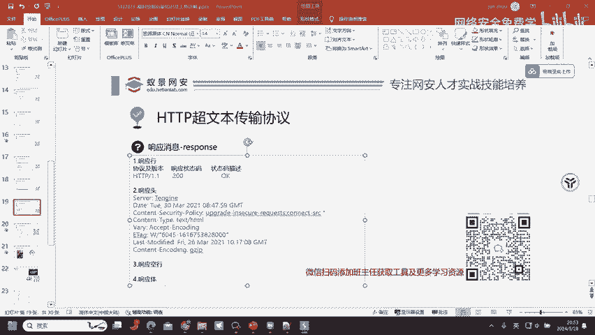
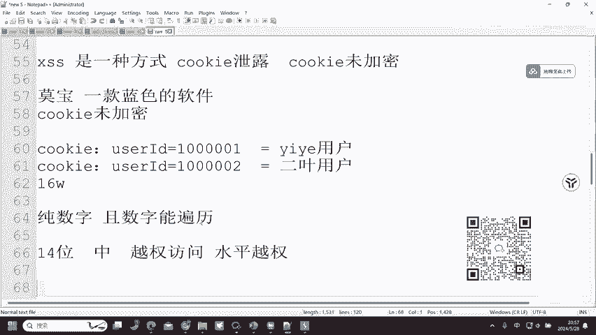
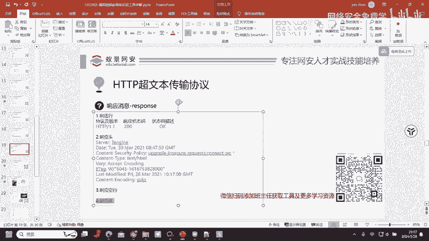
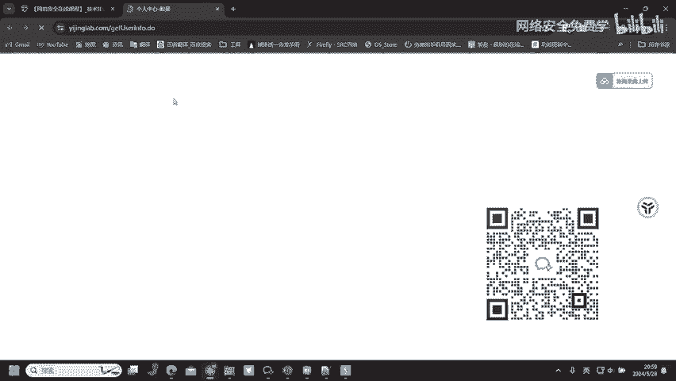
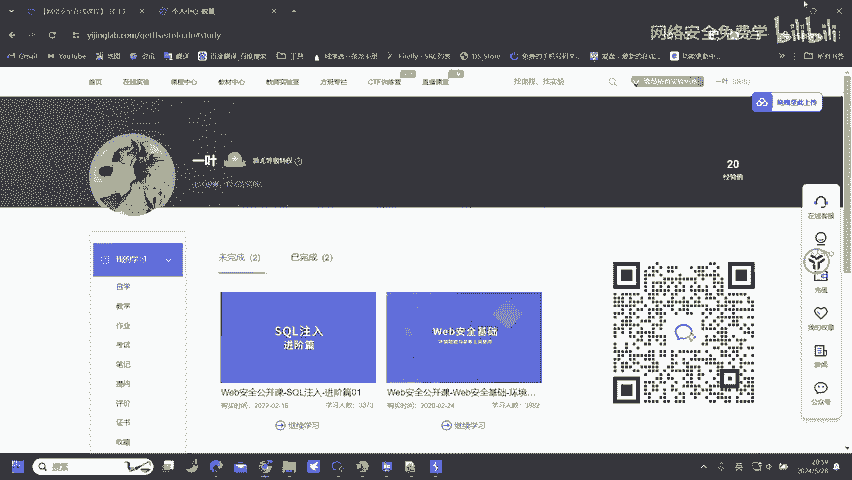

# 2024B站最值得看的黑客教程 ｜ 网络安全／渗透测试／内网渗透／漏洞挖掘／web安全／kali linux／红队靶场／CTF／信息安全 - P77：HTTP超文本传输协议—响应消息 - 网络安全免费学 - BV1uBsTetEow

那我们来看到响应消息。响应消息的话，我们不需要了解这么多，我们只需要去了解到一点，也就是响应状态码。响应状态码呢是我们去判断漏洞是否存在的一个必要点。这里呢是响应状态码的一个类型，这么大的一个数据方案。

其实我们并不需要全部的去了解，我们只需要有一个。只需要知道一个就行了。嗯。怎么换？怎么换还不简单吗？😡，这是不是口？把别人的库信息复制，然后呢把我这里删掉，然后再把别人的复制过来，是不是就可以了？😊。

就可以换了，就这么换嘛。😡，换哭给很简单。

换苦给很简单，但是问题在于。对。cookki哪来的？怎么拿到？别人的cookie。问题是不是在这里啊，同学们。对。cookie我们知道的作用是什么了，然后我们也知道怎么去修改它了啊。

然后呢怎么去拿到别人的cookie创建小号，创建小号自己玩自己是别人是不认的。这个漏洞呢别人是不认的。所以说我们的问题就在于怎么去拿到别人的cookie。😊，对，叉SS。是一种方式。叉SS是一种方式。

还有呢。口口鲜肉。也是一种方式，以及。Cookie。未加密。这里呢给大家讲一个有意思的事情，也就是之前的某宝。蓝色的软件，一款蓝色的软件。这个大家知道吧？某宝一一款蓝色的软件，然后呢。

它的一个站点存在了cookie未加密。cookie未加密cookie的信息呢就很简单。😡，优子ID。等于111000。UZID等于10001。那这样的一个优erID等于。这不知道多多少位了嗯。

100001，那这样的一个数字在这里。大家知道怎么去修改吗？U子ID优怎么用户用户ID等于10001，那我改成1002能不能行？优质等于10001等于一夜用户。😊。

那我们现在呢就把cookie优Z IDD等于1001改成什么改成1002嘛，是吧？01加1个02。😡，等于什么爱月用户。那这样的一个漏洞给多少钱？😡，16万。16万是的，全部用户都有了。

所以说啊漏洞有时候就在不经意间，你就能够发现。BP抓包抓到的cookie未加密可以当漏洞提交吗？呃，看字段。如果说cookie未加密，它的是纯数字的。纯数字。写数字。能辨念。呃。

之前我有一个学员挖了一个库以未加密的，未加密呢纯数字是纯数字，但是数字的一个位数呢14位。呃，最后呢还是收了，给了一个钟。14位的一个纯数字，按理来说啊是不能爆破的，是包破不出来的。但是呢。

他还是报数了几个，因为他后报了后面7位数，然后呢报了。后面7位数。也就是前面7位不动，后面7位报了一下，然后报出来几个用户就给了中威，就给了中威。算什么漏洞？月群。越权访问水平越全。所以说。

cie为加密他算漏洞，但是呢你一定是要。

能够去枚举出来一个用户才算没枚举出来的话是不算的。😡，好，那我们回到正题啊，也就是我们的一个响应消息。响应消息这里呢有一个响应状态码。

那其他的这些呢协议机版本不用管买默认的状态码描述呢不同的状态码有不同的描述信息，然后就是响应头响应头这里呢。😊，不需要管，因为响应头是服务器告诉我们浏览器的一个东西，不需要管它，不认识它。

最需要注意到的就是响应状态码和响应体。响应体判断漏洞是否存在。响应状态码判断我们所请求的内容是否存在，主要就了解这两个就可以了。

然后响应响应状态码是服务器告诉浏览器本次请求和响应的状态。100以后的状态码信息呢，浏览器接收服务器接收浏览器消息未完成，发送100以后的状态码信息。200以后的状态码呢就是成功。

我们访问到了成功的一个页面。我们成功的访问到了这一个内容，它就是200。然后30几重定下，重新的让我们访问到一个新的站点。然后400以后的状态码呢就是客户端错误。404啊，403405。

这里的话需要关注的点就在于405，这几个呢都没有什么可以关注的点。这里呢我们需要关注的点就是403和405，还有401。都是。第1个401未认证，403拒绝访问405请求方式不被允许。401403。

我们可以通过一些绕过方法去绕过它。嗯。🤢，去绕过它，然后呢就可以去进行一个未授权访问。405的话，更换一下请求方式，可能会有意想不到的效果。500以后的状态码服务端错误。

500服务器内部出现异常等这些问题。这里的405的话，get请求和poss请求这两种请求方式。如果说我通过get请求去请求到一个站点，它提示我405。这个时候的话我们就可以更换一下请求方式了。

更换成pos了，那可能就能够正常请求到这一个网页的资源了，就可能可以正常请求了。😊，Okay。那UID可以爆破，那后面等于什么用户怎么弄？后面的用户你只要看到别人的，你只要看到别人的一个信息了。

就证明存在漏洞了。啊，比如说我现在嘛看到的是我自己的一页用户的信息。那如果说我通过爆破user ID，然后存在这的一个get user。

然后呢，变成了二页，变成了三页，就是证明漏洞存在了。就等于动中存在了就可以了。嗯哼。😊。

好，这就是。响应数据包需要注意的呢只有400以后的和200的，只有这两个，我们需要注意。UID都是按规律来的吗？不一定啊，这要看你遇到的网站了，网站不同方式不同，明白吧？不是说每一个网站都是UID。

它可能是Uer，可能是ID，可能是其他的一个参数都不一定的，都不一定的。我只是以U ID给大家举例而已。嗯哼。😊。

