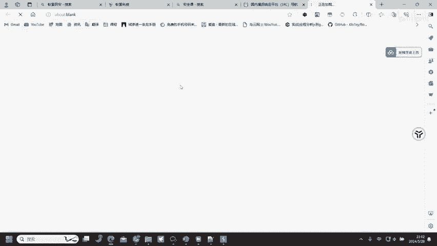
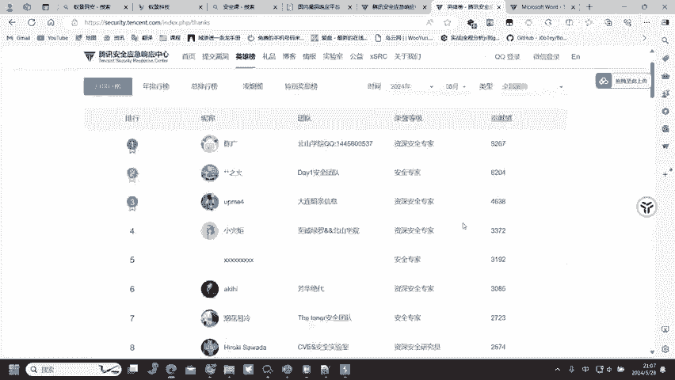
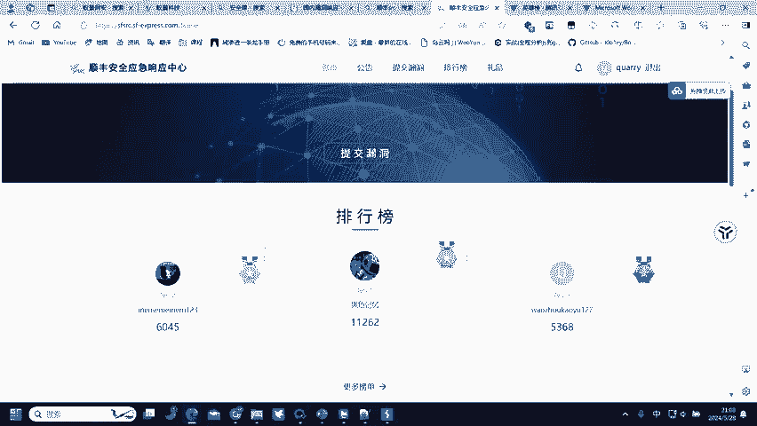
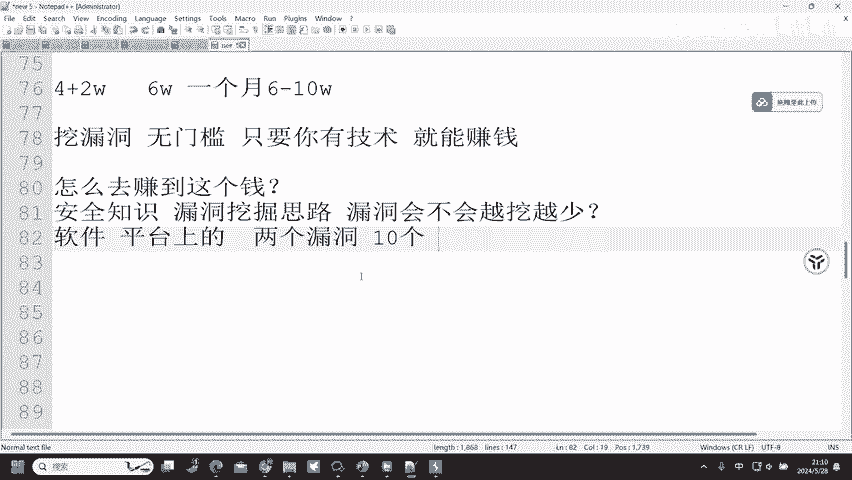

# 2024B站最值得看的黑客教程 ｜ 网络安全／渗透测试／内网渗透／漏洞挖掘／web安全／kali linux／红队靶场／CTF／信息安全 - P78：如何通过挖漏洞赚钱 - 网络安全免费学 - BV1uBsTetEow

好，同学们可以看到就刚才所给大家讲到的这一些漏洞。😡，刚才给大家讲到的这些漏洞啊。😡，绕的慌，简单点是说是不是就是看不到别人的信息是啊，就是看到别人的信息，500的异常怎么修改。500是服务端头。

我跟我们没有关系，我们想改也改不了。500呢，要么就是服务器崩溃了，要不然呢就是服务器代码写错了，我们还能够去改他的服务器代码，改不了吧，我们没有权限改了，所以说呢就不关我们什么事了。

500以后看到直接走，因为和我们没有关系。😊，🤧嗯哼。404访问的页面不存在。404啊访问的页面不存在哦，比如说我在这边呢去访问1个123啊，可以看到它没有这个页面，就会出现404的一个响应。😊。

那这样的话就等于我们访问出错了，就需要去更换请求资源就可以了。好，刚才给大家讲到的这些漏洞啊，其实呢。都能赚钱，但是要怎么赚？😡，同学们知道吧？通过开头讲到的安全应急响应中心SIRC去转怎么去转是吧？

去SIRC应急响应中心上面去提交漏洞。啊，比如说我们在这边呢去打开一个。可能很多同学就是不了解这样的SS平台，我们可以去到安全课。直接搜索安全课嗯。补天漏洞盒子都可以。所有的网站。

除了那几个特定的顶级域名不能挖洞，其余的应该都可以挖洞吧。所有的站点，只要他开设的安全应及响应中心，你都可以挖。我们来看到在这里。😡，安全课有1个SRC导航。在SRC导航这里呢。

我们可以看到有多个平台的SIRC应急响应中心。刚才同学说到的补天，然后呢，我们经常用的美团、腾讯的QQ、微信，以及我们寄快递的顺丰。😊，那这一些呢我们都可以去点击进入，然后呢这里会有一个网址再点击进入。

那我们想要赚钱怎么赚？

进入到腾讯安全应急响应中心，点击在线提交漏洞，写上自己的漏洞报告。漏洞报告怎么写呢？这里有TSIRC漏洞处理和评分规则，以及它的一个测试规范。我们就点击进入它的一个测试规则。在这里呢，我们能够看到。

🤧嗯哼。😊，腾讯非常重视自身的产品和业务的安全问题。体验的，所以说我们必须要去找他的一个产品和业务。腾讯的漏洞，你才能够提交到腾讯平台。你不能说我今天在顺丰挖了一个漏洞。

我去提交到腾讯平台是不允许的这种行为是不允许的。然后呢，我们要怎么去提交漏洞呢？天哪评分规则，评分标准通用规则域名包括，但不限于QQ点COM。

腾讯点COM腾讯PAAY点COM这些呢都是他可以去提交的一个域名信息。然后呢，还有这一些都是我们可以去挖掘的。都是可以去进行挖掘的。嗯哼。😡，挖到这些洞号，我们可以写到自己的简历里面吗？可以呀。

肯定可以啊，漏洞挖掘你挖到之后，它就属于你的实战经验。😡，就这么跟大家说吧，之前呢有一个人。😡，之前呢有人在阿里SRC。挖到了年榜前十。他挖到了年满前十。他的简历写上这一句话。

比得上别人写10个项目经验，明白吧？因为你能在ISESSC或者说腾讯SSC上面挖到年榜前十，你的实战经验是非常丰富的。你能够去挖到的漏洞呢是非常多的。你的项目经验为的是什么？展现你的实力。

但是这一个排名呢，直接去帮你展示了对应的实力了。就比如说刚才有同学说到了CNVD证书。😊，100张CM定证书都抵不上这样的一个年榜前十，明白吧？你的年号CM定证书都抵不上这样的一个年榜前十，就这样的。

因为你能在这平R榜上面。概率很小吧，一定要上班才能写到简历里面吗？也可以不上班也能写啊，不上版，我们就可以把自己挖到的漏洞类型写到简历里面。比如说某某某漏洞，某某某的一个把它去作为项目经验。

去写到项目经验那一块也可以啊。😊，当然上榜了写肯定。好用很多上榜了写进去，那作用呢就大很多了。嗯哼。肯定是有用的。然后在这些平台上面呢，我们就可以去提交漏洞，去提交这样的一个漏洞信息。

根据它的一个评分规则以及所接收的范围，然后去进行漏洞挖掘。挖到之后呢去提交，提交完成之后呢。他会给予你积分。比如说这里的英雄榜，那积分我们来看。9264个贡献值，那9264个贡献值等于多少钱啊？

我们来看在礼品榜这里有安全币兑换现金，那400安全币兑换20000安全币呢兑换5000，也就是1比5的概率，1比5的比例，那9000多的一个安全币可以换多少钱？9000多能换多少，浅浅的算他4万多吧。

那4万多腾讯呢还有严重漏洞的一个额外奖励，也就是一个漏洞呢。4万加2万，这是至少的，也就是6万。也就是6万嗯。体验到那他一个月呢就在腾讯SI上面赚了6万块钱，当然可能还不止啊，可能他不止一个严重活动。

可能两个，那就是4万，也就是8万，三个呢就是10万。三个呢就是10万，这是一个月呀。哥，这是一个月。第一名也才这么点。😡，可能是我有点无知吧，一个月6到10万还很少的话，那。

那确实也我也不知道怎么去说了，一个月6到10万，如果还少的话，那我相信全国99%的工作你都没有办法说去看得上的。你就看你就肯定看不上了，6到10万1个月还少，那也不需要去考虑别的工作了。

就等着做老板就行了。😡，当老板一个月想要赚6到10万的话，都不一定有。所以说啊你只要在这些平台上面挖到漏洞，那你就能够赚这么多钱。而且第一名6到10万，那第二名呢是不是也有几万？第三名呢是不是也有几万？

第四名呢是不是也有几万都有呀。😡，天哪。都有呀，这还只是一个平台，还只是一个平台，还有其他的平台呢？比如说顺丰SRRC呢。😡。

比如说美团SRC呢是不是都可以去挖啊，它每一个平台我们都可以去提交漏洞啊，我们都可以去挖掘漏洞啊，它没有限制说哪一个平台，你只能去挖这一个平台，明白吧？这些挖漏洞呢都是高学历吗？不是哦。

挖漏洞不一定要学历。😡。

平台注册账号你就可以去挖掘漏洞了。平台注册的账号你就可以去挖漏洞，不需要学历，你就算小学毕业，你都可以去挖漏洞，这也就是挖漏洞的一个好处，无门槛。只要你有技术。就能赚钱。这是他唯一的一个好处。

只要你有技术，你就能赚钱。😡，那现在我们知道该在哪里去提交漏洞了那我们要怎么去赚到这份钱？😡，同学们是不是要是不是有这样的一个问问题了？我们知道在哪里挖漏洞，再怎么去在哪里去提交。

那我们要怎么去赚这个钱呢？😡，注册的时候不需要注册，只要你有手机号，只要你有身份证号，有姓名，有银行卡，你都能注册，随便注册，想怎么注册就怎么注册。注册信息是不需要的，是不需要有什么规则的。😡，嗯。😊。

那怎么去赚这个钱呢？首先肯定就是。😡，安全技术嘛。安全知识你要知道，漏洞挖掘思路。你要有你才可以去挖得到嘛。注册账号啊，这些平台你想要去挖漏洞，你是不是得注册账号啊，你不注册你不注册账号。

你怎么在这上面去挖呀，肯定就挖不了嘛。所以说第一点我们就要去注册账号。注册完账号之后呢，根据自己会的安全知识，根据自己会的一个漏洞挖掘思路，然后去挖掘到这样的一个漏洞。漏洞会不会越挖越少。😡，Yeah。

这边可以告诉大家，漏洞它不会越来越少，反而可能会越来越多，可能会越来越多。因为漏洞呢它是存在于软件平台。还它是存在于这一些上面的那我只要新增一个业务。比如说腾讯他每天呢都在新增业务。

那新增的业务是不是可能存在漏洞啊？我可能说今天把他一个比较老的业务类，把它一个比较老的网站，一个系统打进去了，然后呢把它漏洞提交了，修复了。但是他今天呢会不会去上线一个新的系统啊，那这个系统上线之后。

有没有可能存在漏洞呢？也有可能。那他原本。😡，修复完的系统是不是要去更新，更新完之后呢，会不会又多出一个漏洞啊？有可能我之前就挖过一个系统啊啊，一开始呢我挖这个系统的时候，只发现了两个漏洞。😡。

然后他修复之后重新上线，我发现了10个。然后直接给他打下线，重新整顿了。所以说啊系统可能修完之后漏洞还存在。

