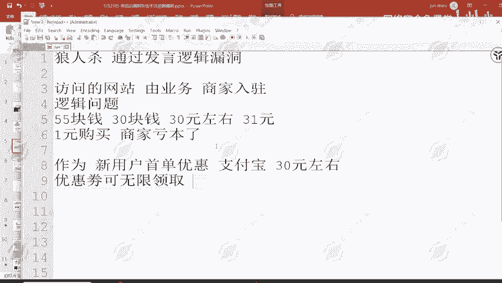
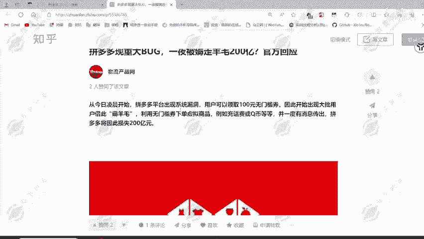
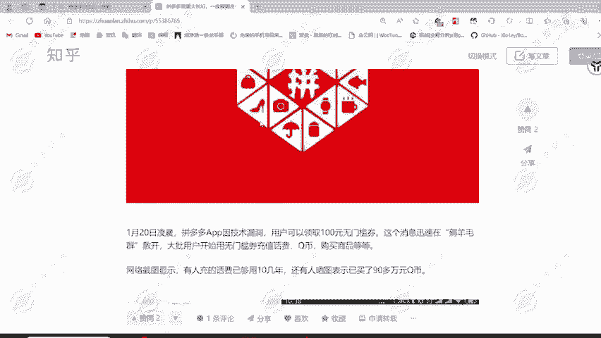
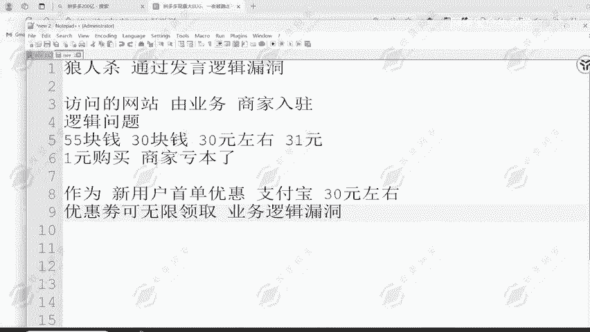
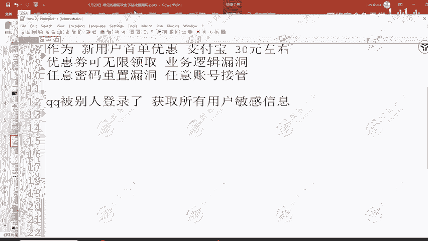

# 2024B站最值得看的黑客教程 ｜ 网络安全／渗透测试／内网渗透／漏洞挖掘／web安全／kali linux／红队靶场／CTF／信息安全 - P79：逻辑漏洞概述 - 网络安全免费学 - BV1uBsTetEow

首先给大家去讲解一下逻辑漏洞。什么是逻辑漏洞。逻辑活动呢，其实我们在自己的生活中呢也是遇到的非常多的一种类型啊。啊，比如说我们玩游戏。前段时间比较火的，也就是几年前比较火的一个游戏叫做唉。啊。

几年前比较火的一个游戏啊，它叫做狼人杀游戏嘛。肯定不止这么点，我只是说把这几个列出来了而已狼人杀游戏它的一个游戏过程，以及他从中去发现男人的一个原理是什么？通过发言逻辑。找出逻辑存在问题的一个人员。

然后给他去指定为男人投票，然后呢获得胜利。所以说在我们日常的游戏中就会出现这样的一个逻辑漏洞问题。就会出现这样的一个逻辑漏洞问题。那我们的一个生活测试呢，其实也存在这种问题。因为我们所访问的网站。

我们所访问的这一个网站是不是由。业务部是不是由业务去明确的一个业务方向。比如说我们去开发1个APP这个APP的功能是干嘛的？为的是实现什么样的一个业务啊？为的呢？

比如说我们开发一个商城APP那我们在这一个商城APP上面所要实现的业务是什么啊？上架商品，然后去贩卖商品，也就会存在有对应的一个上架商商品的一个过程，以及呢去购买商品。然后呢还会存在一个商家。

入住的问题。商家入驻商家挂上商品，然后去进行贩卖。然后呢，客户去购买商品，从而去进行一个发货，然后给到客户手上。那这样的一个流程之中，它有没有可能存在逻辑问题？比如说我今天这边呢开了一个商城。

这个商城有一个产品，它的价格呢是55块钱。然后呢，我去设计一个优惠券，是去吸引客户购买。那这个优惠券呢可能是30块钱。然后这个30块钱的优惠券，那能不能购买55块钱的产品啊？按理来说，55块的产品。

它的一个原价，或者说它的一个出厂价应该是在30元左右。毛利在45%左右的一个毛利嘛。然后呢，我们去上架这了55块钱的商品，然后呢，我去发放30元的优惠券。这个优惠券呢我没有去指定产品了。

我就只是说呃给我的客户发放优惠券，然后让客户通过优惠券来购买我的商品，觉得我的商品呢很便宜，能够在这上面多去拉人帮我们去扩大自己的一个业务。但是这样的一个情况就会出现30元优惠券。

它可以作用在55块钱的商品，能够作用在31块钱的商品。能够去作用在31元的商品上面，就会导致这一个商品呢被1元购买。那1元购买的商品，我还给他包邮，然后呢，我还要给他去寄产品。这个产品你说不值1块钱。

邮费值不值1块钱肯定值。那这个时候的话就会出现一个问题，商家亏本的。那商家亏本了，还会有商家在你上面去挂产品吗？就不会了，就不会有商家入驻了，就会导致这一个业务APP直接下架。

就会导致这一个业务直接就被砍掉，也就是被开除开除掉嘛。所以说在我们去设计这一类的APP网站，或者说一个业务的情况下，都要去理清他的一个逻辑关系，一定是要把完整的业务。去进行一个实现。是的。

门槛优惠券就可以了。但是当我去我在业务部的时候呢，去发布这样的产品的时候，我就没有去考虑到这个问题，也就是出现了逻辑缺陷，从而被黑客所找到的这样的一个逻辑缺陷，通过低价购买了产品。然后这是一个事例。

然后呢，还有就是30块钱优惠券作为什么啊？作为。新用户。首单。新用户首单优惠。那大家看到这一种30元无门槛优惠券，新人首单优惠是不是就很划得来了。然后作为业务方，作为这个公司。

你一个人才能够去购买一次这样的产品。那很明显，为了拉客，我通过这样的一个方式去进行一个销售是很正常的。然后呢。为的呢扩充我自己的一个业务嘛，就像支付宝。某宝嘛某宝之前也出现了这样的一个问题。

也就是可以去拉请好邀请好友注册。然后去扫码获取红包，这个红包额度呢也在30元左右。但是一个用户只限一次，那这样的话就产产生不了多少的一个损失。他们公司呢也能赔得起。但是如果说存在一个问题，就是优惠券。

可无限。优惠券可无限领取，它不一定新用户才能领。那我其他用户也可以领，或者说这个新用户呢，他可以领多次领一次是正常的。我领10次，领100次领1万次正不正常。

就不正常的那这个时候的话我就可以无限的在这个平台花零毛钱，或者说不花钱去购买产品。这里呢也就是业务逻辑。

漏洞。业务逻辑漏洞。因为它所设计的这一个业务功能呢，为的是能够让我们的APP去进行推广，让更多的人来知道我们的APP来使用我们的APP在这上面去购买产品。但是由于我的一个设计不合格。

我的一个设计理论存在问题。这一个优惠券呢可以被他人无限领取，就会导致存在这样的一个业务逻辑漏洞。有人呢就可以通过这样的一个问题去不断的薅羊毛，不断的去购买到我商城的一个廉价产品。这里呢是有一个案例的。

也就是拼多多的一个案例啊。拼夕西不能说拼多多啊。好，这边给大家看一下拼多多之前呢就出现了这一个问题，拼多多200亿损失。

拼多多出现重大bug，也就是出现了一个逻辑漏洞。这个漏洞呢就是因为所设计的这一个无门槛优惠券，用户可以领取100元无门槛优惠券，因此开始出现大批量用户借此薅羊毛利无门槛优惠券下单虚拟商品。

也就是对应的充话费啊，Q币。然后拼多多因此损失200亿。所以说这样的业务呢逻辑问题，它能够造成的损失是非常非常多的。而且可以看到，基本上一个用户是可以无限领取这个优惠券的。

被盗取数千万平台优惠券，然后第一时间修补了漏洞，然后呢，损失有大概。就算1000万个嘛，那就是200亿，就是200亿，200亿的一个损失。那拼多多加大业的能够承受得住。那其他公司呢能不能扛得住啊？

拼多多可能说啊能够扛得住这一点损失。但如果说是其他的公司呢，是一些小的商城平台呢，那它能够去接受200亿的一个损失吗？接受不了。

它就可能出现倒闭的问题。这就是逻辑漏洞能够带来的危害。而且逻辑漏洞它不能够去被扫描器扫描，也不会去被对应的一个安全监控设备监控到。所以说我们的逻辑漏洞可以持续的发展。只要有人去设计这样的业务。

只要这一个业务它存在一定的问题。首先嘛我们要去挖掘逻辑漏洞，肯定要去理解业务，也就是要去多点多看，多去走它的一个正常流程，然后从正常流程里面去发现不正常的一个问题。

然后这里呢就给大家讲解到逻辑漏洞的一类任意密码重置漏洞。刚才给大家讲解的这一种呢叫做业务逻辑漏洞。那现在呢我们给大家讲解一个叫做任意密码。重置漏洞。或者呢也可以称之为任意账号接管。

任意号账号接管危害性呢，大家可以想象一下啊，比如说我的QQ。被别人。登录了。之前呢有这样的一个问题嘛，之前大批量的QQ号被他人所去盗取，然后呢就给所有的好友发送一些什么呃，我住院了。

然后呢给我打钱打1000块钱，打2000块钱，打3000块钱给我应急事后呢，两天之内还给你。那这一种呢就是因为QQ号微信号被他人所盗取。然后给所有的好友去发送这样的一个诈骗信息。

所以说大家能够想象的到这一种任意账号接管漏洞，它的一个危害了吧。不仅能够做诈骗使用，还能够获取。所有用户。敏感信息。为什么现在大家在网上都是裸奔啊，为什么有这么多的一个诈骗人员能够找到我们的手机号。

能够给我们去拨打诈骗短信，发送诈骗短信，拨打对应的诈骗电话，也就是电信诈骗嘛。为什么会有这么多的一个事件出现？就是因为各大厂商没有做好他们公司业务的一个安全问题，导致我们的用户敏感信息。

手机号地址全部被泄露了，以及身份证。那这一些全部被泄露了，就会导致刚才我所说到的电信诈骗的问题，大范围存在？那我们要怎么去预防这样的问题呢？就是去发现这一方面的一个产品问题嘛。

