# 2024B站最值得看的黑客教程 ｜ 网络安全／渗透测试／内网渗透／漏洞挖掘／web安全／kali linux／红队靶场／CTF／信息安全 - P7：搭建渗透测试攻击环境 - 网络安全免费学 - BV1uBsTetEow

关于网络安全和渗透有什么区别呢？网络安全是一个笼统的啊是个笼统的概念。我们渗透测试是网络安全，一个岗位，一个行业，大家学习网络安全啊，基本上都会做渗透。还有什么岗位呢？比如说像安全运维、物联网安全。

车联网安全、汽车安全、软件安全、移动应用安全等等。那这些呢都是属于网络安全的相关方向和岗位，他们学习起来学习的路径和内容是绝对不一样的那渗透测试是其中最火需求量最大的，也是最简单的一个岗位。

也就是说呢如果你是从事比如说人工智能安全或者是汽车安全的话，你可能学习成本就更高啊，这是大家要清楚的。今天主要是解决三个学习目标。首先呢给大家简单讲一下这个虚拟机在渗透测试中啊，应该怎么去配置。

怎么去使用。相信来听课的同学呢，应该对虚拟机都有一个大致的了解。虚拟机就是在我们自己电脑上面呢虚拟出一个或多个操作系统。现在的我们经常去使用。就像大家呢在电脑上安装安卓模拟器，去玩一些手游。

其实安卓模拟器啊，就是在我们windows操作系统上系统上面呢去虚拟出一个安卓操作系统。这个操作系统和我们本身是互不影响的。并且可以运运行相关的安卓应用程序。

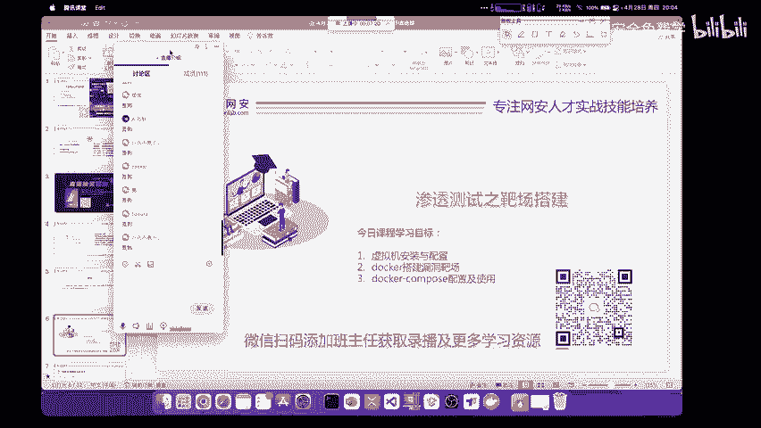

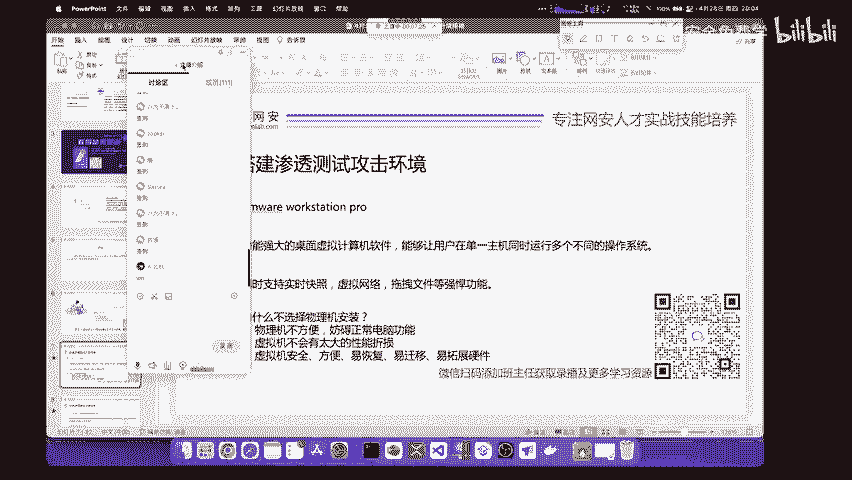

那我们今天要讲的呢不是安卓模拟器，而是在我们的计算机上面模拟出其他的操作系统。比如说在IT工作中经常使用的windowslinux和甚至是模拟出麦苹果操作系统。

那我们今天使用的软件叫做VM workstation pro。那这个软件呢它是非常的强大的我们在VMor里面去安装虚拟机，它其实功能是非常好的，并且不会有特别多的性能折损。如果你把虚拟机完整的进行配置。

安装了相关驱动，在虚拟机里面打游戏都是完全可以的。因为虚拟机也有相关的显卡驱动。所以说虚拟机对于我们正常使用来说，实在是太方便了。我们渗透测试就必须要掌握虚拟机搭建靶场环境。因为实际的网站。

你去攻击的话，可能会有法律风险。第二点呢，攻击实际的网站可能不利于你的学习，为什么呢？因为网站呢它可能有各种各样的防御，它拥有的漏洞可能并不能满足你的学习流程和需要，所以说呢你需要自己去搭建一个靶场。

就像军队里面训训练这些士兵，不可能一开始就让你去上战场，而是不停的打靶，以赛代练，通过正常的这个练习来去锻炼这个实战的能力啊，这也是啊对于我们。

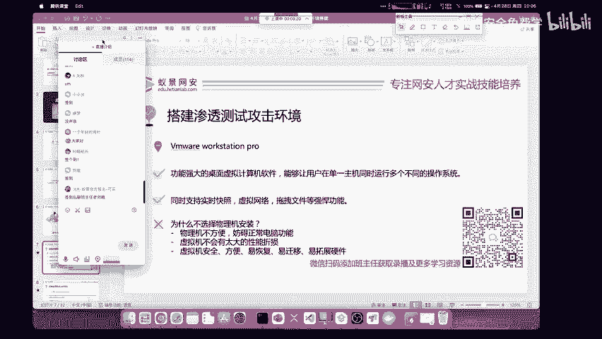

渗透测试的一个功能啊，不是只能攻击网页啊。关于渗透测试和攻击网页的这个区别呢，昨天我已经讲过了呀。首先呢这个VM应该怎么去下载？大家呢其实下载软件哈，一定要去官方网站下载。我见过很多同学呢。

他去下载这个应用，可能会到网络上一些不知道什么样的下载站去下载啊。比如说什么下载之家呀，或者是什么软件应用商店去下载。你下载的这些软件，有几个区有几个不好的地方。

第一点就是你可能下载到盗版的捆绑了木马病毒广告的这些软件。第二点呢就是你下载的这些软件呢，可能版本太低，没有办法使用到最新最好的功能。啊，我推荐大家下载任何软件都要去官网VM的官网。

就是VM work session这样一个网站。哎，我来把它呢发到我们的讨论区啊，发到讨论区，大家可以点开看一下。那在VM的官方网站中呢，我。

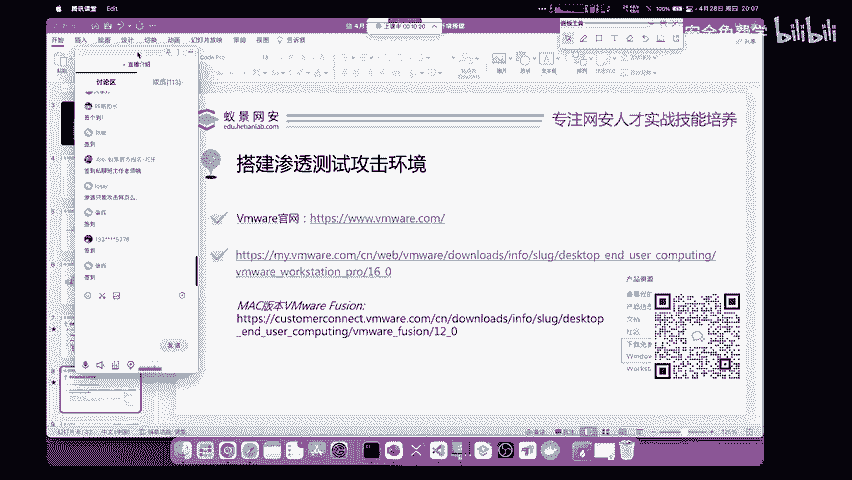

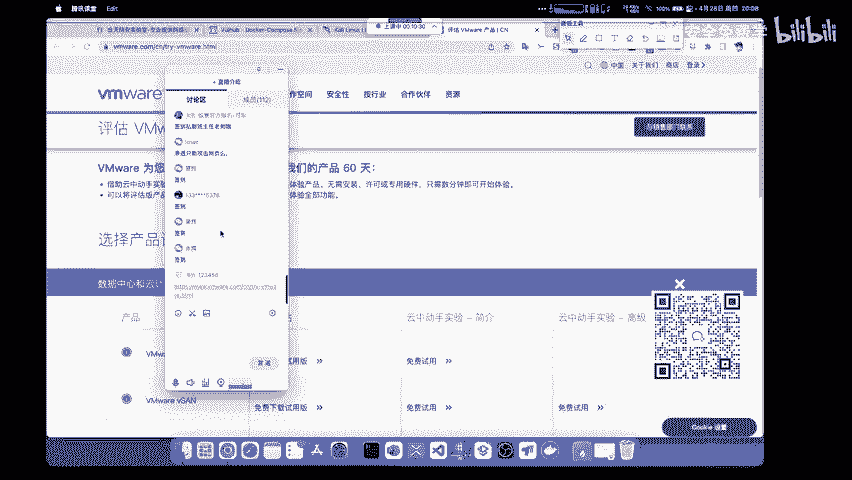

我们能够找到VM word的几乎所有产品，我们需要点击个人桌面，就是个人产品。这里呢有3个，分别是VM word work session pro，我们可以点击下载免费试用版。

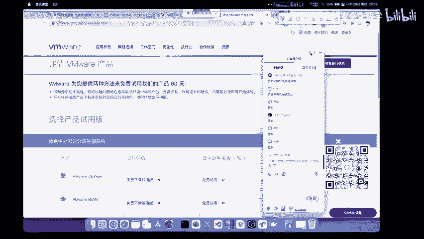

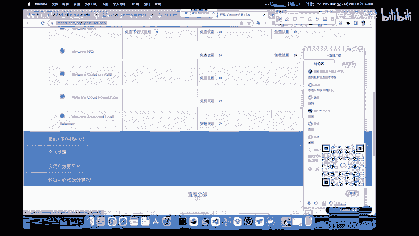

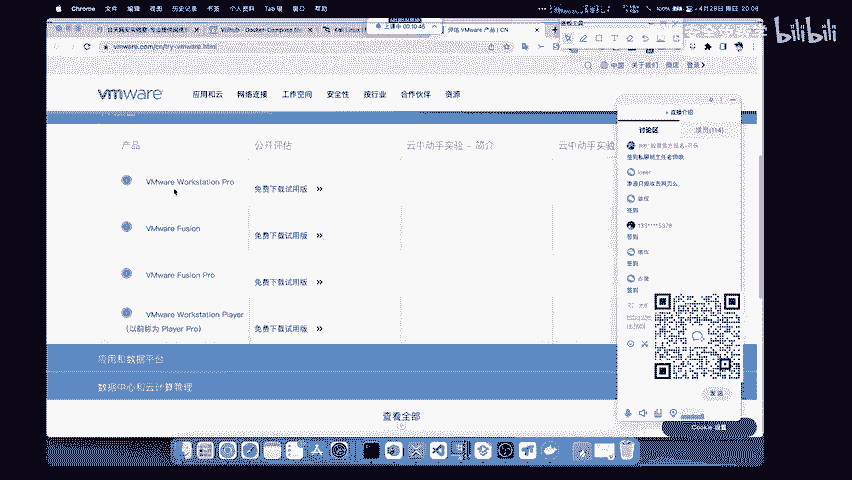

点击下载VM workstation16pro for windows操作系统，把它点击download now，就是现在下载即可完成VM的下载安装。安装VM是非常简单一件事情。

大家呢只需要依次点击下一步，选择自己的安装路径即可完成安装。我觉得啊来听课，既然你都把腾讯课堂都打开了。那安装VM对于你来说应该不是太大的问题。下面几个软件是什么呢？我现在给大家讲一下。

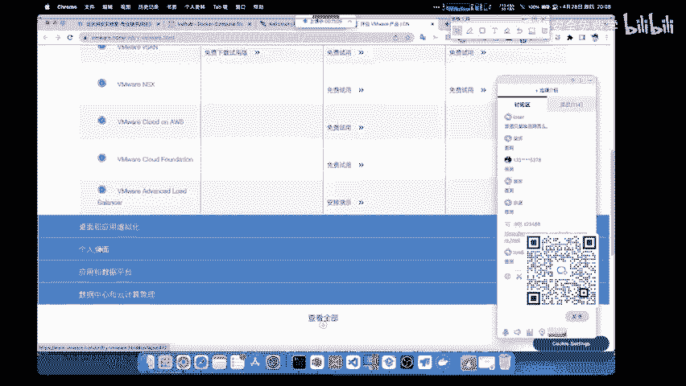

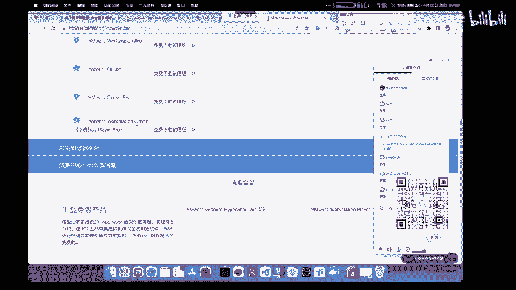

首先呢就是这个VMfuion pro。哎，这个东西啊，昨天我讲过了呀，大家如果没有听清的话，你可以加班主任的微信去要昨天的录播。昨天呢我做了一个详细的解释啊，花了几分钟的时间。如果你想听的话。

在课程结束之后，我也会再给你讲一遍，现在我们先进行课程内容吧。今天是第二节课了。首先呢这个VMfuion pro啊，它是针对于我们麦操作系统的。不过呢这个fuion它只能支持我们两年前的这个麦克啊。

也就是现在新版本的M1M one芯片的ar架构的麦克啊，已经不能够使用VMfuion了。我们需要下载这个M one arm架构专有的这个虚拟软件啊。大家如果你是用苹果电脑应该就非常清楚了啊。

我们正常人啊用windows你下载我们的windows版本就行。不过呢VMwork session pro它。

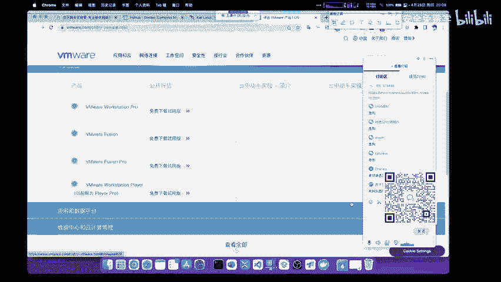

并不是一个开软的软件，我们需要对它进行一个激活和破解。那激活它呢，大家其实就和激活你的windows操作系统一样。那百度一搜，那激活密钥，那是一大把一大把的，你随便用就行。那这里呢为了防止大家搜索不到。

或者是呢啊你觉得不好用，懒得搜索。我这里呢给大家三个这个啊这个搜索的这个许可密钥啊，大家可以直接复制，其中任意一个进行一个激活。那这个操作呢其实是非常基础的非常基础的。

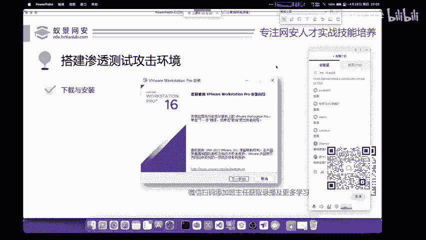

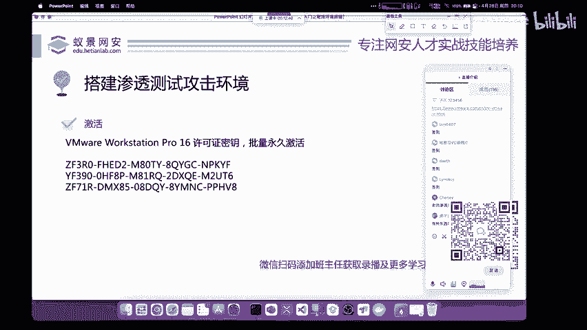

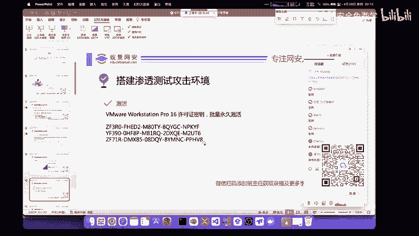

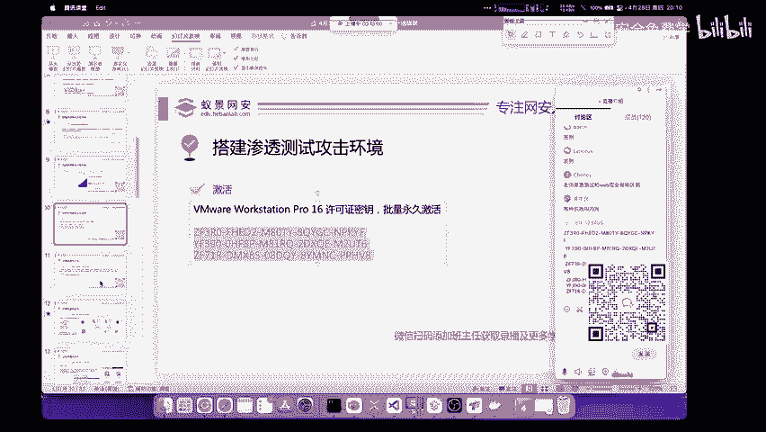