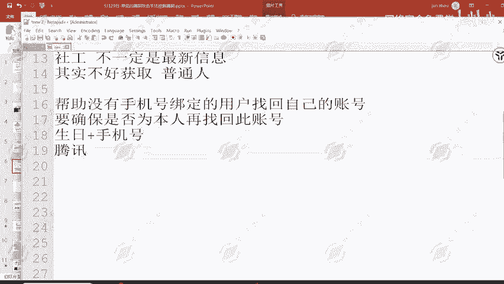

# 2024B站最值得看的黑客教程 ｜ 网络安全／渗透测试／内网渗透／漏洞挖掘／web安全／kali linux／红队靶场／CTF／信息安全 - P80：任意密码重置漏洞举例 - 网络安全免费学 - BV1uBsTetEow

那这里呢就是一个美团出现的问题，美团大家都用过吧。那美团如果说产生问题，出现问题了那影响的范围多管。呃，基本上呢就会导致大部分的用户信息全部被盗取。这里呢是之前美团出现的一个问题啊，王思聪发了一个微博。

他的呢账号被盗了，他的账号呢被别人登录了。然后他的一个敏感信息啊，地址住过的酒店购买的一些优惠券，或者说去哪一个餐厅吃过饭，就全部被他人所获取了。那为什么会出现这样的一个问题呢？其实很简单。

我们来看这里呢是疯凰科技网，然后发放的一个文章。只要能够获取手机号和生日，就可以换绑手机号了。那我们来想象一下手机号和生日这两项好获取吗？同学们来思考一下手机号和生日好不好获取啊。大家思考一下这个问题。

然后回答我觉得好获取的呢可以扣一，觉得不好获取的可以扣2。嗯。2、有人扣2了，有人扣一了，大部分是扣一的。扣一的同学呢应该是了解过一个东西叫做社工。社工呢是可以去获取到所有用户的信息的。

因为我们自己的个人信息，其实大部分都在网上有被他人所去进行一个公开售卖。但是呢售卖的信息它不一定是最新信息。因为现在我们的手机号，我们的一个地址呢时不时就更换了，获取的是之前的信息呢，就没有什么作用。

所以说社工也不是能够去完整的获取到生日和手机号的一种方式。而且社工呢要知道前置条件，也就是这一个人的姓名。或者说这一个人的手机号，或者说这一个人的身份证号，我才能够查出对应的其他信息。

所以说我们去通过我刚才这样的一个讲述啊，我相信大家应该能够明白，其实不好获取。其实是不好获取的。不好获取呢针对的是什么啊？普通人。普通人的信息不是那么好获取，因为我说我叫张三，比如说我叫张三。

那全国有多少个张三哎？那你能够准确的找到我这一个张三的信息吗？不一定吧。所以说针对于普通人来说，其实是不好获取的，尤其是针对某人的一个信息。但是我们要明白，美团所对接的用户，他只有普通人吗？他还有明星。

他有网红，他还有一些公众人物，那王思聪很明显就是一个公众人物。那公众人物的手机号和生日好不好获取啊。

给大家演示一下。比如说我们就在这里搜索王思聪。回车。有一个百度百科，王思聪，1988年1月3日出生于辽宁省大连市。那这一个信息暴露了什么？获取到生日了，我们就能够获取到他的一个生日。那手机号呢。

我可以告诉大家，之前微博有一个漏洞，可以获取任意用户的首需信息。那这两者结合起来。是不是就能够去修改王思聪的一个美团账户密码，就能够直接接管他的美团账号，就能够接管他的一个美团账号。

那这样的一个行为是不是就能够造成这一个漏洞的产生？当然我们普通人的生日没有那么好获取啊，针对个人的没有那么好获取，除非说你能够拿到我的手机号，那就可以获取到我的一个身份证号，我的姓名，我的地址。好。

那这就是它的一个功能缺陷。这个功能缺陷它是正常的吗？你说正常也正常，你说不正常也不正常。因为我们要去思考到一个问题，原本设计这一个业务的逻辑是什么啊？原本我们去设计这样的一个业务，是为了干什么？

帮助没有手机号。绑定的用户。找回自己的账号。这是我们设计的初衷。那这一个初衷有没有问题？没有问题，尤其是在现在的一个互联网时代，每个人的手机号呢可能说我用半年用一年我就换了。

那这个时候我所用这个手机号注册的账号呢，要怎么找回就找回不了了。所以说美团提供这个功能有没有问题？

没有问题，但是他提供这个功能的逻辑出现了问题。按理来说，我们所去设计这样的一个业务，设计这样的一个功能，那肯定是要确保。是否为本人？再找回此账号。是不是要有这样的一个设计初衷？

那美团呢就针对于这一个设计初衷，他没有做到很好的理解，要怎么确定是否为本人，他就以生日。加。手机号。他就以生日加手机号来确认你是不是为本人了。但其实这一种呢是不太安全的。就像我刚才说到的。

公众人物的生日手机号是非常好获取的，就会造成这一个漏洞的出现。那普通人的呢，他就不一定存在这个漏洞的。所以说这个漏洞为什么在王思聪出现了问题之后才会被美团重视啊。就是因为这个漏洞对于普通人来说。

它不叫做漏洞。但是对于公众人物来说，它的危害性就非常大了。也是在这样的一个时间段，美团呢才去紧急修复修复的这样的一个漏洞，才去进行了一个紧急修复。那正常逻辑来说，我们去做这样的一个验证。

肯定是要确认为本人行为。这一点呢，腾讯就做的很好。

腾讯就做的很好啊，你像QQ想要找回手机号，或者说微信想要找回手机号，找回对应的一个账号，它会让你去选择用此用微信或者说QQ账号里面所聊天的一些聊天用户信息，哪一个是你的一个用户。

哪一个不是哪个是你的朋友，哪一个不是哪一个是你的一个常用手机号登录，常用的一个登录设备，哪一个不是他会给你对应的一个选项来确认是否为你本人，所以说腾讯这一个就做的非常好。然后就没有出现这样的一个问题嘛。

然后美团呢就出现了这样的问题。所以说归根结底，就是他们的业务，他们的业务部门并没有去设计好这样的一个业务逻辑问题，从而产生的一个逻辑漏懂。

嗯，这个大家能听懂吗？能听懂的扣个一。同学们，这里能听懂的扣个一啊，都没听懂吗？😡，是这里都没有听懂吗？同学们，我看没有人扣1啊。那可以看到美团这么大的公司都可能出现这样的一个逻辑问题。

那其他的小公司呢，或者说一些他们没有注意到的网站呢，这还是美团APP啊，它的重点业务。那其他的一些业务呢有没有可能存在更为明显的漏洞啊，就可能存在的？

