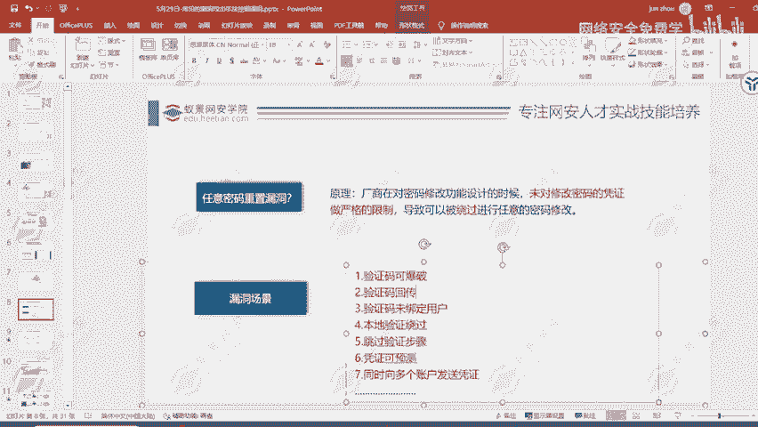
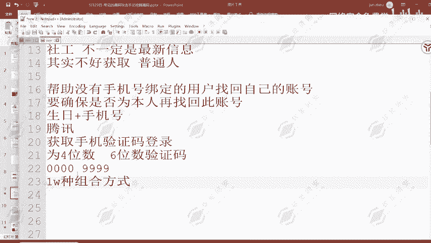
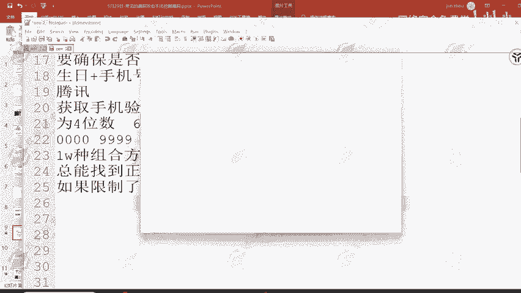
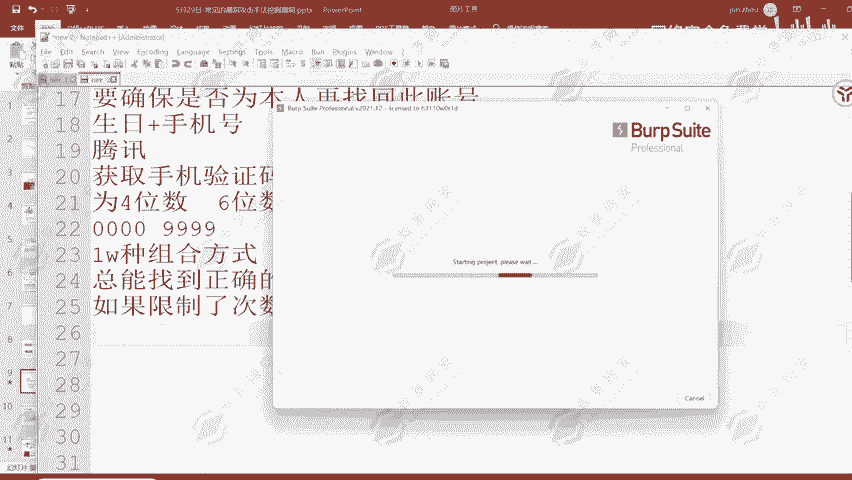
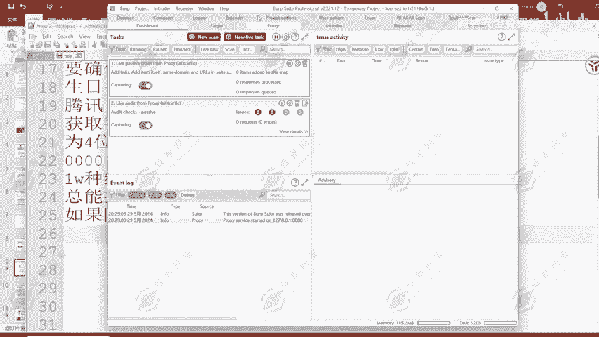
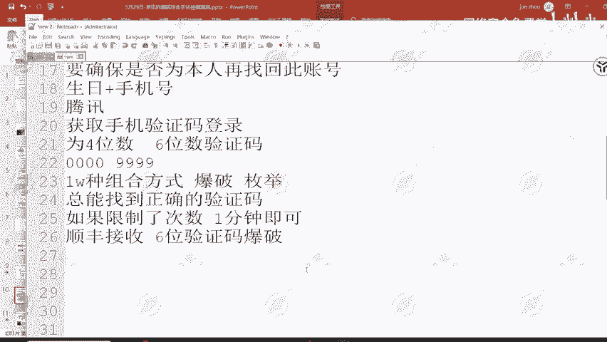
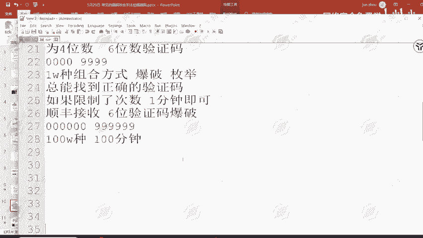
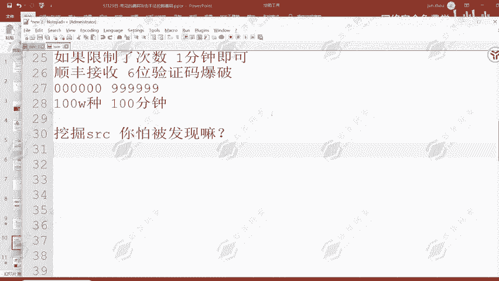

# 2024B站最值得看的黑客教程 ｜ 网络安全／渗透测试／内网渗透／漏洞挖掘／web安全／kali linux／红队靶场／CTF／信息安全 - P81：顺丰某站任意用户密码重置 - 网络安全免费学 - BV1uBsTetEow

那下面呢就给大家讲一下。在网站上面常见的一些任意密码重置后的，这种漏洞的话肯定是不常见的，这种肯定不常见，只在特定的业务范围之内才有效。那下面呢给大家讲解一些比较常见的，也就是。

任意密码重做中的一些场景，还有对应的原理以及挖掘方式。厂商在对密码修改功能。有些类似于逻辑测试差不多，厂商在对密码修改功能设计的时候呢，未对修改密码的凭证做严格的限制，导致可以被绕过进行任意的密码修改。

这是它的一个原理。然后漏洞的场景呢非常多。我们今天这节课呢肯定说肯定是没有办法全部一一的给大家去进行一个细致的讲解，然后带大家来了解一下，很多呢是大家见过的场景。只是说大家没有把它当做漏洞去进行测试。

然后这一些多多场景呢，等会一一的给大家去进行一个讲解。首先我们来看到第一个场景，这个场景呢也是大家在注册APP的时候会经常遇到的。

我们在使用网站的时候去注册账号，或者说去登录账号，忘记密码了怎么办？是不是通过手机号登录啊？那通过手机号登录是不是有一个条件？获取手机验证码。登录。获取手机验证码登录的一个过程。那在这样的一个过程之中。

如果说我们获取的验证码为4位。现在大家所接收到的验证码大部分都是6个验证码吧。😊，有没有接收到过四维验证码的同学，有的扣个一，我看一下。如果说你获取的手机验证码登录有可能为4位，有可能为6位。

那如果为4位会造成什么样的一个问题啊？就会出现这样的一个漏洞。在我们重置密码的时候，发送手机验证码信息，找回密码的时候，然后去发送手机验证码信息，然后发现验证码只有4位。

那4位我们来注意0000到9999，总共呢1万种组合方式。那1万种组合方式。

我能不能去进行一个爆破？我能不能去进行一个。每一举。我能不能去进行爆破枚举，我用0000000100020003，然后11个一个的去进行测试，测试1万次。那是不是总能找到正确的验证码？

我是不是就有概率能够找到这样的一个正确的验证码？是不是就可以？而且呢只需要1万次请求就能够完成这一个漏洞的寻找。如果限制了你的次数就没有办法了。是的，如果限制的次数。那肯定就没办法了。

这就是这一个漏洞的解决方法。当然有解决方法，但是。有没有绕过方法？有呀，时间要很长吗？不需要1万种组合方式，一分钟即可。这里呢就要去介绍到我们昨天所讲到的这一个b速工具了。

w数的工具里面呢提供了爆破模块，能够帮助我们在短时间之内同时去枚举到一个参数。也就是在一分钟之内，我们就能够把这1万种组合全部的尝试一次。

在BURP这里啊就可以去做的。所以说。😊。

如果你能够看到四维验证码信息，它就可能存在这样的一个漏洞，在这里啊就可以去进行爆破了。

但是这一种漏洞呢，现在出现的概率呢不是很多，但是呢存在这里呢就是在顺丰某站顺丰大家都知道吧，寄会计的一个龙头企业嘛，物流的一个龙头企业，它就存在这样的一个漏洞。嗯哼。😊，然后它的一个表现形式啊。

我们看验证码4位服务端未对验证时间次数进行一个限制，出现次数比较多的地方，这也是挖掘。这种任意密码重复漏洞，短信验证码形式的最容易出现的点。大然有没有可能存在6个验证码漏洞啊，存在，而且顺丰接收。6位。

验证码包括。他能够去接收这样的一个6位验证码包括。按理来说啊，6位验证码是0000006个0，然后到99996个9，总共呢是10万种，100万种。

100万种组合方式。那100万种组合方式，你就说我的一个四位四位验证码，我只要一分钟。那100万种呢，1万种方式我只要一分钟，100万种呢，100分钟。那也就是一个多小时的时间。

但是我们所获取的验证码呢，一般都有时间限制，也就是30分钟之内有效，或者说呢是一个小时之内有效。那这一种六位验证码还能爆破吗？就不行了嘛。但是呢。如果说它的一个6位验证码不过期，且时间很长时间很长啊。

就不过期，且没有对验证的次数进行限制，那它也可能存在这样的一个漏洞。因为100100万种组合方式，100分钟它总能够爆破的出来。那既然能够爆破了出来，它的一个时效呢，存在100分钟以上。

是不是就存在这样的一个漏洞。我能够把它的一个验证码爆破出来，然后填写它的验证码信息，从而去修改他人账号的密码。这就是这一种类型的密码重置漏洞的一个原理，以及挖掘方法。

大家看到四维验证码就可以去尝试一下了。最主要的点就在于没有进行次数验证啊。而这种不会，我们一直去尝试验证码输入是不会被对方发现的。而且我们要明白一点，挖掘SIRC这里我们就要去了解一点了。

挖掘SRC。你怕被发现吗？同学们。发现了又能怎么样，没发现又能怎么样？我们在挖掘SRC我会怕怕他发现我吗？我不会怕，因为我有授权，你授权了，我帮你测试漏洞。那我在爆破你的验证码，你会去管我吗？

他不会管你你爆破出来了，你就直接提交，它也没有办法在这么短的时间之内直接去修复这个漏洞。那你就能够撞到这一个赏金，所以说不用担心被发现。挖掘SRC它本身就是授权的行为。

修复方法使用6位验证码验证码次数呢有去进行认证。四位验证码呢也存在无漏洞的场景，也就是验证次数，有去进行限制，只能够去尝试4次。那你说还它还也可能存在漏洞吗？也就是我这个验证码只能提交4次。

提交4次之后，验证码直接失效，那还会存在漏洞吗？你你一万种组合方式，你也要尝试1万次嘛，那你就4次的一个尝试机会，那这一个漏洞它就不存在了，这是第一种啊，修复这种的方法呢非常简单。

直接限制验证码认证次数即可解决。

然后就是。