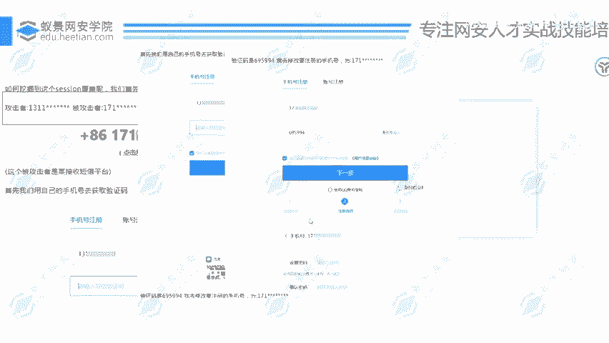
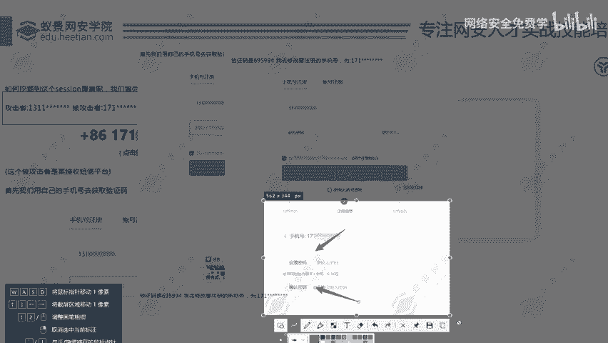
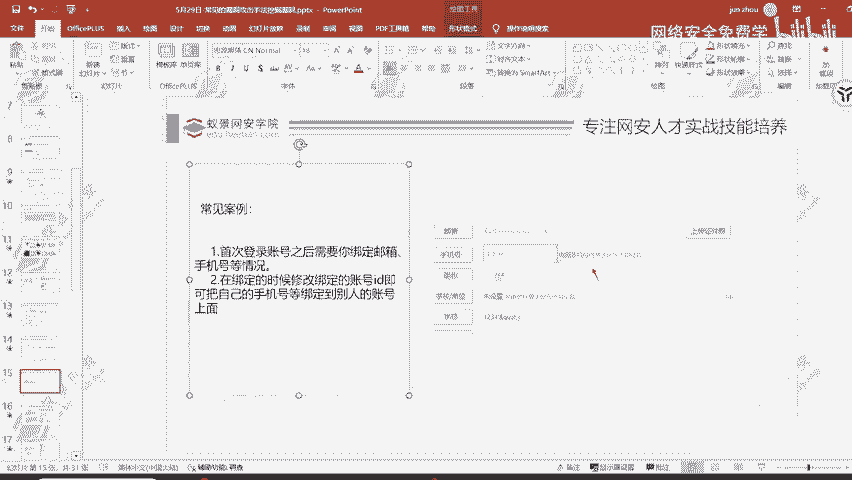

# 2024B站最值得看的黑客教程 ｜ 网络安全／渗透测试／内网渗透／漏洞挖掘／web安全／kali linux／红队靶场／CTF／信息安全 - P83：验证凭证未绑定用户 - 网络安全免费学 - BV1uBsTetEow

然后还有验证凭证未绑定用户的问题啊，这个验证凭证未绑定用户呢同样的也是。这一个。这一个问题呢是现在出现的会稍微多一点，而且呢是危害性比较大的一点。之前呢我是在某政某的一个不是政企机构啊，是证券站点。

证券。基金站点。在这样的一个证券经济站基金站点上面发现了这个问题，还是它的一个主要APP。还是它的一个主要APP啊，就存在这一个问题。可想而知，这个漏洞出现的概率是不是会大很多啊？

一个证券公司的主要APP它的一个核心业务APP存在的一个问题。那这一个漏洞是怎么回事呢？也就是在我们注册用户的时候，这边给大家看一下它的一个流程。这里呢是给大家去整理的一个的。我们首先来看。

我们先准备两个手机号，两个手机号呢是我们在挖掘漏洞的时候必备要的一个基础设施。也就是我们需要准备的一个前置账户。首先呢准备两个手机号。那这两个手机号呢肯定都是我自己的然后呢。

我们用自己的手机号去获取验证码注册账户。然后呢，我这边呢就出现了一个手机号注册，输入自己的手机号，点击获取验证码信息。点击获取验证码信息之后，我的手机上面就会收到这一个验证码信息，叫做695994。

可以看到通过131手机号注册用户，然后呢获取到的验证码是695994。那大家现在想法是什么？可以说一下，是把验证码填进去，点击下一步还是做什么其他的操作。如果说是直接点击验证码去填入。

然后呢点击下一步的同学可以扣个一。然后要做其他的操作的同学呢，可以扣个2，然后想要做什么操作，可以告诉我。嗯。然后有同学扣一了。就正常的一个操作嘛。这一位同学在跟着我思考吗？让大家带入进去。

然后去理解这个漏洞。好，扣二的同学可以把自己的一个想法打在讨论区。我会给大家讲解你这个想法可不可靠，有没有作用，抓包肯定是要抓包的。但是抓包之后，我们要去进行什么操作，是直接填写验证码。

点击下一步还是要去做其他的额外操作，抓包干嘛，可以说一下，然后我这边呢就会给大家去讲抓包改号码，改什么号码，呃，只有123455位同学在加入我的这一个讨论环节吗？换个手机号码，然后填写这个验证码。那。

还有同学有其他的一个答案吗？重发。重发什么重发验证码信息是吧？重发验证码信息，我们就可以挖到短信轰炸漏洞。那有位同学说到了，换个手机号，然后填写这个验证码。然后当时呢我也是这么操作的。😊。

可到验证码是695994，我去修改要注册的手机号为171，把131改成171，然后填写131的验证码信息，点击下一步，我们可以看到进入到了进入到了什么啊？

设置密码的一个页面。进入到了这一个设置密码页面，然后我们去设置密码信息。

可以看到注册成功，用户呢171，我们就成功的注册了171这样的一个用户，就注册了171这样的一个用户。而且我们要去知道他有可能不是验证码，是凭证，有可能是其他的作为凭证。我之前是在。

去年年底去年11月份的时候，挖到了一个证券公司的这一个漏洞，它的一个认证呢不是验证码，这一呢是之前挖的，是之前挖的。然后呢，在去年年底的时候，挖到了一个就是它的验证信息，不是验证码，而是一个托king。

还是一个托品。这里呢我们可以看到。验证码作为凭证，但是我挖掘的这一个积器站点呢，它是toy作为凭证。我输入正确的验证码。和手机号。他会去获取到一个ting，会获取一个ting。

然后作为下一次设置密码的时候的一个凭证，这就是做一个统一的业务管理嘛，统一的一个业务流程。拿到这个toki之后，我去做下一步的设置密码的一个操作。但是我在测试的时候。

我发现了这一个toing可以用到其他账号，也就是我这一个时候我一开始是用自己的正常的手机号和验证码去获取的一个toing。这个toing呢，我记录下来，我用1个18881234567891011。

我用这一个手机号去获取验证码，然后填写一个123456的验证码信息。那大家可以看到1888这一个手机号会是我的吗？不是，那123456会是这一个手机号的验证码信息吗？也不是，然后我抓取返回数据包。

把toing填入进去，点击发送下一步然后就可以去修改，就可以去设置1888这一个账号的密码，然后登录到1888这一个账号。逻际原理是一模一样的，只是说凭证换了一个东西，这个是验证码作为凭证。

这个呢是ty作为凭证。那很多同学就有这样的一个思路了。我看有几位同学啊就有这样的一个思路的。西瓜同学抓包改号码以及HUALY同学也是直接换手机号，那你们就有发现这一个漏洞的潜力。

你们就有发现这个漏洞的潜力啊，这样的漏洞呢？能给到什么样的危害，高危。这样的漏洞能够给到高危的一个危害，高危的一个评级，那就是几千块钱了嘛，几千块钱打底的一个赏金收入了，你们就有挖掘这一个漏洞的潜力啊。

好，这就是这一个验证凭证为绑定用户存在的问题。听懂了吗？听懂的扣个一。然后这是典型的一个逻辑问题了，典型的一个越权问题了。这一个案例刚才那一个问题听懂的那一个漏洞听懂的扣1。

这一位同学听懂了吗？只有两位同学听懂了吗？把一扣起来呀，让我知道大家在认真听。嗯哼。😊，O。