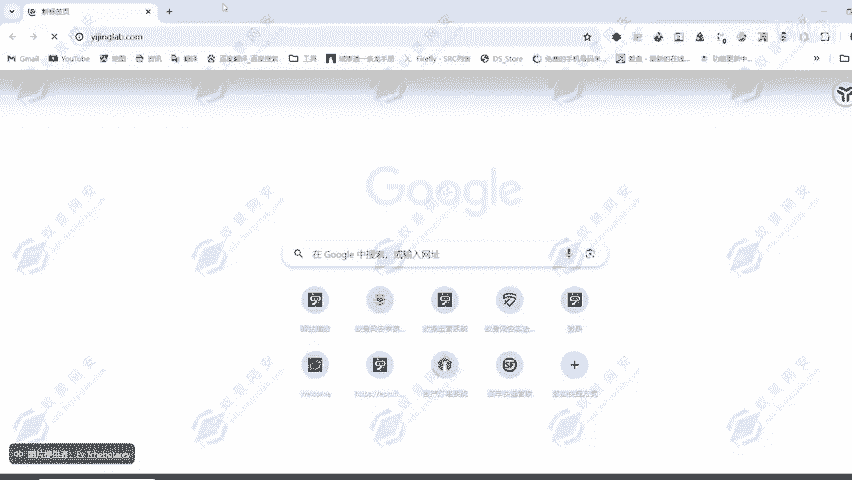
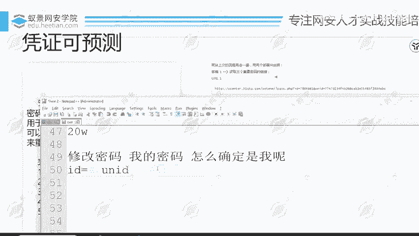

# 2024B站最值得看的黑客教程 ｜ 网络安全／渗透测试／内网渗透／漏洞挖掘／web安全／kali linux／红队靶场／CTF／信息安全 - P84：越权漏洞案例 - 网络安全免费学 - BV1uBsTetEow

那这一个案例呢就是典型的一个越权案例。这样的案例呢，在各大网站上面，在各大厂商都存在。典型的一个越权问题。刚才有同学说到了H1H1呢也有这样的漏洞，H1上面也有这样的漏洞。😊，首次登录账号之后呢。

需要你绑定邮箱、手机号等情况，在绑定的时候修改绑定的账户ID即可把自己的手机号等绑定到别人的账号上面。这一个呢我们可以给大家看一下，其实在我们公司上面也有这样的一个问题，只是说呢呃大家挖解不到。

这边呢我们可以用到自己公司的产品给大家看一下。其实大家在每一个平台注册账号之后，你都会发现有一个东西会去标识你的身份，可以是UZ IDD为纯数字，可以是一些英文单词，还可以是一些特殊字符。

来标识我们的一个账户信息的那这里呢我就登录自己的账号。我们来看。

在登录账号的过程之中，会触发这么多的一个响应数据一个数据包嘛，稍微等待一下，给大家去看一下，每一个站点都有这样的一个代表自己个人身份的ID。比如说在我们的怡警网站上面，在我们的怡景网教学平台上面。

它就有一个ID代表了我的一个个人身份信息。什么ID啊。这个IDREG杠7875杠C06F，然后呢，还有1个-411，这个呢代表的就是我这一个账户的ID那我只要知道了别人的这个账户。

我就可以看到别人账户的一个信息。我只要知道了别人这一个账户的ID我就能够看到他的一个信息。那这里呢就是用来标识我们用户身份，以及我们在数据库里面的一个位置的东西。在绑定的时候修改绑定账户ID。

也就是把我的ID修改成他人用户的ID即合把自己的手机号绑定到别人的账户上面。这也是我们之前存在的问题啊。然后呢我们去进行了修复，去进行了一个修复啊。之前我们的网站也有这个问题啊，现在修复了。

可以看到ID呢也变成了这么复杂的1个ID就不会出现这样的一个问题了。但是在各大厂商呢是存在这样的一个问题的。😊，之前呢支付宝存在这样的一个问题，给了10多万。然后呢。

在HE上面也存在这样的1个UID月权问题。通过修改UID可以修改任意用户的一个身份信息，给了20万。给了20万，支付宝呢给了1多万。然后呢。平安上次也挖到这样的一个漏洞，给了1。5万。

所以说啊这种漏洞危害性很大，给的钱呢非常多，但是要怎么去挖，就要多关注细节。然后就是跳过验证步骤，这里的话就很简单了。跳过验证步骤和这一个漏洞是原理非常相似的，和这一个漏洞原理非常相似。

都是没有去验证对应的一个凭证和账号是否存在绑定关系。这里呢是某珠宝贷平台的一个网站，然后呢去填写到我们的一个手机号信息，然后获取验证码，然后呢进入到修改密码的步骤。这里呢有一个新密码和确认新密码。

我们去输入新密码和确认新密码，然后把账号修改为其他用户的账号，就能够去修改它的密码，修改它的密码。这里呢就是没有去绑定我们的一个验证。对修改密码的步骤没有做验证啊，没有做前置的一个验证。

导致可以输入最终修改密码的网址，直接跳转到该页面，然后输入新密码，达到重置密码的目的。测试的一个过程呢，发现的一个流程，先用自己的账号走一遍流程，然后记录到每一个页面，获取手机验证码的页面在哪里。

修改密码的页面在哪里？确认这两个页面信息以及所要接受的参数之后呢，再去考虑怎么去发现这样的漏洞。先走一遍流程啊，获取每一个步骤的页面链接，然后进入输入新密码对应的链接，重置他人账户时获取验证码后。

直接进入输入新密码对应链接到新密码的界面输入密码重置成功，也就是没有去绑定这样的一个凭证。这两个步骤它是单独出来的，没有做两个步骤的绑定问题。然后还有toki可以预测。

这一个呢也是在邮箱获取验证码信息的时候存在的一个问题。这里呢也给大家看一下挖掘的一个流程。首先呢我们去。找回密码，注册一个账号，然后找回自己的密码，找回密码的时候，通过邮箱去获取对应的一个链接。

获取找回密码的链接。然后邮箱呢就会收到一个链接，这里呢我用到一个邮箱，我自己的邮箱去收到这样的一个找回密码的链接。这个链接呢看起来平平无奇，我也不知道要修改哪里，其实我们可以分析啊。

我们学了对应的一个漏洞挖掘，我们就要知道怎么去分析这样的一个数据包。首先我们来看这里呢也在带着大家来分析一下。HEP这个很明显是它的域名，后面呢fit。

emailpass点PHP很明显的就它找回密码的一个文件，后面接上1个ID等于7804861。这个7804861是什么东西啊？不知道不知道没有关系，我们先等会儿再来看它。然后呢，有1个UNID。

有1个UNID那UNID又是什么东西呢？MD5就简单的MD5就简单的MD5啊。这个UID呢它就是1个MD5加密的，怎么判断它是否为MD5加密呢？我们来数一下。

1234567891011121314151617181092212234Y1272829303132。31123456789101112131315161812哎呀。总共32位，天安哪总共32位。

大家可以自己数一下，刚才数错了，数成31了，总共32位，且为数字加英文单词这样的一个方式。那它就可能是MD5加密，就是MD5加密。那我们判断出来了，它可能是MD5加密。

我们就去通过MD5解密网站去进行解密操作。解密完之后呢，我们可以发现。是的，32位小写加数字就等于MD5大写也可能啊大写也可能是MD5啊。那这里呢我们还看到解密出来之后呢，是一串纯数字，是一串纯数字。

那这里呢我们就可以暂且认定为认证的一个凭证。因为找回密码的这个链接，我们首先要分析业务嘛，分析它是什么东西。😊，它为什么有这样的一个链接？首先我们来分析这个链接它的作用是什么啊？修改密码。修改谁的密码。

我的密码。😡，那怎么确定？是我呢？怎么确定修改的是我的密码，怎么确定是是不是别人在操作呢？😡，这里呢我们就可以根据我们已知的条件和业务的猜想来去明确每一个参数的一个目的了。ID。暂时不知道是什么。

不用管。那UNID呢加密了，那我们就可以判断为它是凭证。

凭证是用来干什么的，确认是我本人在操作。那能够通过凭证确定我本人在操作了，他是不是还要确定一个东西？我本人在操作操作的是什么账号啊，是我自己的账号还是别人的账号，他要怎么确定通过ID来确定。

那我们在这里呢就能够明白了ID参数的含义，账户ID。也就是我们刚才给大家看到的这1个ID账户ID来确定是我的一个账户的，是我的一个用户，是我的这一个账号。那这两个参数我们都明白了。前面的ID代表的呢是。

用户的一个信息是这个用户。后面这个ID呢代表的是凭证确定是我个人正在操作。那确定了这个信息之后，现在暂时我们不知道它有没有可能存在漏洞。其实呢只要MD5解密之后是纯数字，它就大概率存在漏洞了。

我们就能够判断它大概率存在漏洞了。那我们要怎么确认这个漏洞存在呢，再获取一条再获取一个找回密码的链接，然后再来分析这个链接的UNID可以按到获取的链接ID呢还是7804861，那就证明了我们的判断没错。

ID呢代表的是我的账号，那UNID呢。他得到的结果再去解密，发现和上面这1个14586076651458607794是不是很接近啊？只有后面三位不同，前面的都是完全相同的那我要怎么确认这个猜想呢？

再获取一个链接，你会发现前面依旧相同，只有后面三位有去进行一个更改。那它就可能存在漏洞的。因为三位数它的一个枚举范围只有1000条1000种组合方式，我还不能够去枚举出来吗？就能够枚举出来了。

这个时候呢我们就切换成第二个用户，可以看到切换成第二个用户，然后再获取对应的一个。再获取对应的一个邮箱验证码邮箱链接。然后呢，邮箱二伙所获取到的一个结果呢。

你会发现和前面第一个邮箱获取的结果是非常接近的，只有后面四位不同。然后这个时候呢，我们就可以生成一个4位数字的字典，在每个前面加上145860。这个在一天之内呢不会变得一个常数。

然后进行32位的MD5加密即可对UID去进行爆破。那爆破成功之后，我是不是就能够修改任意用户的密码了。通过去控制前面的这一个ID来修改任意账号的密码，这个就是tok可预测的问题。

它的凭证我们可以猜得出来。那这个时候它就存在任意密码重置漏洞，也就可以接管所有的用户了。然后第六个呢就是同时向多个账户发送凭证的问题啊，这个也是在当时的一个基金站点。呃，我开头的时候给大家介绍了吧。

我在东方财富SSC，然后在去年呢是拿到了年满第五的一个排名，然后只花了两个月的时间，然后拿到了年榜第五，然后它上面呢就存在有我刚才所说到的这个漏洞。这个漏洞，然后这个漏洞它都存在。

