# 2024B站最值得看的黑客教程 ｜ 网络安全／渗透测试／内网渗透／漏洞挖掘／web安全／kali linux／红队靶场／CTF／信息安全 - P85：同时向多个账户发送凭证 - 网络安全免费学 - BV1uBsTetEow

他都存在。嗯，同时向多个账户发送凭证，将发送验证码的包截取修改字段，添加多个账户，然后再发包发现所写的有效字段均发送了凭证信息，这是什么问题啊？这是什么原理啊？其实很简单嘛，我们的一个找回密码。

是不是让我们输入？手机号啊。让我们输入手机号，然后获取验证码信息。此时我的手机号就会获取到验证码，从来帮助我修改这一个账户的密码。但是如果说我们此时不止输入。一个手机号呢？我输入两个手机号。

然后再发送验证码信息，有没有可能这两个手机号都收到验证码信息啊？有可能那两个手机号都收到的验证码信息，它是由短信服务器统一去进行发送的，直接去进行统一发送的统一发送的那有没有可能两个手机号？

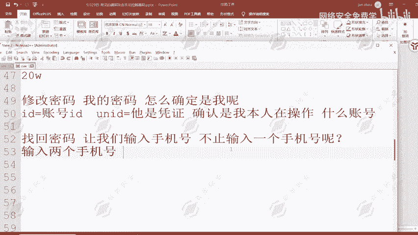

获取的验证码。是同一个。大家有没有思考过这样的一个问题？我就思考过，然后我就发现了这一个漏洞。当我去在这边填写为两个手机号的时候，去发送验证码信息。发送完之后呢，我的手机上面就会去收到了。

如果说我这个这个时候我的手机上面就会收到两个手机号所接收到的短信验证码信息，输入框里面不能输入两个手机号，但是我们可以抓包输入呀。输入框它做的限制只能输入一个手机号，我们就不能抓包输入吗？

抓包输入成功之后，是不是就可能存在这个漏洞啊？然后它就存在有这样的一个漏洞。然后呢，我们获取到了两个手机号的信息，两个手机号的验证码信息是完全相同的那我用自己的手机号去接收一个短信验证码。

后面的这个手机号呢，我填写为别人的，我填写为他们的管理员，他们老板的手机号能不能行？然后我在获取验证码的时候，我的手机号是不是会接收到老板手机号的验证码信息。

那我用老板的手机号再接上我自己的一个验证码信息，是不是能够登录到老板的账号，那我就接管了他这个平台的老板的账号信息，接管了他的一个用户信息。😊，所以说啊这些漏洞呢都是在网站上面真实存在的。

而我也是在最近呢也是去发现到了这一些漏洞。然后呢，这些漏洞大家只要能够学会，那其实一个漏洞。这边告诉大家，一个漏洞。多少钱，大家可以猜一下。这一种漏洞你只要挖到一个有多少钱，大家可猜一下。嗯哼。😊。

一外很大来。10个10万可以，胆子挺大，都挺大。啊，同学们，这1个10万猜的还是有点夸张的，20万10万20万存在。😊，1问大什么存在，但仅限于。大厂上。比如说字杰啊、腾讯啊、阿里啊这些大厂商。

他才可能给到10万以上的一个奖金额度。那其他的呢基本上是在。2000到1万。左右做多200。小乔了小乔的这样的一个漏洞的，至少是啊200，怎么200啊，20002000到1万左右，2000到1万左右。

😊，2000到1万左右啊，国内厂商基本的厂商是能够给到这样的一个赏金额度的，200到1万左右的一个赏金收入。漏洞危害，你说大也大，你说小呢，和他们有没个什么关系，影响的呢是客户的信息。

那和他们厂商又有什么关系？是吧所以说呢厂商给的少，那他就只你就只能认了。但是大部分厂商啊都能给到2000到1万。因为这样的漏洞呢都是高危起步。只要你能够挖到这样的一个漏洞，就是高危起步。

高危呢讲金范围就在这就在这样的一个区间之内。当然有一些少的给1000的。但是基本上不会低于1000，一个高危基本上不会低于1000，也就是10001万左右左右啊。大一点的厂商呢能给到几万块钱。

能给到10万块钱，就要根据于你测试的一个厂商了那这一些漏洞，然后还有这一个修改返回包登录的问题。除了那几个大厂，几家能拿到2K以上。基本上现在大家知道的一些厂商，比如说呃360啊。太多了太多了。

给他看一下吧。其实大家先挖到了这些漏洞之后，我们要去提交怎么提交，是不是要去进入到挖到这些漏洞之后有什么用？我们是不是要去赚钱？刚才说到了嘛，赚钱赚多少钱呢？根据厂商的一个额度来定。

根据厂商的一个业务程度来定。然后呢，这些漏洞挖到之后要怎么办，提交到安全应急响应中心。那这里呢我们就给大打开看一下安全课。😊。

在安全课上面呢，这里面所列举出来的一个厂商都能够给到大家2000元以上的。都能给到大家2000元以上的一个赏金额度。嗯哼。比如说腾讯、平安。顺丰T3、vivo这些呢其实都能给到2000以上。

小米等这些都能给到2000以上。😊，中微高中高危都能上千的吧？是的，中微的话部分厂商不能上千，部分厂商是能上千。然后高危的话百分之百不能说百分百。因为有些厂商我之前挖过一个厂商给500。

一个高危漏洞给500，然后呢，挖了一次之后就没再挖过了。😊，基本上的厂商都能给到上千块钱。小伙炬在腾讯提了那么多洞，一年也就拿了8万。一年只拿了8万吗？

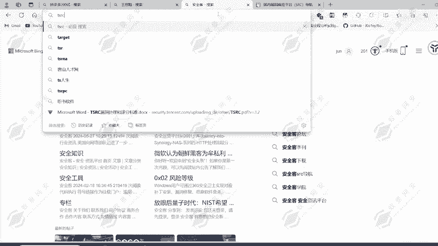

呃，他一年只拿了8万吗？你确定是只拿了8万吗？个1百千万4万的一个贡献值，4乘以5多少？20多万，20多万不包含他的一个业务奖金。

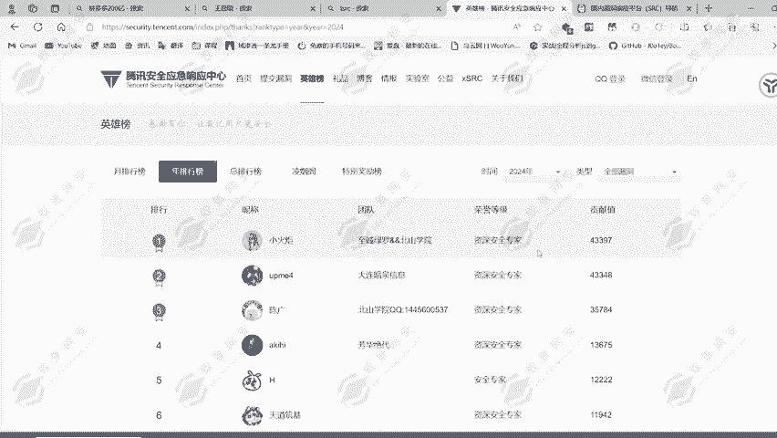

4月即积金奖金2万，3月即日积励奖金3万，2月即日积金奖金2万，3月即基奖金1万，这加上多少了？😡，🤧嗯哼。😊，这里加上来就8万了，这里就8万了，再加上他的一个漏洞奖金多少了？😡。

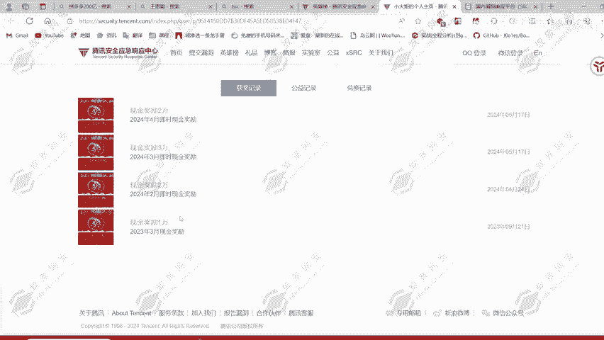

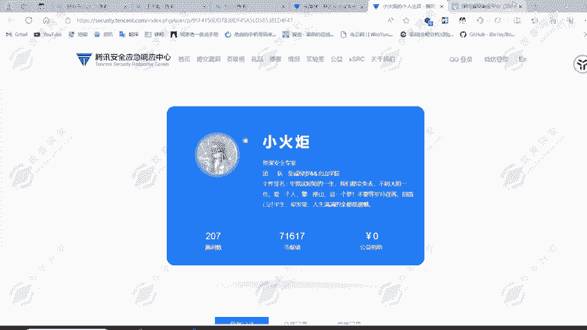

40多万了，你说只有几万块钱吗？你说只有8万块钱吗？不值吧。他在这里呢还只挖了多久啊，5个月的时间赚了多少？40万，平均每个月呢8万，你说的是他一个月挖挖挖了吧。一个月就有8万的一个收入。

所以说啊大家不要觉得啊这种漏洞挖掘呢，不赚钱赚钱，但是要看你怎么去挖，怎么去发现这些漏洞，那你才能够去挖到这一些漏洞赏金，你才能够去挖到这些漏洞赏金。刚才所讲到的这一些平台。

他都能够给到2000以上的一个奖金收入。比如说平安平安的话，他的安全应急响应中心里面所能给到的一个漏洞赏金额度啊。😊。

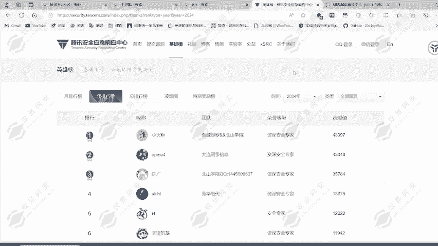

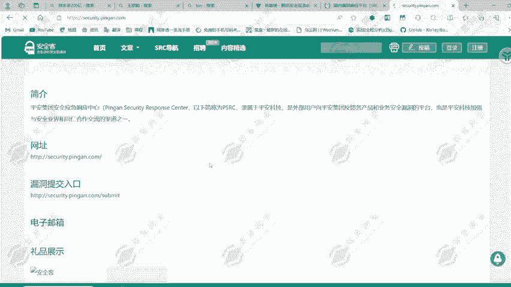

呃，每个月1万的话是最低标准，最低标准。

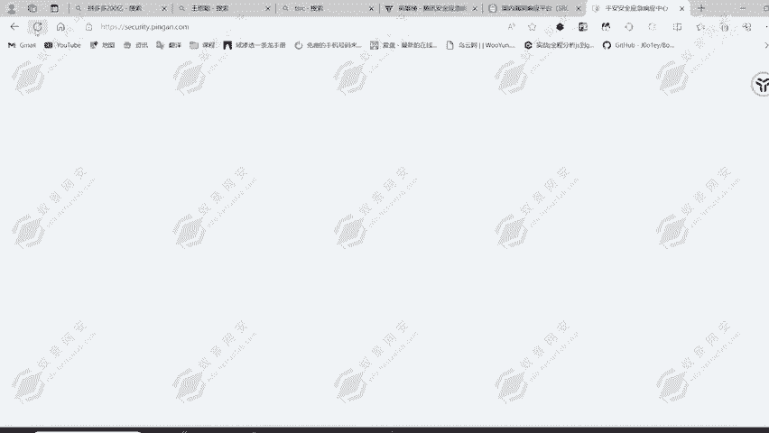

我说的是对于我来说啊，最低标准一个月挖不到1万。😡，死都不会碰SRC了。

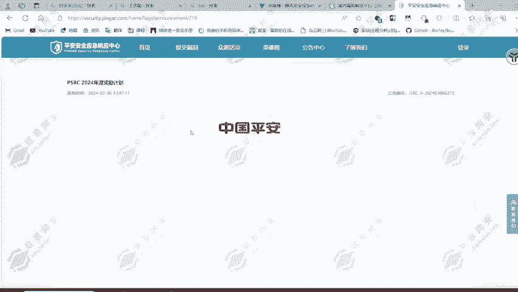

嗯哼。这是平安的一个。平台啊，然后在平安平台上面呢，它的一个公告，我找一下它的公告在后面，公告在后面。

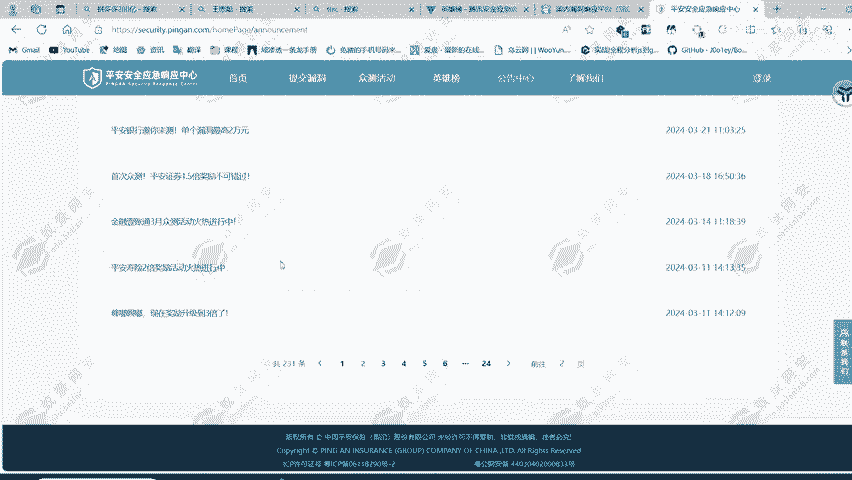

基本上呢我可以这么告诉大家，在平安上面，如果说你发现这样的一个漏洞，是能给到4500以上的一个赏金收入的。4500以上。😊。

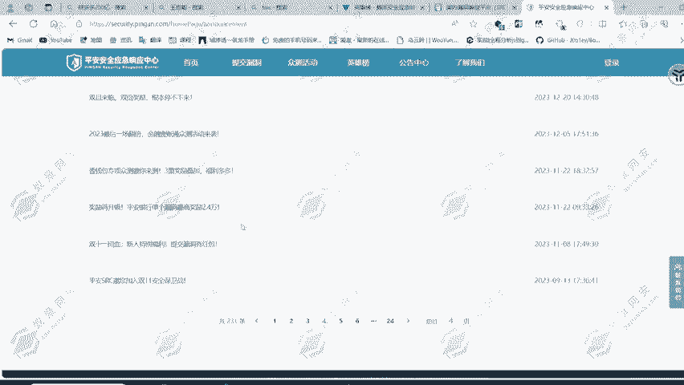

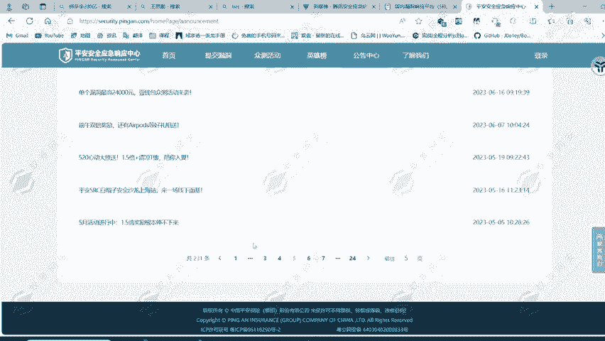

4500以上的一个赏金收入啊。之前呢我在平安这里啊发现了这样的一个漏洞，发现了一个这样的任意密码重置漏洞，给了多少，就是4500，至少都是4500。😊。

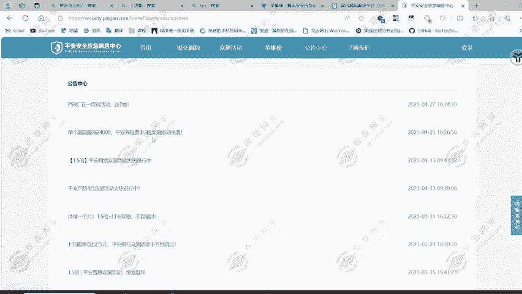

至少都是450的一个收益啊。