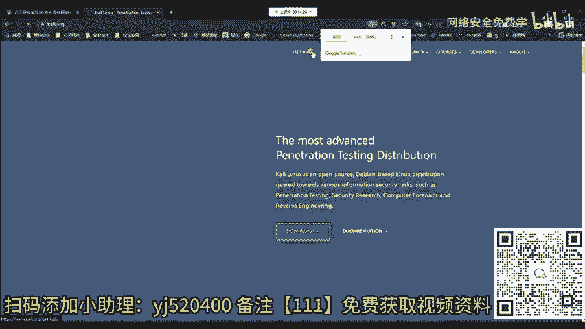
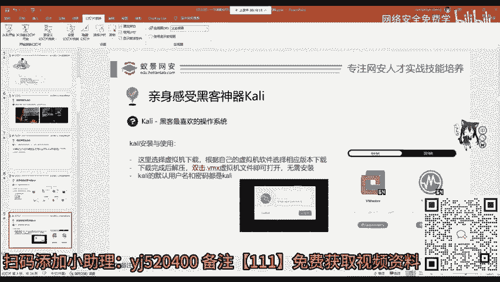
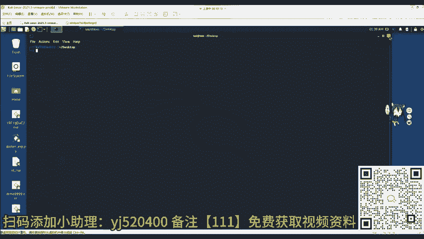
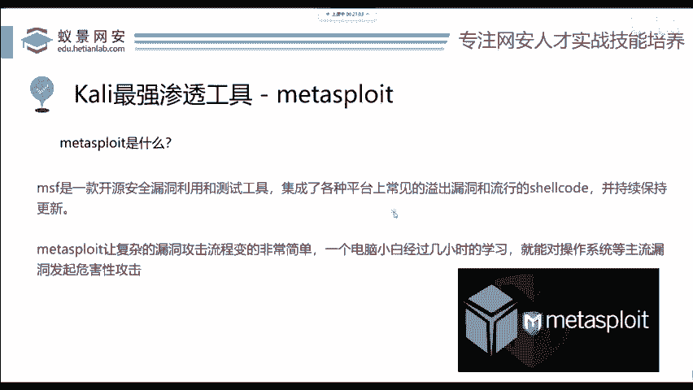

# 2024B站最值得看的黑客教程 ｜ 网络安全／渗透测试／内网渗透／漏洞挖掘／web安全／kali linux／红队靶场／CTF／信息安全 - P86：揭秘黑客攻击机 - 网络安全免费学 - BV1uBsTetEow

我们开始今天的课程。那今天的课程呢首先是最简单的内容，也就是教会大家如何去配置自己的攻积机环境。攻积机环境我们使用的一个操作系统，它的名字叫做卡里。那下面呢就给大家讲解一下卡里到底有哪些版本。

以及我们如何去快速安装一个卡里的平台。给大家访问一下卡里的官网3W卡利点ORG这个网站。稍等一下。我把这个网站复制一下，打开。

那卡利网站呢我们可以点击get卡利就是获取卡利啊。获取卡利之后呢，我们可以看到卡利它针对不同的平台有不同的操作系统版本。比如说针对于CPU操作系统架构IRM架构IRM架构呢。

我们熟悉的比如说像手机像一些移动设备，或者是像最新的基于M oneCPU的macbook pro苹果电脑。那这些呢它都是属于IRM架构。那今天呢我们要使用的叫做vi machines，就是虚拟机版本。

这个虚拟版本是不需要进行任何安装操作的因为卡利的官方人员已经帮助你安装好了。你只需要下载打开去用就行。

第三个呢，大家比较熟悉的像mobile而是移动端，移动端呢可以安装在手机上面。但是请注意，大家千万不要拿着自己的啊像华为、小米或者是一些oppo手机去测试。那这些手机呢因为是没有办法解锁的。

所以说没有办法去刷入第三方的这个操作系统，就包括我们的卡利。如果你想测试的话，你可以选择相应的像一些呃比如说一加手机谷歌的pixel或者是ssung三星手机啊，都能够去安装这些啊。不过如果你感兴趣的话。

网上可以找到很多教程。那下面的呢比如说针对于云服务的，或者是一些容器，针对U盘的启动盘。还有针对我们windows的linux子系统的WSL版本的卡里是应有尽有。如果感兴趣的同学。

大家可以大胆的点击下去，并且浏览它官方的文档告诉你。怎么下载？我们可以看到呢？WSL版本呢是直接到micsoft的 store，就是微软的商店里面啊，就可以把它下载下来是非常方便。

但是这个下载方式对于新手来说是非常不友好的。除非你现在就知道WSL是什么，并且知道它怎么用，以及知道它的原理，否则你不要用这种方式安装，我们要选择虚拟机VMVM那这边呢提供了两个虚拟机的版本。

一个是VM word，一个是vibox。这两个虚拟版本都是呃使用度最高的两个虚拟机软件。比如说我们今天使用的VM word，你就直接点击这里的下载。下载之后啊，大概2。4G的一个压缩包。

我们下载完成之后呢，将压缩包解压，你就会看到一个为后缀明为点VMX的这个虚拟机文件。现在你要做的只是双击把它打开，就可以导入到VMor works station里面直接去使用了。但是请大家注意。

你在安装卡里之前，请务必保证自己电脑上面已经安装了VM wordVMor的安装方式在之前课程中是有的。因为大部分同学呢对这个方向也都知道，并且它的安装方式和普通安装软件是一模一样的啊。

直接点击下一步选择相应的安装位置即可。所以说呢老师将它从课程中移除了，大家如果不清楚的话，可以打开百度搜索VM word安装即可看到相应的教程。双击VMX把虚拟机文件打开之后。

你看到的就是我屏幕上面的截图这样一个登录页面。在最新版本的卡利中登录的默认用户名和密码都是四个字母。卡里KILR啊这四个字母。我们现在呢只需要打开你的虚拟机，然后将它登录就行。

我现在呢想把它登出一下log out把它登出。

那你默认的呢看的就是这样一个页面。啊，我们输入这个用户名，卡里以及密码卡里即可进行一个登录操作。那在这个地方呢，我们在登录之后，请大家注意这里卡利中有一个图形化界面，就和你平常使用操作系统一样。

那第二个呢就是卡里的命令行是下拉菜单的第六个选项，这个叫做min打开它的第二种方法呢是在桌面上右键点击open terminal here，也能够打开命令行终端。

那学过linux的同学都知道linux主要是针对shall，也就是这个命令行终端来进行操作。那卡利呢为了提供方面，在这边呢也有一个应用列表applications。

在这里我们可以发现卡利中内含的300多个工具，就包含我们渗透测试的整个过程以及漏洞攻击逆向工程软件分析密码攻击秀探网络协议攻击的各种工具。那这些工具怎么去学习呢？先给大家讲百分之。

80以上你都用不到。用到哪里，你再去搜索哪个工具去使用就行了。如果你懒得去搜索，那咖利呢他也提供了一个官方的toth网站。我给大家呢简单看一下。就是卡里的工具使用大全，它的一个网址是3W咖利点ORG。

后面跟上工具的英语ts就能够打开它了。打开它之后，我们可以看到这里面是卡里所有工具的使用方法。但是呢你千万不要去学习啊，这没有用的，要提高效率。我用到哪了，再去学哪一个。啊。

因为漏洞工具以及这个编程语言你是学不完的，技术是永远学不完的。你怎么去做到这些渗透测试呢？啊，就是要学习一个工具，举一反三。你要知道任何工具，任何漏洞，它产生的原理，以及呢啊工具开发者的开发标准和思路。

基本上都是一样的那今天呢就先给大家讲卡里中一个非常重要的工具，也是你面试任何渗透测试岗位安全服务岗位，都需要你熟练精通的一个工具叫做matpir，简称MSF。

