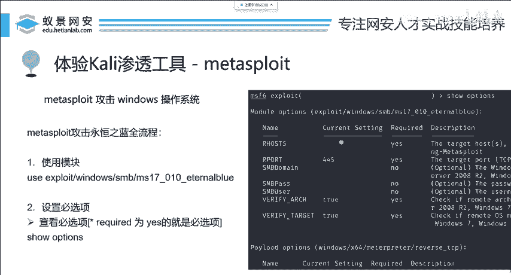
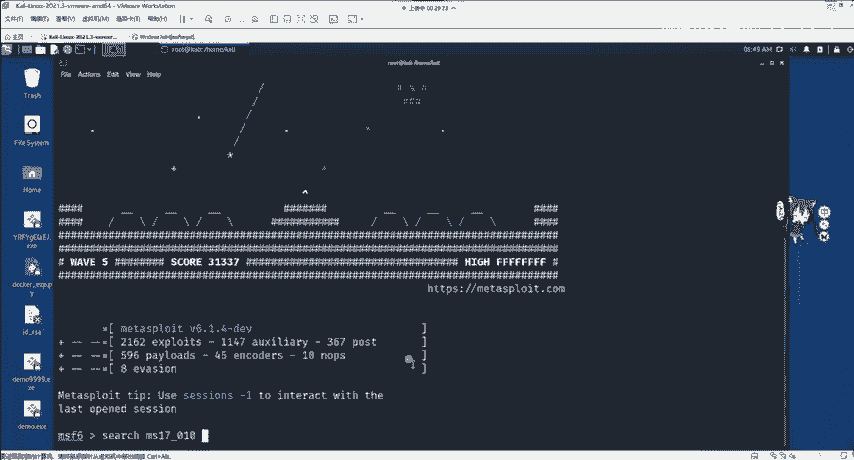
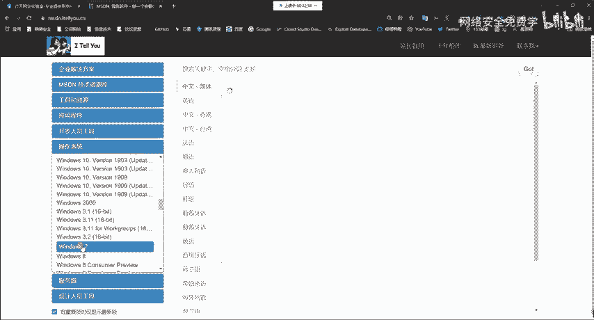
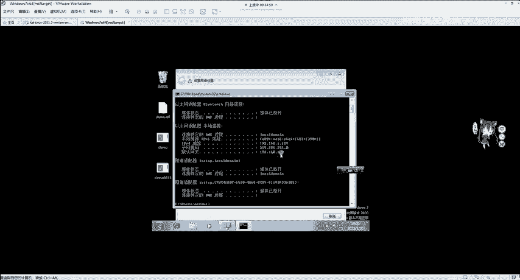
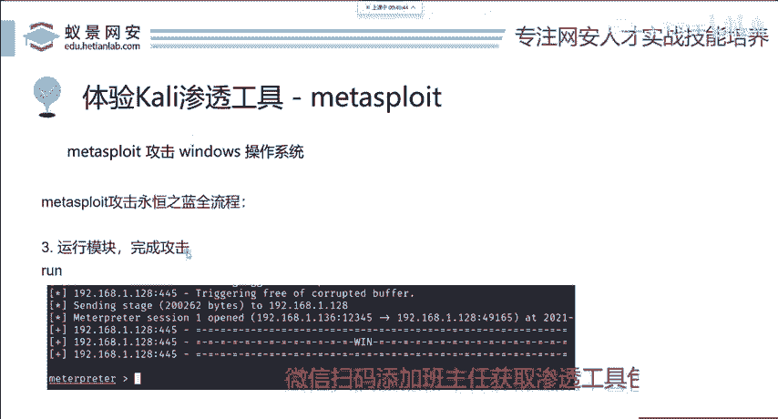
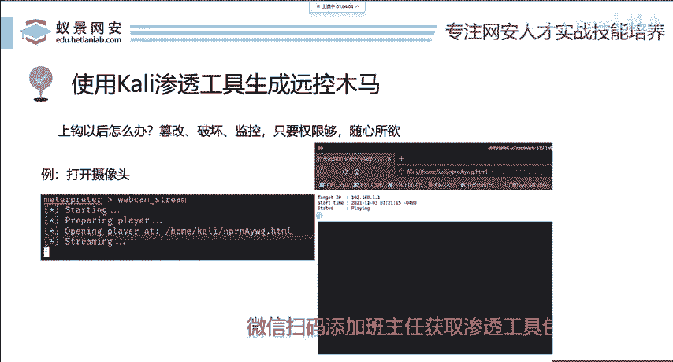

# 2024B站最值得看的黑客教程 ｜ 网络安全／渗透测试／内网渗透／漏洞挖掘／web安全／kali linux／红队靶场／CTF／信息安全 - P88：msf攻击永恒之蓝 - 网络安全免费学 - BV1uBsTetEow

那MSF。就集成了永恒之蓝漏洞的攻击。那首先呢我们在攻击永恒之蓝第一步叫做使用模块。你使用哪一个模块是我们首先要考虑的。MSF中有上千个模块，那哪一个模块可以扫描和攻击永恒之蓝呢啊，这里先给大家提一下。

2017年之前所有的windows操作系统都有这个漏洞啊，叉Pwind2000除外，因为这些系统实在太老了啊，实在太老了，就是比较新的系统，win7win8win102017年之前都有。

所以说呢我们第一步就是要搜索模块，搜索模块啊非常简单，直接se就行。搜索搜索英语 search什么呢？你可以搜索永恒之蓝，或者是搜索这个漏洞的编号。每一个漏洞呢，这个不论是CVE也好。

还是微软官方的microsoft也好，都会己定一个漏洞特定的端号，比如说永恒之然漏洞，就被微软官方列入了windows2017年的第10号漏洞。所以说它的漏洞编号呢叫做MS17010。

有同学说我怎么知道这个是啥，我现在给你讲了，你就知道了。那以后如果出现了新的漏洞，你可以据很多的平台，比如说像推特像get upub，包括微软自己的安全补丁更新文档中都会写出这些漏洞的编号。

包括repeat seven，就是MSF的开发商供应商，也会在其官网上。面更新相应的模块，更新文档，我们只需要呢按着它的更新去做就行了。啊，我这里设置设置之后呢，能够发现有四个模块。

这四个模块分别是干什么的呢？啊，我们不要去读懂它，你要知道后面有一个叫做description描述信息。描述信息中啊都已经给你写的非常清楚了。

从它前面的英语单词，我们也能够简单了解。首先explit攻击利用脚本auxiliary辅助的啊辅助的啊帮助的啊acuxiliary，这个地方呢我们就能看到。首先呢explit是进行漏洞的攻击。

而辅助模块呢就是来检测这个漏洞是否存在。比如说我现在想攻击使用什么使用这个模块使用的方法有两种。第一种是使用，加上这一个模块的前面编号0，这是第一个方法。第二个方法就是使用加上这个模块的全称。

我们把它选中右键copy selection复制粘贴pa selection粘贴到这里。回车也能够达到同样的效果啊，这是使用model使用模块的一个方法。在使用模块之后，我们现在开始第二步。

设置模块设置之前，你首先要知道有哪些设置项，就像你设置手机一样，你要知道手机有亮度调节，有声音大小小调节，有屏幕壁纸调节等等。所以说呢我们这里也要去看怎么去查看当前模块的设置呢。

就使用英语单词查看设置how options。查看设置就行。同样呢你也可以使用它的简称options也是可以的啊也是可以的。那使用options之后，我先把整个的流程走完。

然后再带领大家呢回顾PPT的内容啊，大家呢要呃耐心等待一下啊。O那在这边呢我们可以看到第一个叫做model options就是模块的设置。那这个模块设置中有哪些我们需要关注的呢？

首先这是模块的设置名设置项以及它是否为必须设置的必选项。在后面呢叫做描述信息是告诉你这个设置是干啥的啊，我们来看一下，现在有哪些必选项没有设置呢？明显就是R host而 host它是干啥的？

在后面的描述中，我们能够看到它是指目标的地址targe host就是你要攻击谁我攻击谁呢？我现在想要攻击一台有永恒之南漏洞的信器。这个机器从哪搞啊，从哪找从哪找。

家要知道一个网站叫做MSDNMSDN呢它是windows默认镜像的一个相当于是一个镜像下载的，镜像的下载站，和国内的下载站呢有所不同。它这里面下载的操作系统都是纯净原生的操作系统。

不会有任何的补丁以及捆绑的一些啊，比如说3602345这些叉查软件都没有进行捆绑，可以下载到原生的镜像。那原生的镜像很明显，2017年之前都有应恒之南漏洞。我们只需要选择一个17年之前的版本。

比如说win7。

选择自己想想下载的一个操作系统版本，推荐大家呢下载64位的。因为叉86的32位操作系统现在真的是非常扰了，也没有什么用。所以说我们要选择64位，点击详细信息。

我们可以看到一个叫做ED to p的一个下载链接。那这个链接呢我们可以使用迅雷以及电驴或者是呢啊百度网盘的离线下载进行下载镜像，下载镜像完成之后。

我们需要将这个win7安装至VMwork session虚拟机中。那至于虚拟机怎么安装windows操作系统。我相信啊你打开VM之后，你简单摸索摸索因为VM它本身就是中文的。你好一下就会了。

如果你还是不会百度一搜，成堆的教程还有视频都在等待大家去学习。好，我们设置这里呢为了方便大家演示，我是搭建了一个windows7的一个操作系统。那这个系统呢，它和我们的卡利是在同一个局域网内。

也就是说我们的卡利能够连接至这个把机，请大家注意，你能攻击一个机器前提条件呢，就是你必须能够连接到它，如果你都连接不到了，你攻击它啥呢？是吧？网线都没了啊，我们首先呢要拼P呢就是测试连通性的一个命令。

加上目标的IP地址IP地址，我们可以按住windows加R键，然后打开CMD，也就是comend命令行，打开windows的命令提示符输入命令IPfi，然后查看本地连接以太网的IP地址。

以太网呢就是我们插的这个网线啊，它就是以太网。IP地址是192。168。1。129。我们现在。

P192。168。1。129。能够通能通之后，我们现在啊就可以去设置这个IP地址为目标了。怎么设置set setet谁set our host。当然你也可以手敲为水为192。168。1。

129这样一台windows7机器设置完成之后啊，我们可以再次查看配置。谈完配置。你现在会发现啊这个model options就是模块设置中，所有的必选项啊都已经完成了相关设置。我们在接下来继续往下看。

下面呢有一个叫做拍 load options。拍 load的中文意思叫做攻击载合，也就是整个攻击流程的核心，起到实际作用的东西。如果你听不懂的话，不没有关系，因为在MSF的最新版。

它会将拍load的攻击仔和攻击核心默认设置为windows64位版本的反弹TCP方式的matepre。这个piload是对的。如果你是其他版本，更早的MSF，它默认的拍load是不对的。

我们需要进行设置，怎么设置set拍 load，然后为这个windows叉64啊，买只设置下来就行了啊。因为它现在啊已经默认是好的，所以说我们就不去多此一举了。设置完piload之后。

我们下面看piload里面的参数。拍lo中有两个非常重要的参数，一个叫做l host监听的地址。这里的监听地址呢是我们本地的接口，也就是卡里的IP地址。在MSF中呢，它会做自动填充。

当然我们也可以输入IF configurefi去看我们当前卡利的这1个IP地址。看它的ETH0ETH0呢就是以太网的意思啊，我们在这边呢能够看到192。168。1。136。

跟刚刚show options看到的这个是一模一样的啊，我们就不去配置它了。下面一个叫做lason port airportport。这个lason port呢代表TCP的逻辑端口。

它的范围是0到655356万多个端口你随便选，只要它没有被占用即可，我们可以随意更改。比如说改成6万port。6万就行了。现在再输options看一下，你会发现所有的设置都已经准备充分，万事俱备。

下面啊就可以执行第三步叫做run啊 rock rock，就是攻击，把这个模块呢运行起来。现在我们只需要耐心的等待这一个拍漏就是攻击载合打出去获取到目标机器的权限即可了。攻击自己电脑。

攻击虚拟机没有坏处啊，但是大家不要攻击自己的电脑。因为永恒之蓝，它为什么叫永恒之蓝？它容易把你的电脑啊它蓝屏，并且呢win10以及win11是没有这个漏洞的，请大家注意。在攻击完成之后啊。

我们就能够看到一个东西啊叫做mettter printer。这个mettter printer是啥？mettter printer。是。MSF的开发者写的一个名字。它叫做MSF在攻击完成之后。

得到目标受害者机器的一个后渗透的权限。哎，这这个名字啊是开发者给他起的。以后大家如果能开发出自己的漏洞攻击工具，你也可以给它起一个名字。所以说这里我们只要记住它就行了，叫做matepre。

你看到matpre之后，就代表你已经攻击成功了啊，攻击成功了。现在回顾PPT三步走。第一个使用模块就是use。第二个s options，查看B选项，并对相应的B选项呢进行设置。

设置的选项呢有our host，就是你要攻击谁以及pa load攻击起到实际作用的核心改合。下面呢是设置必选项laon host，就是代表IP地址。

就是卡里的IP地址以及lason port这个端口端口情况。然后run运行模块完成相应的攻击操作，就可以去攻击这个漏洞了。那现在呢在学习完永恒之战漏洞之后，大家能否做到举一反三呢？

比如说针对android的漏洞，或者是比如说明年之后哎，微软又爆出来一个漏洞，叫做MS23010啊，大家还会不会攻击呢？我相信每一个同学啊都会攻击都会攻击。因为mateax split。

它作为一个集成的工具，它不论是开发还是使用，都是遵循一定的逻辑规律的，它不可能一个漏洞，一个模样啊，这样的话大家也不会去使用它呢，我也不会教你了，太难用了，就是因为它好用，所以说我们才去学习它。

它的用户才如此的广泛。

来解答。

