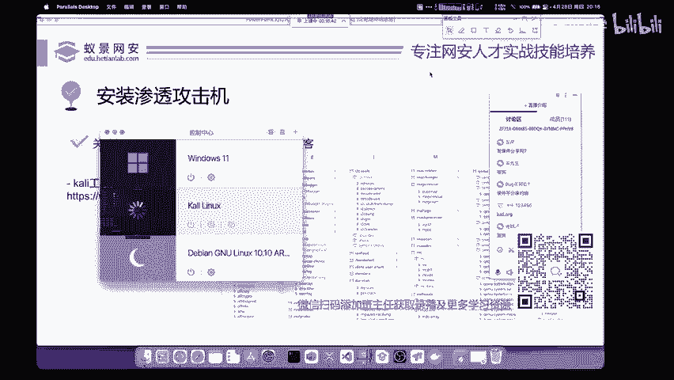
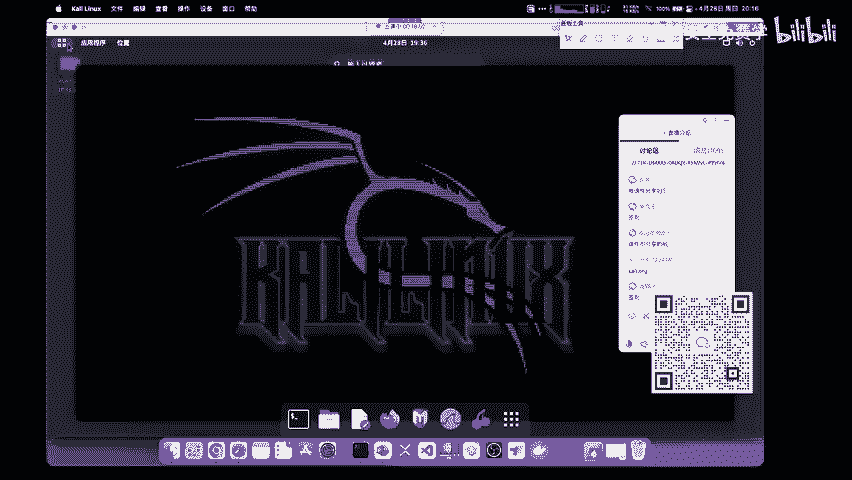
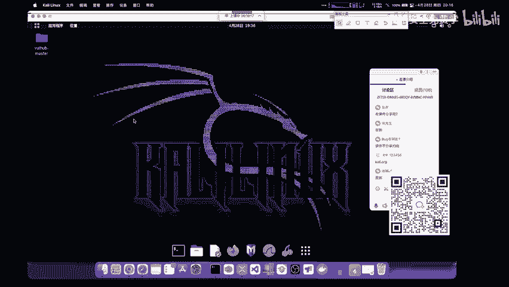
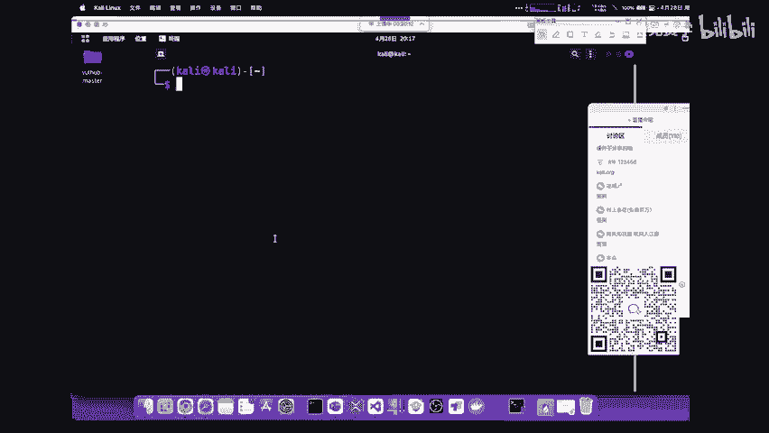

# 2024B站最值得看的黑客教程 ｜ 网络安全／渗透测试／内网渗透／漏洞挖掘／web安全／kali linux／红队靶场／CTF／信息安全 - P8：安装渗透攻击机 - 网络安全免费学 - BV1uBsTetEow

我们下面就来去看安装虚拟机应该怎么去安装。首先呢我们想要去攻击网站，你首先就是要有相关的工具当一个脚本小子。脚本小子呢在大家的眼里可能是一个贬义词。但是我觉得呢并不是的，因为你不论做什么。

首先你得会用是吧？你要先把应用这个东西做好。如果你连别人的工具，别人的脚本都用不好，你又谈何而来的创造呢？就像大家去这些各大的厂商去做手机一样，那首先不也是模仿别人吗？把别人的用好去研究别人怎么做的。

然后自己有相关的实力和经验之后，再来去做创造性的东西。所以说我们首先要掌握一个在所有安全人员中都要使用的这个操作系统，叫做卡利。卡利呢大家应该都听说过，它是一个linux操作系统。

那linux呢它和我们平常使用的windows操作系统啊，有一个很大的区别，就是它是基于命令行的命令行，对于小白来说，大家学起来都非常的头疼。那因为呢它并不符合我们平常的使用习惯。

那其实命令行使用起来是非常高效的，它的效率要比图形化，就是你鼠标点来点去要高非常多。我们要逐渐的学习和习惯。卡里他这个linux是安装了我们几乎所有的啊这个渗透测试工具。

虽然这些工具呢我们大部分在国内都用不到，但是还是这句话，你把能用到的，你学会也就已经是最牛的人了，你还能都会吗？我还是按照昨天来说，你学英语，你没有必要把牛津词典全部背诵完。你只需要学重点就行了。

根据自己的需求去学就完事。那下面呢我们来看一下卡里怎么去下载。首先第一步就是你安装完VM之后，我们可以去访问卡里的官网，就是卡里点ORG啊，卡里点ORG这样一个啊这样一个网站，这个网站访问之后呢。

在网站的左上角有个叫做get卡里获取卡里的地方，我们点击之后啊就可以来到卡里的下载页面。在下载页面中，我们可以看到。不是各样的版本。那针对于VMO，我们要下载哪一个呢？请大家注意。

其实卡里你是不需要自己去安装的。在网上很多的教程，他都会教你一步一步的去安装卡里为卡里配置用户，为卡里配置内存等等。这些其实我们都可以省略，因为卡里它就是便捷易用的一个操作系统。在它的官网中呢。

有一个叫做viual motion的这个选项，我们可以点击它。点击它之后呢，我们就可以看到我们熟悉的两个软件图标，分别是我们刚刚所讲的VMO workstation。

另外一个呢是一个轻量级免费的虚拟机软件叫做viualbox。大家如果在大学里面涉及到虚拟机的话，一般使用的都是viualbox，为什么呢？因为它免费，而VMO呢是一个商业级的应用软件。

在一般的大学教程里是不会涉及到的。因为大学老师一般情况下不会用这些盗版软件去进行教学。啊，我们这个VMO因为我们现在啊VMO要好用很多，我们直接下载就行。点击它左下角的这个下载按钮，把它下载下来之后。

是一个压缩包。我们首先呢要把这个压缩包解压出来。解压出来之后，大家可以在解压之后的文件中看到一个叫做点VMX的一个文件内容。在PPT上面呢，大家可以看到它呀。

这个卡里2021点4AVMO杠MMD64点VMX后缀的这个文件。点VMX文件呢，又被称作为VMO配置文件。我们只需要减压之后，双击这个点VMX的文件。

就可以直接将卡里导入至我们在上一步安装好的VM workstation pro是不需要进行额外的安装操作的，并且非常方便我们使用。有同学呢经常会问卡里啊到底给几个GB才能用。我可你说呢。

按照我们默认的2个GB其实就足够了。如果你给它更多的拓展，当然是越多越好，4个GB8个GB都是可以的但是我们日常使用的卡里啊就使用这么多软件，你给他分配8GB以上的内存。

那很明显是高射炮打文字大采小用了。因为很多情况下，我们是用不到它的啊，我们来看一下卡里的安装以及它的相关使用。那在安装完成之后呢，我们就可以登录到卡利里面去进行一个相关的渗透测试了。

我现在呢打开导师自己的卡利虚拟机给大家看一下。哎，我们打开卡利。

好，打开卡利之后呢，我们看到的就是这样一个简单的页面哈，我先把之前的关掉啊，就是这个卡利的简单页面。那大家呢可能看到的这个页面和老师稍微有一点不一样。但是没关系。

因为我们的卡利是可以自己更改桌面或者是配置相应的主题的这个东西啊，你是不要担担心和在意的。我们在打开卡利之后呢，基本上所有的操作都是在一个叫做terminal终端的地方来进行进来进行操作的。

就是我们的这个terminal这个termin。哎，这个时候呢，我们就把卡利进行了完整的安装。卡利里面内置了非常多的工具。那这些工具应该如何去使用呢？第一种方法，你可以跟着老师的脚步，在渗透测试的时候。

用到哪些就是学习哪些把这个渗透测试的整个流程和思路打通，就可以完成我们卡利的。

学习这一点是非常重要的。大家参加过面试的同学应该知道，很多的面试官第一件事就是问你，当你拿到一个网站，或者是当你拿到一个目标，你应该如何进行渗透测试，或者是问你如何进行漏洞挖掘。这一点的表述是非常重要。

它就在于你平常应该如何去学习如何去攻击相应的靶场。OK那下面呢我们就继续来讲靶场的一个搭建。

