# 2024B站最值得看的黑客教程 ｜ 网络安全／渗透测试／内网渗透／漏洞挖掘／web安全／kali linux／红队靶场／CTF／信息安全 - P91：网站的暴力破解 - 网络安全免费学 - BV1uBsTetEow

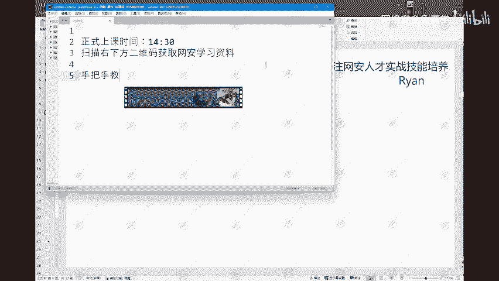

爆破。网站账号和密码。

那么这边首先第一个知识点就是什么是暴力破解？这个其实现在有很多啊，我看各个短视频平台上也有像一些爆破网站的账号密码，一些爆破压缩包的密码等等啊，以及一些暴力破解wifi的等等啊。

都是差不多同样的一个道理啊。那么暴力破解呢，它其实就是使用。暴力的方式。进行。

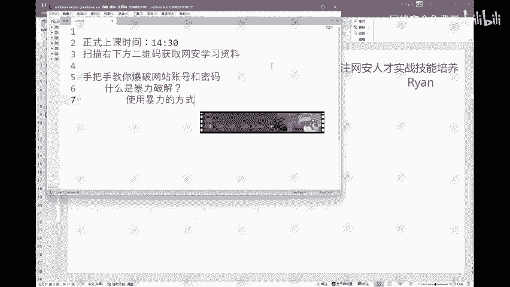

用户名。或密码。的破解。也就是说，通过反复试错。的方式。通过反复试错的方式来尝试破解用户名或密码。那么这个反复试错呢也非常好理解啊，就是比如说我们拿到一个网站的登录页面。

那么我们不知道它的一个用户名和密码。这个时候如果说我们可以去网上找一些现有的像网上现在有很多这种一些字典。利用这些字典，我们可以一个一个去尝试，对吧？比如说像一些admin。admin。

然后什么root。

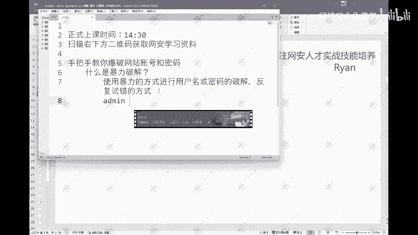

root对吧？还有什么admin。password这样的一些弱口令啊，我们可以通过这样的一些弱口令去进行一个尝试，看一下能不能够登录成功，这样就叫做反复试错啊。第一个不行是第二个第二个不行是第三个。

第三个不行，是第四个，一直试试到能够成功为止。这就叫做反复试错啊。那么这样的话，如果说我们是单纯的依靠我们人自己去做这样的一个事情。那么这个肯定是要花费很多的一个时间啊。

所以呢后面我们也会给大家讲到使用一个工具来快速的帮我们进行这样的一个暴力破解。啊，那么这个就是我们暴力破解的一个概念啊。那么我们为什么要进行暴力破解？为什么啊？首先最重要的。最终的目的。

最终的目的就是获取用户名。和密码。那么当然啊这个东西来获取用户名网站的一个用户名和密码方式有很多啊，除了我们的一个暴力破解之外。像其他的一些，比如说通过CirQ注入漏洞，拿到数据库的一个账号和密码。

以及说通过一些数据监听啊，钓鱼网站获取键盘记录等等这样的一些方式都是可以获得账号和密码的。那么这边就是我们拿到这样的一个网站的用户名和密码之后。那么我们就要区分它的一个权限。

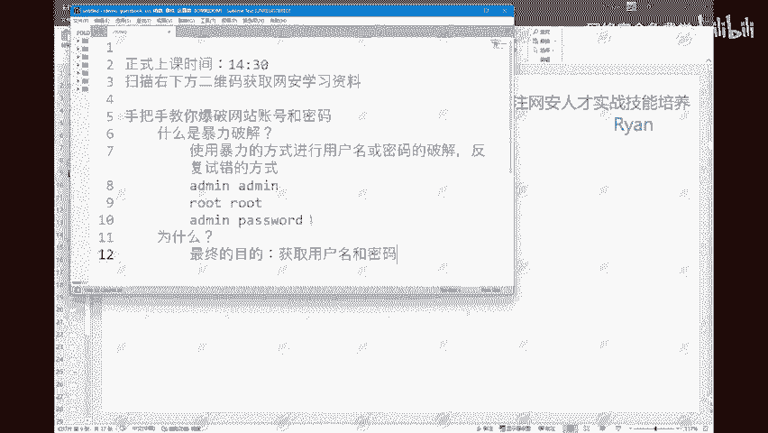

那么在这里呢就要给大家讲一下我们网站的一个权限划分。

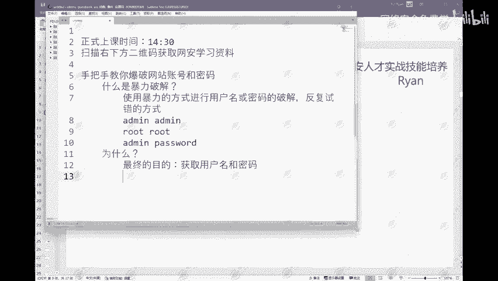

这边目前主流的一个权限划分啊，可以分为。

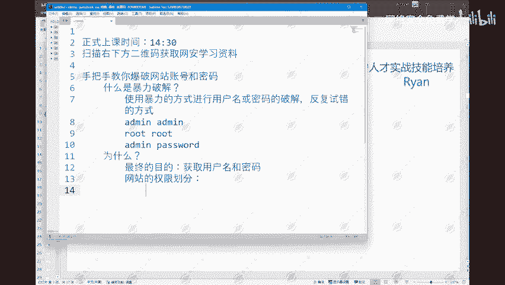

超级管理员。然后是我们的一个普通的管理员，然后像我们一些VIP用户，以及说我们的一个普通用户。以及游客。嗯，那么这个其实像这边可以给大家看一下啊。

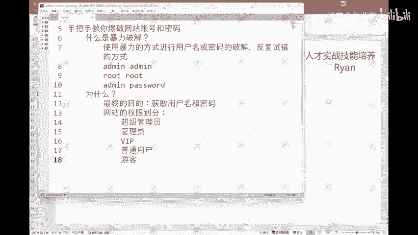

比如说我们这边打开一个我们核天丸实验室。

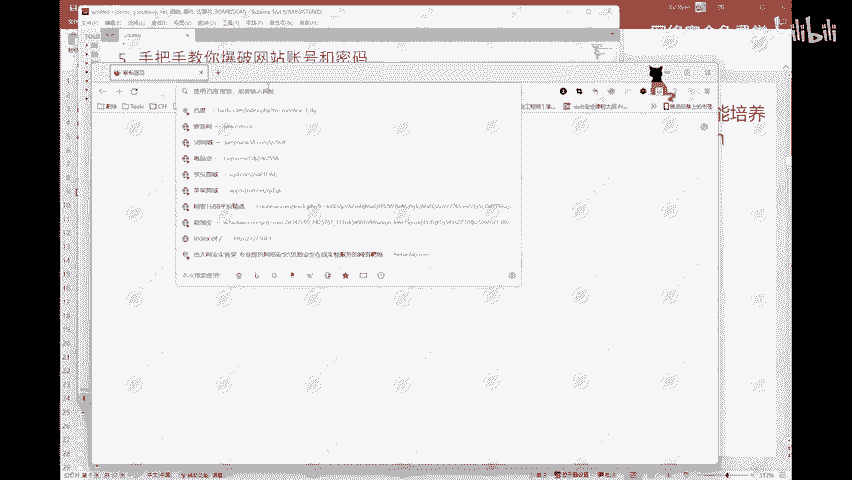

啊，像这里在我们没有登录的情况下，就相当于是一个游客啊，那么就是只能通过一些最基本的一个功能啊，像只能在这边进行一个查看。

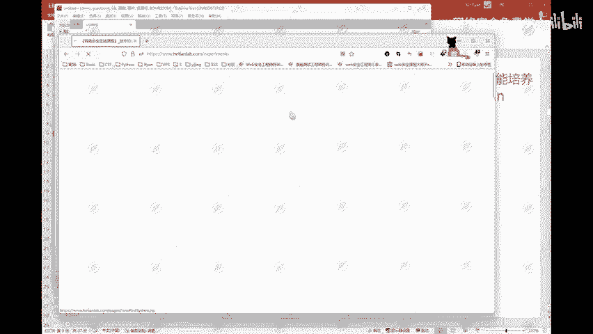

对吧，比如说这边查看一下这个在线实验，目前呢是有1500多个实验，这个这个就是游客用户啊。那么当我们在登录的时候，那么这边登录的时候呢，就分为啊这个是我们的一个VIP用户啊，VIP用户。

以及说还有一个账号，是我们的一个管理员啊，就是。相当于是我们的一个管理员样管理员账号啊，这边VIP用户登录之后。那么这边会显示，当然以及说这里需要1个VIP才能够做的实验。我这个VIP用户是可以做的。

那么如果说你是一个普通用户，那么这一些带VIP字样的这些实验，你普通用户是做不了的。那么如果说我是一个管理员。那么我可以在这边添加一个课程啊，一个教师账号，添加课程，布置作业，布置实验。

那么如果说我是管理员、超级管理员，我可以对这些实验进行编辑，可以把这些实验上架下架等等这样的一些操作啊，那么这个就是不同的用户权限对应着不同的功能。这是这个东西啊，网站的一个权限划分。

那么像这里如果说我们再拿到一个用户，比如说他是一个普通用户。普通用户他没有1个VIP的权限，他不能够去做这样的1个VIP实验。那么这个时候我们如果说作为1个SRC的挖掘。

那么这个时候我们可以去寻找一下它是不是存在一些逻辑漏洞。像我们的一些越权，水平越权，垂直越权这样的一些漏洞。水平越权。那么水平越权，什么是水平越权和什么是垂直越权。这个东西啊这个东西也很简单，水平越全。

就相当于我们两个都是普通用户。那么比如说A用户。他是一个普通用户啊，我就是A用户，然后我可以水平越权越权成为B用户。我就可以使用B用户的一个身份去进行一些操作。这个叫水平越权。那么垂直越权就是C用户。

他是一个管理员或者说超级管理员。我从A用户越权成为C用户。我从一个普通用户越权成VIP用户或者是管理员用户，超级管理员用户，这样的叫做垂直越权。这是我们如果说拿到的是一个普通用户的一个权限啊。

这样的话呢我们就可以去给他做一个相当于是类似一个提权的操作，把我们普通用户升级成为更高权限的一个用户。啊，这是这样的一个东西啊，这个其实现在也比较好找啊，这样的一个月权漏洞。这是这个。

然后接下来呢就是我们的一个叫做暴力破解的准备工作。

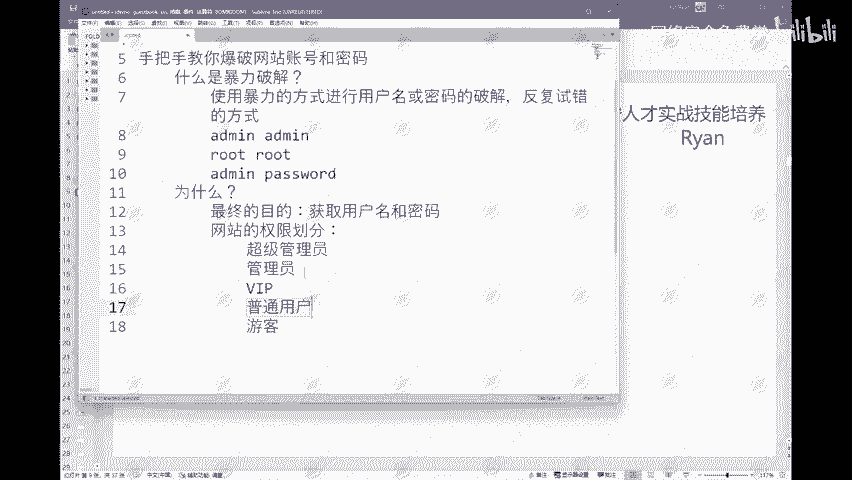

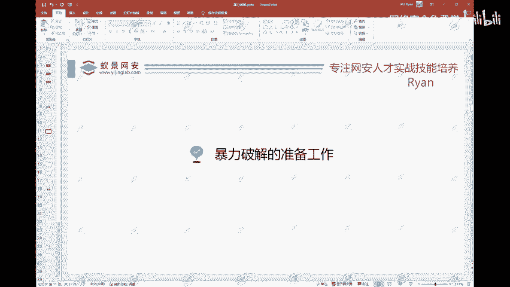