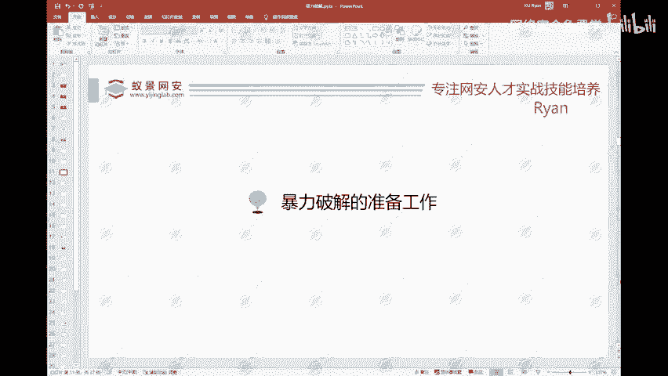
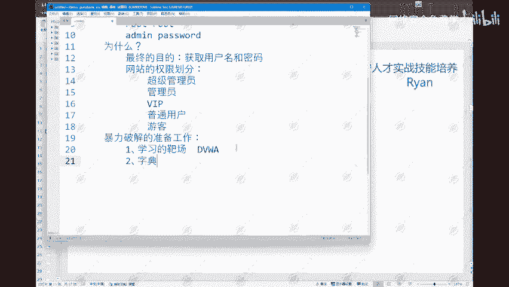

# 2024B站最值得看的黑客教程 ｜ 网络安全／渗透测试／内网渗透／漏洞挖掘／web安全／kali linux／红队靶场／CTF／信息安全 - P92：暴力破解实战、字典和burp - 网络安全免费学 - BV1uBsTetEow

暴力破解需要准备哪一些东西？准备工作啊，那么这边目我们主要首先第一个最重要的一个就是要有一个学习的靶场。啊，那么这个为什么要有一个学习的靶场啊？因为我们是在未授权的一个情况下。没有这样的一个授权。

我们是不能够对公网上的网站。或者是机器发起攻击的，你不能够去，你没有授权，你不能够去对这个网站进行一个非法的测试。这样的话就可能如果说如果说你在网上随便找一个网站，你就去进行一个爆破。

如果你把它的一个网站给它爆破，给他弄崩了啊，搞得他的一个网站的正常业务运行不下去了。那么这个时候如果说网站的管理员溯源到你，那么你就要负相应的法律责任。所以为了避免这样的一个事情。

我们就需要一个学习的靶场。那么其实学习的靶场有很多啊。可以自己搭建。那么我们这边呢像像一些。DVWA靶赏呀等等一些都是可以的。那么我这边呢是使用我自己写的一个小项目啊。

使用我自己写的一个小项目来给大家做演示。当然如果说这个靶场大家没有的话，也是一样的，可以添加我们班主任小姐姐，找班主任小姐姐获取它的一个源码，以及它的一个搭建教程啊都有。这是第一个啊第二个。

就是我们的一个字典啊，这个其实刚刚最开始也给大家讲了啊，这个字典。那么这个字典呢不是我们的一些什么新华字典，牛津字典这样的一个字典啊，这个是不一样的。这里的字典呢，它讲的是什么呢？

是存储了大量的用户名或密码的一个文档。这种东西我们叫它叫做字典啊，那么这一些字典呢，我这边有很多啊。

有很多像这个对吧？1位数字啊，以及说400万常用密码等等这一些入口令及超级字典等等都有。啊，前几天好像我看到是有公布出来，说最近十年还在经常被使用的一些入口令啊。

这些东西呢这些入口令基本上一秒钟不到就能够爆破出来啊。好，这是第二个第二个是字典。那么第三个第三个东西就是我们的一个工具。叫做bb street这样的一个工具啊。这个工具它的一个功能非常强大。

而且这个工具也是我们作为网络安全从业人员，或者说网络安全爱好者必须要掌握的一个工具。这个工具使用频率非常广泛。不管你是做SRC的挖掘还是去参加工作，这个工具是一定要经常会需要使用到的。

所以这个工具的用法大家也是需要掌握的。它这个东西呢除了当然用的最多的还是用它来进行一个抓包数据包啊，抓取数据包，修改数据包进行一个重放，以及说我们的一个暴力破解。也是需要使用到这样的一个工具。啊。

那么这就是我们的一个准备工作啊，准备工作字典。字典有了。然后这边还有一个东西啊，还有一个还有一个东西，我可以给大家看一下啊，一个比较好好玩的东西啊。一个社工的工具。我这边找一下啊。嗯。这个东西啊。

叫做社工密码，社工爆破密码工具啊，这个东西呢它可以我先把这个给删掉啊。这边我们双击这个架包。社工密码生成器啊，这个东西呢就是你可以比如说你拿到了某个人的个人信息，你把他的一个个人信息往这里填上去。

填上去之后，点击这里的发车就可以生成一个专门针对于这一个人的字典啊。比如说我们这边可以试一下啊，比如说这个姓叫张啊，姓姓张。民三。是第三个名名这里呢就没有了。然后出生年2000。出生日期11。

241124。邮箱随便写。然后什么手机号。名字缩写。网址什么。张三电。3W点张三点com有什么网名啊，网名就不写了QQQQ随便写一下。常用密码这个东西你知道就填，不知道就不填啊，都是一样的，知道就填。

不知道就不填特殊年份，对吧？常用字符，以及说这边这个什么配偶信息。那么如果说你知道他男朋友或者女朋友的信息，往这里一填，对吧？或者他的一个配偶，或者跟他关系比较密切的关系比较好的人的信息，填到这里。

填完之后点击发车。它就会提示你密码生成成功啊，然后给它关掉。关掉之后呢，在这边。这里就会生成1个TXT的文档。TST的文档啊，这边我们也可以看一下。对吧这里呢就是专门针对于这一个人的密码。可以看一下啊。

它这边总共生成了228个，228个啊228个。这个东西就是大家需要的话，可以课后找班主任小姐姐获取。然后呢，你也可以把你自己的一个信息填在里面去看一下是不是会生成你自己现在正在使用的某个密码。

这是字典啊，现在这种字典呢其实网上也有很多啊，好找。