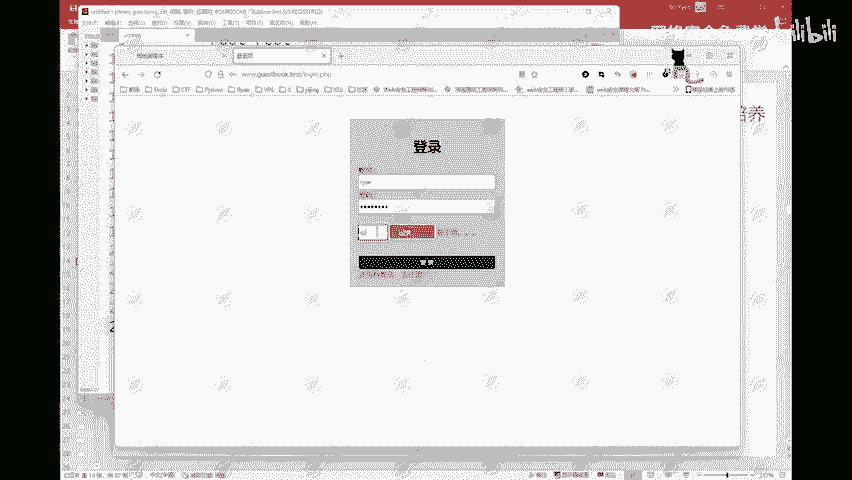
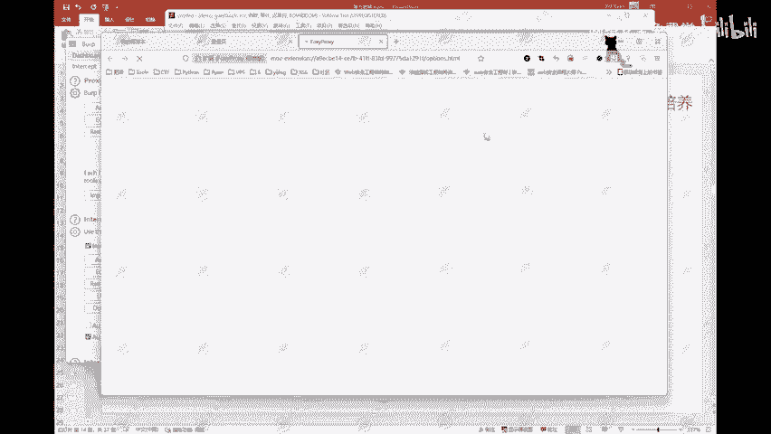
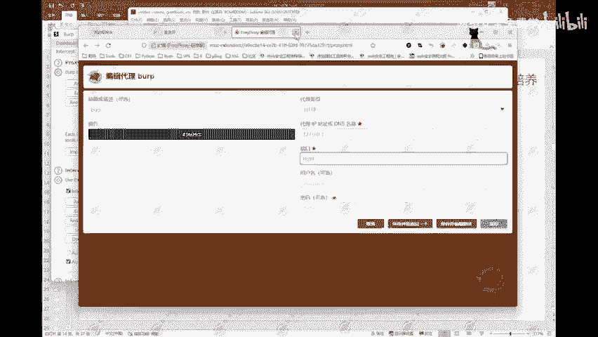
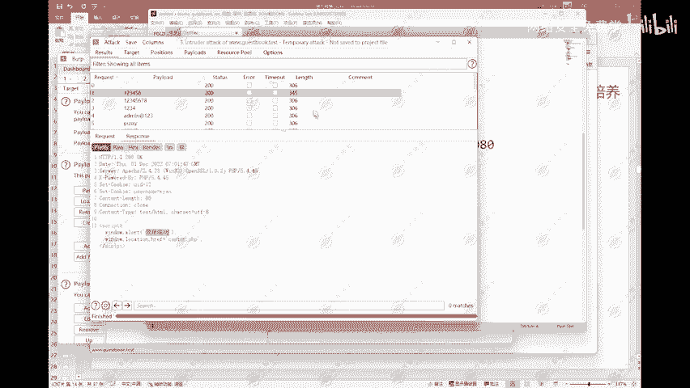

# 2024B站最值得看的黑客教程 ｜ 网络安全／渗透测试／内网渗透／漏洞挖掘／web安全／kali linux／红队靶场／CTF／信息安全 - P93：模式一：狙击手 - 网络安全免费学 - BV1uBsTetEow

如何来进行暴力破解？啊，那么这边就是我们本节课的一个重点。如何进行暴力破解？啊，那么这边首先我先开启一下我的。PGB是大的啊。嗯。好，打开我的PGP拉底启动啊，启动完成。启动完成。

然后访问一下我的这个靶场。好，那么这里就是这样的一个留言本的项目啊，比如说我这边点击登录，哎，就会需要进行一个登录，它也有它的一个验证码，对吧？可以可以换啊，可以换这个验证码也是一样的。

它可以进行一个更改。这就是这样的一个项目啊，然后还有就是我们的1个BP。BP我也给它打开先啊。那么像这边呢，它会进行一个校验啊，比如说我输入一个。addmin啊11111啊，然后再输入这个。UTA。

登录。账号或密码错误，对吧？它会有这样的一个提示。以及说比如说我输入一个，我看一下这个是不是正确的啊，这个密码我自己也不记得了。然后这边。

这边输入一个错误的验证码。哎，它会提示验证码错误啊，说明这个功能还是存在的啊，这个功能是没有问题的。

好，这边。打开我的BP。那么这个使用BOIP进行一个抓包，它也是需要进行一个设置啊。它也是需要进行一个设置的。那么这边首先给大家讲一下这个BORP它的一个工作的过程。给大家画个图。BOIP它的工作过程。

首先这边。这个东西我们叫做。客户端的。浏览器。啊，然后。这边。就是我们的一个服务端。的服务器。网上公网上所有的项目都是部署在它的一个服务器上的。我们通过我们的一个客户端浏览器，对这个服务器进行一个访问。

那么正常情况下。正常情况下，它的一个流程就是客户端的浏览器，向服务端的服务器发送一个请求。发送一个请求。服务端的服务器收到这样的一个请求之后，就会对你的请求进行一个响应啊。

然后给客户端的浏览器返回一个响应，这个是它的一个简化的工作流程啊。那么这里面中间的一些。三次握手，四次挥手，这一些东西这里就不给大家做一个具体的讲解了。大家知道这样简单的知道这样的一个流程啊。

这边就是这样的。那么如果说。比如说就比如说我们客户端的浏览器，你打开你的浏览器，然后输入我们3W点和天。leb点com这样的一个网址。然后这个客户端的浏览器就会向这样的一个网址发送一个请求。然后呢。

像什么DNS就会解析这个网址，然后找到它的1个IP，找到它的一个服务器问告诉他，对吧？然后呢，服务器返回一个响应。所以呢你的一个浏览器上就会显示出和田晚实验室相应的一些信息。

这个就是它的一个简化的工作流程。那么当我们在使用了。使用了BUIRP的时候。这边。这里就是我们的1个BYRP。BUIRP啊使用了这样的一个软件。使用这样的一个软件之后呢。

当然啊我们客户端的浏览器上也需要配置相应的一个代理啊，需要配置一个相应的代理。那么这边当客户端再次发送请求的时候，它就会被我们的1个BUIRP它要经过我们的BUIRP经过BUIP之后再返回给服务器。

再给服务器啊，服务器再给。客户端。那么这边就是我们浏览器发送的请求BURP它会拦截到，拦截到之后，它可以进行一个查看，可以进行一个修改，也可以进行一个丢弃。这个就像小时候传纸条是一样的啊。

小时候传纸条同样的一个道理啊，你要传给别人是吧？自己不好意思直接给你呢需要找个人帮你递一下。那么这个BYP就相当于是你找的另外一个人，你要把你的一个纸条传给其他人，然后找他，那么他拿到你的纸条。

他就可以对你的纸条，把你的纸条拆开看一下，看一下你写了啥，对吧？看完之后呢，他可以原封不动的给这个人，当然他也可以把你的纸条修改一下，把你纸条里面的内容给它改掉，改掉之后再给他。啊。

这是这样的一个简单的一个工作流程。那么这边我们需要设置浏览器的一个代理。首先第一步。设置。浏览器的代理。那么这个代理呢是127。0。0。1。8080。IP地址给它转发到这样的一个。地址加端口。

这个为什么是这样的？因为我们的1个BP。VP它这边默认的是监听127。0。0。18080这个东西啊，所以我们浏览器上也需要配置成这样的一个代理端口才有用啊。就是我这里的这个BYP啊，这边可以看一下。

编辑看一下啊，这里是吧，127。0。0。18080配置这两个东西啊。

然后我这边。开启这个开启啊开启，然后我们这边也可以看一下，在这里这里呢这个on。这个on代表的就是开启监听。开启监听啊。off就代表的是关闭啊，这个off就没有监听了。on就是开启监听。开启监听之后。

我们这边比如说我输入一个re，然后呢密码。然后我们的一个验证码啊，验证码我这里可以随便写。点击登录好，这边这边就已经抓到了我们这样的一个数据包。这里面就是抓到了我们这样的一个数据包啊。

那么这里数据包的内容，po的请求，通过pos的请求传递这样的一个参数啊。然后中间的什么host呀，user agent啊，这些就不给大家一个个去讲了啊。

这边有一个cookiecookie里面这个code就是它的一个验证码。就是这个验证码H5D。然后我这里这里有一个code，这个code就是我填写的这个验证码。那么它就首先它会校验。

这个东西啊是不是一样的？这两个东西相等，那么它就会进行下一步。如果说不相等，那就直接给你返回一个验证码错误啊。比如说我们这边右键发送到重放模块。发送到重放模块啊，我这边发送一下这个请求。

它这边就会显示验证码错误，对吧？那么我这里呢我可以直接改啊，直接改H5。H5D啊，我改一下，然后发送它就变成了账号或密码错误，这个东西就可以直接绕过它的一个验证码的校验。啊，这是我们这样的一个东西啊。

这边继续给大家写一下。这是第一步设置浏览器的代理。第二步。抓包。抓包啊抓包第三步第三步。第二步，抓包。第三步。发送到。爆破模块。我们这里是发送到了重放模块啊，重放模块给大家演示了这个东西。

然后我们也可以右键发送到这个爆破模块啊。这边唉爆破模块，那么发送到爆破模块之后，我们就要给它进行一个设置。设置攻击模式和字段。也就是这边的啊这个target目标，这个我们基本上是不用去管的啊。

不用去管的。因为我们是直接发送过来的，所以这里呢一般是没有问题的。当然你也可以检查一下。啊，我这个3W点gebook点test端口是80端口啊，这个是默认的端口号是80。

对吧3W点guesbook点test，这就是没有问题啊没有问题。然后这边有一个positions啊，这里面呢这里面就是我们需要设置的东西了啊。首先。

大家可以看到这边他是默认选中了这一些这些这些这些这些东西啊。那么这些东西呢我们都不需要啊，它默认选中了这么多，我们直接点击这里的这个clear清除掉，清除掉之后选择我们自己需要的需要爆破的字段。

比如说这边的一个账号和密码啊，那么这边我们就先从最简单的开始给大家讲啊，最简单的就是我们知道他的一个用户名，但是不知道密码。然后这边呢就选中密码这个字段。点击这里的ADD添加这样的一个标记。

这就相当于是我们选中了这样的一个字段。那么我们需要爆破的就是这个位置啊，然后这边有一个攻击的模式啊，攻击模式这里呢有这么4种。那么这四种呢我们会一个一个给大家讲啊，首先第一个。这边。给大家也记一下吧。

攻击模式。首先，第一种。第一种啊第一种我们叫做。狙击手。那么它是干嘛用的啊，我们直接来走一遍啊，这边选择这个攻击模式，然后选中这个字段，然后到这里来啊，这里来这里这里这上面有有一排对吧？第一个tit。

第二个是这个东西，第三个paylo。然后我们第二个设置完了，看一下payloads payload这边。payload set这里只有一个只有一个一啊，只能让你选一个一只有一个一。

因为我们只选择了一个字段，所以这边只有一个一啊，然后这边payload的 type，我们的一个字典的类型，字典的类型啊，这边什么simple list，就是简单的列表。

然后这个什么run time far运行时的文件。然后这个什么自定义迭代器，什么字符替换，什么大小写修改什么递归查找等等等等，什么numbers啊，这一些啊这些。这些东西呢我们这里就不给大家讲啊。

我们这边就只讲一个简单的列表。其他的就是自己用到了就去看一下，很简单啊很简单，这些东西都好，这是这个，然后需要设置我们的一个字典。刚刚给大家讲的准备好的一个字典，需要给它填到这里来啊。

然后这个东西怎么来填，这里直接有一个啊，比如说我们写1个AAAADD唉，它就会添加进去啊，然后BBBADD它也会添加进去，这是这样的一种方式啊，你可以自己一个一个写。当然这样的话呢也太麻烦了。

最简单的啊解除掉啊。然后这里呢有一个load。这个东西就可以加载我们准备好的字典啊，我们这边有1个PWD啊，password点TXT打开它就会默认，它就会自动帮我们添加进去啊。

我们这个TXT文档里面的内容，它就会自动写进来。好，这里呢就已经设置完成了，然后设置这个资源池。那么这个资源池呢，我们基本上是不用去改的，这边呢是。相当于是可以调它的一个线程，你呢可以调高调高的话呢。

它的一个爆破的一个速度就会更快啊。这边我们但是我们一般不会去调啊，一般不去调。然后这边这个。这个东西呢也不用去改啊。我们直接点击这里的一个开始攻击。点。好，这边他就会进行一个处理。

那么这边呢有一个finished啊，finished这边还是很快的啊，一下子就finished就完成了。完成了之后这边有一排这样的一个东西啊，有一排这样的一个东西。那么这里我们就需要。进行一个处理啊。

我们怎么来找到我们所需要的东西？这边设置。设置完成之后，第五步。设置字段处理。就是我们的一个payload啊，paylo这个东西也设置完了，就直接开始。第六步。开始攻击。开始攻击，然后攻击完成之后。

攻击完成之后，怎么来怎么来判断哪一个是我们所需要的啊，这边有20个请求，对吧？那么哪一个是我们所需要的呢？这里其实大家也可以看一下，看一下这边哪里有没有什么不一样的地方。啊。

大家也可以先看一下这边是否有一些不一样的地方。啊，那么像这边我们也可以直接看一下啊。点击这边我们可以直接点这个Ls啊。当然这边因为数据比较少，我们可以直接看得到这里有1个345，其他的什么306306。

唉，这里也有1个345对吧？然后306306306，就是这一些东西，我们可以直接看到两个不一样的，这里有1个345，我们拉拉起来看一下它的一个请求啊。request请求看一下它的一个请求。

user name是rean password123456。然后看一下它的一个响应response，响应登录成功，登录成功。

然后还有一个还有1个33345345对吧？这个我们也可以看一下，哎，这里也是real。然后呢，rean123rean艾123。然后这边的一个响应也是登录成功。啊，至于这个为什么我们这里一个账户。

一个用户名，他搞了两个。这个东西呢就是我的一个代码写的不严谨啊。代码写的不严谨，所以呢它这里就会出现这样的一个事情啊。这边这个响应大家也可以看一下，这里user name real。啊。

我们这个123456啊，这个rean，然后再看一下我们这个。这个这个rean它是大写的啊。这个R是大写，然后前面这个呢R是小写。就是这两个东西啊，这样的话呢就说明我们就已经能够找到了。

已经能够找到他的一个用户名和密码了，它的一个密码就已经被爆破出来了。然后我们关掉啊，这是第一种模式。第一种模式叫做狙击手。狙击手呢就是破解一个字段。比如。密码。图形验证码。然后像什么短信验证码。

这些东西啊这些东西都是可以进行一个使用我们这个攻击模式进行一个处理的。那么这是第一种模式，狙击手。那么第二种模式啊，第二种模式我们回到这里来啊，第二种模式。叫做工程锤。然后这个英文我就不写了啊。

