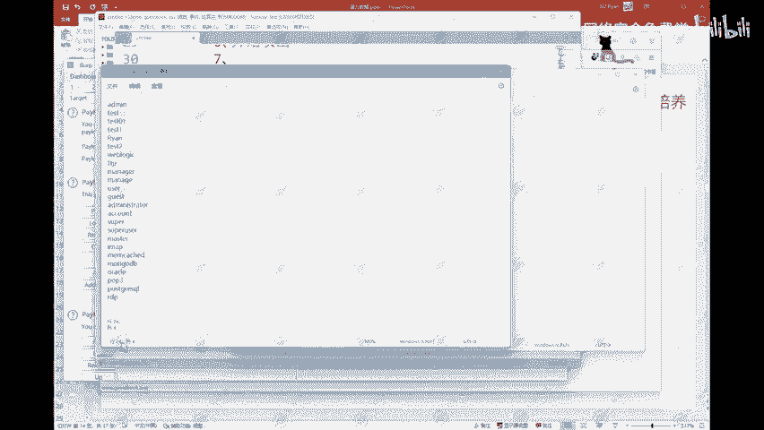

# 2024B站最值得看的黑客教程 ｜ 网络安全／渗透测试／内网渗透／漏洞挖掘／web安全／kali linux／红队靶场／CTF／信息安全 - P95：模式三：草叉 - 网络安全免费学 - BV1uBsTetEow

那么第三种模式呢，它叫做。草叉。第三种模式啊。好，我们这边看一下第三种模式。第三种模式叫做草叉。那么这里我们还是一样的选中这两个字段，选中这两个字段啊。

然后点击这个payloads这边唉大家可以看到这里呢它就有两个了，这里它就有两个了啊。然后这个一这个一代表的就是我们这里的第一个字段，一代表的就是我们这里的第一个字段，二代表的就是这个第二个字段。

所以我们这里的这个字典需要改一下啊。一。对吧这里呢我们是需要我们的一个用户名，因为这个一呢是user name，所以呢需要我们的一个用户名字典也是一样的。点击这里的load。

加载一下我们这个UZ name点THT啊，打开它会直接加载进来啊，加载进来之后选择2选择二，然后加载我们的一个密码字典。加载我们的密码字典。好，这两个东西加载完成之后。给大家提个问题。几个问题啊。

然后呢，这边先给大家看一下我们这两个。这两个字典。嗯。一个是有珍林。

一个是password。首先，user nameuser name它有24个，user name有24个。

password有20个。You在 name。24个。password。20个。那么这边他总共。会。发起。多少次？请求。这边大家也可以想一下啊，总共会发起多少次请求。大家可以想一下。

那么这个其实也比较简单啊。其实这里啊这里呢。总共只会发起20次请求啊。总共只会发起20次请求。这边可以给大家看一下啊，我们就把把这个先留着吧。好，我们这边直接点击开始攻击。看一下他总共多少次啊。好。

总共呢只有20次。为什么只有20次啊为什么只有20次？因为它这种模式。他这种模式给大家解释一下，这种模式叫做有几几个参数。就需要设置。几个。字典。而且。而且会。按顺序。会按顺序匹配。

什么叫做按顺序匹配啊？什么叫做按顺序匹配。我们这边给大家看一下这个对比一下啊。好，我们这里这个ad me。Add me。然后我们的一个密码字典。这是密码字典啊，我们的一个用户名。用户名字典ad me。

密码字典。拉过来啊拿过来。admin123456admin123456test12345678test12345678。test一。1234task011234test011234是吧？

task1admin123test1addmin123，它就会按照这个东西给它一个一个一个一个一个来进行一个匹配。那么匹配到最后匹配到最后这里20个。匹配完了，后面这4个，这里没有内容跟它进行一个匹配。

没有内容跟他进行一个匹配。那么这后面这4个他就直接舍弃掉，就直接不要了。直接不要了啊，所以呢他总共只发起20次请求啊，只发起20次请求。这是这种模式的一个特点。总共发起。20次。那么这边。如果。两个。

字恋。的数量不一致。那么就以少的为准。以少的为准啊，多余的就直接丢弃了，多余的就直接不要了。这是我们的第三种模式，叫做草叉啊。第三种模式。那么这个这种模式的一个用处啊。

就是我们在比如说像网上一些之前有过的一些信息泄露的事件，对吧？像什么推特啊、CDN啊等等这样的一些大的网站都曾经有过信息泄露的事件，就是你的一个在这个平台的账号和密码会被泄露出来。

那么这个时候如果说你拿到了这样的一个账号和密码，你就可以使用这种模式去进行一个匹配。使用这种模式去进行一个匹配啊，看一下是不是还有人没有去更改这个密码。这是第三种模式。

