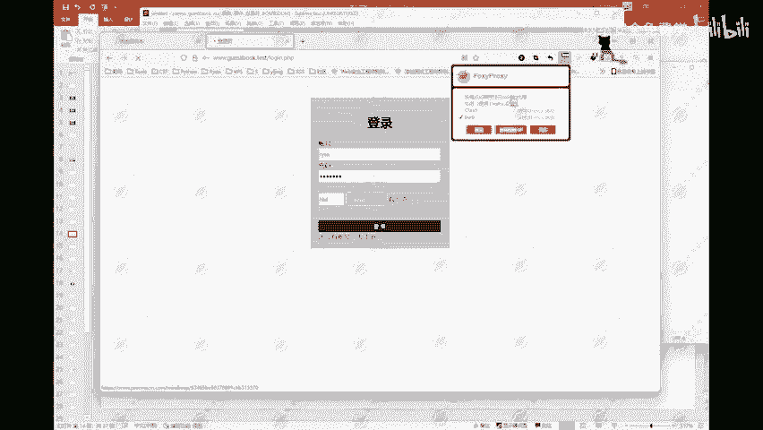
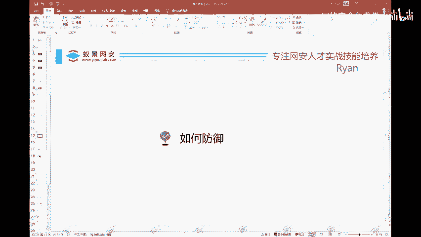

# 2024B站最值得看的黑客教程 ｜ 网络安全／渗透测试／内网渗透／漏洞挖掘／web安全／kali linux／红队靶场／CTF／信息安全 - P97：网站如何防御暴力破解 - 网络安全免费学 - BV1uBsTetEow

如何进行暴力破解？这边也给大家写清写的比较清楚了啊。这里呢第七步叫做根据lance。进行排列。筛选出结果。这就是它的一个过程了啊。那么这边。这边我们也可以看一下啊。如何来进行一个防御？

那么这个爆破我们已经爆破了。那么如何来进行一个防御啊？这边防御的话呢，我们需要从几个角度来给大家讲。

如何防御？首先从我们的一个网站的角度。从网站的一个角度啊，就是从这种网站的一个开发。这种网站的一个开发角度，他们开发人员应该做的事情。首先第一个。第一个就是我们的一个密码，要密文。传输。和。

存储这个基本上现在都是啊基本上现在都是。基本上现在你的一个密码，它都是密文传输和存储的。像我们可能常见的一些加密方式。MD5。然后加盐。对吧这个是现在用的比较多的一种加密方式啊。

你的一个密码数存在数据库里面，它就是1个MD5加盐的一个情况。这种情况呢就是你的一个密码在它的一个，比如说我这个网站，你在这里注册了。注册了之后呢，存在数据库里面，它就是一串MD5加盐的一串字符。

那么这个东西他网站的管理员，他也不知道你的一个密码是啥。当然啊这种东西呢可以经过一些手段，也是有可能给它解出来的。这个MD5是可以解出来的。然后第二个第二个。第二个就是可以限制。错误次数。

比如说就像我们最常见的我们的一个手机的锁屏，手机的锁屏密码，你输错了5次6次，然后给你锁一分钟，对吧？再输错，给你锁10分钟，锁5分钟这种啊，然后像你的什么银行卡，对吧？你去取钱的时候。

把你的银行卡放到ATM机里。然后你密码输错了3次，它就直接把你的卡吞掉。这就是这种啊限制错误次数。然后还有就是我们现在也是比较常见的叫做二次验证。那么二次验证里面呢就有什么图片。图片验证码。啊。

什么短信。然后什么人脸识别。是吧等等这样的一些方式啊，这个也都是可以做到有一定的防护效果的啊，有一定的防御效果的。那么还有像第四种呢，就叫做锁定。锁定你的1个IP。把你的IP搬了啊，禁止访问。禁止访问。

那么这个东西呢，其实在我们的一个互网里面啊，互网里面其实经常蓝队蓝队经常就是用这种方式啊。直接把你这些看着不对的1个IP直接给它搬了。这个东西有一些使可以使用我们的一个像wa。啊，以及说什么IDS。

