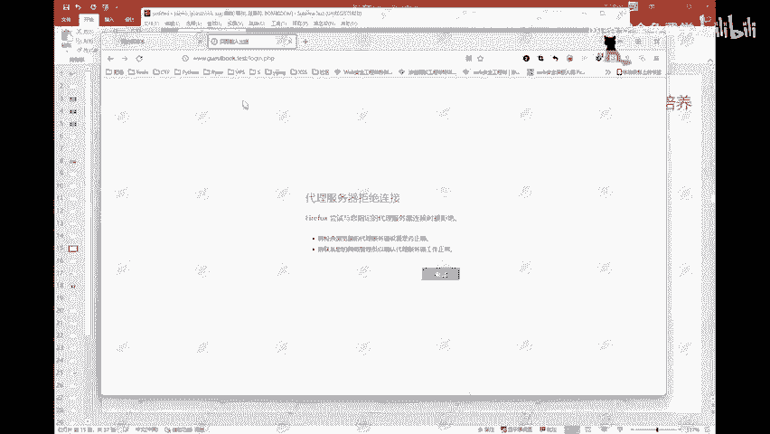
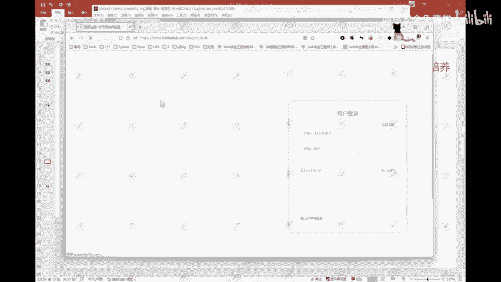

# 2024B站最值得看的黑客教程 ｜ 网络安全／渗透测试／内网渗透／漏洞挖掘／web安全／kali linux／红队靶场／CTF／信息安全 - P98：个人如何防御暴力破解 - 网络安全免费学 - BV1uBsTetEow

IPS这样的一些设备是可以做到这样的一个事情的。这是从网站的一个角度。那么从我们的用户角度啊，从我们用户角度来讲呢，我们的一个密码。尽量复杂。尽量复杂。密码尽量复杂，不要用一些什么简单的密码。

什么你的一个什么姓名呀，姓名的拼音呀，拼音的缩写呀，加上你的一个出生年月日啊，然后再加个什么艾特符啊，加个什么小数点呀，这样的一些东西啊，这样的一些东西都是很容易被别人破解的。

然后还有就是不同的网站使用不同的密码。不同的网站使用不同的密码啊。这个我可以说啊，90%的人他可能好几个好几个网站，或者说好几个社交账号，他的一个密码都是同样的。这种就比较危险啊比较危险。

如果说你某一个平台的密码泄露了，那么黑客它可以通过撞库，通过撞库把你其他平台的一个密码给撞出来，这个也是可以的。所以呢不同的网站使用不同的密码。还有就是定期修改。密码这个是最安全的啊。

定期修改密码是比较安全的。比如说你隔隔一两个月改一次密码，隔一两个月改一次密码啊，那么还有第四点啊第四点。上网时。检查域名。这个东西可能基本上啊99%的人不会去做这个事情。防止被钓鱼。

99%的人是不会去做这个事情的啊。这个东西怎么来讲呢？可以给大家看一下啊，比如说还是拿我们和田晚实验室啊。

何天玩实验室的一个域名。是3W点。何天。leve点com对吧？这个是和天的一个域名啊，这是和天的域名。那么如果说我是一个黑客，我要去获取和天玩实验室这些用户他的一个账号和密码。

我可以给他做一个钓鱼的页面。这个页面。页面是可以做的一模一样的。😡，比如说我们这边把这个退出登录啊，退出登录。然后登录一下。这边这个登录页面。

这个登录页面我是可以做的。做的跟这个和天晚研实验是一模一样的啊，这个东西是做得到的。跟这个东西做的一模一样，这个是可以做得到的。但是这个域名这个东西是一定不可能一样的。这个东西啊它肯定是不可能一样的啊。

😡，肯定是不可能一样的啊。所以呢这个是我们和天晚实验室的一个域名，对吧？那么如果说我是一个黑客，我给他。我给它做成这样的，我给它加一个对吧？何天哎，我给他加一个，然后我把这个链接发给你。

我把这个链接发给你，你访问一下，发现唉它这个页面跟这个东西是一样的。😡，一旦。你在这边填写了你的账号和密码。那么我在我的一个服务器服务器上，在我的一个服务器上，我就能够得到你的一个账号和密码了。

这就是钓鱼网站，钓鱼网页它的一个作用。所以呢这个东西啊可能99%的人都不会去注意这个事情。这个在最早的时候最早的时候一几年。10年左右10年到14年左右吧，差不多那个时间段那个时间段呢。

当时网络游戏比较火。网络游戏比较火，那么这个东西就会造成了一个这种黑灰产的一个情况。黑灰闪的一个情况啊，他们呢就有人有这样的一些黑客，他会去制作一些像什么像大家可能有些啊年纪大一点的朋友啊。

跟我差不多的可能会知道有一些什么这种。刷枪。啊，刷枪的网站对吧？你那个什么CF刷枪啊，然后什么什么那种那种点卡。😊，点卡这种东西。以及说你的一些什么领奖的一个页面，这种页面他们可以做一个一模一样的。

就是这种钓鱼页面。你把你的一个账号和密码往上面一填，那你就完了。你的这个你的这个账号就没了。你的这个账号就没了。😡，你只要把你的账号密码填了，那么黑客那边他就拿到了你的一个账号和密码。

他可以直接把你这个账号的密码给他改掉。那么你这个账号你就没了，就被他拿到了。他可以把你里面的一些装备什么的，对吧？去进行一个贩卖。😊，所以这个东西大家也是可以去做的啊，检查一下这个域名，防止被钓鱼。

这是这样的一个防御手段。防御手段。那么像这边的一些在线加密的一些网站啊，像什么MD5。MD5啊，然后什么综合类型的一个加密，以及说凯撒密码的一个加解密等等这样的一些东西。这个东西大家可以去用一下啊。

因为说实话，像有一些你比如说你在打CTF的时候，有可能也会遇到一些。一个加密后的数据啊，你可以呢使用这些网站去给它进行一个解密，去试一下。像这边一些我们网络安全相关的一些事件啊，这个可能也比较早了。

这个是4月今年4月份的一个哥斯达黎加部分政府的一个公共服务网，处于关闭状态啊，以及说这个这个是微软的一个exchange，它的邮件服务器啊，邮件服务器。邮件服务器是被勒索啊，勒索病毒。那么勒索病毒啊。

为什么这个东西大家听的最多？为什么这个勒索病毒经常能够听得到啊？因为勒索病毒它的一个造价啊，或者说制作勒索病毒的一个成本相对来说会比较低啊，相对来说会比较低。但是它所能够带来的一个收益是比较高的。

基本上啊像这种这种大公司啊这种大公司一旦被勒索病毒勒索了。那么这个勒索病毒，他们投放这个勒索病毒的人所要的一个赎金可能就是几百美刀甚至几亿美刀啊，几百万几亿美刀。所以呢这个也是为什么勒索病毒越来越多啊。

但是这个东西也是因为现在啊勒索病毒虽然多，但是现在的一些杀毒软件也能够有效的防御一些啊，有效的能够防御一些。那么像这边啊，这个是最早的之前找一些时候的叫wning cry这样的一个勒索病毒啊。

我这边也是有它的一个样本，有它的一个样本啊。这个是在我自己的一个虚拟机上操作的，试了一下。它这个还是还是有用的啊，还是有用的，可以把我这里的这个文件。我这边的这些文件，这个文件夹已经打不开了。

已经打不开了，这就是勒索病毒的一个作用啊，它可以锁掉，把你电脑上的一些文件夹文件给它锁住。你只有使用它特定的一个密钥进行一个解密，才有作用，才能够把这个文件正常的打开。啊。

基本上他这里呢就会给你弹一个这个东西啊，跟你说你的东西，你的电脑被勒索了，然后让你给一些赎金，对吧？给一些比特币，让你去充值。最好三天内付款。这就是它的这样的一个东西啊。其实还有像1几年的时候。

那个熊猫烧香也是一样的啊。熊猫烧香那个病毒的作者还是比较厉害的。当时熊猫烧香也是波及的一个范围是非常广的。很多的一些政府网站，以及说学校的一个校园网都是被被这个熊猫烧香给打了。它就会在你的一个屏幕啊。

满屏满屏就是一个熊猫在烧香的一个图案。你这个电脑就正常使用是使用不了了，这就是勒索病毒它的一个危害啊。

