# 2024B站最值得看的黑客教程 ｜ 网络安全／渗透测试／内网渗透／漏洞挖掘／web安全／kali linux／红队靶场／CTF／信息安全 - P9：docker快速搭建漏洞靶场指南 - 网络安全免费学 - BV1uBsTetEow

靶场的搭建。好，这个同学在问啊，这个卡里安装完成之后怎么配置网络。如果你按照的是老师的这个VM workstation下载这个压缩包的版本啊，就是免安装版本的，它默认情况下，就是这一个配置好的，懂吧？

它默认情况下就是配置好的，如果你是自己安装的卡里，你需要去访问卡里的配置网络这个一这个文件地址啊，是interEC interfacenet这个文件夹中对它的文件进行相应的配置配置它是自动获取IP还是使用这个静态的固定IP地址。

这是需要大家呢自己去配置的。如果你只是默认安装VM workstation，然后呢下载了卡里的这样一个啊VM版本，它就是直接已经配置好的啊，直接已经配置好的。好，这是我们卡里的一个安装啊。

卡里的一个安装。那下面呢我们来讲解靶场的搭建。靶场搭建什么是靶场，就像训练军队一样，这个士兵在进行攻击的时候使用的这个靶场平台。我们在攻击网站的时候，也要去安装一个基层的平台来去训练和学习。

那我们在搭建漏洞靶场的时候，经常会遇到很多的方法。这里给大家讲的叫做docker。docker也是现在安全面试以及安全技术中经常提到的一个环节。它是指我们一个虚拟的容器。docker呀，它比较像虚拟机。

但是和虚拟机完全不一样。它是一个非常新的技术，是基于相关的容器，将我们的代码或者是相应的运行环境，集成到一个镜像之中。

然后运行在我们常用的linux或者是windows操作系统上面实现这个虚拟化的一个漏洞靶场或者是虚拟化的一个网站环境。啊，这就是我们的docker。那docker它和虚拟机有什么区别呢？

其实大家呢在学习docker的时候，都必须要清楚这一点。我们从右边这张图片就能够清楚的看到。我们的VMwork session它是一个完整的操作系统。我之前也讲过，如果你对V。

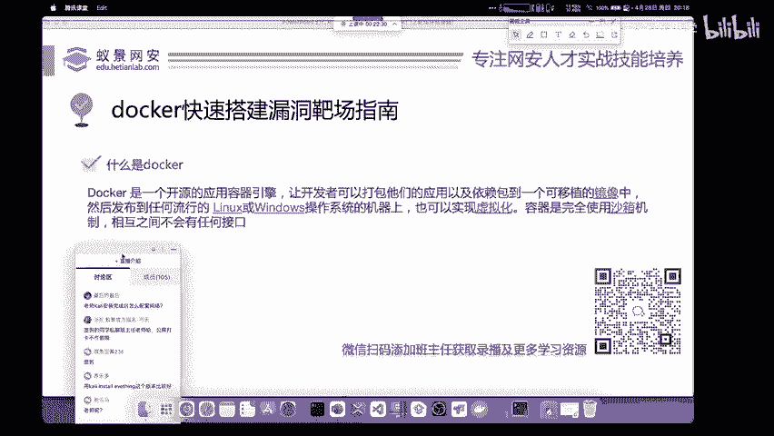

M进行了正确的配置，我们用虚拟机去打游戏都是完全可以的，而且也不会出现太大的卡顿和性能折损。因为它是一个完整的操作系统，它一切的硬件驱动，都是可以经过虚拟出来的。而我们的docker。

它只是一个轻量级的容器，它不是一个完整的操作系统，里面呢是只包含了我们网站或者是靶场所运行的源代码和运行环境。如果我们想在docker上面去安装一些驱动，或者是安装一些应用程序，这是无法做到的。

但是呢我们可以看到docker它相对于VM来说就是非常轻量化的。它的启动速度是非常快的。你启动虚拟机可能需要几分钟的时间，而我们的docker一般就是一1秒钟或2秒钟就可以得到启动。下面我们就来。

实际操作一下，为大家搭建一下这个docker的漏洞靶场。

漏洞靶场呢，我选用在安全中，每一个同学都必须要完整复线和几乎每一个同学都听说过的这个DVWA作为我们今天的一个演示内容。DVWA应该如何去安装。首先第一点就是我们要在自己的电脑上面去安装docker。

就安装docker，哎，这个直播是有回放的呀，大家看PPT就知道啊，这下面有写。哎，如果你想获取直播内容的话，你就可以添加班主任，哎，问班主任要就可以了啊，这个之前已经讲过了呀。

在卡里中啊安装docker。首先呢你可以把这个docker安装在我们的虚拟机卡里里面，或者是呢把docker去安装在你自己的电脑上面是都可以的，你可以自行去选择安装。那卡里安装docker的命令。

我来给大家讲一下，哎，这个同学说啊，docker和VM不能同时安装。这个问题啊，在我们的VMwork session16版本已经得到了解决啊，现在是没有这个问题了。

这就是为什么老师讲你安装软件尽量去官网下载最新版本。因为最新版本啊，它是会解决这些问题的那VM和docker不能共存，确实是影响了一部分人的使用，所以也都在积极解决这个问题。

现在是已经没有这个没有这个事了啊，没有这个事了。除非就是你的电脑太老了，或者是你的软。剑太老了，才会有这个问题存在。好OK那下面呢我们就来讲一下卡里去安装docker卡里安装软件啊有一个软件包管理器。

我在这里直接给大家写了哈，直接给大家写叫做ITIT叫做卡里的软件包管理器。什么是软件包管理器。大家可能呢不太清楚。就相当于你手机所使用的应用商店，比如说小米手机所使用的这个小米应用商城。

华为手机使用的这个华为商店等等。我们在小米应用商城中直接点击我们的下载，然后你会发现啊这个APP从下载到配置到安装已经完全为你走完这个流程。这个东西叫做应用商店，就非常相似。我们的这一个软件包管理器啊。

软件包管理器。这这个同学啊在讨论区说RPM啊，RPM啊是我。我们s通S和rett的这个软件包，它和卡利啊关系不是特别大啊，和卡利的关系不是特别大。所以说呢IPT它其实呢并不是这个RPM的一个库啊。

这个大家要清楚一下。那首先呢就是怎么去使用carly中的软件商店呢？它并不是基于图形化的，使用起来也是非常简单的，就是使用IPT加上你要操作的这个命令，比如说IPT int，我们加上我们想要安装的软件。

比如说我们想要安装我们的火狐浏览器，火狐浏览器的英文是firefox直接加上就行。IPT installstore firefox就可以进行自动的安装。那如何去卸载呢。

就是使用卸载或移除的英语IPT remove。remove的意思叫做移除或者是叫卸载都可以。IPT remove firefox就可以卸载火狐浏览器。那如果我们想更新和升级应用呢，就是使用我们的IPT。

什么upgrade upgradegrade啊就是升级的意思哈，升级更新的意思，加上你想升级的软件名称啊，就可以完成相应的功能啊，就可以完成相应的功能。这个是我们常用的这个命令。

那在卡里中怎么安装docker呢？我相信很多同学也已经通过自己的思路去想出来了，就是使用我们的IPT命令啊，使用我们的IPT命令，加上inststore啊inststore。

然后再加上呢我们的docker。点IO。docker点IO啊，我这里敲错了啊，docker点IO那这个docker点IO是怎么知道的呢？其实大家一定要清楚一个好用的工具，最详细的教程，就是它的官方文档。

它的官方网站中关于docker的安装已经写的非常非常清楚了啊，已经非常清楚了，已经不用再去讲了，你直接看就完事儿。那下面呢我来给大家演示一下，首先我们进入到自己的卡利操作系统。进入到卡利操作系统之后。

我们打开终端，你目前进入的终端呢叫做普通用户。我们linlin的操作系统呢，它是分为普通用户和管理员用户的。普通用户的情况下是不能够安装软件。我们首先第一步就是要把卡利切换至root超级管理员用户。

使用命令速度SU进行切换。

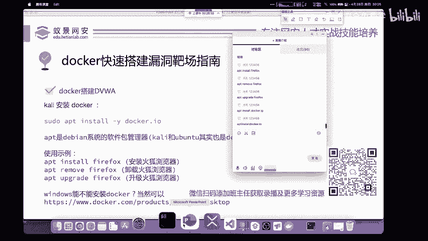

速度SU现在对这个命令呢做一个简单的解释。速度它是指以root权限运行命令。SU呢就是指linux的切换用户命令。切换用户到哪儿呢？如果SU不加任何参数，默认情况下。

就是切换至我们linux操作系统的超级管理员用户。我们点击回车。这个时候我们的操作系统就会提示我们输入卡里的密码卡里的密码在卡里最新的版本中，还是KILI这几个字母，我们可以直接输入它。

然后登录到我们的root权限。登录完成之后呢，大家可以去执行命令。比如说像who am I来去看一下我们当前是谁，是root。那在使用卡里以及我们做渗透测试的过程中。

lininux操作系统一定是你入门的一个基础。所以说呢lininux命令又多又杂，学习学习学习起来是需要时间成本和你认真的一个学习过程的那如果你想学习linux。你可以去找我们班主任。

看一下能不能获取我们核天果安实验室免费的linux相关教程。如果你不想获取的话，其实在各种网站上面也都有相关linux的一个文档或者是相关教程。

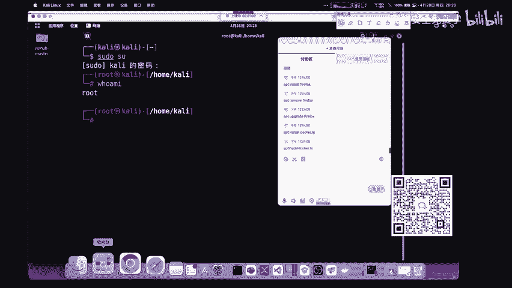

比如说我们经常使用的这样一个菜鸟教程，它上面就有我现在给大家打开，简单看一下啊，在浏览器中我们搜索啊我们的linux就可以了。在百度中搜索linux。

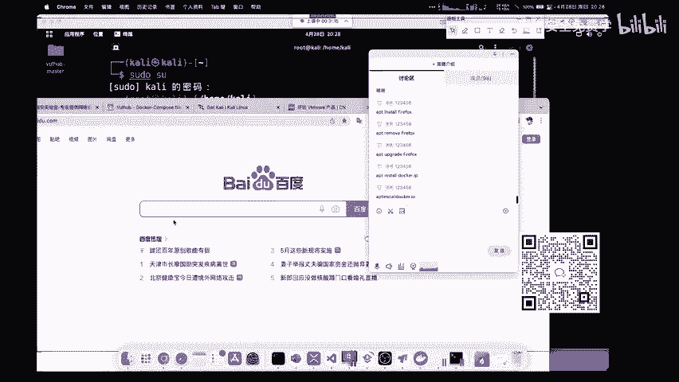

搜索lininux之后，我们一般第一个第二个看到的呢就是菜鸟教程的linux指南。在这个地方呢，它是使用一个目录的形式来解释了linux操作系统的基本使用和linux操作系统的各种命令以及权限管理。

大家呢只需要把这样一个呃把这样一个全部的东西去浏览一遍，然后安装在自己的卡里上面依次复现，你几乎就能把linux操作系统去掌握。火狐能打开，但是不能搜索。请问你是火狐是什么版本呢？

你是在哪一个操作系统上面进行打开的呢？火狐的搜索呢就是conttrorl加F啊，cttrol加F按键盘的ctrorl加F就可以调出火狐的搜索页面，当在当前页面呢检索信息啊。

这个ctrol F是个通用的一个快捷键啊。在这个地方呢我们可以去学习linux，由于时间问题和linux是非常基础的东西。在这个地方请大家呢可以自行学习，我就不会单独在一个小时中花时间来给大家讲了呀。

来给大家讲。那我们再次回到自己的卡利回到卡利之后呢，我们可以输入一条who am i指令，来看到自己当前是属于root用户。属于root用户之后呢，我们现在就可以去执行我们的IPT命令的。

比如说IPT int，加上我们想要执想要安装的这个软件名称。比如说我现在呢想去安装docker啊，我们直接加上然后点击回车。点击回车之后呢，你就可以自动的将docker安装上去。不过呢在安装的过程中。

我们的卡利可能会提示你是。

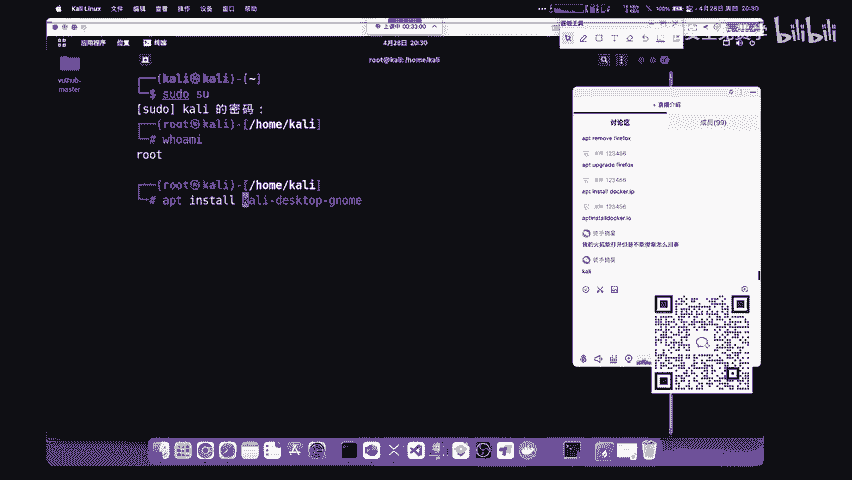

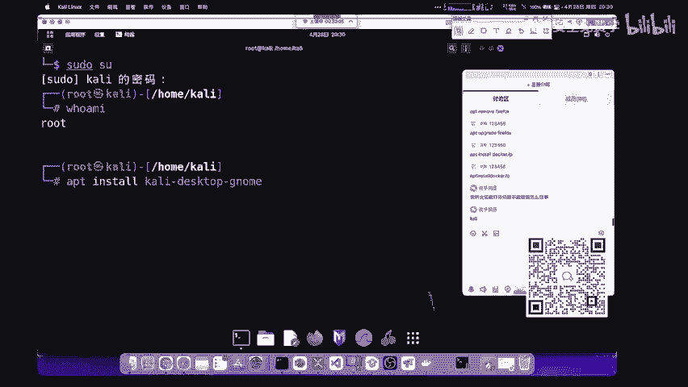

是否要真的进行安装，需要大家手动的输入hy，也就是yes的首字母来确认安装。如果你想避免它的话，也是非常简单的。直接在IPTinsstore这个地方呢加上一个杠Y。

然后加上我们的docker点IO即可完成相应的安装操作。我这里呢把它复制出来来发到讨论区给大家看一下啊，给大家看一下，就这个命令啊，这个复制不出来，我就直接敲了。杠Y然有docker点IO啊。

这个命令就可以自自动的把docker安装好。因为呢老师这里是已经安装了，所以说它是不需要花费时间的啊，不需要花费时间的。在安装完成docker之后，我们可以在自己的电脑上面输入docker，来看一下。

如果它出现了docker容器的相关帮助文档，就证明呢我们已经安装成功，我们已经安装成功。那下面呢我们来一起搭建一下DVWI靶场，这个靶场怎么去安装，首先解决一个问题，就是大家的windows操作系统。

能不能安装docker呢？现在啊在现在的这个2022年，你目前使用的所有操作系统，就是windows麦以及linux都是支持docker的。你只需要去访问docker的官方网。网站。

就可以看到它docker的官方网站有个下载链接，就有相应的版本。比如说docker fordestop，就是我们这个docker的 windows版本。

以及我们docker的麦克版本docker的linux版本都可以在这个官网上面得到下载。好，在这里下载软件我就不会再做教学了啊，都不会再做在做教学了。那下面呢我们就把这个DVWI呢来搭建起来。

那搭建DVWI，首先大家要清楚，我们docker的镜像是从哪里去下载。全部是从国外的网站上面去拉取这些镜像。那我们在大陆的话，你访问国外的网站速度是非常慢的如果你想去配置加速器的话。

这里告诉大家一个好消息，就是docker的加速器一般都是免费的像阿里云腾讯云，他们都提供了相关的加速服务。怎么去配置属于自己的镜像加速服务器呢？其实大家要掌握一个很好的学习方法，就是刚刚老师也讲过。

就是多百度，我们只需要百度搜索docker镜像加速器，就可以出现很多个解决方案。我们任意选择自己想要的就行了。那在这里呢，老师也提供一个解决方案，就是阿里云的镜像加速器。阿里云的镜像加速器呢是免费的。

并且速度非常快。大家呢只需要访问以下链接即可打开就行了。在里面呢有详细的文档。不过呢如果你没有阿里云账号的话，你需要先做注册啊，先注册一个阿里云账号，然后呢再进行一个使用啊，再进行一个使用。好。

再进行一个使用好，OK那我们下面呢来看一下docker如何去安装我们的DVWI。首先，docker它是一个非常复杂的云容器，我们学习它只要学习它基本的操作，能够满足我们搭建靶场就完全足够了。

没有必要对它进行深入的学习。因为我们不去做云计算，也不是做运维的，我们是做网络安全的。现在怎么去搭建一个DVW靶场呢？我们可以在百度搜索docker hubDVWI它会显示DVW的官方镜像。

现在呢我会把相应的命令给大家拷贝到腾讯课堂的讨论区。首先第一步就是在你已经安装好docker的这个电脑上面执行docker铺这一个DVWI命令。这个命令的执行前提条件呢有两点。

第一点是你的电脑上面已经安装了docker。第二点就是你把这个docker呀打开了。如果你没有打开这个docker，它是没有办法正常运行的。比如说现在我的电脑上面是有docker的那如果你使用的是卡利。

在卡利上面如何打开我们的docker呢，打开方式也是非常简单的。这里给大家简单演示一下，打开docker的方式就输入一条简单的命令，叫做system cTL start docker。

就这一条命令就可以了。我们回车运行docker就可以被自动打开。好，就这条命令运行之后呢，打开docker，然后再去执行我们的这样一个docker pro啊。

docker pull去拉取我们的DVWI镜像啊，拉取DVWI镜像就已经就完全ok了就完全OK了。现在呢老师给大家操作一下。首先是docker pro。加上呢我们的DVWI的地址。

回车这个时候它就会自动读取DVWY这个镜像，然后把它呢下载和拉取下来。大家可以稍等片刻，它的拉取呢是需要下载时间的。好，这里地地方啊它可能是网速的问题啊，就是它需要连接至你的镜像加速器。

我们可以稍等片刻。刚好在等待的时候呢，我们来进行一下抽奖吧。就是等下呢我会发起这个抽奖啊，大家可以抽到10份精美的U盘。有10位同学呢会中中奖，我在这里直接发起抽奖哈。好吧，我直接发起抽奖活动。

大家稍等一下，就能够在腾讯课堂的这个地方来看到它。我们抽奖的时间呢是。啊，我5分钟吧哈5分钟。啊，U盘抽奖是10个人啊，10个人哎，我们5分钟的时间来进行抽奖。你可以呢在腾讯课堂中点击抽奖按钮啊。

参与抽奖活动。那刚好呢在抽奖的时候等待这个DVWI的下载，等待它的下载。那我们为什么要选择docker去安装这个靶场呢。首先就是它非常的方便非常的方便。如果你使用自己的虚拟机。

你还需要去安装thinkPP啊，不是PPstar等PAPP运行环境，还要自己去配置数据库，还要去下载DVWI的源代码，而这些事情，我们通通的通过docker的一条指令，就能够完成相应的所有功能。

是非常方便，是非常友好的。不友好的地方，那就在于docker，它是一个基于命令行的。你可能使用起来不习。好，下面呢在这个地方我们可以看到docker是已经把DVWI的镜像为它下载下来了。下载下来之后呢。

我们可以点击docker image啊，docker images去查看一下它相关的镜像列表啊，查看一下相关的镜像列表叫做docker images。好。

docker images这个地方就可以去下载它了。好，这个同学说OWSP对OWSPPWA啊，这个VM直接下载这个你可以下载呀，这个没关系的。OWSPBWA啊，它里面还有其他的靶场呢。

你可以把它卸载一下。不过呢它那个靶场都比较老了呀，都比较老了。怎么找漏洞，怎么找漏洞，就是按照你平常学的这些漏洞挖掘方法去找呀，是吧？怎么找漏洞这个东西是吧？你问我，我给你讲一个月吗？

这个东西就是按照你平常学习的这个漏洞去挖掘就行啊，依次的去找信息收集，然后做这个漏洞的扫描漏洞的手动挖掘，找逻辑漏洞啊就完事了。啊，这些东西你需要自己去动手去试啊。那我们在这边。

不是把这些网站都整到靶场去啊，不是这个意思。你这个网站是真实的呀，我们的靶场是虚拟出来的，懂吗？这个网站是别人的，就像网站就像你打仗一样，是上战场而我们的靶场都是假的，都是你平常打靶练习的，懂了吧？啊。

这个不是把网站弄到靶场去，你也获取不到别人的网站呀是吧？别人是已经安装好的，别人已经这个在服务器上面搭建好的，你去攻击啊，你去找的找漏洞的。好，OK我们在这里呢在docker images。

你就能够看到刚刚下载的DVWA这个DVWA镜像啊，它只占用了712MB就可以去啊使用了啊。这个刘欣同学，你说的对啊。靶场就是学习和练习的地方，靶场就是供你学习的。如果你真实的去打网站的话。

就是你可能找不到漏洞，你也完不成这样一个真实的啊这个整个的学习流程是吧？所以靶场是非常重要的。你不要觉得靶场很low啊，任何一个安全大牛，你看一下，如果你经常关注推特。

关注telegram你去看一下别人这些安全顶级的大佬，他们在复线漏洞的时候用的是什么？用的是真实的网站吗？肯定不是用的都是自己搭建的虚拟靶场，进行漏洞的挖掘，漏洞的复线，包括搞这些汽车安全的人。

他也不是去买一个汽车，也不是从大路上随便找一个汽车去攻击，而是去下载这些汽车的模拟器，下载特斯拉的模拟器去攻击去找漏洞，懂了吧。靶场是非常重要的。有的同学啊他可能就是觉得哎靶场没有意思。

自己想去攻击这个真实的网站啊，这是一个错误的学习方法呀。那下面我们如何把DVWI打开呢，这个打开的方法，我们给直接给大家吧，直接给大家这个打开的方法呢，在DVWI的官方网站上面也是写好的啊。

你直接复制用就行了。我给大家看一下这个靶场的这个打开。现在下载好之后，我们就去啊就去运行它就行了。好，等一下给你解答啊，等一下给你解答，我们来运行一下它。现在我把它复制到自己的卡里里面。自己到卡里里面。

然后大家有问题的话，可以稍等一下啊，然后去运行一下啊，我直接输吧，我直接输就是docker run杠杠RM杠IT就是指我们要把这个镜像呢启动起来，启动在我们的80端口，启动哪一个镜像呢？

启动刚刚自己下载的这个DVWI啊，启动自己的DVWI把它启动之后，哎，我们的DVWI呢就可以得到启动。老师这里是失败了。为什么会失败呢？就是因为老师的80端口是正在被占用的。

大家应该还记得昨天老师所讲的这个80端口吧。它是HTTP协议的默认端口。现在呢因为我的卡里上面已经安装了HTTP我需要先把HTTP关掉，就使用sstem。CT l。好，stop我们的阿帕奇2。

把这个东西啊给它关掉，然后再去执行刚刚的这条指令啊，再去执行刚刚这条指令。这个时候啊又出现了报错。那这个报错是啥意思呢？哎，大家看一下这个报错可能是老师自己的问题。因为呢我的电脑是ar架构的。

它可能无法运行DVWI这个时候怎么解决呢？我们的卡利啊，它无法运行，这咋办呢？哎，这里呢老师提供一个解决方案，就是我现在用我自己的电脑去运行这一条命令给大家看一下啊，恭喜你啊，恭喜你中奖的话。

添加班主任的微信啊，添加班主任的微信领奖。啊，添加班主的微信领加就行。那我现在呢在自己的电脑上面呢运行一下这一个命令，大家要等待一下，这个时候我们的DVWI会自动的启动，我们要稍等一下它。

我们要稍等一下它OK启动完成之后，我们现在就可以打开自己的电脑浏览器，访问一个叫做127。0。0。1的地方。1127。0。0。1，就是我们的本地地址就是指我们现在是把DVWI搭建在了自己的本机上面。

本机的地址是127。0。0。1，在安装完成之后呢，我们可以登录我们的用户名和密码。比如说登录用户名admin密码是password。这个密码呢是我们这个。就是DVW的官方密码呀，官方的用户名和密码。

我们在输入完成之后，点击login。点击login之后呢，它会出现dabb set up，就是我们DVW的一个安装界面啊。这个安装界面，大家可能英语不太好的同学看起来是压力非常大的。这个没有关系。

你只需要划到最后面，点击create setb reset database就可以了。我们点击它。点击它之后，我们DVWI就可以进行自动的安装啊，就可以进行自动安装。然后跳转到我们的登录页面。

现在我们再进行重新的登录，叫做admin密码是pass word啊，pass word点击登录就可以打开我们的DVWI靶场。DVWA它的全称呢叫做demon危险的web漏洞靶场。

它里边是集成了我们几乎在工作中或者是在学习过程中遇到的所有针对网站的漏洞，在这上面啊都有相关的这个靶场利用。在这个靶场中呢，首先我们可以划到最下面，点击DVW security。

可以更改它相应的安全等级。因为你在学习的时候，默认情况下也是属于low就是低级的。我们需要依次通关，先通关low。再通关medum再通关hi啊再通关hi这个地方呢我们需要把三个打穿。

然后再通过imposible去查看这个软件这个漏洞是怎么进行防御的。这个同学说啊无法定位软件包。你在问问题的时候可以提供你的截图啊，不然的话，老师是看不到你的电脑，没有办法分辨你到底是遇到了什么问题啊。

你可以给一个截图，无法定位到软件包呢，可能是你的软件问，是你的网络问题啊，或者是你的IPT的一个语言问题啊，都有可能造成这个东西啊，造成这个东西的。好，我们现在点击漏啊，点击漏点击漏之后啊。

我们在左边呢能够看到这个漏洞列表。我现在给大家讲一下这个漏洞列表有哪些呢？比如说我们的暴力破解啊，命令执行CSRF文件包含文件上传不安全的验证码，搜Q注入搜Q注入盲助。

以及我们就是危险的哈有缺陷的三生绘画RED还有大家经常会说的这个叉SS漏洞啊，叉SS漏洞的几种类型，以及针对于我们GS的相关漏洞攻击啊，这就是我们几乎遇到的所有外部漏洞。

今天呢我们就是讲一下现在一个正常的一个漏洞攻击，就是大家最想要的comman injection关于中奖的一个东西啊，还有抽奖的东西，大家都可以问班主任啊。这个地方我是不太清楚的啊，你中奖的话。

你就可以加班主的微信啊，免费领取。没有中奖的同学，我们明天还会有抽奖啊，还会有抽奖，这个也没有办法呀，但没有办法的。

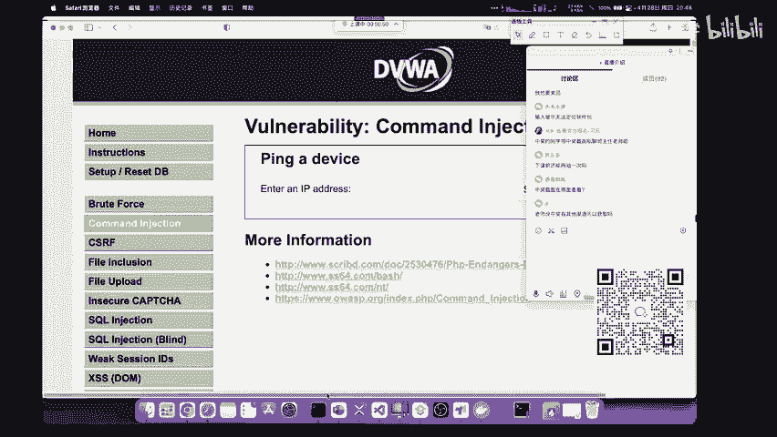

OK我们下面呢就给大家来简单讲一个例子。比如说我们现在遇到一个场景，就是我们DVW的这个command这个地方啊，DVW的comman injectionject叫做命令执行或者是叫做命令注入漏洞。

我们来看一下这个网站最简单的功能，大家一定要清楚，所有的漏洞都是因为黑客能够改变程序原有的执行逻辑而造成的安全隐患，所有的漏洞都是这个样子的，没有例外啊，没有例外。那这个网站呢正常的功能是什么。

我们做渗透测试是必须要知道的。也就是说你对一个网站的功能点越熟悉，你挖掘到这个功能点漏洞的可能性就越大。比如说在这个地方，我们来看到它的提示，叫做你pin。

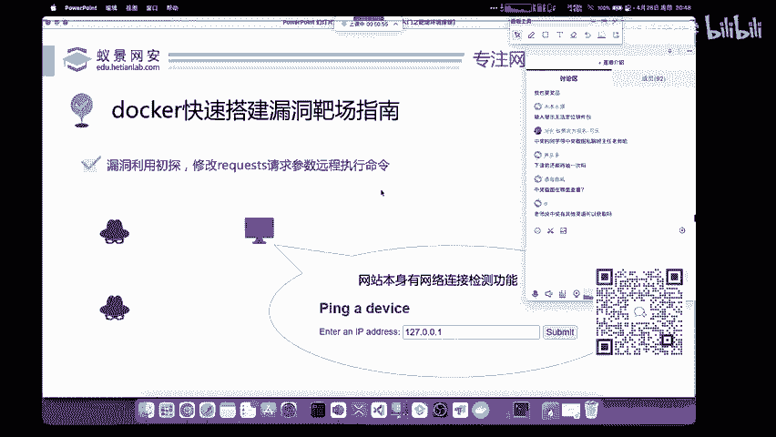

device，然后让你呢enter anIP address，让你输入1个IP地址。那这个IP地址呢，它主要就是测试我们网站是否能够连通。它是这个网站这个页面呢正常的功能来给大家用PPT看一下。

也就是说网站本身它是有测试网络连接功能的。

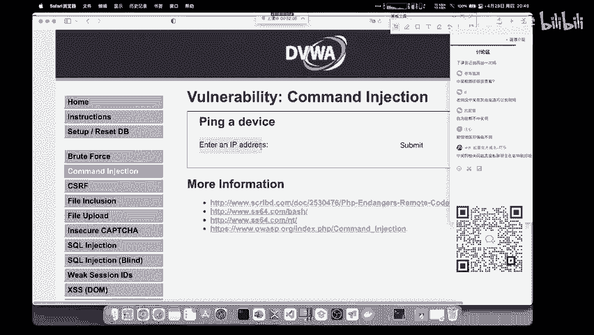

我们现在来按照这个网站的本意来输入1个IB地址，进行一个简单的测试。

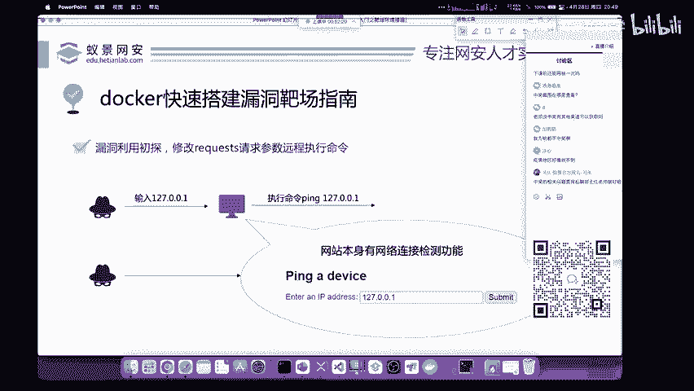

比如说老师这里输入自己本机的IP127。0。0。1，点击subit提交。

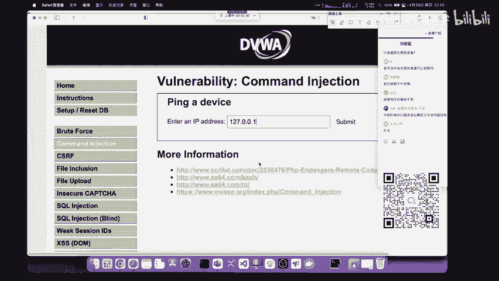

提交之后呢，我们可以看到是进行了这个pin127。0。0。1测试连接的这个功能。这个功能呢大家在自己的路由器后台经常会看到这样一个输入框。并且大家的路由器。如果是非常老的路由器。

或者是你的固件你的软件系统版本非常老，经常会有这个漏洞，就是在PIP这个地方去拼接其他的命令来导致一个漏洞的产生。我们下面来看一下如何进行拼接。首先呢就是正常情况下就是输入1个IIP地址。

那你现在作为一个黑客，你要想着怎样去改变我们输入的内容去攻击和利用这个网站。那这个条前提条件下，且呢我们就是首先要对我们操作系统的命令有一个简单的了解。比如说这里我们现在改变一下它输入的内容。

我去输入一个叫做127。0。0。1，然后加上一个and符呼MI这个and符是什么呢？它就是我们在操作系统中常用的命令拼接符，我们现在在向网站输入127。0。0。1的时候，其实这个网站的后台。

它就是执行了这样一条命令，叫做 pin127。0。0。1。那现在呢我们除了想让后台执行这个命令之外，还想让它执行其他的命令，应该怎样去操作呢？就是可以加上命令拼接符命令拼接符有非常多的种类？

我们一般使用的就是这个and符号，为什么要使用它呢？因为and符号在windows操作系统linux操作系统和miccro操作系统它都是通用的，不会有任何的区别和影响。所以说我们首选这个and符。

现在我输入这样一条指令。比如127。0。0。1，然后加一个and符，加上另外一个linux相关的命令。比如说加上who am I。这个时候我们点再点击submit，再点击提交，稍等片刻。

你会发现啊这个网站在执行了pin127。0。0。1检测连接是否通知后，又执行了我们刚刚输入的who amI这条命令，它的结果在哪儿呢？它的结果在这个地方，3W刚data。如果你是一个刚入门安全的小白。

你可能看不出来这个东西到底有什么危害。我现在先给大家讲啊，一个网站正常的功能就是访问它。就是我们的浏览器去打开这个网站，也就是像网站发起请求，就是我们昨天学的HTTP学协议。然后网站在处理完请求之后。

把网站的相应内容，图片或者是JS文件去响应到我们的浏览器。这个时候网站就能实现访问了。这个过程是相互独立的，是安全的。但是如果我们能通过这个HTTP的请求和响应，来操控目标服务器执行一些其他的事情。

这个就是产生漏洞危害的关键。比如说在这个地方，我们是在操控目。要执行了whoMI这条命令。who am I可能没有什么危害。但是你想一下，如果我对这个命令进行相应的修改呢。

如果有学过linux的同学应该知道，如果我的权限允许，并且呢你可以进行任意拼接的话，我们可以跟上and符，然后加上你想拼接的任意命令。比如说各位同学在表情包里经常看到了一个RM杠RF。

然后加上斜杠这个命令的意思呢叫做删除我们操作系统中所有的内容，包括操作系统自己。也就是大家熟知的山库跑路啊，山库跑路，把整个的操作系统都给删了。不过这条命令执行起来是需要权限的限制的。

就是我们必须是超级管理员权限才能够执行这个山库跑路的命令。那执行什么命令，就是通过大家对于linux操作系统的掌握而是决定的了，这个就没有一个固定的思路啊，没有一个固定的思路。一般情况下。

你可以先执行who am I来进行尝试。这时候又有同学要问，为什么我非要执行who am I呢？这又是一个通用的地方啊，who am I它是在所有的操作系统啊，你能见到的操作系统都有这个命令？

你如果输入其他的，比如说你输入L或者是你输入ID，那可能linux有windows没有，这就会造成一个阻碍是吧？我们可能在渗透测试的时候。

你并不能非常很好的去判断目标的这个网站到底用的是windows还是linux或者是其他的操作系统，所以说为了避免这个事情的发生，我们就用户外I不就okK了吗？是吧？就直接避免了，我不去判断户外就行了。

好，这个键就是也是通信了。就为什么我们在命令的连接符中选择and？为什么我们在执行命令的时候选择户外ma，这都是有原因的，并不是凭空去想象的啊，并不是凭空去想象的。OK这就是一个简单的漏洞。

我相信啊很多同学也都知道啊也都会这个东西。那关于这个漏洞呢，刚刚我想一开始的同时候，有个同学去问了一个问题啊，就是说外部漏洞跟渗透测试有什么区别。那如果你是学外部安全的话，执行了这条命令。

就可以终止继续了，就不用再继续了。我们把它的网站就直接拿下了，这就是外部安全。那渗透测试呢，渗透测试就是在互网中啊，包括我们做渗透岗位经常遇到的这个内容。

就是你现在已经能够在目标的服务器上面去执行一些非法命令了。那现在你要干什么，下一步要做什么，怎么做深入的利用，是我们渗透测试以及打互网红队，你要考虑的事情？比如说对内网的一些信息进行批量的获取。

比如说你拿到的一个服务器，它上面有很多员工的密码，有很多内部的一些资料报表，你都可以把它下载下来，进行一个信息的窃取，或者是呢对它进行一个更深入的利用，把这个权限呢提到最高。

或者是对他的内部网络环境进行一个渗透测试，这些都是渗透测试。这个工作岗位要考虑的事情，包括面试中现在也是经常问到内网渗透，以及这一个啊我们的预渗透等等。好，OK这是渗透测试和外部的区别。

对渗透的岗位一般是涉及到内网啊，一般会涉及到内网。不过也是根据你岗位的不同，还有你公司的不同，你接到项目目的不同而区分的这没有一个固定的答案啊，没有一个固定的答案。

那这个时候我们其实通过最简单的命令执行漏洞，你也看出来了，漏洞其实就是改变了原有的功能啊，原有的功能，什么漏洞都是的，你搜cle注入也是的，你就是软件漏洞也是的，软件漏洞是什么？

就大家经常遇到的这个游戏外挂可能就是利用了游戏中所产生的漏洞。那游戏外挂是怎么回事，不就是改变了这个游戏原本的功能吗？所以说它是外挂，他也是利用了漏洞，任何东西都是这样啊，你就理解了这个思路。

你再去学习，不论是自学也好，还是嗯找培训班也好，那都是对你有一个很大的帮助啊，很大的一个帮助。那这个就是我们docker去搭建DVWI的一个详细指南。那关于docker还能做什么。

这里大推荐给大家一个网站，叫做VOL hubub。VUL hubub这个网站是我们一个顶级的安全大牛做安全的，我估计没有人不会不知道他就是P牛啊，这个大佬他写的一个项目。VOL hubub的官方网站。

我现在发到这个讨论区啊，大家可以访问一下，访问一下之后啊，打错了打错了，稍等一下啊。ORG这个网站大家访问一下之后呢，在网站中是P牛大佬啊，已经为大家写好了详细的教程和使用方法。

在VOL hubub里面，这个同学就刚刚问我啊，有没有什么好用的靶场。那 hub VOL hub就正适合你里面有非常多的漏洞等你去复现，为什么要复现漏洞，还是这句话。

我们不论学习任何东西都要站在巨人的肩盘上面，看别人是这么做的，别人会做的，我们也会做，那你就已经是最牛的人了。如果你在会做的时候，你又能举一反三，做出一些创造性的东西。

那你就可以站在整个行业就是偏上的一个水平，你的薪资肯定是非常高的。好，所以说你不要担心要先会用漏洞复现是非常重要的。

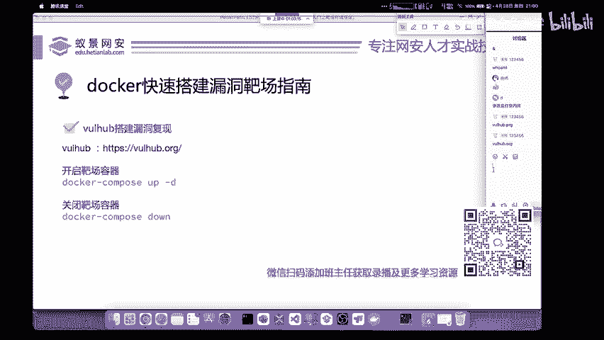