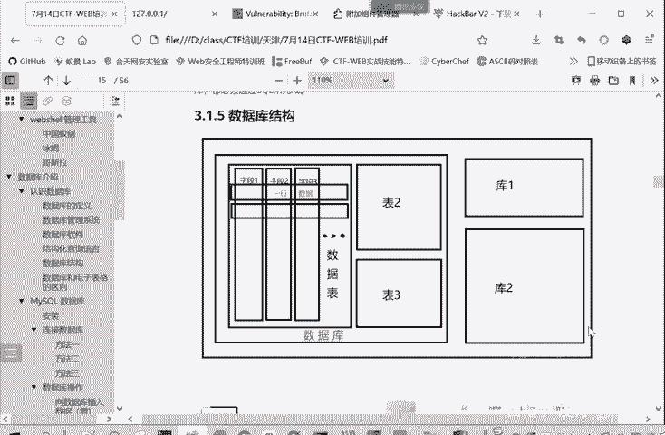
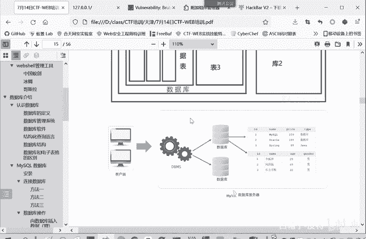
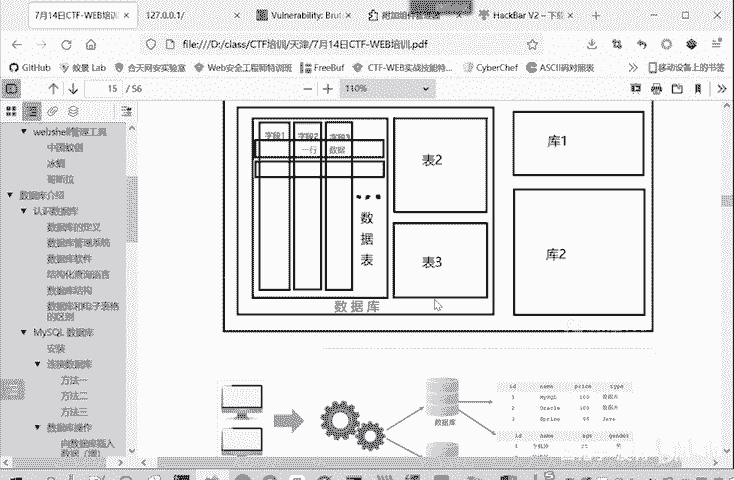
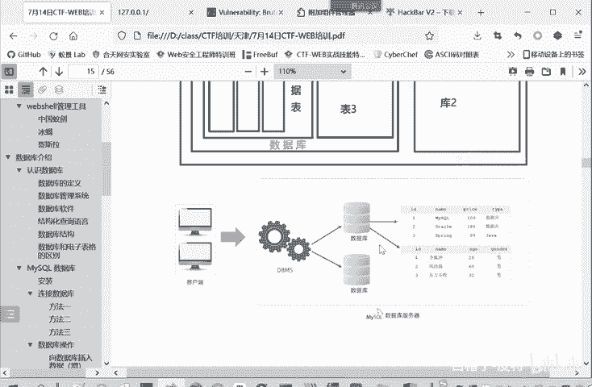
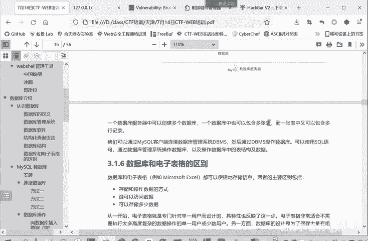

# 2024B站最系统的CTF入门教程！CTF-web,CTF逆向,CTF,misc,CTF-pwn,从基础到赛题实战，手把手带你入门CTF！！ - P11：web-数据库结构 - 白帽子-皮特 - BV1m64y157UX

数据库系统。或者数据库管理系统，它管理的多个数据库，这里面有一个数据库，还有库一块等等很多个数据库。那每个数据库里面呢又有非常多的数据表，数据表一、数据表二表3。

那每个表呢都是由行和列子组成的这每一个表就类似于一个excel表格一样，类似于啊。还有很多个表，就表里面有很多个字段，就是很多个列字段一、姓名、性别、年龄。然后有很多行，第一行就张三的数据，啊。

李四的数据。这是一个数据库的整体的一个结构。

让我们。换个角度来看。怎么样？操作一个数据库端就客户端。或者是程序通过数据库管理系统，比如说mysq。来访问某一个具体的数据库啊，这个数据库里面有很多个表来看某一个表。

它这表里面有多个字段ID namepri type有多条记录来看这些记录或者是修改删除增删改查嘛，都能进行操作。这是另一种结构。

他们俩内容是一样的，只是以不同的形式来呈现。

那帮助大家更好的理解。

所以说一个数据库服务器中啊有多个数据库，一个数据库有多张表，一个表呢有多行记录，多个字段。

这里再给大家。