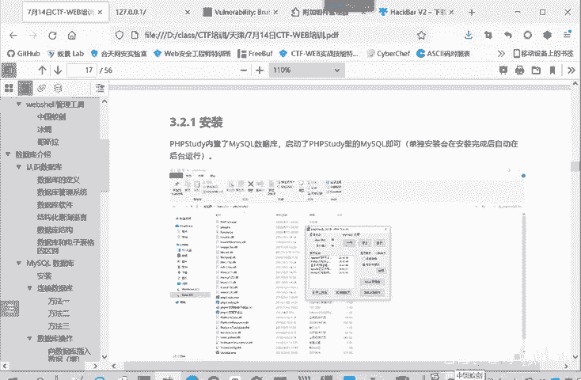
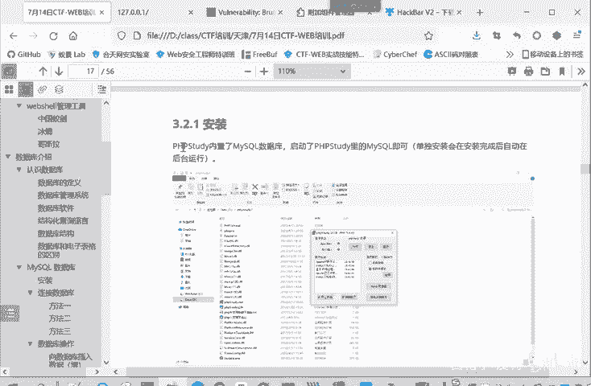

# 2024B站最系统的CTF入门教程！CTF-web,CTF逆向,CTF,misc,CTF-pwn,从基础到赛题实战，手把手带你入门CTF！！ - P13：web-MySQL数据库安装 - 白帽子-皮特 - BV1m64y157UX

I think数据库呢是一种开源的，基于cicle的关系性数据库管理系统。他还专门针对外部应用进行优化。可以在任何平台windowslinux。macOS都可以进行运行。白C一个特点呢就是灵活多变。

互联网的兴息带来了许多新的心和不同的需求。那myser就开始成为了外部开发人员和接基于外部的应用的首选平台。灵活。随心应变的灵活性呢是mys的一个主要特点。

所以就有很多顶级的互联网网站和基于外b的应用呢，都采用了mys作为区据管理系统。那么我们下面看一下mysq数据库的一个安装和使用。安装呢？这里大家之前装了PHP study。

就不用再专门进行mysl数据库的一个安装了。因为PCP study它是一个集成环境，它是集成了myscle，就是WAMP嘛。

是一个。MAMP的一个集群环境。W这个就是windows我们操作系统。这个A呢。阿帕奇M就数据库myqP9PHP后端语言。它是个集成的系统，PP study。

一个集成环境。是阿巴西mys这个PHP。看这PHP都集成在一起了。然启动了C口就启动了这个。

只要启到PP study点就启到个mys数据库。