# 2024B站最系统的CTF入门教程！CTF-web,CTF逆向,CTF,misc,CTF-pwn,从基础到赛题实战，手把手带你入门CTF！！ - P15：web-数据库操作（增、改、查、删） - 白帽子-皮特 - BV1m64y157UX

我们操作数据库呢主要就是。读取数据、修改数据，查看数据。可以用增增加删除修改查看，增删改查四个字来进行一个概括。所以这里主这里我们主要是讲啊，为了后面circle注入做准备的一个学习。

而不是说为了一个网站的开发。那网站的开发，我需要维护数据库的稳定性啊，创建新的数据库，创建新的表等等。这里我们就不需要进行这些。我们重点是对它里面的某一些数据进行获取。

这是进行这个外部安全测试的时候需要进行的工作，主要是获取数据。那么在进行数据库操作第一步呢，就要选中数据库，使用右侧。数据库的名称。就选中了你需要你操作的数据库。那么你后面的查看数据啊，修改数据啊。

都是在你选中的这个数据库进行操作。比如说我们刚才这里就是。选中的这个DVWV这个数据库。那么们这里修tables显示的表呢，也是DVWA的表。这个数据库里面的表和而不是其他数据库里面的表。

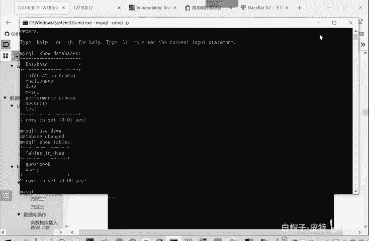

嗯。

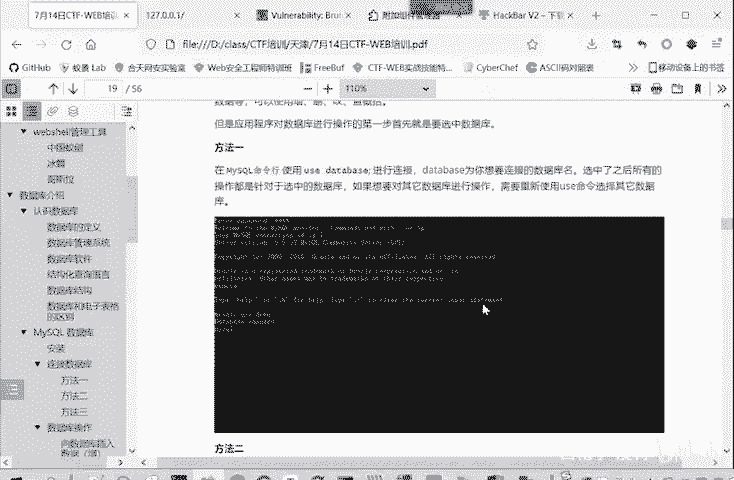

这同样的有三种方法使用数据库。

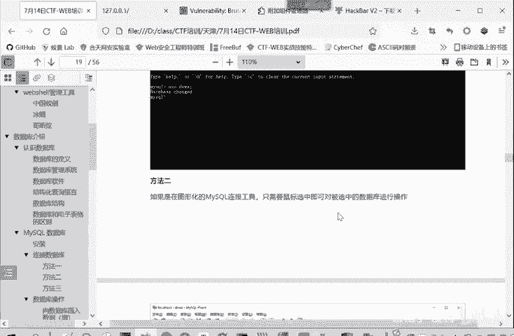

在命令行呢就右侧。

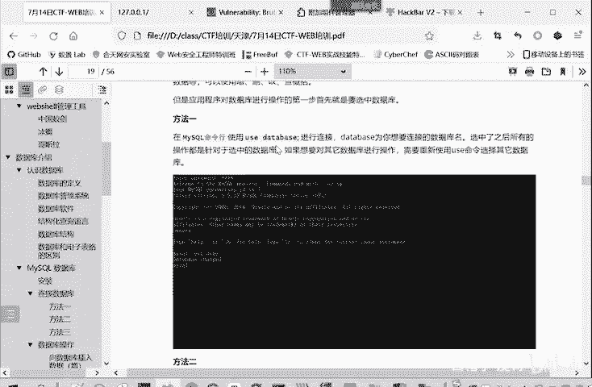

然后在连政软件里面，你直接用鼠标选中这个命令界面大家都懂。然后在这个网站开发里面。就是mymy second say next。DB这个函数对数据库进行一个选择。我们这点写了。先是连接数据库嘛。

要把这个连接的距离给带上。然后你选择数据库的名称。选择哪一个数据库？这是连接，连接好了之后呢，向数据库里面。增删改查数据。我们下面就重点看一下通过命令行怎么操作。因为通过软件通过这个方法二呢。

软件这里进行操作，这非常简单，直接进行。直接进行修改这个。用户界面是很友好的，就不用讲了。然后网方法三呢，这是网站开发的一些方法。我们这里就我们不是开发人啊，只要了解一下。不做重点讲述。

我们重点讲述就是在命令行里面。因为大家以后要参加比赛的做题，主要通过这种命令哈。

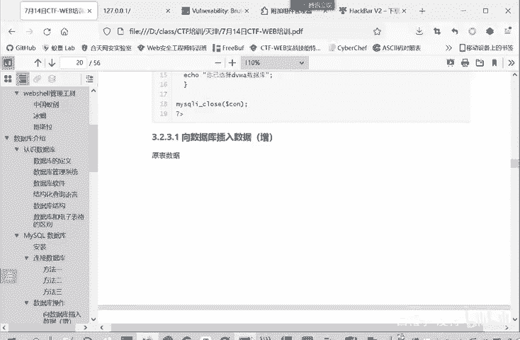

就是很多时候离不开这个命令行操作。我们主要是看一下在这个命令行里面怎样进行一个增删改查的一个操作。

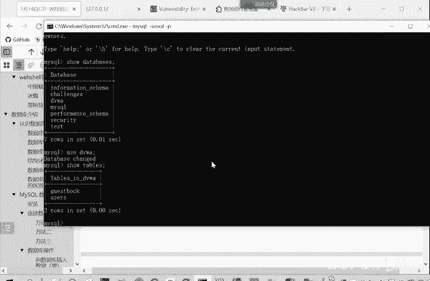

比如说我们刚开我们首先看根据我们的这个目录啊，首先看增增加的就是insert这个命令。他后面要带因土，然后表明我在哪个表里面。增加什么值？🎼比如说我们的gaest book。

我们先看一下geestt book。🎼。那么ges the book呢就有三个字的comment ID commentment和 name这三项。如果说我们需要向里面增加一条数据呢。

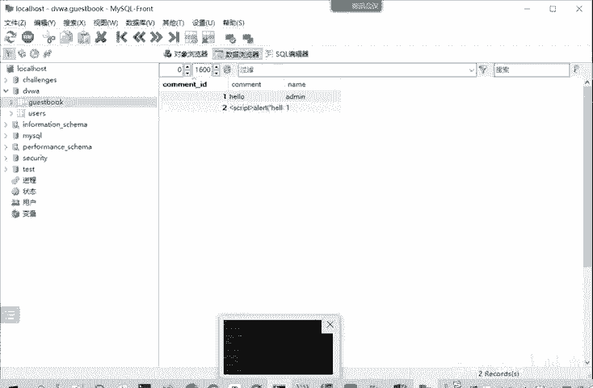

这里写就是insert这个表的名称，gestbook。然后。他的。评论和内幕是值是什么？就comment IDD是自增长的，这个我们是不用管的。我们在这里面啊看一下。Insert into表格的名称。

ttbook。然后字段名。字段名和表格名称这些都是。不用打引号的。valueual。然后他我们传进一下职内蒙后ment的是什么？Com问头。不了不。然后内蒙。你是问。好，这些就OK。

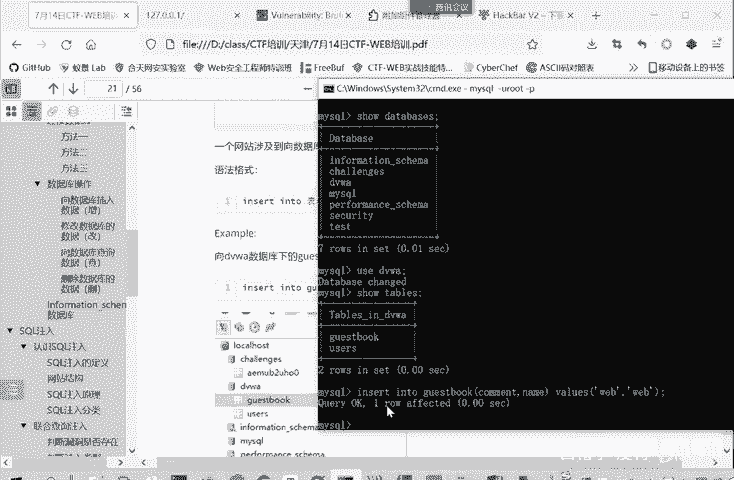

一行受到影响，那我们再看这里显示我们刷新一下。是不是我们刚才添加的信息就显示出来了。这就是一个真。就是insert into。然后选择表格里，表格里面的字段。然后在winds后面是字段的值。

像这些数据库自带的这些数据库的名称表明。然后他字段名这些是不用加引号的。应该你要输入的字符串需要加引号的这是一个区别。那我们再看看如何修改数据，修改呢就是更新updateupate一个表面。

然后update后面接的一关键字呢是set。这段名等于什么？然后为尔条件。比如说我们这里如果你不加威尔条件，加了威尔条件，只满足这个条件的这一行进行修改，不加威尔条件。那么所有的都会进行修改。

我们这里先看一下这个。facebook原始的数据。那我那么我们进行修改看一下。

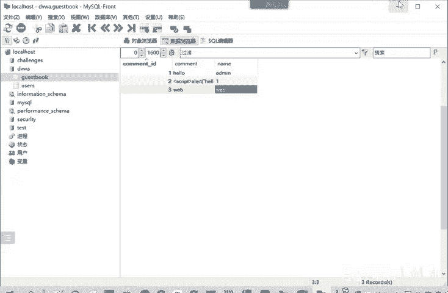

Update。Yes。update表明。然后。😊，后面是set这个命令。然后字段名要改哪个字段？这我们不改com目的，我们换一个改内幕字段。把name字段改成什么呢？嗯，是不是内蒙斯的就改成一个。

全部都改成我的命。🎼如果说不加未来条件，就这样。嗯。命令函输入的时候就是经常会有。Okay。

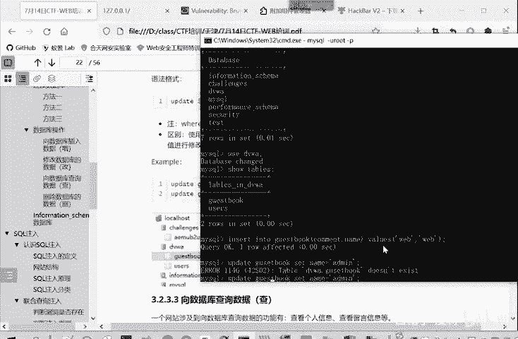

Yeah。输入的一个错误。G u e s t。这你看显示成功了。卖出三行，改变了两行。那么。它影响的是三行，改变的是两行。因为第一行原来就是有的命，它不用进行修改。那么们刷新一下看一下。

看用户名是不是都被修改成addmin。

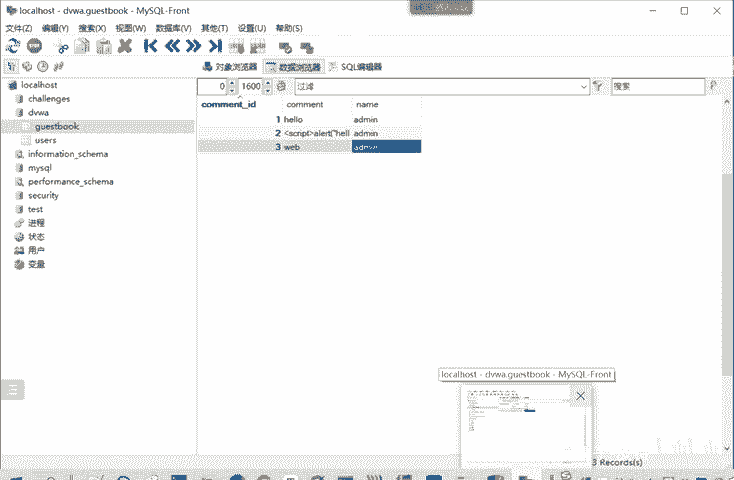

那么如果我们说如果我们加上这个未尔条件呢？用内蒙改全。威尔。加乡未养条件。where什么toment。t m m。后面的ID等于一。

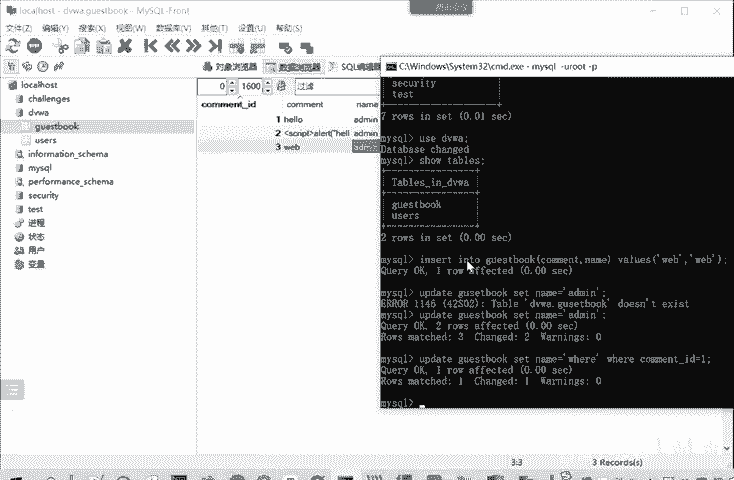

他受影响的就有一行。那我们刷新一下。是不是空me的 IDD等于一这一行的名称改成了威尔，其他的都不变，这就是一个威尔条件，它没有，它所有的都变，它有的话只改变满足条件的那一行或几行数据。这就是修改。

比如说大家以后参加CTF比赛或者参加货啊，有的时要修改这个数据库里面存储的用户的口令，就可以用这update这个命令来进行一个修改。但最常用的还查找。就获取信息而不改动信息，这是最常用的。

查找呢就是sn。这里面你选择查找的查找哪些字段from哪个表面，当然也可以带上未来条件。如果是新号的，就查看所有信息。

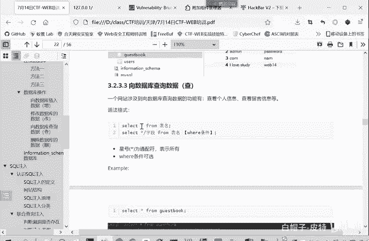

我们这里执行一下。我们比如说查看星号from。Here the book。那查看gebook这表所有的信息。有时候我不想看他所有的信息。我只想看他的内幕。没有看他的comment。

它就只会输出内是多少啊quament是多少，就空白ID这一下这个字段我们因为没选择，就不进行输出了。刚才新就代表所有选择所有的时候，它就。属于被选择的字段，那就会进行输出，这它区别。

那么同样的也可以带上一个未来条件。你看我们where common IDD等于2，那么它就会只会显示。后面的顶二的这一条记录。威尔是加一个限制条件。

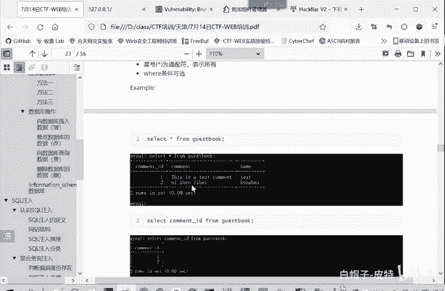

这是查那删除了删除。从这个英文单词就知道dele。delete from表明，然后带上一个木要条件就删除某一个记录。

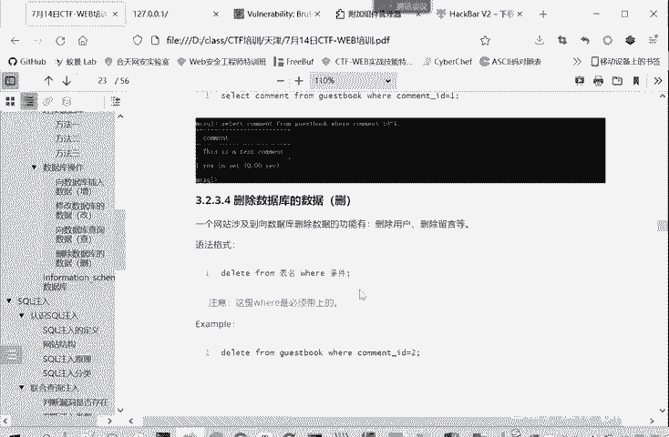

那比如说我们刚才这个。我们刚才查到这个addmin这个记录，我们想把它删除掉。那就是delete。Fbook。neet frombook where是吗？common。那我们再查看这个啊，我们刷新一下。

是不是刚才那条数据。就一些。被删除了。我们刚才查看空 IDD等于2个数据呢。没有了。N客。不存在这com IDD等于二的数据了。因为我们上一步已经进行了一个删除。这是数据库的一个增删改查的操作。增加。

Insert。修改update。查询select，然后删除dele。

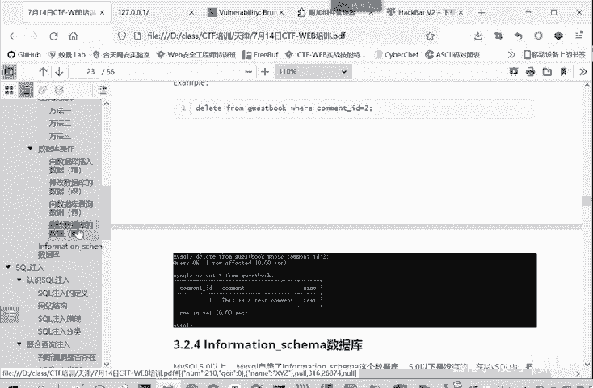

这是一个增山改查的一个工作。然后。😊，下一个板下一个板块呢，我们再介绍一下来s这个数据环理系统中非常常用的。非常重要的一个数据库，自带的一个数据库，information sma这个数据库。

