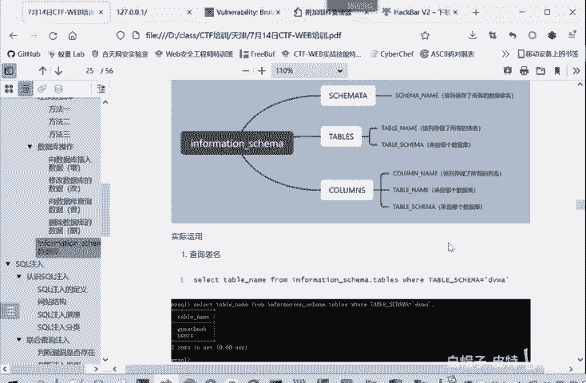
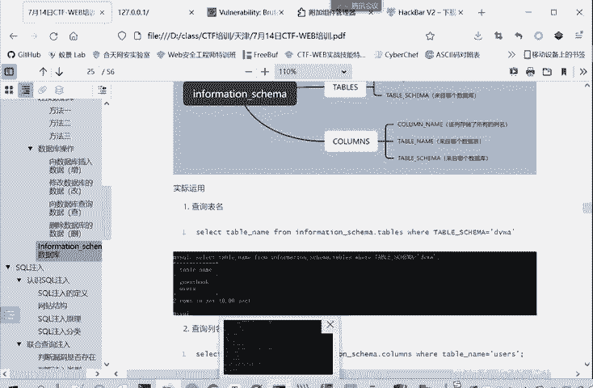
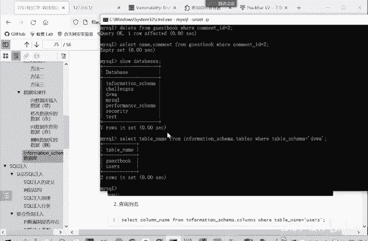
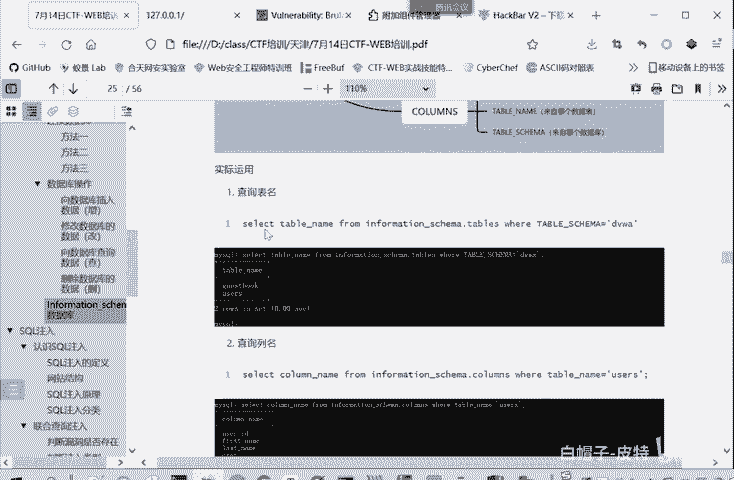
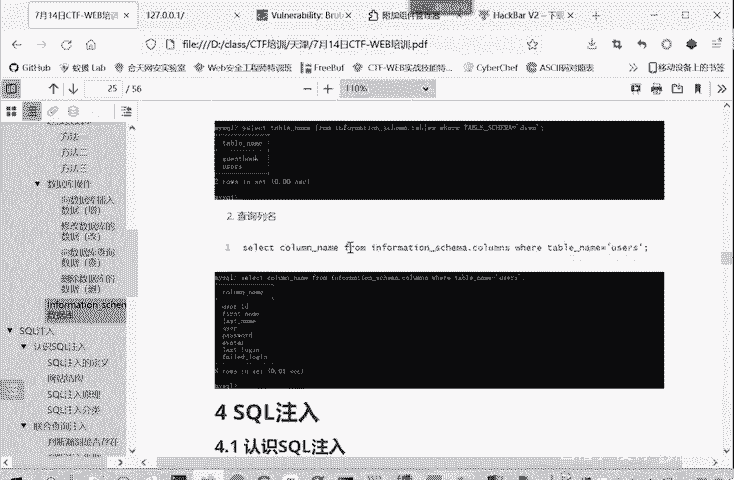
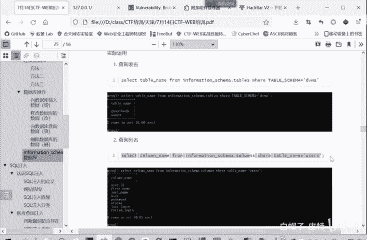
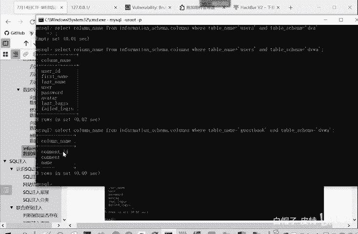
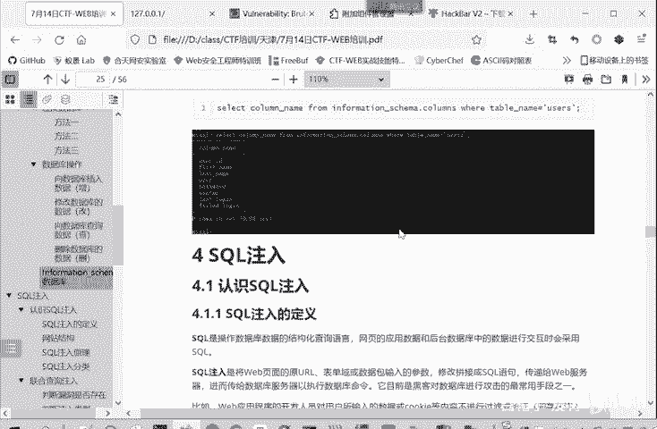

# 2024B站最系统的CTF入门教程！CTF-web,CTF逆向,CTF,misc,CTF-pwn,从基础到赛题实战，手把手带你入门CTF！！ - P16：web-information-schema数据库 - 白帽子-皮特 - BV1m64y157UX

我们直接打开电影看。mys数据库都自带了这个information schememer，这个数这也是一个数据库。这个数据库是什么呢？是mys5。0以上就自带的一个数据库。它叫做一个信息数据库。

它是保存着mysq服务器的相关信息。比如说这个数据库就保存了其他的这里一个我给你们看一下。Yes。s个ma。他是买 informationform game这个数据库其中的一个表格。

这个表格保存的是什么数据呢？就是我这个数据库里面有哪些这个数据管理系统管理了哪些数据库，关键inform game这个数据库管键阶段级DVWN接数据库的名称。都是他这个表里面的某一条记录。

我们需 database。只有dabss刚才连接的时候，查询这个数据库的名称也是从这里查出来的。所以说这个inform gamemer是一个信息数据库，它就保存我这个数据库管理系统的一些信息。

有哪些数据？有哪数据库，有哪些表，有哪些字段。每个字段是属于哪一个表的，保存着这些信息。这里面有很多表，他们我们重点掌握前三个表，因为讲多了，大家刚开始肯定是有点。就会觉得有点懵，搞不清楚。

我们先掌握最重要的三个表。在我们cicle注里面找握这三个表也就够了。第一个表呢是这个smmer表。它是保存了当前mysical实例中所有的数据库信息，也就是我这一个数据库系统中所有的数据库。

都在s这里面，我们刚才给大家看了。所有的数据库7个都在这里面数据库的名称。第二个tables顾名思义就是表嘛，tables本来就是表这个表呢它是保存了数据库中所有表的信息。我们打开看一下。嗯。

table这个表它保存所表的信息。比如说。我们筛选一下。Yes。DVWA中呢就有users这个表有guest book这个表。

你看table name表的名称users的名称gesbook属于table schemer，属于哪个数据库，属于DVWA数据库。要普通的表的类型。writing。还有其他的很多的信息。时间拖这些。

所以这个smment是保存着。这个数据库的信息嘛。table버表噶。不同的数据库里面都有哪些表，每个表是求哪个数据库，保存到表相关的信息。那我们。保存数据库的信息，保存它表的信息。

那下面还有一个字段的信息，也需要保存。字段的信息呢，字段实际上就是excel里面的列。所以这个表呢叫coum。他提供了表中的列信息。我们看一下。colums就保存了每个表。可来就更复杂一些。

我们还看TV大V。每个字段comme IDD这个字段属于ges the book guess the book这个表呢属于DV那边这个数据库。同样你。你反过来看，从左往右看。

那gas book这个表呢就有三个字的。user就录表呢就有。这些资个。也就这些年。所以quaum呢是保存一个镍的信息。就是最重要的三个表。地面给拿记出来了。

schemmatic这里面有项table s杠name保存的数据库名table记表里面有两个字的table name table schememer。

Coums面大有三 column name table name， table schemer。经了这个列。存储的匿名。然后来自于哪个数据表，来自于哪个数据库。

比如说如果是我没法用这个修 database。

最开始是想看。Yeah。他所有的数据库嘛就 databasebs如果说没法使用这个命令的时候。但是他忙不住的时候，命令没有危险，那我们怎么办呢？我们就可以。Dect。喜般。

因为我们现在是在DVWA这个数据库里面，我们要查看information scheme这里面的表，我们就得把这个数据库的全称给带上。

Senlect people name of problem in for。危险。食见嘛。点tables从这个tables这个表里面查看，是不是？我要听过 s。通过这样的方法呢。

就把这个DVWA里面有几个表查出来。其实这怎么看呢？我们从ination schemechema点tables。我们看一下tables从这里面。这个表里面查。查询的条件是什么呢？

tableable schemema等于DVWA。睇搏。Skima点DVW就这两个。那它输出就是usergebook这两个表。我们只选tableable name这一项嘛。别的时间那项都没有查看。

这个查询表明查询页名，也就是类似的selectcom那 name，下面查询表面就tableable name。

从哪informationschema点 column。他要求和table name给 users。你要严谨一点的话，再加个table schememer，就它这里是先进它数据来自于user资这个表。

不来自于gbook这个表，但是没有限阱他们的数据库，来自于DVWA这个数据库。

找机VWA。也把users搁个表里面了。字段都查出来了。那么如果说我不想谈你U。We cutting't get the book。他们的表都是属于DV，他们的库都属于DVWA，所以后面and不用变。

这样执行他就可以得到。这个gbook它里面知道名。

就通过这个表来获取字段名。上面呢是关于数据库的一个。基本情况的一个介绍，现在还没有涉及到漏洞。那我们呢从第四章呢就开始进入一个漏洞的学习。前面介绍一些啊数据库的基础知识。我们现在进行漏洞的学习。

