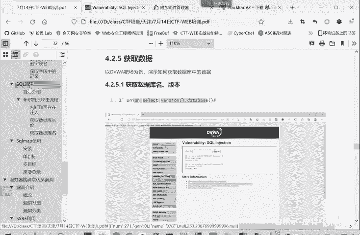
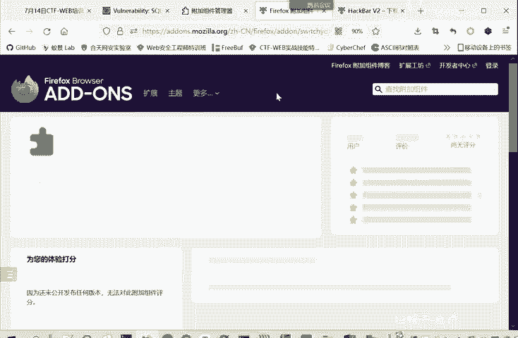
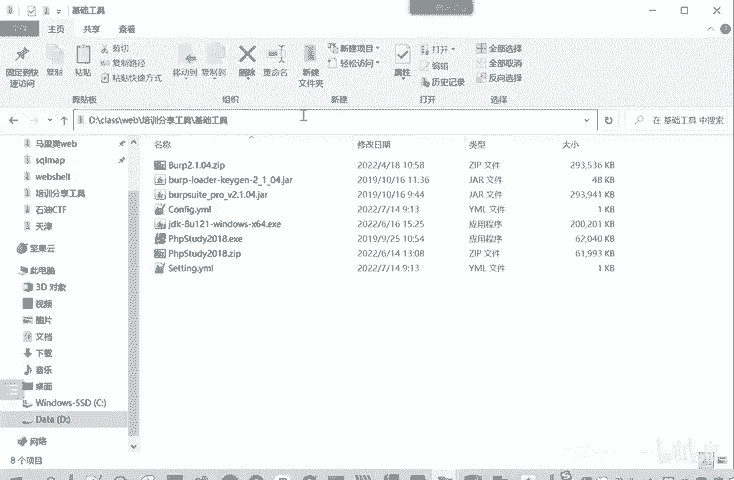
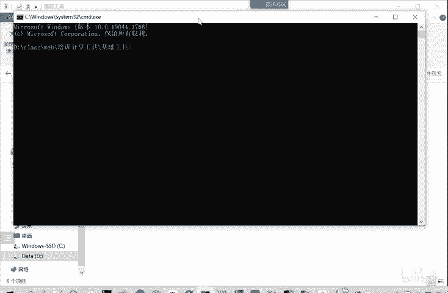
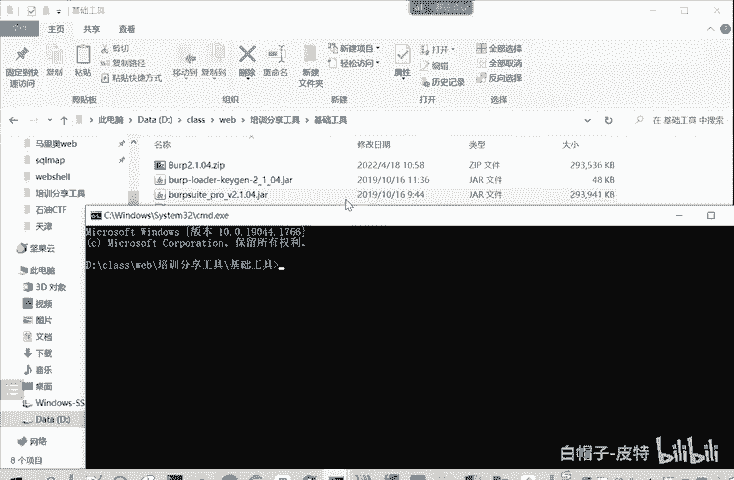
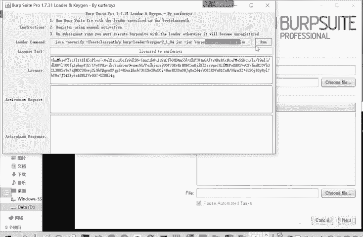

# 2024B站最系统的CTF入门教程！CTF-web,CTF逆向,CTF,misc,CTF-pwn,从基础到赛题实战，手把手带你入门CTF！！ - P22：web-获取数据 - 白帽子-皮特 - BV1m64y157UX

复取数据。确定显示为证，我就可以获取数据啊。比如说最开始的我要获取这个版本信息啊。数据库的名称呢。那么就是一闭合掉，然后。6年。我这里啊正好使用这个。一个把插件是更方便操作的。我们可以看一下。

他这里改变的什么？-一有有点C net。snet这是我们要垫的。就from users，这些我们是不变。我们C next的是什么？第项就不是user的。我们查看一下版本信息。

那第二项呢也就不是pass word了。查看是dabbase数据库有哪些数据库性里面有哪些库，我们执行一下。这你执行的啊版本信息就是5。5。53。数据库的名称呢是DVWA。那获取数据库的名称之后。

那我们就要获取数据库里面的表的名称。怎么获取表的名称？数据库这myss数据库就有一个表有一个库叫information schememer。它里面的tableables存储了所有的表的信息。

那我们就从这个tables里面怎么传。这时候呢我们可以把第一项做写一个站位复，就是一。我们只要在第二项输出我们表的名称就可以了。2C%都好我们保留。怎么输出呢？可以net。People name。说啊。

information scheme点table。这个信息数据库的数据表中。输出这个。你咩时多大啦。tableable name然后从这信息数据库表有输出tables，它要求是什么？数据库。

你们是输出DVWA我们刚才看到DVWA这个库的表。所以table有一项table schememer要等于。BKWA。我只先下。Information from table schemema。

我们看一下。我们直接在这里面输入。这样就看到了，我就。DVWA数据后面有哪些表？那后面类似的是不是我可以再进一步获取表的名称。现在是一。🤧然后。

con name from information in columns，然后要求了table name等于gestbook或者这个表的名称或者等于user或者user的表的名称。

这里为什么属于一个group content呢？就是把多行结果合并为一行输出。比如说我们这里没用group can，它就是有两行结，它就分两行来输出。用这个呢就是。一行输出。这个什么作用？就是。

今天给大家讲，有的网站他只会输出一行数据。所以我们要把所有的字段名放在一行里面进行输出。试试。a name就comment ID D commentment name。嗯。😊，就字段名。

然后就获取字段中的记录，就是每一条信息。啊，这是每一条信息。我们可以不用这个group can。那我们就。这三项就不能同时显示了。因为它只能输出两面，我们把st的一去掉。就是把后的ID也去掉。

输出后mon的。和这个内部。也以是说commenthello name是weformment web name是 me。🤧这样嗯。就获取了表中的记录。当然你要进行别的操作也是可以的。

我们一般在这种比赛呀，或者说。在大家挖SRC的时候，就是公益漏洞的时候。一般是不修改别人的数据的。也不删除别人的数据库。如果说你证明你能够查看，其实到上面这一步获取数据库的版本。和数据库名。

也已经证明对方在网站存在漏洞了。就可以。去在SIRC平台进行提交了。大家觉着要也要遵守法律，不要去删除和泄露别人的数据库。就会有法律风险的。我们这里只是演示一下这个方法。那上午的啊主要内容呢就是这么多。

嗯，回顾一下，就是先介绍一下CTF。然后一常用的工具ba suit啊。黑板我不需要管理工具的安装使用。然后就接下来数据库。再介绍的一些circle注入里面的一个联合查询中。

那我们下午呢就会讲一下什么是盲助cyclcle盲住。

他忙住就不会给我们显示这些果。还有一个cyclcle map，这是一个cyclcle注的一个强大的工具。这个工具是怎么使用的？然后下午的第二部分呢就是这个服务器请服务器端请求伪造no洞SSRF。

这个动洞的介绍和利用以及防御。最后一部分就是一个文件上传漏洞。他的介绍，他的检测机制和绕过方法，以及如何防御。下午是2点到5点半吧，我记得这个时间。嗯，大家有什么问题？尽晚发在讨论区里面，发在聊天里面。

我们。可以给大家解答一下，其他同学也可以听一下。大家有什么问题吗？啊。so这个switch呢就是我们在这个浏览器里面点击这个扩展。扩展里面有如搜索，我们在搜索框里面搜索实维性欧米伽，然后搜索。

搜索了之后，它第一个就是这个pros维活命，我们点击进去。

点击进去，这里就有一个添加。你如果之前没装的，就是添加。已经装的想删除的就是移除。啊，这位老师可以。现在操作一下，看有没有问题。因为这是一个浏览器的插件，所以在扩展里面进行搜索。

搜索搜索到了之后就点击进去进行一个添加。呃，虚拟机里面点击bp速的没反应是。这位老师是用的我之前分享的这个工具包吗？就是。这个这你课件你想就是java，他。这个b它是一个java的写的。

所以它和这个java的版本有一个配合的关系，它们两个版本要相配合。我们看一下安装这里。你看我们我们给大家分享的是b速的2。1。08。嗯，老师我我能用语音说吗？啊，您说您说。

这个我安装的java是你那个版本，那我自己的版本是1。7，我虚拟机里头，我自己的版本没问题。但是我点你那个版本，它就是没反应。不知道为什么。然后你那个浏览器扩展是哪个浏览器，谷歌吗？不是火狐，谷歌的话。

因为要要要用梯子用VPN，所以说一般就用火狐，有时候没有VPN的条件。哦，你那个代理是在火湖的。火合呃扩展火合这里。右上角这里有个选项嘛，这个这里面有扩展和主题。您那个火狐版本有要求是吗？没有要求啊。

我这个可能版本比较老，我这里没有扩展，没有扩展。嗯。那你的火候设置里面有扩展这一项吗？就是或者就是安装插件。其中。好吧，我再看看吧。这个您您说的这个是刚才您说第一个问题就是这个b。

你是b之后打开点击run就是没有反应是吧？对我点让他没反应。没简让没法，你可以把把这一段。他点击状实际上就是执行的对大命令。你要把这个命令复制下来，然后你在我们这个。

就是这个bb suit这解解压的这个路径下，你输入CMD就在当前目录下打开了这个终端，终端的路径就是我们这个路径。

然后你把这个。命令给粘贴过来。点击之前，他也是启动这个bp速的。也是同样的效果。老师，你要不试试把这个命令都复制下来，然后。

在终端里面进行执行。哦，好的好的好的，谢谢。然后那个bo那个网站报那个网站我打不开是怎么回事？H是下载证书的网站，是不是啊，对，那就是。

嗯，那个。那个就是你。他这个程序他自带的一个。他自带了一个证书。你要连上代理才行。你先把这个带理打开。我先把bob打开。对你把b和带进都都进行打开。然后intersect is on是吧？嗯。

你不要按按，那是拦截。不用。对wo对。然后你这里输入HTTP。8号斜杠DURP。就可以了，进入到这样一个界面，然后右上角就是。你输入输入HTTPb。您这个火狐浏览器是什么版本？

火狐浏览器你可以直接在百度上进行搜索官方下载就行。什么版本都可以吗？什么都可以啊。没有没有一个版本的一个限制。哦，好的，那我明白嗯。破婆酷浏览器。好的好的，谢谢老师辛苦了。😊，啊，最新的版本也可以吗？

因为我说他的版本不一样，好像老版本比较适合做实验。可以，只是你说你那个版本不知道扩展在哪。你只要找到这扩展里面，再搜索这个搜维生活密码就行。嗯。😊，您这个是什么版本？是最新的吗？我这个。不是最新的。

但是也表现他。他今天提醒我要下载更新，我没有更新。这这个都没有关系。哦，火狐浏览器哦，它不影响是吧？哦哦，行，对你要找到它扩展，然后再相当于在它的插件的市场里面搜索。嗯，搜索这个搜信页面。嗯。

好的好的好，谢谢。😊，老师辛苦了。啊，不客气。这个。啊，这个聊天里面这个呃蒋同学发的这个。发个链接去。就有什么问问题吗？啊。对，这也是一个。导入教程。看这个也可以。啊，请问大家还有什么疑问吗？不是。

扩展就是安装插件。你在火狐浏览器，这里是打开的火狐浏览器的插件。谷歌浏览器插件。我现我现在我现在没有那个我现在就不没有VPN的环境。所以我搜不到谷歌，然后你在谷歌浏览器打开插件的话。

你要有VPN的环境才行。这里更多工具。谷歌浏览器里面也有更多工具扩展程序，然后你搜索扩展程序。但然你要要能够翻墙才行。所以说没给大家。这查不到，因为我们因为我现在没法翻墙。

火狐呢就它就不存在一个翻墙的问题，所以说就让大家用的火狐。如果能翻墙的话，你用这个。谷哥也是可以的。

