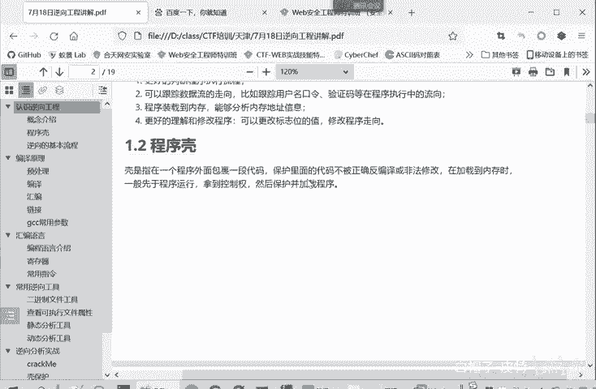
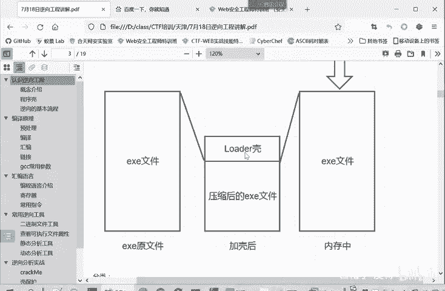
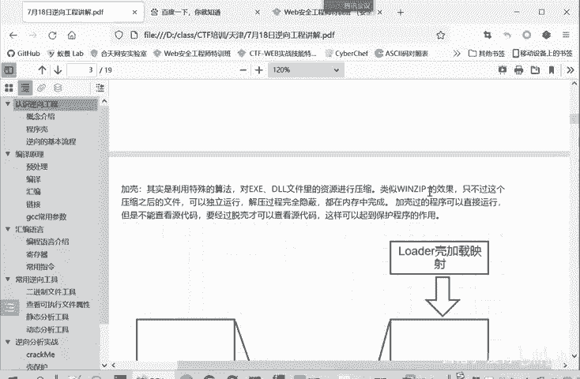
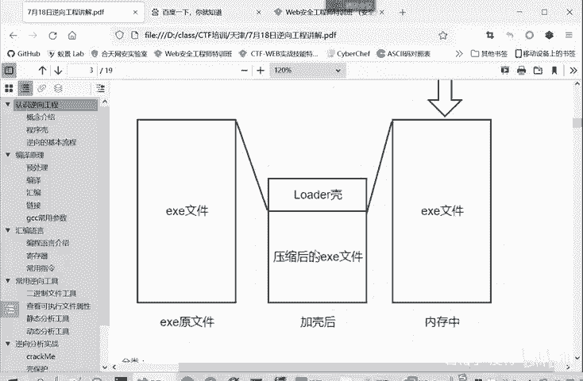
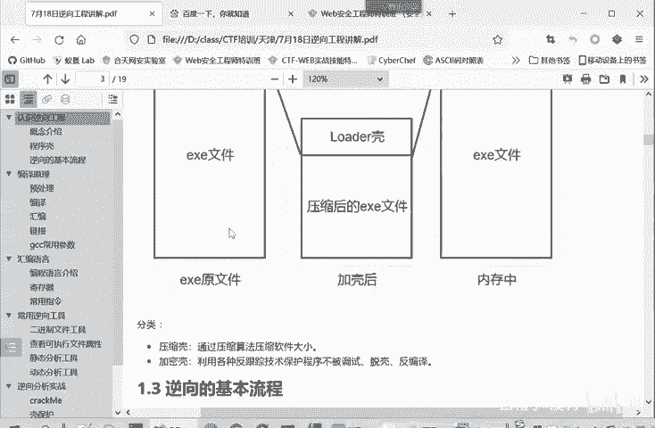
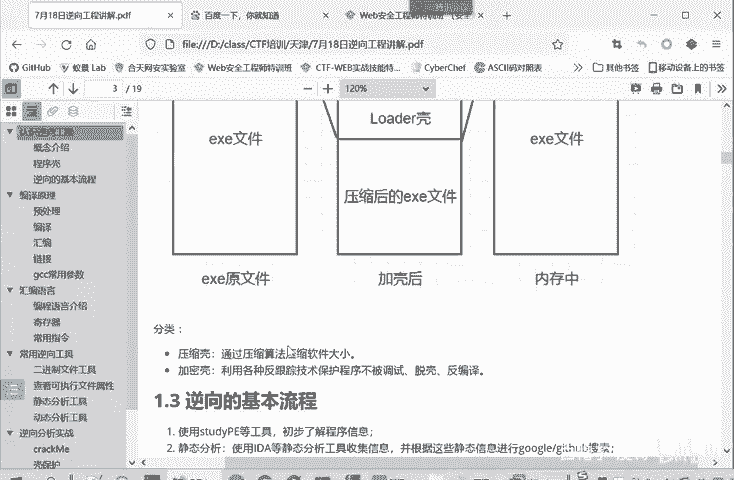
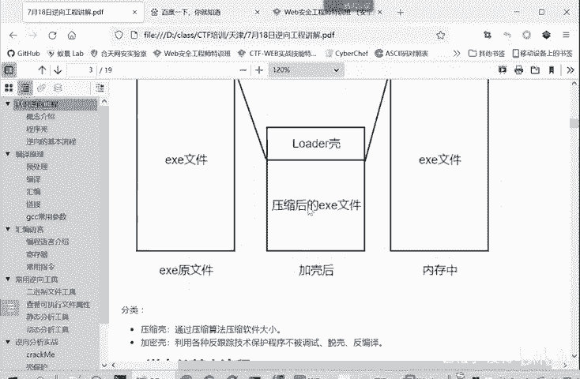

# 2024B站最系统的CTF入门教程！CTF-web,CTF逆向,CTF,misc,CTF-pwn,从基础到赛题实战，手把手带你入门CTF！！ - P24：逆向-程序壳 - 白帽子-皮特 - BV1m64y157UX

这是一些逆向工程里面的一些概念。让我们看。一0工程的第二部分就是一个程序壳。这个重要的概随把它单独拎出来。所谓的壳呢是一个程序外面包裹的一层代码，它保护里面的代码，不为正确的反编译或者是非法修改。

它加载到内存当中的时候，一般是先于程序运行，拿到控制权，然后再加载真正要执行的这个程序。

我们可以看这个图啊，比较明显。本来这是一个正常的一个可执行文件，什么什么点EX可执行文件。这是没加壳的，加壳怎么办呢？就是把这个ESE文件进行一个压缩。然后再在它的外面，加上一层 load引导区。

这就得到一个新的加课后的文件。这加可后的文件怎么执行呢？加可或的可执行文件。就直接。执行它会先执行loader这部分。然后loader这部分功能呢就是。把这个压缩后的这个EXE在内存当中进行解压。

恢复出原来的文件，然后再执行原来的文件。所以对于。普通用户来说，他使用这个原文件和夹壳后的文件。没有什么差别。尽管这个加壳扣的文件要经历一个引导，还有解压缩部分。但是对于普通用户而言。

这是没有明显感觉的，不会觉得这个啊会卡，或者是运行慢很脱，他们之间的差运行时间的差别是可以忽略不计的。对普通用户这两个文件没什么区别。然后对于分析者呢就不一样。如果说我们是逆项工程的一个调试人员。

我们调试原文件，直接看这个原文件，我们静态看动态看非常容易。如果你看这个加壳的文件。你静态看会。很混乱很复杂，因为这并不是你看这loader壳是引导部分，就压缩后的ESE文件，并不是最后要执行的文件。

所以你不管静态感动态感都会。很头疼。很复杂，很难理清这个程序的机制。所以这个壳就是为了给调试增加难度的，给逆向工程的分析人员增加难度。所以遇到这种加壳的题或加壳的这种程序呢。

我们首先要做的是我们手动给它去掉壳。得到这个文件，我们手动分析住这个原文件。然后再进行一个逆项。的静态或动态的一个分析。所谓的壳呢，其实就是利用特殊的算法，就是一些压缩算法。

对这个AXE啊或DIL动态链接库这些是你的文件资源呢进行一个压缩，就类似于win zip的一个效果。

只不过这个压缩后的文件它是可以独立运行的。解压过程是完全隐秘的，是在内存当中解压。所以加壳后的程序它是可以直接运行的，对普通用户来说是没有感知的。但是呢它不能查看程序源代码，因为这个程序是经过压缩的。

并不是真正的执行后面要执行的程序。

要经过脱壳之后才能进行分析。这样可以起到保护程序，避免。程序被。调试被分析的这样一个目的。当然毛河盾都是相对的，可以加壳，也可以去一壳。这可油的分类呢主要是两类，一种是压缩壳，这种是最常见的。

就是我们这个图这种把原来的文件经过压缩后，放在壳里面。

第二种呢是加me，这个是难度就是更大一些。他是利用各种加密算法跟。还有反追反跟踪技术保护程序不被调试。我们后面举个举个例子是这种压缩壳的，我们先掌握这种简单的。

加密壳比较复杂，我们。后面再进行学习啊，今天后面的例子会给大家讲一个可保护的例子，就是一个压缩 curve。

怎么进行分析利用。