# 2024B站最系统的CTF入门教程！CTF-web,CTF逆向,CTF,misc,CTF-pwn,从基础到赛题实战，手把手带你入门CTF！！ - P26：逆向-编译原理 - 白帽子-皮特 - BV1m64y157UX

我们进入第二章，就是一个编译原理的介绍。这一张呢是给大家讲如何从一个高级语言写成的代码转换成一个二进制可执行程序。这种转换过程中到底是发生了什么？因为我们是讲逆向工程嘛。

大家要先要了解一下正向是一个怎么样的工作过程。那我们在逆进行逆向的时候，才能更好的理解程序，理解机制。我们这里呢是以今年的这个hello world这个程序为例。

给大家讲解从源代码到可执行文件的一个编译过程。首先我们看CE言的源代码int stand IO点Hin stand I点H这是。包含stand I点库，使用这个库文件到有interman moon函数。

他输出很简单，proF hell word。然后换行retturn你就结束了，这是一个非常简单的一个程序。大家学C语源的时候。都学过，这是个入门的一个程序。那么这个这是一个高级代码。

大家写好这个程序之后都会在。那个C源编辑器里面点击个编译执行，是不是？然后就得到可执行的代码，然后会弹框输出hello word。那么我们使用软件来编译执行，它到底是做了什么呢？

今天我们就是一步步把这个。编译执行的过程。给大家分析一下。将上面的这个源代码编译成可执行的程序呢，需要4个步骤。第一个是预处理。第二个呢是编译，第三个呢是汇编。编译汇编，然后第四步就是链接。

最终得到我们的二进制文件。我们这几个过程我们一步一步的看，首先是预处理。怎样进行一个预处理呢？它的命令是GCC杠1，这是我们原来的C源源代码，比如hel了点C杠O呢是你输出文件的名称。

这里面GCC是一个编译器，我们inux下常用的一个编译器。

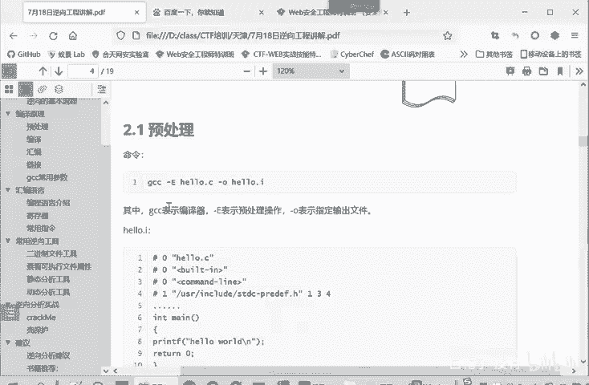

杠一呢是一个预处理操作。我们。啊，执行一遍看一下，在coming里面进行一个执行。首先我们写了一个hello world点C这样一个程序。它的源代码文件。就是我们刚才给大家看的。

Pri F hell and returning。然后我们在这里执行的GCC。正义。讲欧那是。输出文件。那么我们这样编译呢，就得到一个叫做预处理文件。

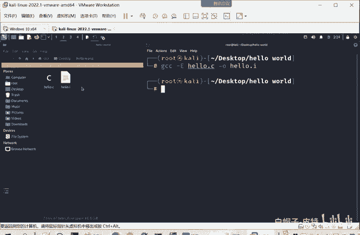

这是原文件，就是经过预处理后的文件hello点I。那么我们可以看一下hello点I的一个内容是什么。

你们直接打开它。啊，我们这里可以在。比如说我们这hello word。就以给他加个注释output。那我们再进行一个编译。那我们hello点I呢看一下hello点I的一个内容。啊他有。

就是我们这个预处理源来源的文件。还些库的信息。看起来是非常复杂，把我们原来就啊三四行那个代码。最后得到了1个700多万代码。但我们最后代码的部分还是在这。大家发现主要变化没有？

首先我们的incstand IO点H没有了。然后我们后面这里的注释也没有了，是不是这是一个变化。那具体这个预处理阶段进行的工作呢，主要是第一个头文件的包含，就是处理井号include这样的预变译命令。

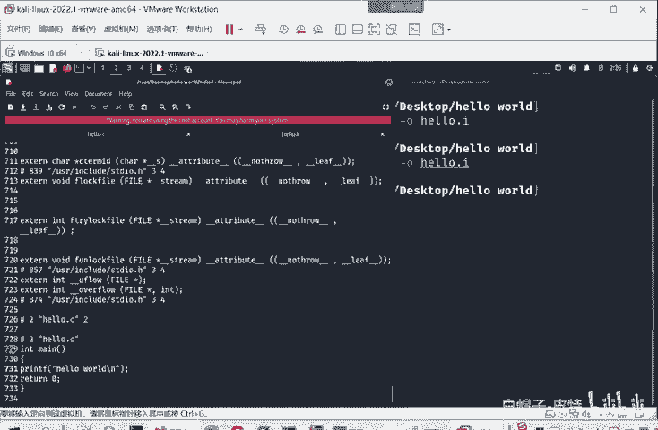

include就是我要导入某个库。那么预祝你就就是把你库的内容具体的导入进来。所以不存在standIO这一个standIO点H。这个库的信息，因为他把库的具体内容导入进来。所以说它会增加到700多行。

第二个操作呢就是红的替换。我们经常选用红命令，比如杠井号define什么。比如说我们会用到deefant派等于3。1415926，后面会用到。派一些操作。

那么这个预处理阶段就会将所有出现派的地方替换成这个3。1415926。给红的计划。第三个就是处理条件编异之女，条件编异这里就有一些衣服啊这些。条件编译制明是决定哪些代码要被编译，哪些代码是不被编译的？

这样大家写一些工程的时候，也会用到这种条件名义指令。就是我根据。我导引用这个文件的不同决定。比如说A用户需比如说A程序啊，需要引用我这个文件，那我编译A部分，然后B程序需要引用我这个文件。

我就编译B部分。所以这写的这些代码不是每一个部分都被编译的，就是条件编译主力。女准结呢就是处理到底是哪一部分需要编译，哪一部分呢不被编译。第四个操作就是删除所有的注释。

因为这些注释信息啊是对我们开发者来说有用的。理解这个程序，开va者很需要，只有注释，要不然你几个月后再看自己写的程序，自己都不认识。但对于计算机来说，他不需要这个注释。其实这个。

编译过程编译原理就是一个从人理解的语言转换成计算机能够理解的语言，也就是二进制这样一个过程。计算机它不需要注释。所以他会删除掉所有的注释。第五个操作呢就保留这个哈格玛这个编译器值。

这是用来输出编译过程中的一些信息的。这个我们没有涉及到。

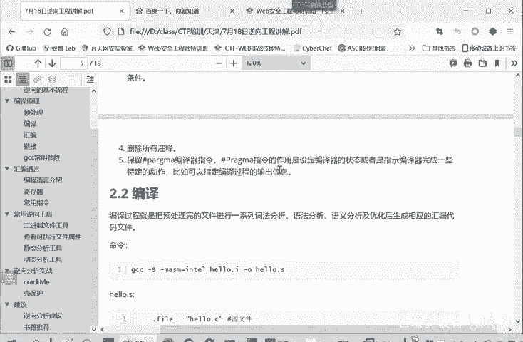

这就是我们的第一步。预处你。啊，由原来的。等等的六行代码。把这个库文件给导入了。把这个。注释信息给去掉了。其实就是做这样一些操作，这就是预处理。这也是由我们人类能够理解的高级元转化成。

计算机可以理解的机器语言的第一步。

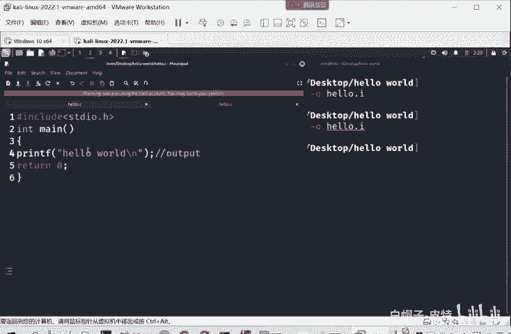

那么第二步是什么？就是编译。编译就是把预处理完的文件进行一系列的词法语法予义分析。来些。来生成相应的这个汇编代码文件。

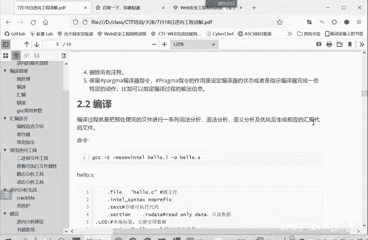

我们刚才看到的，实际上这个预处理文件还是一个。啊，高级语言，这其实就是C语言嘛，只是把这些注释啊，这酷函就给引用了。或者把红的定义给替换掉，其实还是C语言。那么这个编译过程呢。

就是把这些高级语言转换成相应的汇编代码文件。这个命令呢就是GCC杠S杠S这是编译的命。这杠MSM呢就是。因为汇编代码它是和。平台有关的，你是叉86平台和R平台，这些都不一样。

所以我们指定一个平台就是用英特尔平台。然后预出你的文件是hello点I，然后编译之后生成的文件呢，杠O指定为hello点S。我们执行一下这个命令。这样呢我们就得到一个生成的行点S文件。大家看这个文件。

是不是比预处理文件简单多了，这里面涉及到的都是一些汇编的指令，putach木。第这些啊pop这都是一些汇编的指类。他实际上呢就是将预处理的文件。一出你得到文件。转换成一个汇编代码。

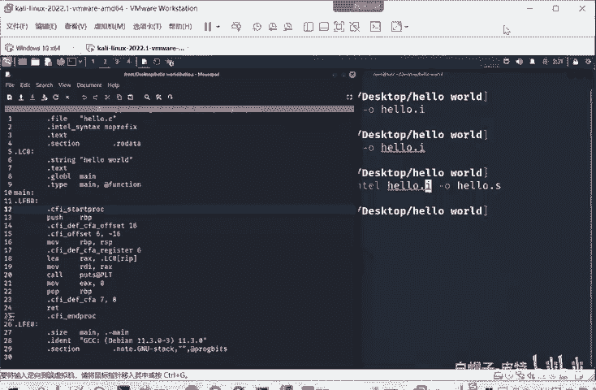

所以再做一个编译。那么这个汇编代码的内容呢，也是复制到我们课件当中了，也是给大家做到注释。每一行是什么意思？

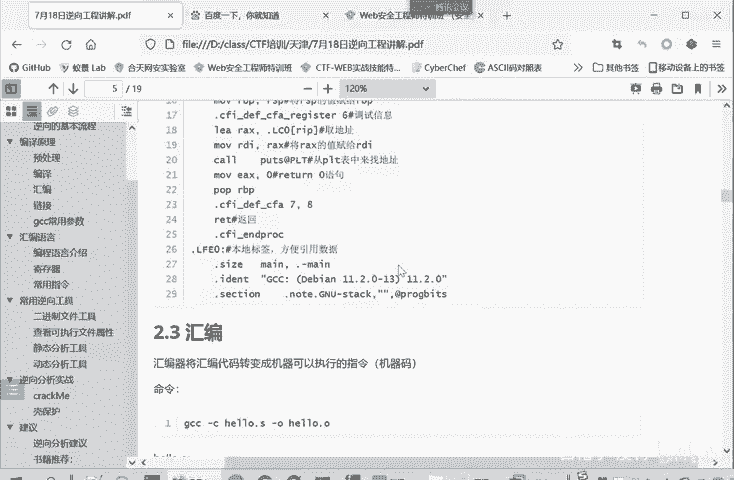

我们这里过一遍。好点S里面首先有个点fill。hello点C原文件就是说我编译生成的这个汇hello点S这个汇编代码文件是由哪个？原代码文件过来了。只含了点碎这文件过来了。

然后是使用英特尔的一个语法格式。因为我们这里指定的是采用英特尔的格式。点TXT呢是代表着存储可执行的代码段。点date了就数据的啊，就是大家后面在使用IDA的时候也会看到。然后呢。

点section这里一个。点ROread only data。RO呢这井号就是我家的注释啊，井号之前的是我们。这个原来的内容，你看点section点ROdata。使我们编译后宣选的内容。

井号是我家的注释，先给大家说一下。

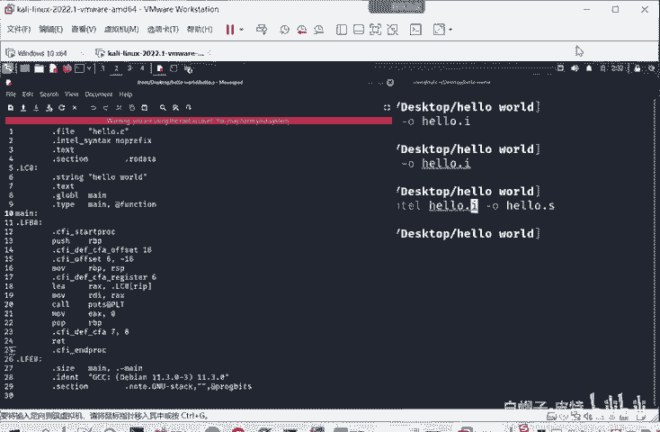

RO呢就是read only。data就data就是只读数据段。它代表后面的数据呢是一个只读数据。点LC里是一个本地标签。大家有过汇编语言的一个基础就知道汇编语言需要寻找地址。我需要这块地址的时候。

我直接使这个标签就行了。这实际上跟我们平常。你比如说这个我们这个标题实院也是个标签，你想看哪个标题都容，你点一下就跳转到相应的板块了。啊常用指令就直接跳转到这，然后编译直接跳转回来。

这实际上是同样一个意思，就是一个标签。标签下有sstrray定义hello word定义这是定义一个字符串常量。这个就。每句话的命令就不一个一个给大家讲了，都写在这个井井号后面都是注释了。

然后后面一些命密啊破解。这是入战的命令。然后目移动数据的命令，然后括调用函数命。啊，这样就得到由我们的高级语言得到了我们的汇编代码。事实上这个意思就是说汇编代码你也可以自己直接写。

你直接写一个汇编代码写成这样和我们写C语言。写成这样，最后转换得到了机器一样。是一样的。就这个意思。这是我们一个第二步。这样一个编译的过程。但编译过程虽然得到汇编代码，但是这仍然是符号语言。

它不是一个机器嘛，因为计算机它是只理解01的。它只例解二进制。计算机硬件上来说就只有高电频、低电频。那么如何由这些汇编代码转换成计算机可以直可以理解的01这些二进制训练呢，这这需要第三步汇编。

第三步呢是汇编器，将汇编代码，就是我们上一步得到汇编代码转换为机器可执行的指令，也就是机器码的一个过程。它所用的是段参数是杠CGCC杠C。我们上一步得到hello点S杠O输出输出名文件呢。

我们就保存这hello点O。

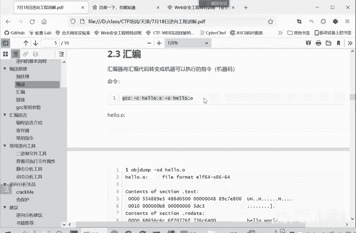

然后我们执行一下。现在出现这个hello点O这个文件。然后我们直接打开hello点O这我们先看一下。他发现没有合适的一个。打开文件的一个程序。因为它这是一个二进的文件，不像刚才的是一个文本文件。

这里是一个文本文件，直接就好打开。然后我们这个二进制文件呢。打开了之后是一个乱码。当然里面也依稀有一些常亮的字符状，比如我们定义的hello world。这个时候呢我们就不能直接用文本文件来进行打开了。

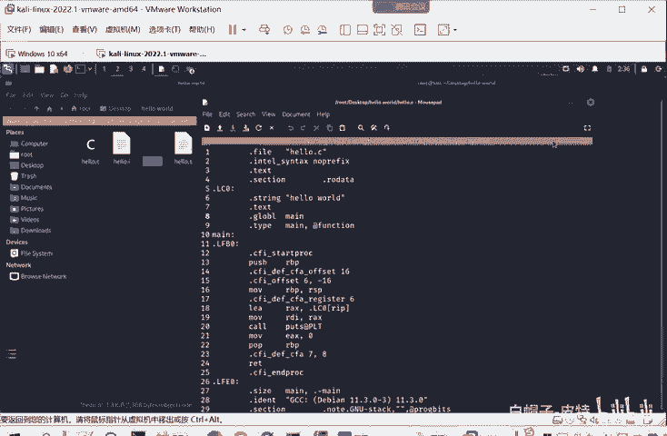

我们可以用什么？我们可以用这个OBJd来查看这个hello这个文件。hello点O这个文件。

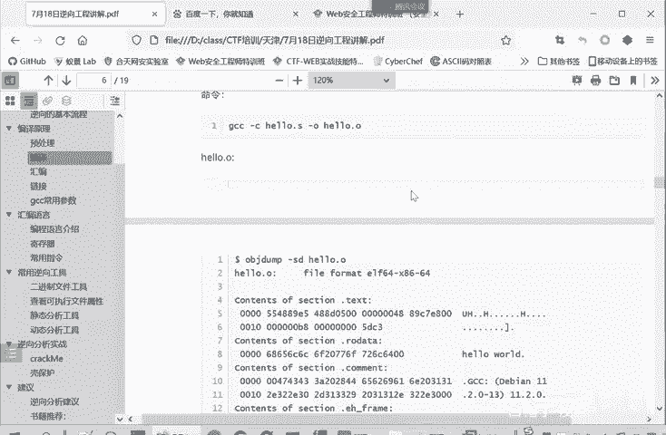

我明。

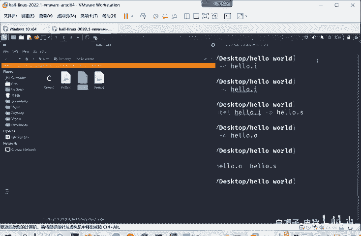

看一下。这是inux里面的一个命密。杠SDhello点O。因为它现在是一些机器嘛，所以我们必须选用这个。命你行工具来辅助我们查看。首先告诉我们行点这个文件呢，它是一个。

64位的ELF文件ELF就是linux下的一个可执行文件。它里面有这个代码段，代码段内容是这些。这都是二，这是十6进制的数字，它表示的是二进制的内容。因为直接二进制的话。很未晕。

然后这是数据段re only data，是不是我们定义的哈lo，这是数据段的内容。然后。方便我们看了就去hello word。因为存储的必然是二进制嘛，实际上代表内容就hello word。

就是我们要输出的那个常量。然后点com就是。这个编译过程中添加的注释信息，这是方便我们调试的。就我们使用的是GCC这个编译器。你看他这也说了反编译这个代码段，就代码段这些内容如果进行反编译。

我们代码的内容是什么？55488915，你看这里是不是55488915。把它表示成汇编代码，是什么？就是这样子。其实它里面存储的跟汇编代码没有关系，它只存储这个机器码，也就是这二进制。

它就存储55488915。计算机是明白这是什么意思，该怎么执行。但是我们嗯。如果是我们这个分析者来看呢，就是比较反人类的直觉。不是那么容易理解。所以这里进行一个反汇编，告诉我们它对应的汇编代码是什么。

帮助我们理解。那IDA呢在这种基础上也可以进行一个反编译，告诉我们这个汇编代码对应的C语言代码是什么？进一步减轻我们理解的难度。所以说IDA是一个工具嘛，它工具就是让我们分析问题更加的简单。

然后是闷函数等等。啊，这是一个。

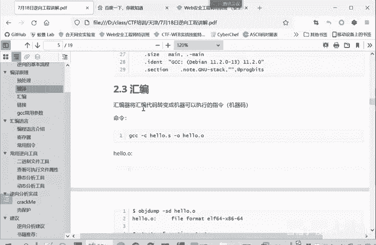

汇编这样一个字。它实际上就是它真正存储就只有这些二进制的一些。数字。答以实用性的表示，下面就是。这个工具把我们分析出来的这些20的数字代表什么意思？然后这样这个二进制文件虽然是机器嘛。

但是它还不是可执行文件。他还需要进行最后一步，就是链接。有为目标文件它需要链接一些相关的文件。他才能够得变成一个最终可执性的文件。链接呢就我们直接GCCW点O。就行了，就可以进行一个链接。

然后后面杠的话就是你链接后输出的文件名。我们就得到好有点out。大家可以看到行点out。就是职接具有执行权限的。我们执行一下hello点out。他的输出就是ho word，然后换行。

这个文件我们也可以拿出来看一下。好了点O我们。拉出到我们主机里面可以看一下。好了，点out。首先用文本编辑打开，这全是乱码。

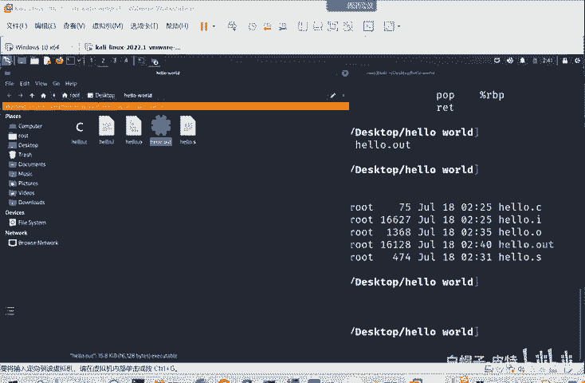

啊。这都看不懂什么内容。我们要用16制16性制文件的一个查看工具来进行打开。比如说用UE来打开。就能看到这个对应的二进制文件。这就这个这你就是这个文件的一个真正的一个内容。这边呢是这些文件对应的字符。

有的有可举。可查看的字符有的没有对应的可查看的字符。我们刚才编写了fendhelloF。gandF hello world实际上经过编译之后，最终得到可执行文件就就是这样得到就是这样的二进制的文件。

那我们很我们刚才正向的过程，我们逆向分析呢很多时候就是给我们一个这样的二进制文件。让我们分析出他的源代码是什么，它的机制是什么。这这就是一个逆向和一个正向的一个关系。然后整个的过程呢，我们可以在。

回过头看一下整个的过程去。就是这个图展示的这样一个过程。就是我们的源代码文件，经过预处理得到一个预处理的文件。预祝你呢就是把注释信息。对把注视信息呢给。去除掉，然后把这个。红定义给替换掉。

把库文件给导入进来。然后第三步呢就是进行一个编译编译的过程。编译呢就是把这些。C语代码转换成一个汇编源的代码。然后第四步呢就是汇编。汇编就是把这些汇编员的代码转换成一个机器嘛。

它其实里面都是二进制的文件。我们刚才给大家OBJd。查看这个二进制制的文件，可以看到它反面的汇编的，这是工具帮我们编辑出来的。它实际上文件内容都是二进制。然后第四步就是链接。

它把一些链接库需要的文件给加进来，得到我们最终的可执行文件。这是整个一个编译的过程。经过第四步之后，就得到了可执行的一个文件，可执行的一个程序。直接运行这个程序呢就能执行函数的功能。

它就不再需要这个C源的源代码了，它自己就是一个独立的可执行程序。我们最后给大家介绍一下我们这个GCC编译器常用的两个参数。第一个是gsave down save temps。

你直接使用GCChel点C就是最开始原文件，也能直接一步得到我们最后的可执性文件。但是他不会保留中间的点A呀，这是预处理。还有汇编编译这些文件。那你添加了杠sve dump嘛。

sve times就可以保留这中间文件供我们进行一个分析。大家课后也可以自己写一个简单的C员的代码。然后。进行这样一个分析，查看一下它中间过程这些文件是什么。来更好的理解我们这个编译的过程。

第二个参数呢是杠杠vers。他就可以输出GCC一个详细的工作流程。啊，大家经常用这些软件工具的应该是很好理解。前这是这部编译的编译的过程，就是一个软从软件源代码到可执行文件一个正向的过程。

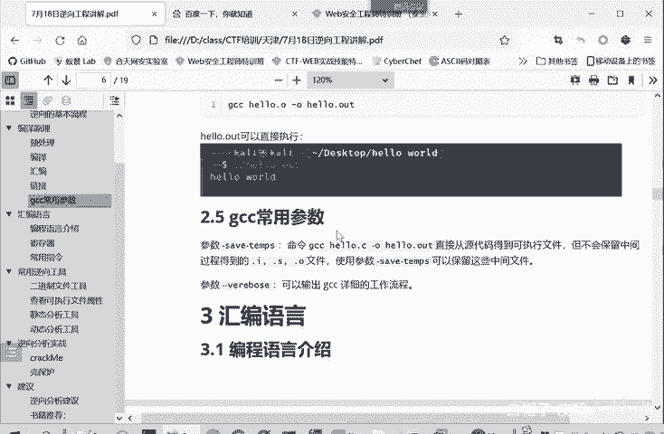

那么正向的过程我们现在清楚了。为了真正的看懂这些正向过程，他到底是进行了一个什么样的操作呢？我们必须要了解一下汇编语言。这这些都是汇编语。

