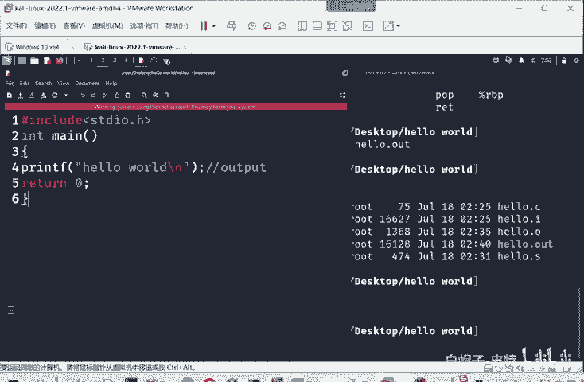
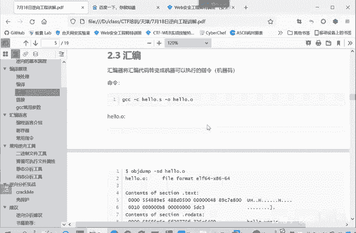

# 2024B站最系统的CTF入门教程！CTF-web,CTF逆向,CTF,misc,CTF-pwn,从基础到赛题实战，手把手带你入门CTF！！ - P27：逆向-汇编语言介绍 - 白帽子-皮特 - BV1m64y157UX

大家了解汇编语言就知道为什么这些语言执行的效果就是printnt F hello world。那我们来看一下汇编语言。首先呢。看一下这个编程语言的介绍，我们提到三种语言，一种是机器语言。还有汇编语言。

然后高级语言，我们看一下这三种语言的一个关系。首先机器元，那计算机的硬件呢，它是一种电动元件。他只人。是有电或没电。高电频或低电频。所以说为什么CPU它只能处理二进制内容，因为硬件上就只有两种状态。

我们任何的一个操作计十进制的加减乘除啊，都要转换成二进制。进行预算，这样CPU才能够理解。in此么二进制的语言是计算机语言的本质。所以计算机刚开始发明的时候，就是为了控制计算机完成自己的任务和项目。

这个也就是编权。这时候编程了就只能编01这样的二进制数字去控制电脑。这就这以前的我们。我们在大学里面，一些老教授他们用过的。打卡用纸袋来打孔。实际上有孔没孔就代表了零和一，也就是两种状态。那边去。

这种语言就是机械语言。那这个语言大家可以很好理解。就能感受到证明肯定编程是非常麻烦的。因为你只能输入零和1。对于我们开发者编程者来说，这个使用就非常受限，非常的麻烦。

所以以前的计算机只有很专业的人士才能够进行操作。那么后面呢就发展出来一种汇编语言，汇编语言是什么呢？就是一种低级语言，它是相对于后面高级语言来说的，它也叫做符号语言。在汇编语言中是用助记符代替。

机器指尼的操作码。用地址、符号代或标号代替指令或操作数的地址。简单来说就是用符号，也就是英文字母来代替临1的训练。比如说这一串，这是个机器群。这上面呢是一个机器指，就机器嘛，机器语言。

他是一串你异的信念。那我们呢就可以规定这串泥异训练就用木AXBX进行替代。那我以后想执行这样一个目复制数据的操作的时候，就不需要输入这一串名序列了，而只需要输入。这样一个助记符，也就英文字母就可以了。

这这个所以说这个汇编指令就比这个机器实力好理解太多了。但是他还有什么好处，他又不影响效率。因为他这个。汇编指令只是机器指令的一个助记符和机器指令是一个一一对应的关系。这需要指出的是呢？

在不同的设备平台中，汇编语言对应着不同的机器人指令级。就是会编员他这个具体的。每个命令的作用还书写的格式是跟你CPU的平台是相关的。和CPU价格相关。

不同的价格比较常见的叉86power PCC叉86英特尔用的比如power PCC呢以前苹果也用这个价格，arMar现在用的很多了，我们的。苹果手机、安卓手机。它的处理器都是按个价构。

它不同价度的这些汇编指令呢不完全一样，它的逻辑基本上是一一样的，所以具体的格式不一样。这个大家只要掌握一种汇编言，别的都好理解。那大家学这种编程语原言啊，第一种语言，C语言学起来很难。你学会了C之后。

你再去学。java呀、pyython这些。其实难度就小很多了。因为他们更多的是一些一些语法规则呀，具体的书写形式的差别，他们的逻辑基本上。就是共通的地方很多，不说一致吧，共通的地方很多，这很好理解。

这是汇编语言。然后呢我们再看一个就是高级语言。就是出现了机器语言汇编语言之后。现在发现限制计算机使用限制程序推广的关键因素。这是一个程序的编写或程序的可移植性。所以。

计算机专家希望创造出一种不依赖于计算机硬件，能够在不同的机器上运行的程序。这样就可以免去成编程的重复编写过程，提高效率。这什么意思？我们用汇编言编写，本质上也是对应着机器语言。那么你就跟平台是相关的。

跟价格是相关的。但是现在我用高级语言编写，我编写一个C语言程序。我把这个C源代码放在windows平台，它也能编译这些。放在苹果的系统里面也能编译学习。我只要在不同平台开发一个编译就行了。

对开对于程序的编辑者来说，他编写同样的。这个源代码文件在多个平台之间都能够编译执行。同时呢这个高级语言它是更符合人类的认知了。他实际上高级院。因我们刚我们之前看的这个。Hello world。

这种高级语言，它实际上就更像一个英文的作文一样。他每一步就告诉你什么作用。这样理解是比这些汇编语言机器言容易很多的。

呃，这是种高级。这就是高级预。那高级元缺点就是什么？他的效，他因为离CPU很远。就相当于中间过程很多嘛，所是它的运行效率是不如汇编言和机器员的。这是一个语言的发展趋势。

就是它的运行效率事实上是越来越低的。因为CPU的性能越来越强。但是他的编写的容易程度，他的理解的容易程度是越来越高的。其实就像pasthon一样，python比C玩出来，所Pthon比C的效率是低的。

但是person更好理解。正好上手。那我们总结一下汇编语的特点就是代码很简短，然后占用内存少，执行速度快，这是相对于高级语言而言的。它比起机器语言呢，它是更加便于记忆和书写。大家看这。要一个转换就行了。

或者看我们上面的。汇编的这里的一个转换。

这是机器人，这是。汇编员机器员汇编员。大家看这个转化就知道。你看这些数字那机器码。是很难掌握的，很难理解。然后第三个特点就汇编员，它具体的格式是和机器和CPU的架构是相关的。

具体来说就和CPU的架构是相关的。本章介绍主要是叉86平台的这个汇编语言。因为这是大家用的最多的。我们windows系统啊。就是基于一个英特尔的价格，叉86就是一个英特尔的价格。

或者说你用了AMD的芯片，它实际上也是叉86的价格。那上述机器的指令和汇编指令呢是相对应的，他们的含义啊，这两个指令是在。意思是一样的，只是会编之女更容易理解和记忆。

作用呢就将寄存器BX当中的值呢送到AX当中，就是负值。说白了就AX等于BX起到这样一个效果。我们后面讲一下寄存器，然后我们先休息10分钟。32点55，然后3点过5分，我们继续上课。

