# 2024B站最系统的CTF入门教程！CTF-web,CTF逆向,CTF,misc,CTF-pwn,从基础到赛题实战，手把手带你入门CTF！！ - P28：逆向-寄存器，常用指令 - 白帽子-皮特 - BV1m64y157UX

刚才大家提到这个一些软件的问题啊，其实大家在网上搜索就可以了，就找可以找到这个。破解的软件。当然有些人想使用正版软件呢也是完全可以的。这里我就不分享这些破解的方法了。这也是要符合法律的要求吗。

那我们学习网络安全什么时候都要遵守这个法律？然后我们继续学习，我们来看一下这个寄存器。寄存器呢它是CPU内部的高速存储单元。它也就是说寄存器是集成在CPU内部。它访问速度比内存快得多，价格也高得多。

大家可以做一个比较，就是寄存器。和我们说的运行内存和存储空间。继存器的速度是比内存内存要快比。硬盘更要快很多，但是它价格呢也是寄存器这个单位存储空间的话是最高的。其次是个运行内存，其次是硬盘。

因为继存器它是集成在CPU内部的嘛，所以它必须要很快，它才能够。配合的了这个CPU高速的运行速度。然后我们常用的寄存器呢可以分为四类。分别是这个8个通用的计存器。再就是断寄存器。

16个断不16位的断寄存器，还有。

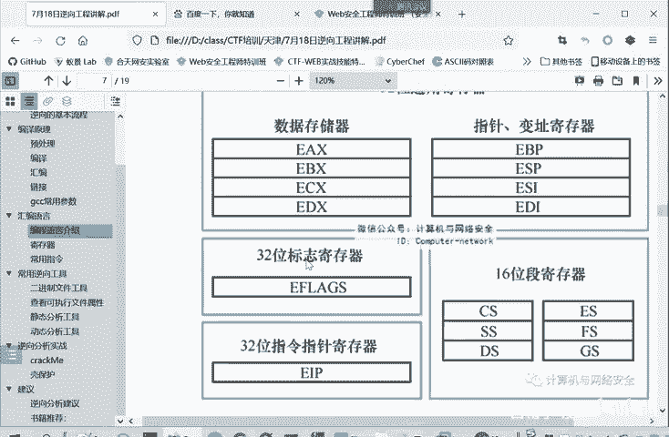

标志计存器和指令计存器。我们现在具体来看一下。

同用寄存器呢又可以分为这个数据寄存器和这个指针变值寄存器。

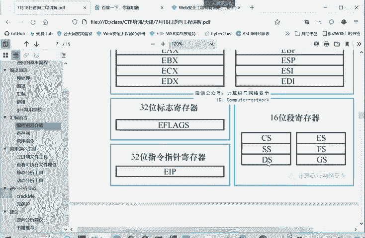

所谓数据集成器呢，就是主要用于各种计算，还有数据的传输。

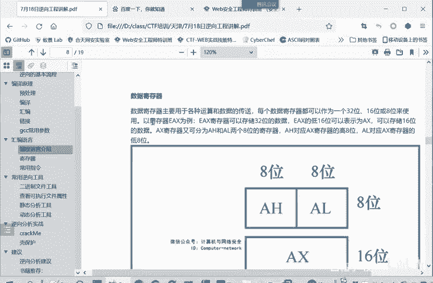

这就有EAXE呢。

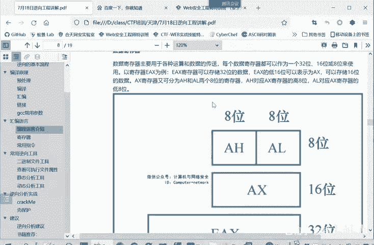

准确说有AXBXCDX这16位的。但是随着CPU的扩展呢，主要后面就产生了32位的这个CPU。那么寄存器呢进行了相应的扩展，就叫EAXEBXECXEDX。那么后面呢又扩展了64位的CPU了。

那么相应的这个基存就称为RAX。RA X RBX RCX。这就是一个你的这个区区别。

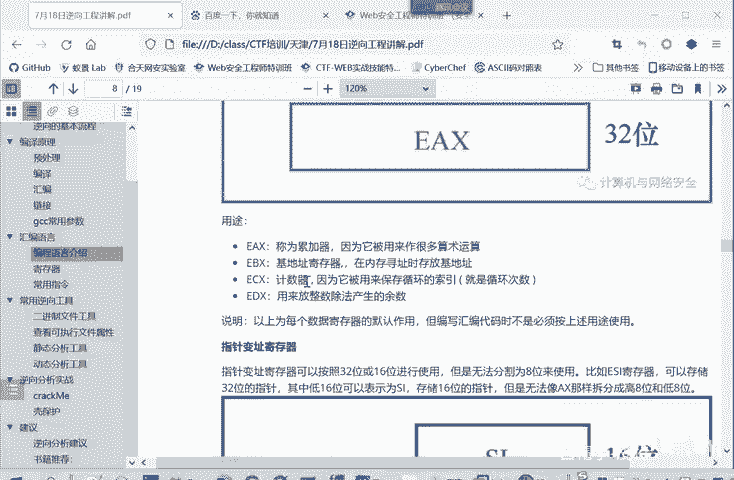

这个关。啊。AX他小写都是无所谓的。叫64位是R。然后32位的。就是B。

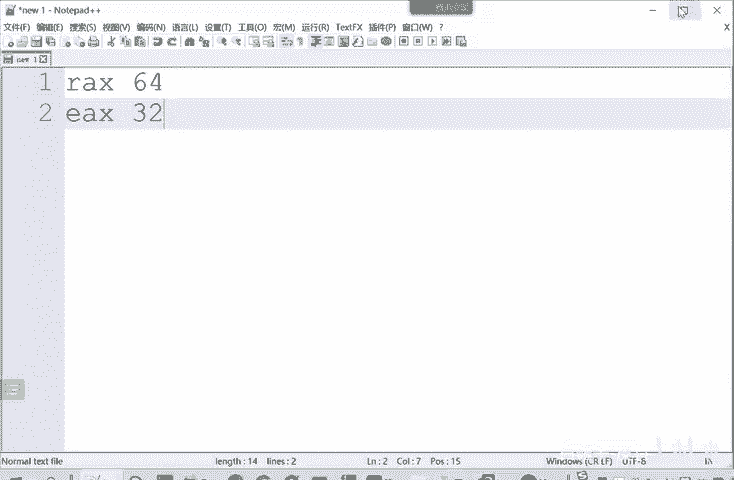

那么这个继存期怎么分呢？比如说32位继存申请。他第16位就是AX。他这是为了兼容以前的16位的CPU。那16位呢又可以在。划分成AH和ALH就是hiL就no高把位和低八位。

这是为了兼容以前的8位的CPU。就是你以前的那个8位的CPU程序，在我们32位的就CPU上也可以运行。你就直接使用它这个低把位或者高把位就行了。

那这个寄存器有什么作用呢？这个数据寄存器有它主要是来传递数据的，它有4个计存器。

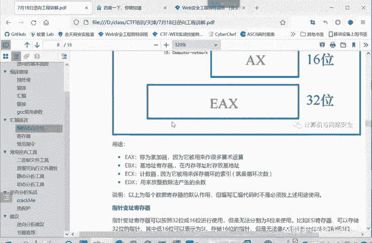

EAM就ABCDA呢是主要是累加器，它通常用来进行算术运算。他还会经常用来保存这个函数返回的值returnreturn多少，就是保存在这个EAX当中。EBX呢是机器式寄存器，常用来保存。

在内存寻址的时候，放这个基地址。

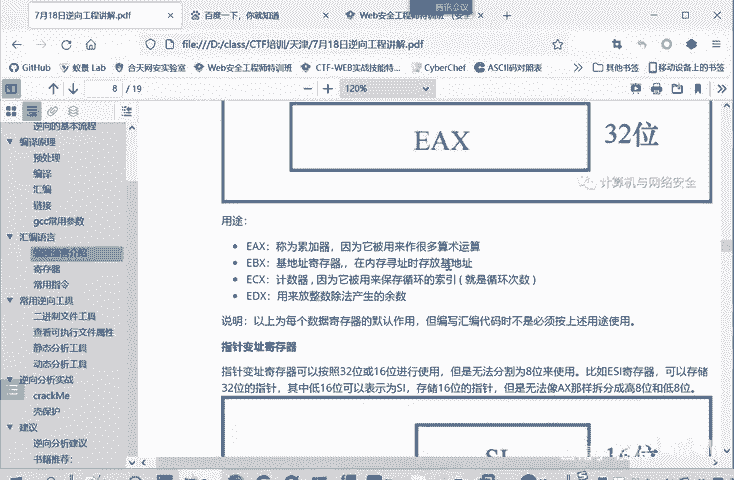

因为我们内存寻址寻址的模式，我们只要找到一个内存的地址。

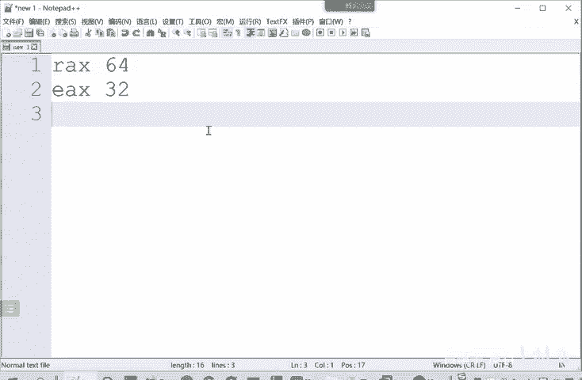

这是一个。微层地址是怎样确定的？这是一个第一地址。

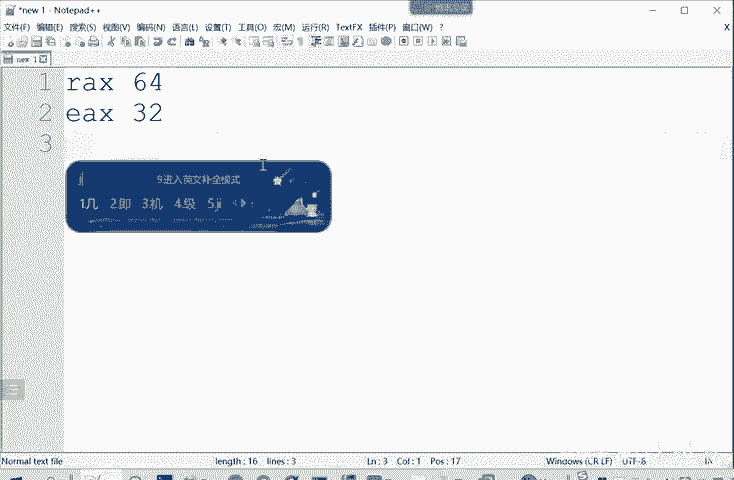

加上一个偏移所确定。

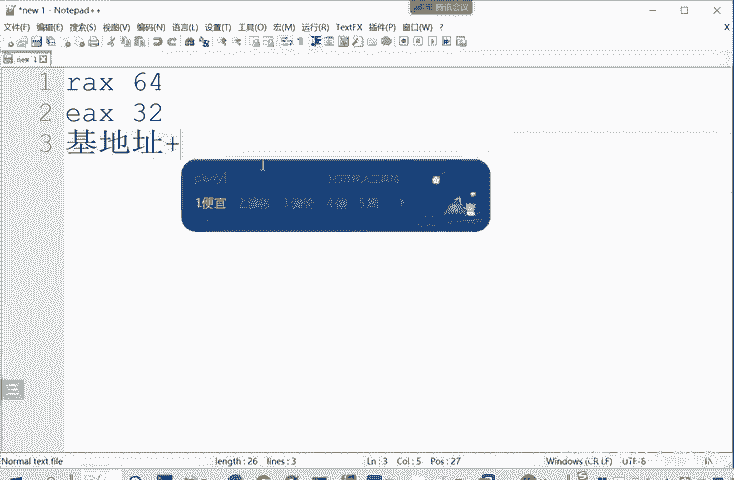

就是我们说以及地址。基础偏移，就是我距离这个基础是多远的距离。我和这个基础相差多少个地址。通过这两点来定位出你所要访问的数据，或者是你希望获取的指令，它的一个在内存中的位置。

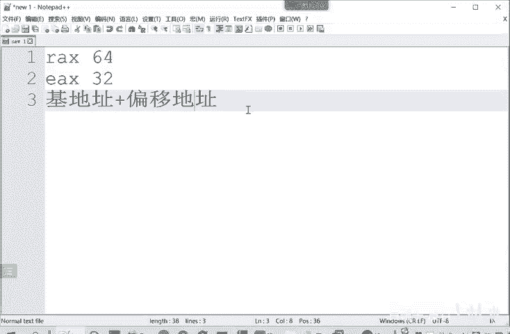

那ECX呢去记数据，通常用来保存这个循环的次数。比如说大家写C语原的时候，forI等于1。I小于100I加加，那100就是这个次数，它保存这个循环的次数。而EDX呢常用来存放整数除法，它产生的余数。

这是一个通常的一个作用。相当于是默认作用，它不并不是说这个每个基层器只能够做这样的功能。但是大家在进行一个软件分析的时候，通常这些计算器是执行这样的功能的。

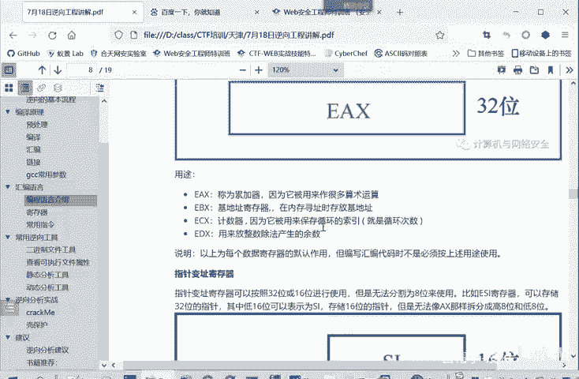

这意思就是编写汇编代码的时候，不是必须按照这个规则来使用这些计存器。但是你如果是编写的是高级语源代码，再通过编译器来分析得到的结果。编译执行得到结果。那这些寄存器的作用基本上就是按照默认默认的作用。

来使用。那我们进行意向分析，它大部分软件，绝大部分软件都是使用编译器得到的。并不是人直接写汇编代码，那还是非常少的。

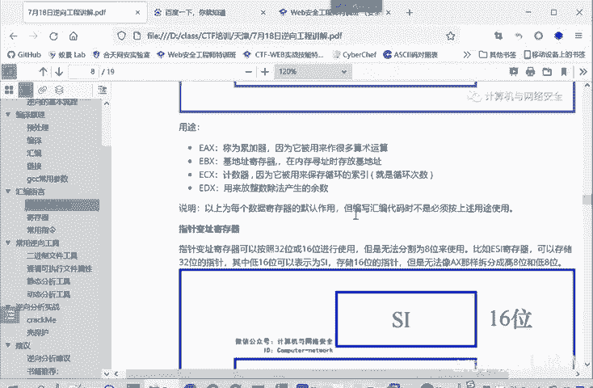

然后第二种类型的寄存器为指针变质寄存器，主要是SIDI这些。他可以按照32位或者16位来使用，当然也可以按164位，就是RSR。但是不能像我们上面讲的通用计有数据计算器呀，再划分成8位，这是不可以。

它只能到16位、32位。

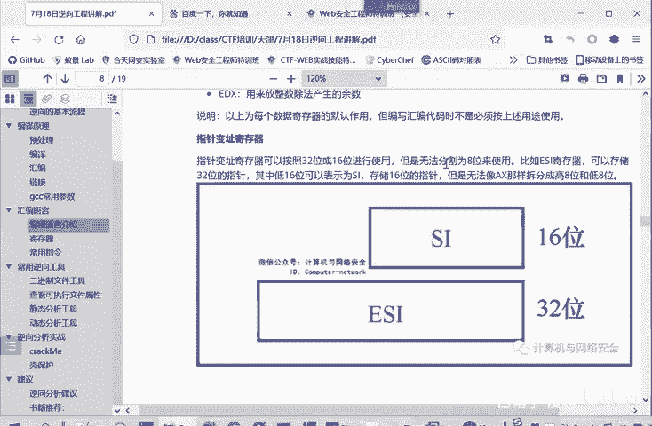

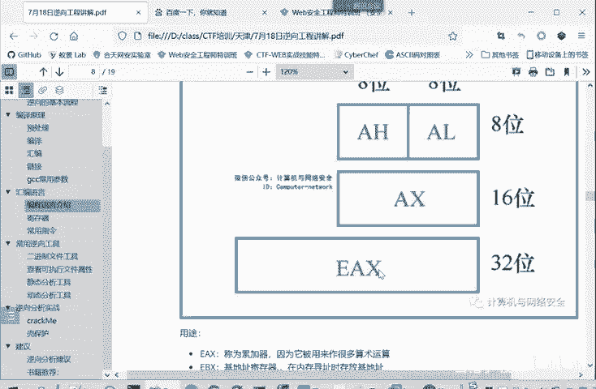

那16位的就叫SI，然后32位ESI64位的ISI这个规律大家应该。很熟悉。因为这些寄存性命密都是按照这个规律来进行的。

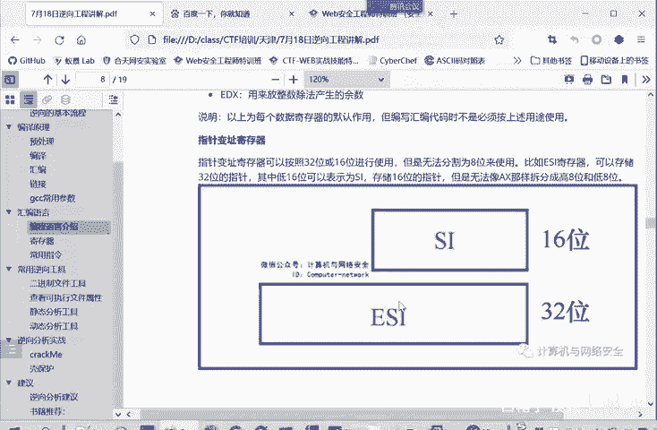

它的用途呢这主要有4个寄存器BPSPSI和DI用途呢BP就是BP和SP是一对，它是用来存放占信息的。BP呢贝ase就是存放占机制的寄存器。他说白了BP就是占第一。那SP呢就是站顶站顶指正。他是占地。

然后SI呢S是source，就是软源地址计算器。用于内存中数据的传送。它这里保存的是偏移地址，它断地址相当于基地址，段加上偏移就指向原数据串。那DI呢D就是destination。它是目的之针寄存器。

那我内存中数据传送的时候，我传送到哪个目的地行，一般就用DI。他去。全部的偏移地址就EDI它全部的地址就DS冒号EDI这就是G地址加偏移。或者断地水加偏移的这样一个。方式来确定它完整的提取。

这就是数据所到达的目的地。

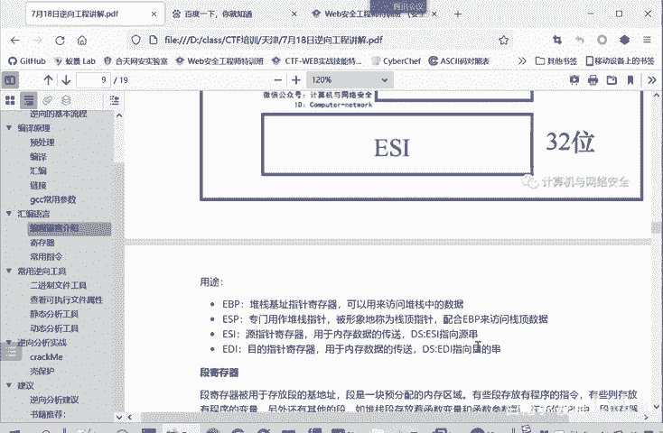

那刚才提到了这个断机层器。DS就是一个。数据的d。S是sment段dta segment数据段。断计存器呢是用来存放断的积进去。就我这个数据段。的基地址是什么？然后你SI就是我这个。

我去取我这数据段里面哪一个数据。啊，这个大家如果说有什么不理解的地方，也可以发在群讨论区里面，发在聊天里面。我们下课之前会回答一下大家的问题。段就是内存中遗块预分配的区域，还有内存，有数据段断码段的。

它有的段是存放程序的指令，这些代码段，有的呢是存放程序的变量，就数据段等等。在16位的CPU当中，但继存器呢只有4个，分为代码的code segment数据的吧？date segmentment。

然后堆栈段。这是tack， data下就tack。SDACKt的，然后附加段在32位的计存器中呢，又扩展了两个。分别是FS和GS。这都属于和ESA啊，属于附加的断寄存性。就是根据情况再使用。

前面的代码呢就是存放代码，数据段就存放数据堆账的存放这个堆账信息，这些大家都好理解。还要重点给大家介绍一个寄存器EIP或者叫I16位中叫IP。这个寄存器是保存的程序，下一条要执行的指定的地址。

指业地址它指令是存放到代码里面，所以它完整的地址就CS冒画这个EIP。这是机制，这是偏移。顺序执行代码的时候，下一条指令地址就是当前指令的地址，加上当前指令的长度。比如说我们嗯上面。会编成的这次。

这些啊C源代码，我执行完这条语句之后，怎么直到执行下一条语句呢？它就是时刻改变着EIP这个寄存器的值。这里是RIP64位，改变了RIP这个寄存器的值。当我执行这里的时候，执行了这条。

那RIP的值就指向了这里的地址。他就知道啊要从这里执行，然后顺序执行。当你使用括re的时候，你就使括re或者降糊这些调用啊，跳转这些命令。它为什么能实现跳转，它实际上也是修改的。

这个RIP这个寄存器里面的值，因为RIP寄存器就保定。存着我下一条执行的指令是在哪儿读？这是我们的RIP寄存器。也就EIP或者IP，这就是有64位、32位、16位这CPU的不同。

然后还有一个标志寄存器叫flag flags32位种叫efls。他实际上今晚扩展到32位，他只用了他的低16位，就0到15。他这个标志起在什么作用？我每进行一些。计算呢它它的计算的结果，一些标准存放给。

比如说这个ZF zero flag就零标注位。如果说你上一步运算的结果。你当前预算执行的结果是零的话。那么这个标注就是true true就是一就是标记为一。如果运算结果不为定，那就是false。

然后这个这一位就是零，所以我们通过这一位的值，这个计算器的值就可以判断运算结果是为零还是非0。其他的一些溢出啊方向这些啊，这都是写在表格当中。给大家查看的。大家一开始这些肯定是啊记不住的。

所以说要根据后面我们在实战的时候再进行一些分析。根据实战题目，然后再查按这些计算器的内容，包括前面讲的。EAXEBS这些。再明确每个基层其他的一个作用。这里只实先给大家介绍一下，有一个印象。

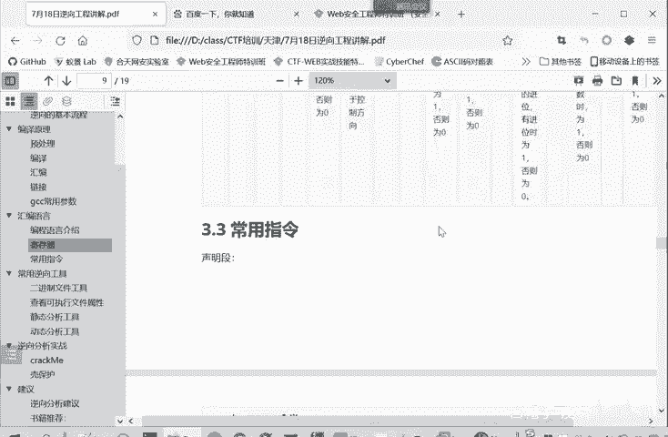

那么常用的那些指令呢，我们会员常用指令有哪些呢？比如说我们刚才。就是通过编译过程中生成的这个汇编代码。

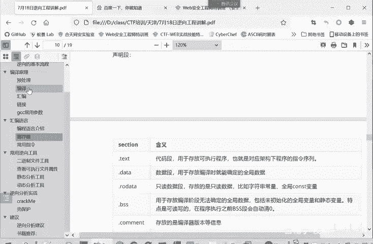

它里面就会出现一些这样的指令，是什么作用呢？点TXT就声明，这是一个代码段。点d呢就说明是有数据的。的存放数据。RO data呢就是read onlyRO嘛，只读数据的。存放一些常量。

或者是我们在写诗预言的时候。我们有时候会加上cost，定义这是一个不能改变能量，它就存放了read only的。这个段的数据是不能更改的。Yeah。点BSAS端呢就是暂时无法确定全局数据。

那程序执行的时候，这一段会这里面的数据会被清理。

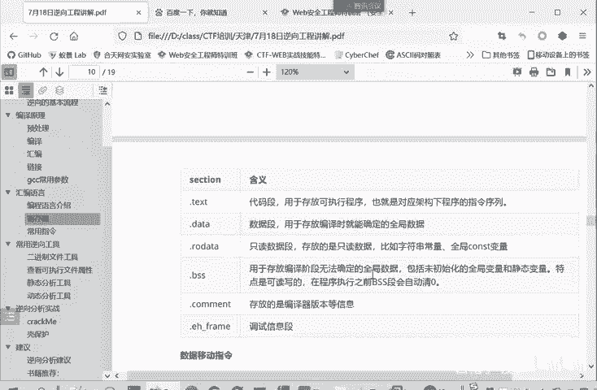

在权执行的时候。执行之前，这段数据就会得到确定。点comment就评论嘛，它是。实际上是一些方便调试的信息。

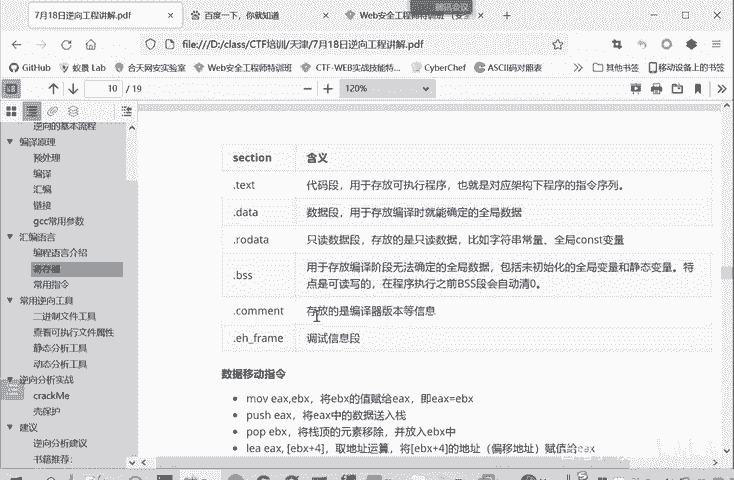

比如说他存放了我们这个。文件是由哪个编译器得到的？还有个EHF frame，大家自己。进行我们编译原理中这些过程中也会看到这个段，它是放着调试信息的。这是声一些声明的指令，声明段的一些指令。

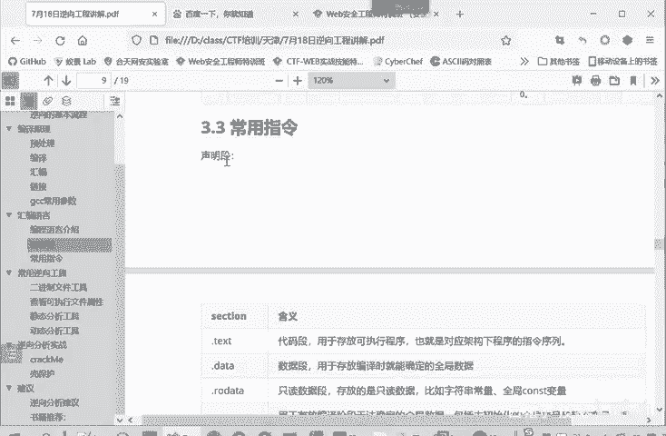

然后呢，在第二部分指令呢就是一个移动数据群。比如说有个木EAXEBX你看这个计算器的名字就知道这是1个32位的CPU在32位的。32位的程序，它在32位CPU上运行，但在64位CPU上也能运行。

因为它是兼容的，向后兼容的。他的作用是什么呢？就加EBX这个寄存器的值，大家可以理解为EBX是一个变量，这个变量的值呢赋给EAX简单点就这么个。用高级别的写法就是EX等于EBX。然后透气。

EX就将EAX中的数据入站。EX本身是一个寄存器，这个寄存器它是硬件，它是不能够入站的，它是将里面的数据存到站中。PopEBX popop就是弹出。他是将战警的元素移除，移除之后放在哪儿呢？

就放在这个EBX当中。这个LEA呢就是取地取预算。这里是将1BX加4，它这个地址。我们这里说的地址都是偏移地址。然后付给EX。

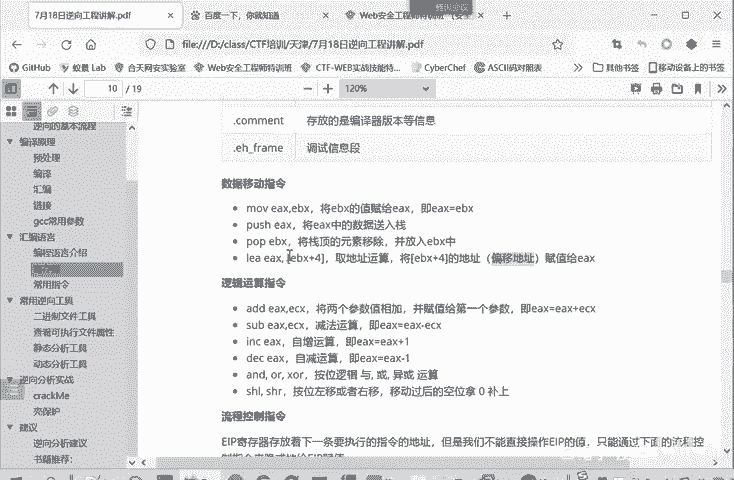

这是数据移动的指令。然后呢还有一些逻辑运算指令，比如说加减乘除增加adEXECS还是将两个参数相加，并将值付为DAX。第一个参数。用算数表达就是EX呢等于EX加上EC次X。将他俩相加的结果付给EX。

那s就减，这样大就好理解了，就是EX减去ECX值付给EX。INC呢就自增自增是增长一。EEC呢相当于就是字减减也是字减1，然后and were Xor就是它是按位的逻辑与逻辑或。这个按位就是按比特。

我们一字节是8比特。让SSHLSH就是移动嘛，L就nftR就right，它是按位左移或右移。移过后的空位上会补泥。这实际上就相对于一个乘以2和除以2的运算。但是不会要余数。用榆树煮泥了去掉了。

再就是第四部分的一个指令，我们的一个流程控制指令。EIP寄存器中存放着下一条执行的指定的地址。刚才我们说绍计存器的时候就介绍了。但是我们是不不能直接操作EIP的值的。相反。

相对应来我们这些EX啊EBX这里面的值我们在调试的时候是可以直接进行修改的。那么这个EX的值它不能直接修改，那它怎怎么样被我们所控制呢？我们怎样给它赋值了？就使用一些流程控制值。

比如说降JMP你一个lel或者一个地址。他就将程序跳转到这个参数指定的内存地址中执行。不JEJNE这是属于条件。跳战决定。相等的时候跳转或者是不相等的时候就进行跳转。或者call一个function。

扩调用一个函数，这也会进行一个跳转。re就是一个子函数返回的命ret相当于。他放回了上层函数，他也会。改变EIP寄存器的值，然后进行一个跳转。这些都是说跳转的情况。

如果说没有这些跳转的指令的那EIP是怎么改变？就是加上上一条指令的值。我们刚才介绍寄存器的时候。加强上一条指令的一个长度nice。那就是顺其直行，这些跳转呢就是。跳转到指定的位置，不按照顺序来执行。

这些汇编的秘密。