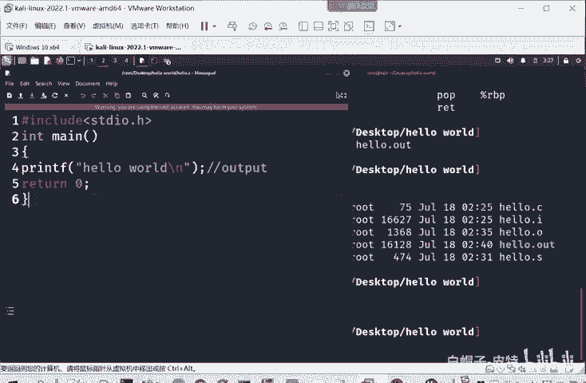
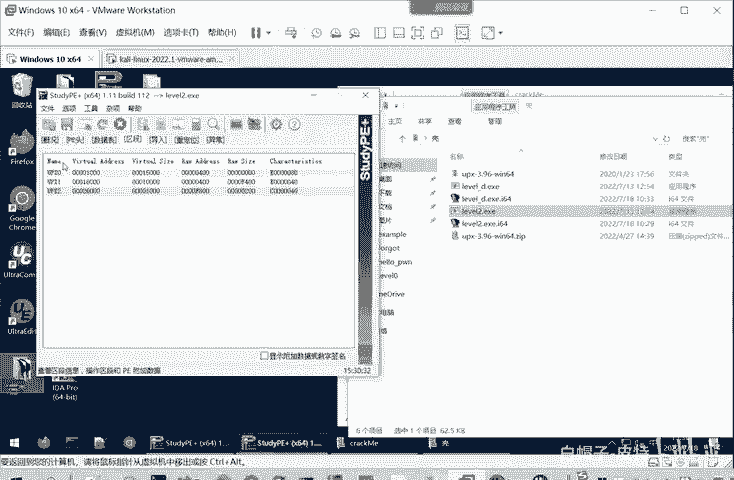
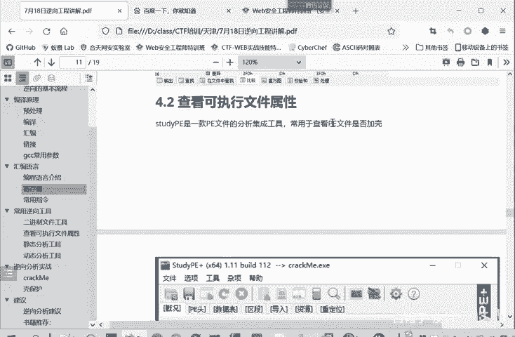

# 2024B站最系统的CTF入门教程！CTF-web,CTF逆向,CTF,misc,CTF-pwn,从基础到赛题实战，手把手带你入门CTF！！ - P29：逆向-常用逆向二进制文件工具 - 白帽子-皮特 - BV1m64y157UX

啊，这是汇编员的部分。就给大家介绍这么多，建当让大家建议起一个这样汇编也的意识。然后进入我们课程的一个第四部分，就是逆向工具的使用讲解。第一个是二进制文件查看工具。常用的二进制文件查看工具。

我们可以用这些工具来查看修改和比较二进制文件，常用的就有on his。然后user editit刚才给大家讲过L010ed这wint它是适合打开大型的文件。比如说大家要分析一个操作系统文件，好几个G。

都可以用调文his来打开。有tureed我们平我平常用的是比较多的。它可以用来打开文件，打开二进9文件。就是别的啊一些二进制文件也可以打开。也可以修改。比如说我们嗯放最上面。这你7F。

也改成什么00什么的12这都可以的。修改它的二进制域文件的X进行比比较。比较就要装个usU圈这个compare。你选择两个文件。然后进行一个比较。他告诉你哪些部分是相同的。

这灰色的部分是他们也相同的7F45什么什么，然后这里是不相同的，这是02，这里是03。就比较一般就是用于。比较两个相关的文件。可能他们俩就只有个别的。这个位进行改变。比如说就这里呃03和02的区别。

其他的都是一样的。就是个别物质的改变，导致他程序执行的代码就完全不一样了。通过这样可以进行一个比对分析。010AD的其实也是跟UE这个差不多的功能。这个图是一你和0原下好了，它进行比对之后呢。

它会把你个匹配的部分是一个颜色，然后差异的部分就是两个文件相同的部分和不相同的部分。它这个相同不相同，是指这两个文件的二进制。是否相同还是不相同？也是二进制文件的一个查看，但它显示结果不是二进制。

是16进制的，以16进制形式来显示。所以它以十6进制就是44位嘛，四个比特，然后两个16进制CF就是8个比特就一个字节。所以这也是第一个字节，第二个字节，第三个字节。然后我们再看一个工具。

就是查看可执行文件属性的工具。就是sidePE它是一个查看可执行文件的一个属性。比如说我们看一下。

嗯，先把这个。IDA关掉。比如说这个我们后面要分析这个correct me这个。程序。就和用starPE来查看一下。拨进去。这个文件发现它是32位的PE文件，那么我们就知道要用IDA32来打开它。睇会。

这样检测出来是64位的PG文件，那就用IDN64来进行打开。还这个文件的MD5值是什么？一个文件，它的文件名是没有意义的，这个文件名是可以任意修改的，不影响这个程序的功能。文件名只是为了帮助我们。

帮助人来理解这个文件是干什么的。你可以给他任意命名，不影响计算机执行它。他真正标识他的身份的呢，就这些哈希哲MD国或者沙万都可以。如果说你改动了这个程序，它的MD5值就会进行改动。

不你在要改动这个程序的一个字节和一个比特，它的MD5值都会发生改变。然后这个文件类型，这这里文件类型不懂的，可以把这个结果放在百度里面进行一个搜索。那么搜索呢。就可以知道，这是一个啊汇编语言。

的文件它没有加壳。那加壳的文件呢也有，我们来来看一下什么是加壳的文件。这个level2。1XE就是一个加谱的文件。我们把这个文件拖起来看一下。哎，这是1个64位的PE文件。那么要用IDA64来分析它。

这是它的MD5值相关值。而这文件类型是一个不知道的EXE type。那不知道我们再看一下这里是概况，我们看一下别的地方，P一头就要。我们分析理解PE文件的一个结构。才能理解这个P套。

他每一部分是干什么的。然后数据表。这里面有个区段信息，还是区段。我们看一下区段机这个UPX0UPX1UPX2这个UPX呢就是一个非常常用的一个加壳的工具。所以说这里基本可以认定这个程序是加过壳的。

所以才会出现这么多UPX的区段。

那到底是不是加入可能，我们后面再进行一个分析。这是我们star PE这个工具的使用，它就可以查看PE文件。的一个属性。他多多少位的你哈希纸啊什么的，它P文件图的一些情况啊，数据表啊，这些都是可以看的。

这是软件的一个截图。那个PE文件呢就是。P9是portable executive。你就exive。

它是windows下的一个可执行文件的格式。那我么在inux当中呢，我们就可以用readELF。因EIF是inux的可执行文件来查看。inux下执行文件的属写。我们看一下在迅行看卡里。我们刚才是生成了。

hello点out这个可寻文件。那么我们现在看一下。hello点out就可学性文件来个。情况我们就杠A参数，就是查看他的所有信息。这些信息都给我们显示来的，他比较多。

我们把这个信息摘摘取到这个课件当中了，大家可以在课件当中进行看。前面呢是一个magic，就是一个文件换术。它是标识你这个文件的类型的。大家自己去打开二进制文件。

就可以发现这个文件话术一般是前10个字节左右。有的6字有的8字也根据不同的文件类型有所不同。比如说你同时打开多个PN机的文件图片嘛，你会发现尽管图片内容是完全不相关的，但是他们的文件头。都是相同的内容。

但然不是这个7F45啊，这是可执行文件的。PNG文件它的文件同中相同，不你打开几个GAF文件。后点打开一些可执行文件，你发现只要是同一类型的文件，它的文件头都是相红的就叫magic number。

中文呢叫文件幻术。我们上次讲那个文件上传的时候，就提到过这个文件换术。这就是这是说的一回事儿，就是那个文件换术。然后它的文件类型呢是EIF64位的。就是readEIF是一个文件查看工具。

那查看呢通过这个3DPE或者readdEF了解这个文件一些总体情况。我们后面呢就可以进行一个静态分析了。静态分析呢主要是用到。

