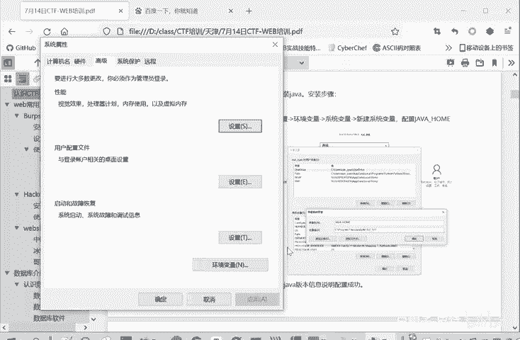
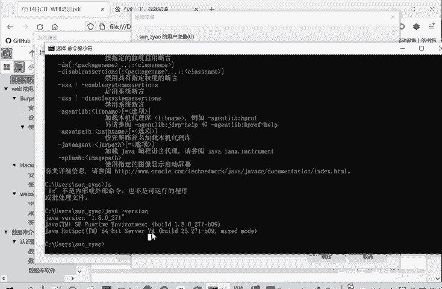

# 2024B站最系统的CTF入门教程！CTF-web,CTF逆向,CTF,misc,CTF-pwn,从基础到赛题实战，手把手带你入门CTF！！ - P2：web-web常用工具-burpsuite安装 - 白帽子-皮特 - BV1m64y157UX

啊，那我们现在进入的第二部分，就是一些外部常见工具的一个使用安装使用。然后昨天这个工具已经是发到群里面了。那么我们首先是看一下这个bp suit是如何安装使用的。

那么bp suit呢是我们非常我们抓包改包啊一个必备的一个工具。可以说。所以我们这里先学习一下barb suit如何安装使用。bb suit它的运行呢需要一个java环境。

所以我们要首先安装javaJava的安装程序呢也是在昨天的工具包里面，我们看一下。就是。这个工具里面有个基础工具，然后里面有个javaJDK这个。8U121windows叉64这个EXE。

大家直接双击打开，然后。点击安装就可以了。然后。安装的过程就自己选择路径就行了。因为我这里已经安装过了，我就不重复安装了。这个安装的部分呢。是默认，你可以选择默认安装也可以。可以选择默认安装。

也可以自己修改路径。这个相信大家都是会的。然后。这个关键的部分呢需要给大家讲的，就是说要配置一个环境变量。环境变量在哪里？在我们高级系统设置里面有个环境变量。比如说我们。可以打开设置。

但大家这个不太清楚每个设置在具体在什么位置的时候。可搜索一个。你直接搜索就行了。在设置里面直接搜索，然后就会打开相应的设置。比如这里搜索高级系统设置就会打开这个系统属性的设置。然后这里个环境变量。

我们点击环境变量，然后点击这个系统变量这一块，因为系统变量它的权限比这个它优先级比这个用户变量高一些。所我们在系统编加里面。如果之前没装java了，就没有这个java home。这一项。

那么你就点击一个新建，新建变量名。🎼就是这个java home，然后变量值呢就是你安装java的路径。看你是默认安装的，还是说你自己选择一个路径进行安装。让配置好了之后呢，就是一一直确定。

点击确定就配置生效了。最终的效果是什么呢？本来你把家班安装好了，你再。随便一个路径下，你只要不是java的安装路目录，你输入java是会给你报错的。像这样。我会给你报这个家吧，不是个内部或外部命令。

那你如果说把这个环境变量配置好了之后呢。你在这个终端里面。在任何路径下都能执行java，你可以看到java的。版本信息。那就是你这个安装和配置环境变强成功的一个标志。

就在高级系统设置环境变量里面，环境变量，然后这里面系统变量，你新建。变量每些java home都是大写，然后变量指的就是你这个java的安装路径。这样保证你在命你在命令行里面。

任何路径下都能使用java的命密。啊，这里看大家也给大家截图了。这是一个java的一个安装。安装好java之后呢，我们就可以。安装这个bb suit了。bb suit的那个程序也是给大家发送了。

首先把这个进行一个解压。解压之后呢，就会得到bp pro和bp load这两个文件。你如果直接运行bpro呢，它是要你激活的。啊，如果说要需要绕过这个集合，为了学习的目的啊，我们绕过这个集合怎么绕过呢？

就是打开这个b load。但是这要先装加吧才行啊。你看这GL。要打开这个JAR文件。有java的命令，然后点击这个run。他就会启动这个下面的。这是我之前的一些抓包的情况，把它删了。

就会启动这个bp suit。但大家初次启动不是我这样子，因为大家启动有一个激活的过程。大家起动去。应该是这样的，要你输入这个license k。niceK在哪呢？就在这个。

这个nense里面把它全部复制，全选复制。就license key，然后点击下一步，后面有个手动激活。你看。manual， manual activation，手动激火。手动激活里面有个二这一项。

把它放在我们b分段里面。这这里面。request当中。然后呢，它会生成个response，自动生成的，再把这个response复制出来，你把二放在这个request当中。

就会自动申成这个response把response复制也是全选。这个框里面所有内容都复制。然后放到这个8部。b suit更案3这个内容当中，然后点击下一步。就可以完成一个激活。激活的后面再怎么用呢？

后面用的时候还是不能够直接的打开这个bp suit这个程序，还是要打开barp load，再点击run，就像刚才那样点击run，你就打开这bp suit了。这个时候就可以直接用了。你是一个临时的工程。

还是一个新工程？就可以直接进行使用，不需要再重复的这样一个激活过程了。

刚才的这个激活操作进行一次就可以了。