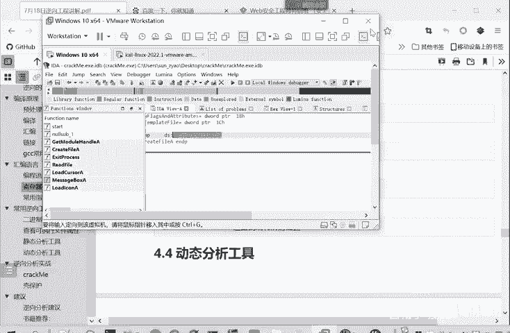
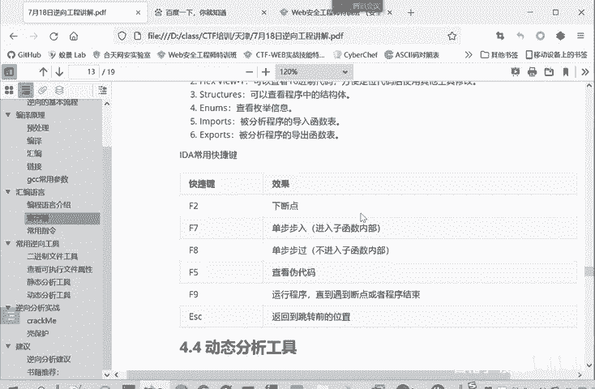

# 2024B站最系统的CTF入门教程！CTF-web,CTF逆向,CTF,misc,CTF-pwn,从基础到赛题实战，手把手带你入门CTF！！ - P30：逆向-静态分析工具 - 白帽子-皮特 - BV1m64y157UX

这个。静态分析工具就是IDApro。嗯。IDApro呢，它是。交互式反汇编辑专业版的一个缩写，简称呢就IDA我们一般就把它称作为1个IDA嘛。嗯。😊，它是目前最强大的一个静态反编音软件。

可以说是我们进行逆向分析，或者说有的人对那个胖感兴趣CTF当中的胖。进行胖分析的一个必不可少的一个工具。IDApro呢是一款交互式的可编程可扩展多处理及多平台的一个静态分析软件。当然也是要付费的。

尽我要付费，但是确实很好用，功能非常强大。IDpro是已经成为了事实上的分析恶意代码的标准。那么我们使用IDA打开程序，IDA就会对打开的文件进行自动的分析。

它会识别程序中所有的函数以及可能用到的库函数数据结构。分析完了之后呢，IDO就会显示主窗口。它这个窗口我们看一下，主要有第一个这里是一个代码块，它是对不同的代码块进行了不同颜色的一个区分。

因此呢我们可以直接点击这个相应代码块来定位到不同的代码。这第一部分这个代码。然后第二部分呢，这是函数列表窗口。我们先给大家介绍这个窗口，后面再实地打开这个程序，然后大家。看一下谁打嗝的效果。

这里是函数列表窗口，就是罗列了IDA分区出的所有的函数。然后第三个呢是IDA的主窗口。它是显示一些这程序的代码呀，不管是汇编代码，还是说伪代码，或者说程序它的控制流程图。这点四呢是一个小窗口。

有控制流程的一个缩越图。第五，这里呢是一个终端，它可以执行pathon脚本。我们这里打开看一下。Yeah。我们直接打开，我们要分析程序，可以看到这是不同的代码块。

你定位点击不同颜色就定义位到不同的一个代码块。然后这边呢是IDA分析出来的函数。这是start这个函数。然后还这里就是一些库函数。message books弹框的这里是函数的一个总体的一个。控制流程图。

这边呢就是4号窗口，这是一个缩页图，这里可以移动。然后这边呢是52窗口，这里可以执行pathon的命密，这是一个输出窗口，你执行pathon脚本进行一个输出的结果。这是IDA的一些主要窗口。

那么IDA中。他主窗口。中间这个是主窗口，它里面还有多个子窗口。通常有IDFUA趋势默认显示当前函数控制流图，然后his you。是显示这个程序的1六进制代码。就以实用性决的方式来显示这个程序的内容。

structure呢是查看程序中写的人员结构体信息。ous是查看枚举信息，然后inport。导入产生导入的，还是说用。export呢是导出。这是UA，这是。啊，这些还。他现在是。一些问题。

因为打孩的时候遇到的一些问题。这实用进者来查看这个函数。所以这个IDA它其实本来是一个静态分析软件，但是它所版本的根结它是越来越全面的。但这实用性者查看的，比如说我们是UE的。功能它也具有这个功能。

所以它是越来越全面的。包括后面你讲的动态分析实际上。这个IDApro它也具有动态分析的功能，而且也很强大。所以他去朝着越来越集成全面的方向啊进行一个发展。structure分析说结构体是。

因为我们这个程序。不是很复杂，所以没有一个结构体，这些媒体信息，这是导入的函数。导入函是就是库函数。就是函数的名称，函数的地址在群序当中的地址。而这函数是来自于哪个库？科了32然后Uer。

GGDR就是来自于不同的酷。导出函数了。就是它不是有到库函数，这是外界执行的函数。Stuck。这就start。在这里执行。这里面都是我们刚讲的的用汇编代码库写入站括调鱼函数目移动数据的移动数据。

然后又入站。这里第二个函数CMP就比较比较这ES和这0FF0FFF全是F就代表是-1。标EX值是不是-1，然后这边是跳转，看是否跳转到这个look440109A这个标签当中。跳转的话就到这里执行了。

不跳转的话就到这里执行。这就是程序出现的一个分支。这个IDA帮我们分析出来的东西。然后ID常用的快捷键给大家介绍一下，就是F2就是下端点。就是我程序执行的时候，你不下端点，它就直接运行到程序结束。

你下端点的话，它就会在指定的位置停下来。一可在停下来之后进行一些查看。这个他程序所处的位置，它执行哪个代码块啊，查看继成线内容等等。这用于动态调试。FCC呢就单步运行动态调试的时候。

你一步一步执行这个汇编代码。F7F8都是单步运行，区别呢F7是单步注入。就是像这种你跨一个函数。这个函数里面是有很多内容的，它要执行很多操作。F7呢就进入这函数内部再执行操作。

哎，等一下。

然后F8呢，就是把这个括当成一个。一条整令它不会进入这个它调动的函数的内部。所以F7是单步步入，进入此函有内。F8呢是单步步过。不尽如此还有内。F5的是查按伪代码，查按伪代码是什么意思？

比如说这里是合我们分析出来的函数的起点是在这里执行start。这个是汇编代码。但是有人说叫汇编代码不是那么好理解，虽然要看也难看，但不是那么好理解。这个时候大家可以使F5键。嗯。进行一个汇编分析。

它可以。分析成一个反汇变的一个伪代码。因为我们但它它不是每个函数都能反汇变。都能反面。比说这里他就是反变译失败了。那也有能够反变译成功的。比如说我们。打开另一个。嗯。

我们又打开这个这个函数看起来复杂一些。我在这儿这是汇编代码，我们可以按一下F5。它就会买反会变出C语元的代码，这就C语元代码int64进行一个变量。布尔电量inter对吧？然后后面的操作Y就是循环。

那里面进行采用什么操作，负值，然后加减一运算什么的，这就是C元的代码。它叫伪代码，意思就是我们这个C源代码和这个是起到同样的一个功效的。喺即边。

但不一定你你这个汇编语言就是由这些C代码所编译过程编译过去。F5就是查看。得到了C元的伪代码。F9呢就是运行程序。直到遇到断点或程序结束，ESC呢就是后退退回到之前一步的位置。嗯。这ID这个静态工具呢。

介绍就给大家介绍这么多，然后后续使用。会在使用的过程再给大家详细介绍。因为现在给大家讲太多的话，大家没有感觉，就在我们。这个cret me这个程序的过程再进行详细介绍。

