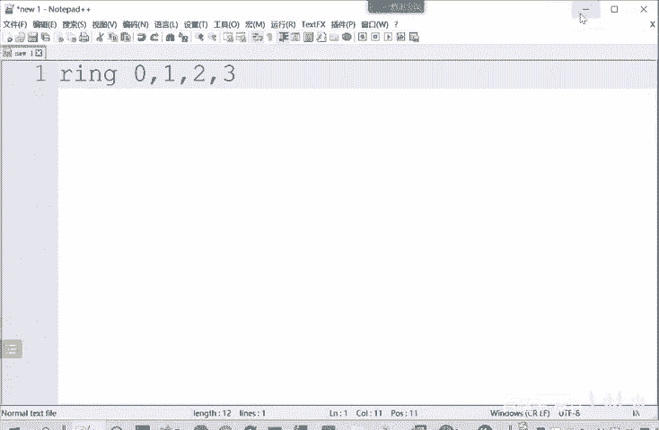
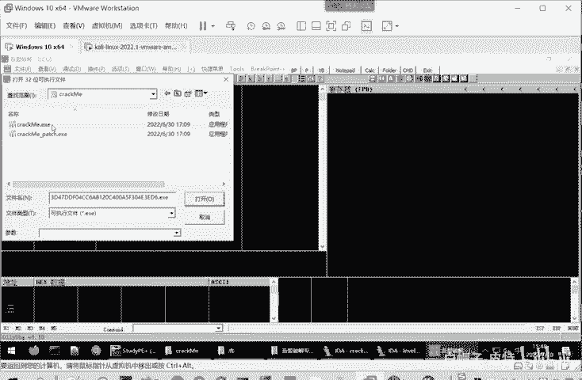
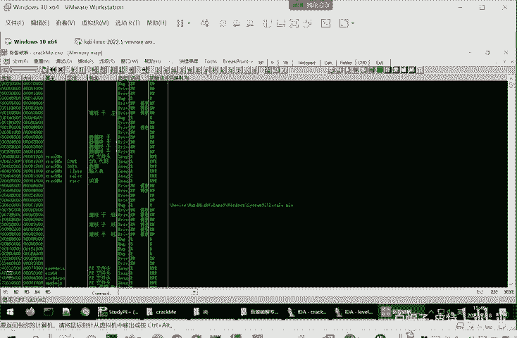
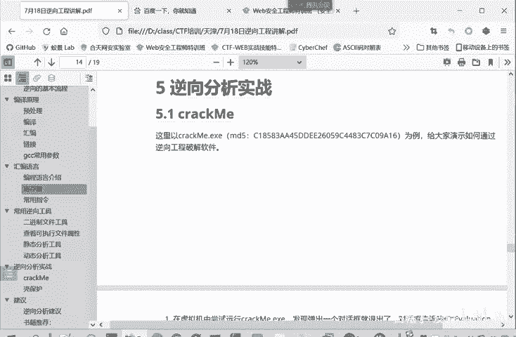

# 2024B站最系统的CTF入门教程！CTF-web,CTF逆向,CTF,misc,CTF-pwn,从基础到赛题实战，手把手带你入门CTF！！ - P31：逆向-动态分析工具 - 白帽子-皮特 - BV1m64y157UX

那我们看到静态了，再看一下动态的工具。动态调试呢就是在程序可执行程序的一个运行过程中来查找和修正程序当中的语法错误和逻辑错误。我们这节个就给大家介绍是on尼 debug。

大就用别的文64Dbug叉Dbug叉64Dbug文Dbug那都是类似的。就以这个onitbu为例来进行介绍了，它简称是OD。是一个windows下run三级的程序调试利行。主要是用于动态调整。

什么叫润三级？可润的级别呢就分为0123。您呢去实一下内核。内核的权限。三呢这一个用户权限。12是预留的，没有实际的使用。

就是说OD呢是调试用户态的。比如说我们现在就是用户在使用。那内核态的OD是不能调试的。他主要是调试这个润三级的一个程序调试利器。就我们这用户它的都能调试。Yeah。所以大家这些运行的软件呢。

它都是能调试的。如果说你要分析一个操作系统，它的运行的逻辑。那这个OD可能会遇到一些问题。那下面我们介绍继续介绍这个OD。这OD的就是。我们选择一个可执行程序打开之后。

可以看到OD加载可执行程序的一个界面状态。这是它的界面，它默认的主界面呢是CPU窗口，这是它默认的主界面。CPU窗口有5个子窗口组成，这叫反汇编窗口。这里是一个汇编带机器码，然后汇编命令。贵编的。

地址就是机器嘛，然后。得到的对应的汇编缘的命。这里是注释，就是你调试的时候，你会要加一些注释。我这里这一句话是干什么用的？这个 meaninging是什么读取口令啊什么的，做一个注释，方便自己。

进行一个调试。然后右边这里是一个寄存器窗口，它是存储寄存器的信息。因为我们动态调试要经常查看。在某一个状态下，这个计存器的值是多少？然后这信息窗口就是信息窗口，就是显示一些输入输出信息，这是数据窗口。

下面数据窗口呢就是。可以查看对应地址的它的值ps数据就16进制数据是什么？最后这也是对战唱歌。堆站上就是显示堆站的状态。他叫一个D站窗口。我们打开一个程序看一下。on need节班。

刚才打开这个软没打开，没有打开程序，就是这样的。我们打开一个可学程序。就打开我们的cck me这个程序。

我们当前显示就是个CPU串口，就是汇编窗口。地址汇编代机器码，然后汇编代码，然后你这里可以自己加上一个注释。这里是一个注释信息。自己标注这句话是有什么作用？这是数据，这寄寄存器。

你看EX它值ECXADXABX它们的值。对战。输出信息和有数据窗口，这是他的窗口。这就是我们最主要用的窗口，我们别的窗口也可以。大家点击这里memory。内这是内存的一个窗口。C呢就CPU窗口。

我们刚才主要的。

点击这也可以切换窗口。其实我们最最主要的用的还是这个CPU窗口。下面呢也是详细介绍一下这个CPU窗口。它里面此窗口就返回边窗口，它分为地址栏。She。这是我这个命令的地址，当然这个地址也是相对地址。

然后这边呢就是十六进制数据。然后这是反汇编，然后反汇编的，然后最后是注释。信息窗口是用于解码反汇编窗口中选中的。第一个命你的参数。就是信息显示在这。那数据窗口呢主要是我们来查看内存中的数据。

比如说有些内存它。要操作的数据的地址是存在寄存器当中，那么你就查看对应在寄存器它的值，然后在这里查看地址，跳到这个值这里，然后查看它的具体数据是什么。寄存器窗口就是用来显示了。

当前所选线条CP计存器中的内容。这个窗口呢同样可以让我们修改寄存器。这里计存器的值。是可以进行一个修改的。这个递增递减或者是修改成一个多少都是可以的。但EIP这个计存器只是不能够用这种方式来进行修改的。

它必须用什么跳转命令啊这些来修改。最后呢就是一个堆站窗口。用于显示当前县成的一个堆栈。当被调试程序暂停运行时，A站窗口呢一般会自动滚动，将当前的ESP指向的地址放在窗口的第一条。就是显示堆站的信息。

Oh。啊，这是对战的窗口。那么这些长的工具我们介绍完了之后呢，我们就。看一下这个逆向工具的一个实战。

