# 2024B站最系统的CTF入门教程！CTF-web,CTF逆向,CTF,misc,CTF-pwn,从基础到赛题实战，手把手带你入门CTF！！ - P32：逆向-逆向分析实战（上） - 白帽子-皮特 - BV1m64y157UX

你向分析为师长，我们具体分析一些程序，看他是。一个什么样的功能？比如说我们这里correct me这个程序给你它的MD5值的是这个。给大家演示如何通过地项工程来破解软件。这里这个步骤都给大家写好了。

大家后。后面自己去操作一下。首先呢我们是在虚拟机中运行cor me程序。这里给大家强调是在虚拟机当中。因为我们在进行一个软件分析的时候呢。经常需要分析一些病毒程序，如果直接在本机运行的话。

很容易把本机中毒，或者说使本机一个崩溃。那你主机这个调试起来修复起来比较麻烦。

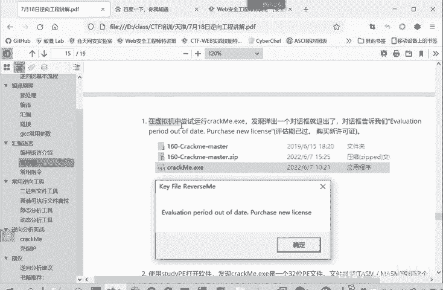

所以让他在讯拟机中运行。大家拍摄了快照。我直接恢复到快照就行了。🤧嗯嗯。啊，直接恢复到快照。这样即使重病毒啊也能够清除病毒，所以让你再去信息里面一些。比如说我们先把之前的那个。之前的内容都关了。

我们就拿到这个题。我把这个程序复制出来。本来这个题呢就只有这一个程序。在现在目的呢需要破解这样一个程序。

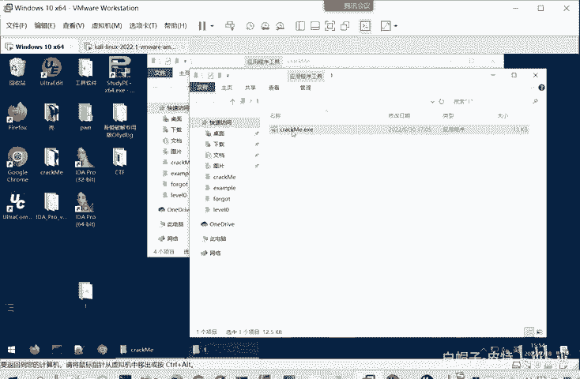

或者就要破解这样一个软件。我们学在虚拟机里面运行一下，现在我们任何信息都不知道。

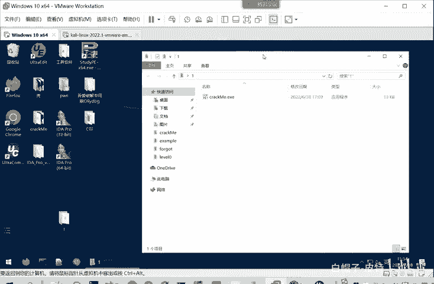

啊，运行一下，他给我报说我们这个。有效期已经过了，让我们重新购买这个license。就是大家使用软件经常遇到这个情况，说已经失效了。要输入激活码，这都是一个意思。

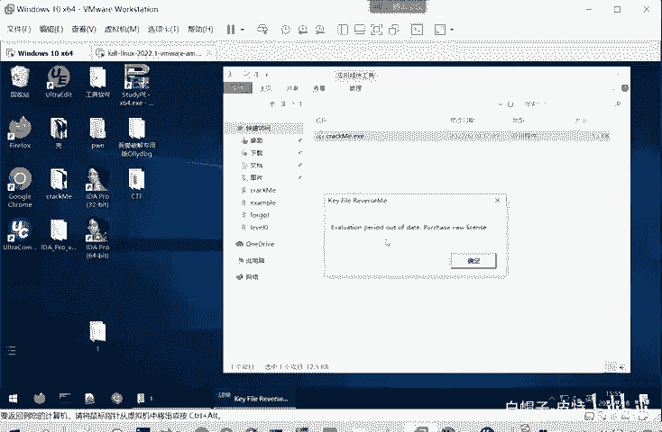

这是我们第一步先运行一下。

看看这个程序的一个情况。那第二步呢，我们可以用 studydy PE打开这个软件。打开之后会发现它是1个32位的PE文件。那我们在虚拟经元打开。

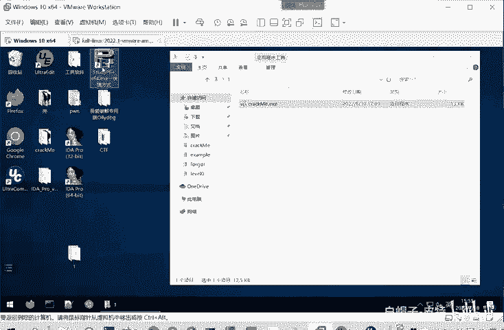

就用starPEstar DPE然后选择文件。你把这文件直接拖进来也是可以的。这里呢就告诉你们是325的PE文件。这里呢是告诉我们没有加壳。夹壳的一般文件类型是on no或者是UPSX什么的。

主要是这些。没有夹壳儿。而且这是用一个汇编语言写的一个程序。所以我们刚才进行1个F5反汇编的时候。就难以把它转换成C语源的为代码。因为它不是用C语言写的。CRE也不知道把它转换成什么样的C语源代码。

第三步呢，因为它是1个32位的PE文件，所以我们可以使用IDA32来打开软件进行一个静态分析。嗯。我们使用这个。IDA32来打开这个。大家选欢032，直接点击快方式打开有3个选项。6就是。

你打开这个会让你选择一个新打开一个文件够呢，就是先打开这个软件，后面再选择要打开哪个文件。previous就是打击开你之前打开的那些文件，选择一个。

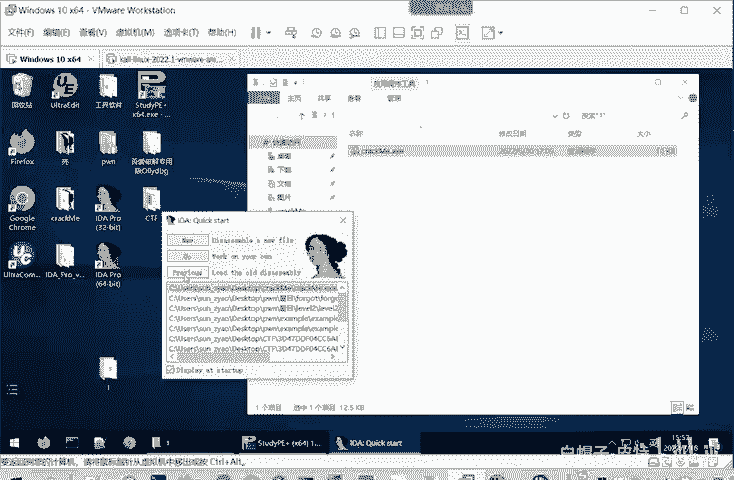

我们这点击6，它就会让我们选择要打开一个文件，打开这个。需要破解的文件。它这个我们自动识别出来，这是个PPE就是portableexact这PE是80386，也就是22位的PE文件。一般情况下。

按照默认的识别就行了，也就OK他就帮我们进行分析。嗯。啊，这些我们一个分析的结果。这里呢是一些导出的函数。并且是他分析发现的一些函数，这是函这是程序缩维图，按住ctrl加入鼠标键，可以放大缩小。

这你看呢移动显示的位置。这是程序的一个整体的一个流程。然后我们这时候可以看一下的吗，它引用了哪些函数。有那很多苦海状，就还。所以这引用的部分呢，大家看一下先，重要是导出的exports。导出start。

他有的会导出闷啊，或者是导出一个sstem什么的，系统函数都有可能。那么这个start就是程序的一个起点。我们点击start双击。就跳到这个起点这里了，我们可以放大再看一下这个内容。啊，这里是汇编的。

如果说你觉得汇编不太好看，你就返汇编。反汇编成一个伪代码，因为它这是本身就用汇编写的，所以没法转成这个C语源的伪代码。那我们那就只能看汇编了。这着我们我们看那是不是从第一条语句开以看的。这个显然不是的。

大家进行一个逆向分析的时候，注意，不要陷入到细节里面。因为他这个代码是非常多的，这还是个简单的程序，代码量是比较少的。后面大家做题的时候会遇到一些站略非常多的一些程序。你从第一条开始看。

你这看了几个小时，还没把这个程序看一遍。大家不要陷入到这个细节当中。我们要从整体上把握。比如说这里很明显是有两个分支。这个分支内容很少，这个分支呢下面还有很多分支。那我们就可以看一下这个分支是什么。嗯。

我们放大看一下。这分支就是判断EX对是否等于-1。来进行一个跳转。他不等于的话就跳转到这等于跳转到这儿。这里是做的什么呢？这里利用IDA给我们分析出来字符串。

你看Euation period out of date。是不是我们之前运行的时候打开的？字幅差。这个message books呢是一个系统函数，它就是用来弹出那个对话框。

所以这里我们可以知道我们直接运行的话，事实上就走的是这个分值。把，这些信息给我们弹出来了。

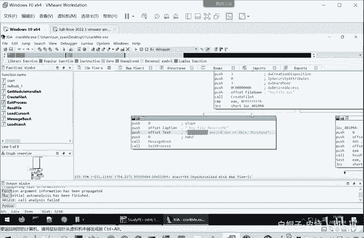

那我们现在要破解这个权序，就是希望他不走这个分值，是不是？有这个分支他直接。就报这这样的错误了。所以我们就要分析上面这一点内容。这些内容。因为这一些是。这个分支口。他是来决定。到底跳选了什么分支的？

所以自然而言这一块。就这附近也不是说三行或者四行吧，就这附近的一些代码成为我们分析的一个重点，是我们重点要看的。这就是一个。使用IDA打开软件一个。使用的一个过程。那我们细致的分析。这一块是干什么呢？

我们要充分利用IDA帮我们识别的注释。因为它原始文件是二进制文件，我们是没法看的，必须要。使用ID给我们分析出来的函数，分析出来字符传来进行分理解。这你前面破写。push push析，这些都是入账。

但是。是什么做呢？就是。入站就是函数的参数。因为这是32位的一个程序，它是通过栈来传递参数的。就是比如说我们写1个32位的一个。还是加法。电台。In特币。颜色。ABC这个d是一个函数名嘛。

ABC是通过什么传递的？

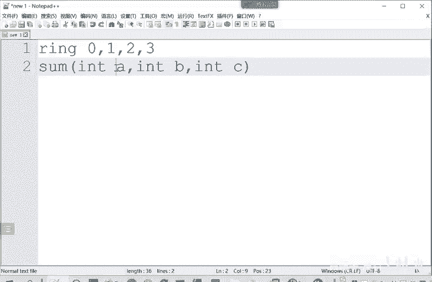

在汇编语32文里面，就通过push的方式。把ABC分裂压入战中。当然是按照CBA的顺序来进站，64位的话，会把前6位放在寄存器中。后面如何超过6位的参数放在站中，32位的是直接全部放在站中。

这是他们的一个区别。这前面的是参数入站。它参数入站这些数字呢先不用看，它关键信息是什么？fiile name。文件名文件名是什么？可 file点 date。K饭点D一T。然后。

create file a就打开这个文件。那很显然，这一步是打开。这个可以fi点date这个文件。在其他的猜质就可能是以读的方式打开还是写的方式打开，打开之后读多少字节等等。这些细节我们就先不用管。

千万别陷入到细节当中。说明这里是进行了一个什么呢？就是打开这个文件。打开这个文件之后，它的返回值就是EX有两种可能。打开成功了。就会跳转到这儿，打开失败就会EX值就是FFF它就会跳转到这里。

接下来就走到这里。那说明需要存在一个key file点date这样一个文件。这样才会跳转到这里，才有一个破解的可能性，是不是？那就算跳转到这里之后，我们看接下来这里它也存在一个跳转，它有两个分支。

是不是？我们看先看这个分支下面有多个分支，先看这个情况简单的分支是什么呢？这个情况简单的分支是一个K file reverse me。K file意思。Not many。这里可以这啊。

我们顾名思义可以理解为一个。啊，训练码。是不是？或者一个凭证文件。所以说呢这个凭证文件呢是无效的。那说明不能走到这个分支。然后这里呢走到这个如果说不走这个分支，走到这里分支呢，它也一两认可的。

他说明还是要走这个分区才能到正确的。这个分支呢这边。这边走过来，另外这边是一个循环结构。左边啊这里是一个循环结构。那么循环就有一个终止的时候。所以走到这个分支之后，它必然要经过这里的分支。

因为循环必然要结束。所以这里分解它有同样两种可能，一种是叫暴证无效，再就是跳到左边跳到左边呢最后到这儿，这就顺序执行了。顺序执行那就是有reyd恭西，那说明这就对了。因此呢我们通过静态的分析来看。

程序要想它破解的话，我们就要有一个Kfi点date这样一个文件。这个文件里面呢还要有符合要求的这个验证信息。是。使这个程序能够按照。从这里跳到这里直线，然后再到这里直线，再到这里直线。最终到这里。

然后在这个分值再跳的时候，再跳左边这个分值。

达到这样一个目的。当然，这都是我们静态的一些看法，一些猜测。到底对不对呢？还得我们动态调试，把这程序运行起来。这就是前面给大家啊，这里我课件主也给大家写了。这里是一个调试的显示的信息。

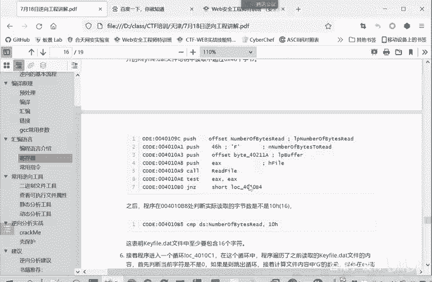

那我们进行一个调试，怎么样进行刚才是我们静态的一些。猜想嘛，因为逆向就是这样。七分飞写，三分靠猜。猜是不可不不可缺少的。那么我们现在就会进动态来验证一下动态怎么运行呢？用onitbug是可以运行的。

那这里呢我就还推荐大家用这个IDA来运行。因为IDA现在它集成了动态分析的框架非常强大。只要用这一个工具就能够完成动态静态的分析，而且静动态静态分析都在这一个框架里面，你非常好对应。

我们这里就演示用IDA来进行分析，怎么进行分析呢？我们这里选择这里是一个分析器。看这里no第bu个没有分析器的时候，这里是灰色的，我们选择一个第bug，这里呢是windows的一个第bug。

本地的当IDA也可以远程。调试工具你可以远程调试remote。啊，都是可以的。我们这里本地分析。本地风险。我们直接运行呢，它会运行到断点处。大家。通过刚才的分析，大家看我们要下到点，首先要下在哪。

是不是首先他在第第一个分支之前。是不是？比如说我们在这里像这按住F2来下断点。在他分支之前，我们要程序停下来。有些运行。啊，这里是我们一个代码的一个窗口。这边呢。我这个因为界面比较小，大家看起来比较。

我这里是一个现成的窗口，我们用了很少把它关掉。这是执行到哪些模块一些包括我们现在分析这个程序，还有一些。这个动态库我们这用的也比较少，先把它关掉，这显显示主要信息。然后这里呢是一个寄存器的窗口。

EAX的值EBX的值，然后ESI的值他们都有。这里是一个堆栈窗口，这里是ps16进制，可以查看内存中数据窗口。主要是这些窗口。然后我们现在运行，现在程序已经运行到这里了。

这里大家可以判这个EX的值是FF。所以上面比较EX和FF的值的时候，它们是全部相等的。所以说这里进行跳转呢，你看ID也帮我们提示了，这个是在闪烁，说明它跳转到这个方向。这个原因就是什么呢？

就是因为我们他打开这个。这里括是打开这个Kfi点data。打开这个文件，因为我们在。啊。我们看一下啊。哎，在这个路径下面没有开fi点date这个文件，所以它打开失败，然后就返回的是全F。

就权威这权F就返回负一，一般是失败的。函数执行失败的一个标志，执行成功了返回零呢，返回一啊，都都有。所以他他跳转到这里给我们报这个。程序执行错误。我们继续去进行。看，这里就是弹框。啊。

叫我们out of date，让我们购买这个license。这是我们第一遍分析，说明我们刚才这里的猜想是一个正确的，就是需要这个Kfi点对的这个文件。这个时候呢我可以在这个路径下新建一个文件。

它的名称呢就叫。K饭。Yeah。第一器。啊，他现在这个。文件是是没有。任何内容的。

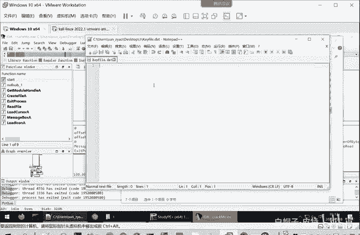

我先把这个文件放这。然后我们再次进行调试。因为这个调试就是需要一个反复的过程，不可能一次。就运性清楚，那是你以前做我的题，你一次都能搞清楚新题目肯定是要反复调试。我们再次去这个断点还是在的。

所以它还会停在这，我们再次运行。哎，发现这个时候EX的值就不是FF了。就不是负一了。所以这时候跳转的方向，你看闪烁的方向就这里了。说明我们这个Kfi点date添加，它就起到了一个作用。

那么现在会跳转到这里。我们这里就不一步一步执行了，因为我们要抓住重点，重点是什么呢？是不是这样一个分支跳到左边的分支，它有成功的可能性。跳到右边的分支呢，根据我们刚才的分析呢，它就会报这个无效。

那我们就要在这个分支口这里再下一个端点。然后我们再点击F9或点击这个运行，再继续运行。它就直接运行到断点处，或者是运行到程序结束。然后运行到这里了之后，我们再看。他给我们提示了。哎，是跳转到这里。

是不是跳转到左边，说明目前来说我们还没有发现问题。那我们呢就继续往后面。执些他这里面。有一个跳转，那我们又在分岔口。做一个断点，我们继续运行。他现在运行到这里。闪烁的是这个右边的这个线。

说明它要跳转到这程序失败了。这里为什么会失败呢？我们这个时候就需要啊细看，这个时候就需要进入到细节当中。我们看这一部分是做了什么？要进行一个抑货运算啊，抑货。Yeses，然后这里比较了什么呢？

你看number of be three读到的字节数。和10H这10H是16性制。你可以这里可以进行一个转换，转换十进制，就是16，或者是可以转换成一个。二进制都是可以的。

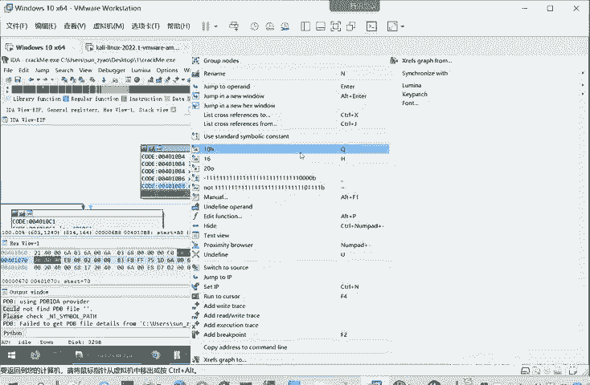

他内容都是一样的，只是以什么方式来进行显示。他据你看读写的字节。和这个进行比较。JL也要就是N。小于如果说小于的话，就跳转到这个。LOCno就nocate这个4010F74010F7是哪的？

这就是4010F7。这特点到这里。这说明什么？说明我们要从读它读的字节数要大于等于这个E0H要就要大于等于16，它才不会跳转到这里，是不是？那我们这这里啊继续执行。你看他很棒。

这个K five is not value无效，说明我们有这个Kfi，但是目前来说是无效的。那我们前面也下了这么多断点了。刚才的问题呢是出在这儿。看这里几个呢。哎，好像看不出来到底是怎样才能使他有效。

那我们就往上再追溯一下，看一下这。这一个代码它是做什么的？这个代码呢是。我们前面这里是啊已经读到这个文件了，是不是这里代码的是做什么的呢？我们这里再看细节。这里是入账，这是传入参数。

然后这里是number be three，哎，这和后面的是不是关联起来了？他这里呢是46H。是有一些对应的字母。是如果显示字符串的话，就是F。如果显示成这个十进制呢就是7厘。

这是number of thisread。这读取的这个。字符彼此字结束嘛，所以它是个数量，我们还是用十进制表示。在这里统一都是用十进制来进行。一个表示。其实。这是buffer指针。

然后read file。read file这是一个系统函数。这里也帮我们识别出来了。我们可以从函数导出里面。搜索按住ctrl F在这个关迎按住ctl F，然后搜索。Read file。

这是一个来自于这个col32的这样一系统函数。遇到系统来说，我们就好办，就不用分析。直接在网上搜。就科勒32里面的reallyfi。他是什么参数，他输入是什么，输出是什么？就知道这个函是要作用。

这个函数呢就是。读文件。读文件上的内容。但是你直接读的话，它存在一个溢出的风险。大家如果有胖的经验之的，就存在一个溢出的漏洞。所以它这里呢就限制了读取的最大字节数是70，这这你的意思。

就我就从这个你刚才给我。读到了就可fi点da嘛。发现存在这个文件，我要读读这个文件的内容，读取藏内容呢不超过70字节。就你这文件如果只有50字节，我就读5十字节。如果有80个字节，我就只读70个字节。

只读前70个字节。这样一个意思。然后读取读取到了之后呢。他就会跳转到。读取成功跳回到到这里，读取失败呢就会最终到无效。这是这个框的意思。那从这里再分析问，那说明读取。他刚才直接是跳转战。

说明他是能够读取到可fi点da。只是说。因为我们的Q发点对是空的嘛，没有内容的，啥内容也没有。他这里呢所以说后面进行一个读取的字节数比较的时候。它是小于16的，所以就报错了，说明什么？

说明他读取的四结数最大是70，但是最小要是16。如果少于16个的话，就会直接报错。那么我分析出这里了。就知道我们需要给这个文件添加字符串，让它能够读取到超过16个字节的数据。这里可以啊随便输入。

我们就我们就输入这个任意的一个。英为。然后我们再进行一个。动态调试。这时候调试呢前面的一些断点就可以去除你按F2是下断点，在断点的地方再按F2就取消断点。那这个地方就没必要再断了。因为堵到这个文件。

它就跳到这儿。这里呢也是读取不超过70个字节，它能够读到也就跳到这，这里也没必要再下当年了，我们直接定位到关键的地方，要运行。这样程序就直接运行到我们这里了。

它现在这里比较number be three。你看就你B思瑞的。值我们点击ID就会给我们显它的值是23H，这个16呢是多少？是10H肯定比23H大，23H肯定比这个16大。

所以呢这时候它给我们跳转的闪烁的箭头呢，就是这个左边的这个箭头。这个右边的箭头这直接跳到错误里面，就不会再闪烁了。那么正常运行就会到左边。那我们这一步的问题，刚才直接跳转到这里的问题。

就是他从这个文件中读不到内容。那，现在这个问题解决了，我们继续往下看。嗯。😊，下面这里啊左边是一个循环。所以他最终跳出去环横到右边。大家看关键是右边这里。这里步跳出循环。

是到左边还这一步跳转是到左边还是右边，到左边就成功了，到右边还是失败。因此呢我们要在这里面下一个断点，然后我们直接运行看一下。能能行不能行。哎，他这里给我们报。是一个跳圆到这里，右边。会报错。

那么这时候我们又要进入到一个细看了。这时候我们就要仔细的看这一段的细节，我们要把握。所以说这个逆向分析就是一个要定位到关键的代码。你在这关键代码逐字逐字的看清楚，就不清楚的地方，你再查。

然后其他代码你就不用看那么清楚。这里呢我们看一下啊，是这里是一个本地的标签，跳转到这里，然后它只有两个命令，1个CMP比较。比较ESI这个计算器的值和8。进行比大下。现在ESI是多少？

是00和8是小于的。JL就是降篷n。的意思就是它现在小比是小于小于的话就跳转到4010F7。他就确实这个E。ESI嘛，就实小于八的，就跳转到9倍就失败了。那你反过来反过来想，那如果ESS大于等于8。

那是不是跳转到这儿，然后顺序执行就会到这里就会成功。所以我们现在的目的就是要使这个ESI大于等于8。那ESI是由谁来决定的呢？我们这一步之前呢已经分析确实出了，然后这一步直接运行会出现问题。那很显然。

现在问题的关键就是这一个循环。从这里这么直行，又返回来这个循环的结构，是不是？这个循环的结构应该是决定ESI的值。或者说我们这个我们刚才是给这个文件填充了内容。那么这个文具体应该填它是读取了字节嘛。

它具体的字节是什么？应该是决定了。ESI内容不是说你任意填充字节都可以，它应该是特定序列的一个字节。特定血列字符串，也就是我们平常所说的一个。序列码激活码它才能够进行激活。

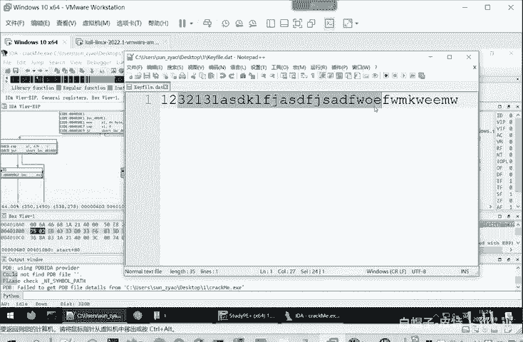

嗯，那么现在我们就知道了。目前还不清楚的地方，关键就在于这一个循环。这个循环呢就属于我们要细看的内容。我们先看一下这个循环是什么。啊，我们下一步是读取的。这个。不小于16个字节。那么这里呢？到这里啊。

它是一个直行，然后。这是个比较AL是吻合零向的，然后进行一个跳转。然后进行循环，这里是不是可以理解为AL就是一个循环的一个标志。我循环。我循环次数够不够够了，我就跳出，不再进行循环，没够。

我就进入到循环的训练。啊，这一段段是这个意思。所以说这里是一个循环，那相当于我是继续循环还跳出循环的一个判定。那么关键呢就是应该在于它循环起的这一部分。那学环题我们看一下是什么内容，我们大概先扫一下。

其实内容也不是很多，就是1234。567456就6行汇编代码。那不是很复杂，我们就一行一行的看。第一行CMPAAL和47H。就是比较AL的值和4HH是不相等。我们上年给大家介绍寄存器的时候说过。

这个我们看一下计损器这里。EAX32位，它可以划分成低16位，低16位又可以划分成高8位、低8位。所以AAL就是EAX这32位里面最低的8位，就最右边的8位。

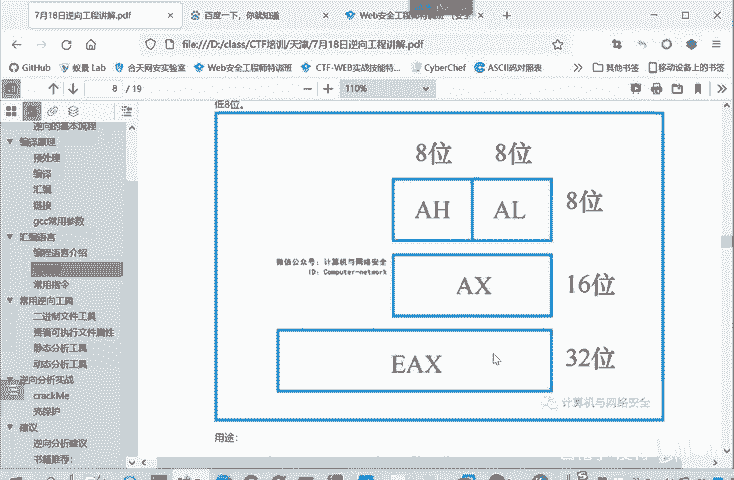

比较在最右边的8位EAS最右边的8位，也就AAL它和47H47H持用静止0叉47。是否相的，这妮给我们注释，C其是就是。字母G。对你给我们这介not zero。N就是notote。不相等的时候呢。

就跳转到4010D0。我们看一下401跳转到这里执前。如果相等的时候呢。那就到这里INCINC这个命令介绍过自尊。ESI就自增一哎，这个ESI我们找到了，我们后面看的就ESI。然后再到这里直线。

从这个框图就可以看到这个。AL等于47还是47H还是不等于47H。它的区别就是ESI增加一或者是不增加一。因为你最终都要到账。区别就一个执行了这个INC自尊命令，一个不执行，直接到这里。

然后这里呢再就INCEBXBX增加一。然后就跳转到这个。循环点头，这就是一个循环。那么经过我们刚才的逐个汇编语句的这个读呢，我们认真的看到每一个汇编语句。那么就可以。知道这个循环体的一个大致的功能。

就是不断的比较这个AL和47H的值。和C情形是不相等。我相等ESI就是加一个不相等就过，然后再比较一次再过。是不是实际上就因为AI也是变，AI也是变的嘛。AR是这个EBX所决定的嘛。

EBX每次就增加一嘛。所以事实上他就是。逐个他就是对读取间的字符串，逐个和这个470去做比较。有一个相等的ESS加1，没有相等的，比较下一个。所以说这个这个循环节的作用大家就应该明白了。

