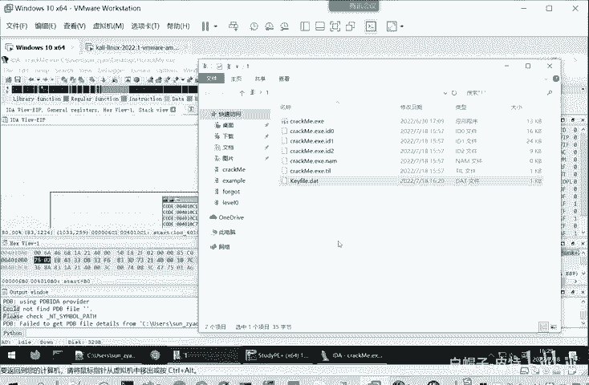
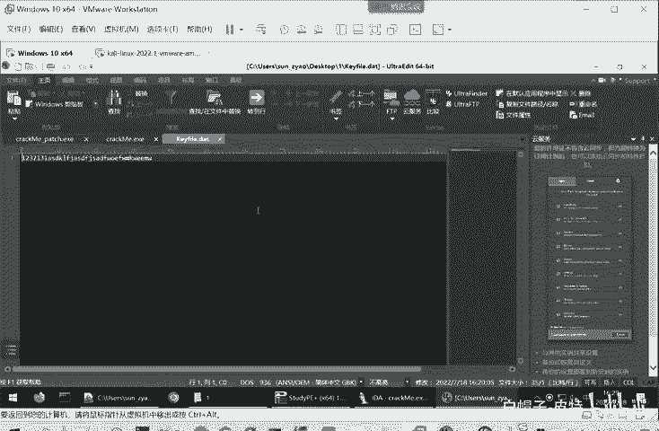
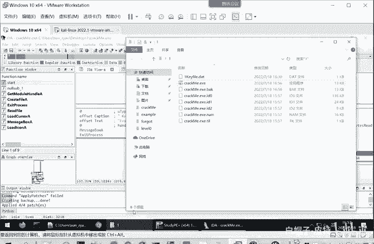
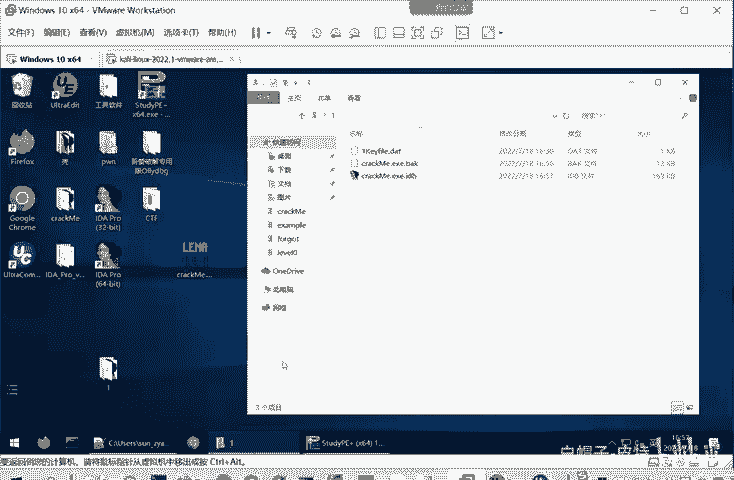
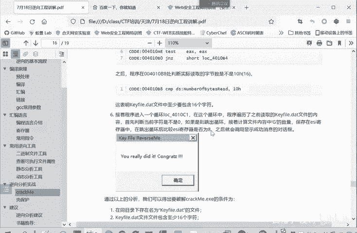

# 2024B站最系统的CTF入门教程！CTF-web,CTF逆向,CTF,misc,CTF-pwn,从基础到赛题实战，手把手带你入门CTF！！ - P33：逆向-逆向分析实战（下） - 白帽子-皮特 - BV1m64y157UX

我们前面不是读入了这个字符串吗？我们读入的这个字符串啊，比如说我们用16进制打开去来打开。

你看他我们读的指的是31，用16这验来看，就313233。然后后面64666A73这些。他就是把这些毒鄂值。和4期。做比较。如果相等，看有多少个相等的那ESI就增加多少个。

然后最后再判断ESI有没有8个，说明我们输入了这个读取字符传，至少要有8个0差4期。四期呢就是大G。这个时候我们是不是可以对我们这个进行再次修改？他既然啊想要读取大计，那就多输几个，是不是？

我这里为了演示我们中间叉。3123456。789能插入几个字符。调空。因为别的程序正在啊我们这个程序在运行当中，正在调试当中，正在使用这个Kfi点da，所以现在是没法保存的。我们先让这个程序终止。

你可以点击运行，让它运行到最后结束，你也可以直接点击停止。现在我们修改了这个Kfi点d内容，先输三个G，再输3个G，再输3个G。那我们再执行。啊，他会。站在这里，然后。我们可以这时候我们可以点击F8。

然后单步运行，仔细看一下它每步的运行的情况。它和我们之前静态的分析，我们自己读这个汇编代码，它的结果是否一致。我运行一下。啊，到这里。他现在是把这个。1BX就是0。

这里项目GS拜这个40211相当一个数组。是吧数组了第0个元素。A0A1A2成为这样的。付给AL，然后AL现在就4747了，实际上就是我们这里的第一个G。然后AR它不能等于0。确实不等于0。

那跳转到这边进行比较，比要和47去进行比对。发现确实相等的相等的的话，那就跳整到这里，ESI就自增1ESI是多少呢？是0。然后让它自证一自证一之后呢，ESI就变成了一。然后EBX加1EBX是0。

自增了之后变成一，然后再跳整到循环头。这时候就相当于读取数组的第二个元素，就是这里EBX已经变成一了。AX呢还是47，然后继续这些。那，继续执行ESI变成2了，我们前三个都是G啊，这里就继续执行。

看一下。哎，这时候再读了之后。DBX变成3，这读取第四个元素，第四个元素就不是G了，就是我们的一。他16就是我们的316进制里面就是0叉33。这是EX就等于33了，还是不等于0，还是要到循环体里面。

这时候呢就不等于记了，另外它就不会跳转到这个自增，那它直接到下面。然后再读写下一个，又变成47了。是不是这跟我们之前分析的是一致的，它就是这个循环体，就是计算它读取的变量里面，读取的字符串里面。

这个大G的个数。那我们这里直接让它运行，不再一步步运行了，直接运行到这个我们下端点的这个位置。这个时候呢，ESI等于多少？等于E。E就是14。他显示大于八的。那么这个时候呢，它就会跳转到左边。

然后我们F8跳转左边就是在下面。就会正常的执行。就我这个弹块已经成功了。然后这个软件的。一个破解文件，相当于我们就找到了。这时候我们可以关闭嗯，们把ID最小化啊。然后我们直接编写。

这个cck me点EX。是不是它就成功了，因为它读取到我们keyfi点da。如果说我们没有这个文件，比如说我们重命名一下。这这就跟我们最开始是一样的。啊，我们先。啊，休息10分钟，后面再接着讲啊。

在听课这么久了，可以喝点水啊，或者想上厕所，可以上厕所。2。嗯。嗯。嗯嗯。嗯嗯。🤧嗯嗯。Yeah。嗯。😊，嗯。嗯，啊同学们好，现在我们继续上课。呃。逆向工具中，我看大家提的问题，逆向工具中。没有ID。

啊，这IDA其实。用的也是破解的，那后面也可以给大家放到那个工具当中。等那个等我们今下午的课程上完之后，也还是放在那个网微盘当中，大家到时候再去下载。然后我们的虚拟机是win。

不用win7win10都可以。然后我们继续看。就是通过我们上一节课的分析呢。就已经可以得出。我们这个crrack me或者叫reverse me这个。程序。他能够。

破解的条件就是说在同目录下要存在一个名为key file点DATT的文件。这文件名是写死的，不能改的。第二个呢是可 findDATT文件，至少要存在16个字符。这是由这是由我们。

这一步所决定的他如果说读取的文件字符数是小于16的话。那么就直接跳到这个无效这里。第三个条件呢就是说keyfi这个文件当中。要至少有8个这个G支付。这个祭祀符就是。就你ESI。的个数就是G似符的个数嘛。

他要大于等于8才可以。这是这个软这个文件进行一个破解的。条件。只要满足这三个条件的，可以f点 date都可以认证成功。这是一种破解软件的办法。那么我们之前在介绍的逆项公程说还可以修改程序。

因这种如果说大家在使用一个软件破解当中，要使用这个软件，必须同时带上Kfi点DAT。那有的人可能觉得比较麻烦，那有没有一种别的办法可以。实现这个破解软件呢，又不需要这Kfi点DAT的。这也是可以的。

这里给大家介绍一个。我们IDA的一个功能就是修改程序的功能。key patch，这实际上是一个插件啊。怎么修改呢？比如说我们现在。没有直接运行他。我们是没有Kfi了，他这个是过期的。

因用Kfi点对的重命名了。这个时候怎么办呢？我们在分支的地方向上断点。我们运行。嗯。他这里是不是读取文件，读取keyfi点 date它读取不到，没有这个文件，他肯定要报这个。凭证已经过期了。

这个时候我不想让他报平证估息，我想让他走到这边，走到右边这里来怎么办呢？这时候我可以改这个程序的代码。点击你所要想要修改的代码，然后点击右键。就会出现一个K pass。

然后这个选项里面再点击这个paer。这里面就可以进行一个修改。本来你修改他代码是要改它的。机器嘛。因为它这是二进制文件你要改二进制。但是通过这个一个插件呢，我们就不用操作二进制。

我们直接操纵这个汇编命令就行了。因汇编命令，大家比较好理解二进制文件的话。嗯，反正我也不会修改，绝大多人都不会修改吧。我不敢说百分之百的人。这里它本来是接NZ到。洛克40109A。40119A。他就是。

note最2的时候不是为0的时候到这里，那我这他现在补到这儿，我把它改一下就行了，正好做一个相反的判定。GNZ就改成了一个。接近就可以了。然后点击pach。然后下一步取消，这些不用管就行。

那现在这个命令是不是经过修改了？它是相等的话，再跳转到这里。等于零的话再跳远到这。那我们继续点击F8运行。这时候他就不跳转到这，尽管没有KF点对的，它还是不跳转到这儿，是不是？这一步经过这样修改的话。

那程序就按照我们所期望的路径进行。进行了跳转。那这在这我们看下一个分支向上断点，然后运行到下一个分支。他这里是要哎跳转到这儿，为什么？因为他这里是要读。读我们的K发 data，我们本来就没有这个文件。

它当然也读不到那这个内容了。他读不到的话，就跳转到这里啊，这时候。我们又可以。故技重施啊，重新修改一下。把他的判定语句给进行一个修改。那么这时候再按F8到下一步，它就跳转到左边，而不会再跳转到右边了。

那我们继续。执行继续执行到这一步。他还是会跳转到右边，哎，这里又是错误。说明这是这个时候。读取的字节是不是小于16，是不是？读取的字由是不是零嘛，那当然是小于16。

大家这个点击下就可以看到它所对应的数据就是0。您肯定是小于16的。那这个时候就可以进行一个修改。这个修改就比较多了。它JL，你看看GNL。它小于你可以看接跳转G就great大于，那都是可以的啊。

就正好要和他原来的判定条件相反。接NL不小于，也就是7gre equal大于等于啊同样的效果。这时候跳转到左边，它不会跳转到右边报错这里了。这时候呢运行到这儿，它比较ESI的值ESI就是。

读取的这个字符串里面大G的个数，当然是你呢，因为他根本就没有读取到数据。这个时候跳转呢，他又要报错。这时候我们可以。同样的方法，右键key patchpat再进行一个修改。然后剪击下一步运行。这样。

尽管没有Kfi文件，还是执行到了我们想要到的位置。这就是第二种破解的方法。我修改文件的判定条件。但这种方法呢只适用于比较简单的程序。如果说你他在程序后面还需要用到读取文件的内容。

那么你以这种判修改判定的操作呢，就会使程序出现问题。你直接接进去，它会报er就是会出错。我们这里修改之后呢，还要点击一个保存。我们这里修改是在IDA里面修改。IDA呢是把这个程序打开之后。

这都是IDA的。数据库。他就把这些保修改，保存在数据库内有这个文件本身我们打开是不是直接运行还是out of date。这个程序本身目前是没有修改的。那怎么修改呢？我们点击这里的。嗯，edit这个。

patch program。这里edit下面p program。修配就打普丁嘛，修改程序。点击这个修改程序呢。它这里面有一个应用修改apply patches。点击这个应用修改。然后这里创建一个备份。

大家自好选一下。备份文件。这个cre me点ES呢，这里的文件名就是我修改后的一个文件名。刘范，他原来文件名就叫。加上点bag做一个备份。这样你想要是有原文件的时候，还是可以使用，不会进行覆盖。

最好都勾选下这个创建备份，了解就OK。然后你看我们这里。crack me点EX。诶。Crack me。Pauch。S。对呀，这是嗯。

啊，这个嗯。这就是我们免备份的文件，这是我们修改后的文件。大家看现在没有Kfi点data，这里是1KF点data。没有这个文件，它仍然能够正常的执行。这就是我们。破解软件的这第二种方式修改它的判定条件。

不需要可以fi点对的，把直接直接拖出来。他就能执行，他不需要条件了。

嗯。啊，这是。这第一个题。这个过程啊。

不知道大家理解没有？其实我们回过头来看一下第一个题呢。就是我们先从它的整体的流程里面把握。把语语把握一些关键地方，就是一些跳转的地方。然后可以分析它在什么情况下是跳转到左边，什么情况下跳转到右边。

他每次要跳转。是判定的是什么条件？他真正的。跳转的是看什么？把这个条件取获取。然后一步步就知道我们要到达最终的目的地，它需要什么条件才能够走到最终的目的地。然后发现这个关键的代码呢。

就是除了跳转处之外呢，就是这个循环处。然后循环处呢就是判定。读写字符串里面呢等于大G的个数，要求大于等于8。那么只要在Kfi点d里面输入很多个大G，就超过8个大G就行了。

这样本来一开始打开车去都是这会员代码，看起来就是不是那么好理解。但是你把它的整体的框架给理解清楚了。在每个关键地方再细读它的每一行汇编代吧。这样整个程序它的机制你就弄清楚了。

你不能说一开始我就读他会员代码，你这样就很容易读晕。嗯啊这是我们第一个题。那我们下面呢再看看第二个题。

