# 2024B站最系统的CTF入门教程！CTF-web,CTF逆向,CTF,misc,CTF-pwn,从基础到赛题实战，手把手带你入门CTF！！ - P34：逆向-壳保护 - 白帽子-皮特 - BV1m64y157UX

第二个题一个nl2这个题。这是一个带壳的铁，有可保护的铁。

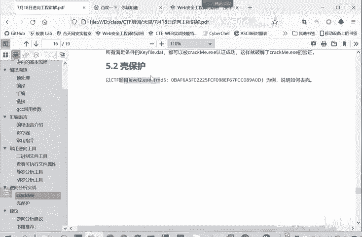

看看可保护的提示怎么做。其实这个。具体做法的套路呢还是跟。第一个题是很像的，我们。把这个都关了，相当于再把第一个题啊回顾一遍。我们去看这个壳保护的这个题是在。

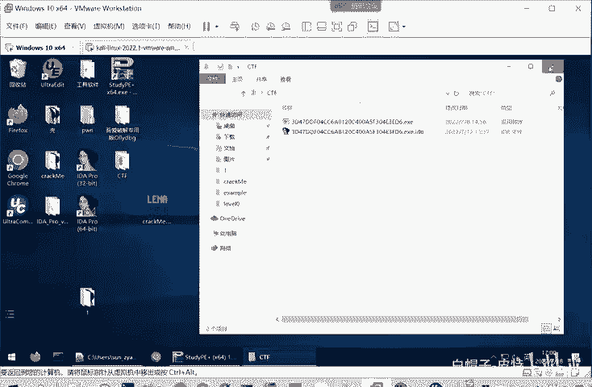

在壳这里面。这个nvel2这个权序。我们如果直接运行的呢。那闪烁一下，他没有任何输出。然后我们也s studyPE来看一下。这个程序他的内容。啊，它是1个64位的1个PE文件。嗯。认为大排除大家的干扰。

我先把这个复制出来。放在一个单独的文件夹里面，我们再来分析。

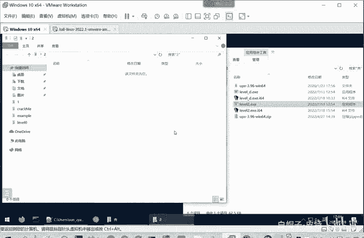

然后再个starAPP来看。

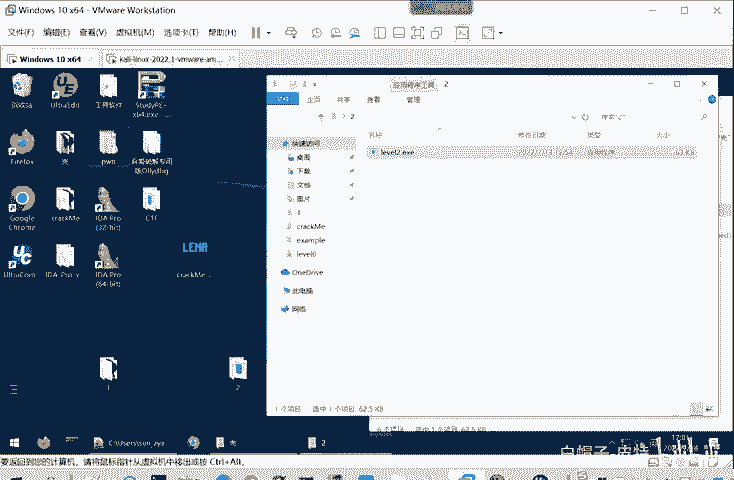

Yeah。他是个64位的P议文件。然后呢，它是一个unknown的态度。然后我们看一下它的P头。这里面呢。嗯，直接看就是没什么。我们很关注的信息。数据表还有导出表导入表。

它的躯段呢都有UPS这些UPS就是一个加壳的工具。然后我们看区段有三个这个区段。通过这个UPS信息呢，我们看判断它大概率是存在一个加壳的。

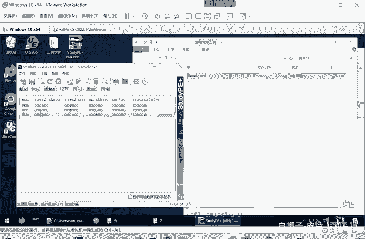

加壳的程序呢，我们就要去壳才能分析。但是有的人就是我们可以试试，如果说不去壳，它会有一个什么样的效果。

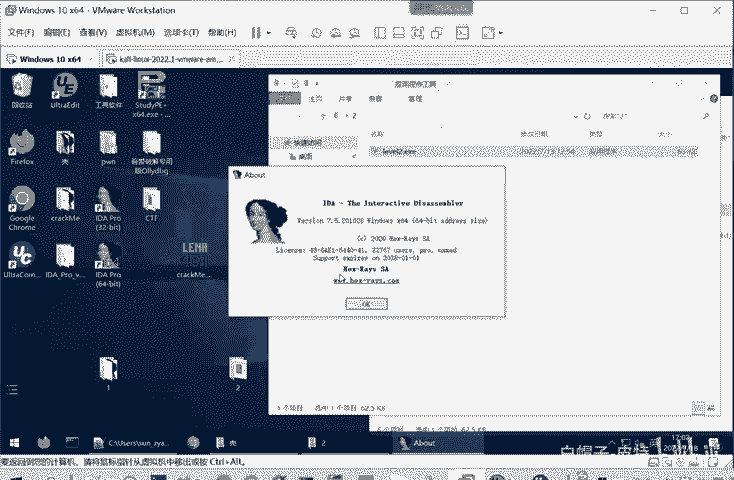

不许可进行一个分析。他识别出来这是1个64位的。PE的文件，它要AMDAMD和英特尔都是叉86价格，那都是一样的。我我们直接打开在使IDA的时候，他经常会报一些这种各样的问题，其实不用管它。好吧。

我分析哎，我们这里分析。我们还是点一下F5看你看这就是它原来的汇编代码。转换成那个C源的伪代码，实际上就一个。调用这个函数，然后return给获选。你这里面其实也是要也是括这个函数嘛。按F5之后。

反编译成那库C语言的为代码。那么这样我们就更好的能够理解。start就执行这个函数嘛，然后。开始的位置，然后就执行这个函数。那我们看这个函数内容是什么？我们看一下。这个函数有两个输入A1A2。

我们看一下输入是什么，我们点EESC访问到上一步。嗯，这好像只有一个输入。那他这里又有两个输入。这种情况也是存在的，因为IDA它接触的只是二进制，它要通过它的算法来反编译出C语言的代码。

所以它有可能有的地方不是完全准确。然后这个函数定义呢。很多参数，然后有一些循环。这个时候我们怎么办呢？你要想看懂这个的话。你就要知道他的输入，然后你就一句话一句话的看。然后每个输出。

你再看他这输出怎么定义，怎这个变量怎么定义。但大家一开始遇到这么一个比较复杂的一个函数。不要尝试去看。这太费时间了，而且。也不知道这函数的定位是什么。我就像我们刚才分析上个题一样，我们要定位关键代码。

你要知道这个函数是一个关键函数，你再看它现在还不知道它是关键函数，你不要仔细的看。光这些函数你分析清楚，那可能都一两个小时过去了。这时候就不仔细的看他。那我们看看别的地方，它导出函数有哪些呢？

这啊就只有一个start。嗯，那还到这儿。那他的我们这时候可以看一下它的一个不右里面一个open sub you。用个strth把这个strth这个窗口。strth呢就是从这个。

程序里面提取出来的一些字符串，看我们有没有一些字符串可以用。这好像都是一些库函数。这里面没有什么肯定有的。这似乎也挺简单，就这么几个库函数导入导出都很简单。这是伪代表吗？这前面英文字母就是伪代码意思。

这个分支呢。嗯，其实也很简单，那么关这时候关键我们就看就只能看这个函数了。这个函数看呢。其实一那现在只能看这个函数了，也不是说从第一第一个命令就一直往下看。你是先要大概的看。看他这里面调用了什么函数。

这里面啊这种情况就是什么address，然后退出进程。那我们现在看的是140024F40140F240，它这里还识别出一个函数F42，我们看一下这个函数是什么。是吧也不简单，感觉是一个什么算法。

那么进入这个函数内部呢。我们刚才是在这儿，他不是扩这个140024F40吗？我们进入函中内部。来，看他这个框图。这还是呃。还是比较复杂的，是不是？总之就是。复杂，然后怎么看也看不出来。这个就是就是。

流程特别复杂。这是因为他们加壳了。我刚才给大家讲壳的时候。我们现在看的是这样一个玩善，一个loader加一个压缩文件。但很难理解它程序真正要运行的什么？它运行的它不是运行这个压缩文件。

它运行解压后的文件。所以这里呢我们必须先要进行一个脱壳，才能够进行一个分析。要不然这个题就没法做。所有这权，我们就使用脱壳工具，这就了进行脱壳。脱壳工具是什么呢？这脱壳工具是。

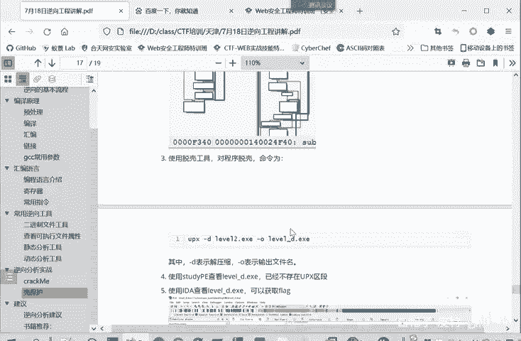

我们放在了。放在了这个微盘里面，大家应该也下载了。就是这个。UPSX3。91这它版本。这个解压缩之后呢，就对到这个UPS这个软件这个文件夹。它真正起作用呢对真正起作用。它执行程序呢就是UPSSCEX。

你使用它可以。我们在本地在这里打开CMD。UPX。先看一下他的help是吧？先看他help他的一些帮助信息。这里面呢。UPS它本身是什么？它本身这个工具它既可以对程序加壳，它也可以解壳。

所以杠一这是杠一和杠9，就是你给成序加口的时候就进行一个压缩嘛。杠一和1-9是一个压缩的等级。越接近一呢就压缩的越快。越接近久呢就越复杂，它压缩，它伪装性就越好，就这个意思。

杠D呢就是你看Dcomppress就解压缩。这个详信大家自己后面去用。为了让我们更好的使用这个UPSX工具呢，我们还是把它添加到我们的。

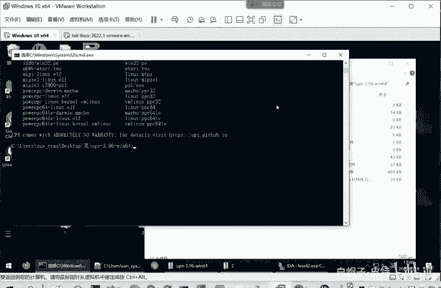

添加到我们的一个环境变量当中。

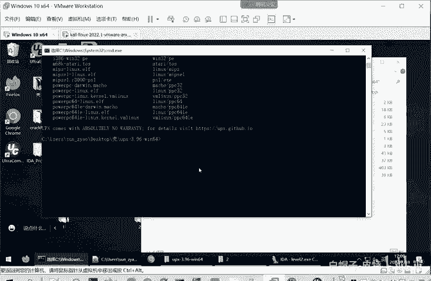

是这。

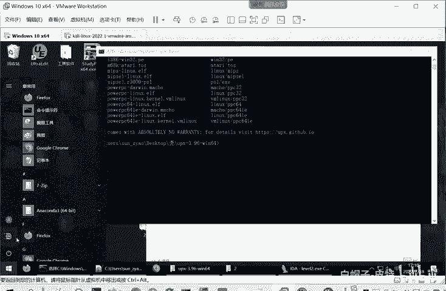

在设置里面就像我们之前。装那个家吧，只要也要设置一个环境面量。高级系统里面有环境变量。只不过这个时候不是新创一个项，而是就在pass里面。点击编辑。然后新建把你这个。可儿的路径给加进来。

以及UPS程序这个路径。The不MD。把这个路径给加进来。加进来之后呢，你在任何路径啊都能够直接使用UPSX命令。我这里是已经加好了。那么这时候我们就可以。对他对这个。level2。EX进行一个解合。

我们在这里面。

本地打开CMD。使用UPX命令杠D就是解壳。🤧Number2点ESE。就杠O呢就是输出文件，输出文件进行一个命名。这个命名都是随便命名的，这文件的名称都是无所谓的，关键是文件的内容。然后这里。这是一个。

投资可人信息。他是由原来的。66万多字节到这个这么多字节啊，反正就脱壳了。其是实际上就是一个解压缩的过程。它这个字节压压缩比例的变化不是我们所关心的。

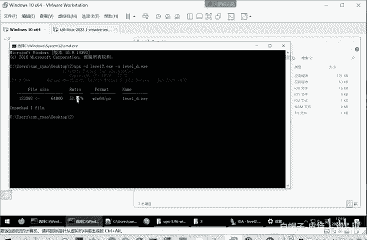

脱壳之后呢，我们就可以分析这个程序了。我么使用IDA。对新程序我们还是嗯。

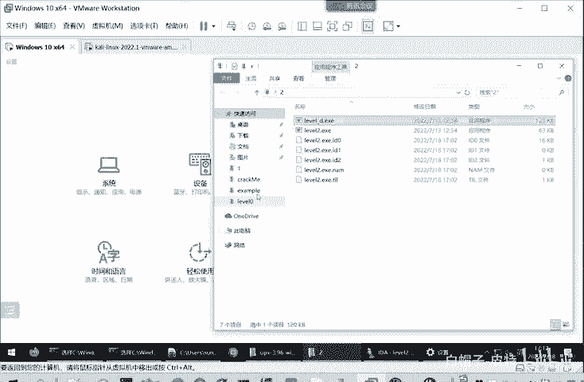

按照之前的套路组一遍，执行一下。啊，他直接进行会报错。

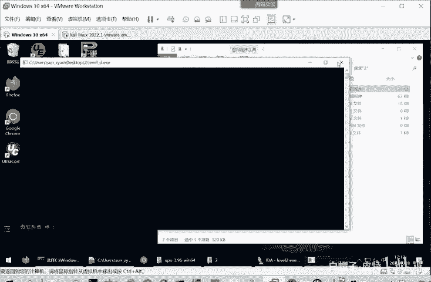

然后我们 studyP看一下。先把老流程走一遍。虽然说哎他叫脱壳软。不会改变他的位数，还是64位，但家也可以脑陈数一遍，这时候就不是on诺了。这是mic克C，这是用C语言编写的程序。你看他的P头啊。

数据表里面。就正常的R dataread这些数据段。代码的。啊，这些就是。很正常的，不存在一个壳了。那我们这时候呢再用IDA打开进行一个分析。IDA里面finopen。

open它会让你保留当前的这个程序，它的。一些信息。保存下来，然后我们打开新的level D点EX。这也帮我识别，这都是默认的啊，直接打开就行了。这个哎非常简单。就只这一个框。

这里面呢一定要注意到有1个WCTF2020加死UPX杠D。这就是这个题的答案。因为这是1个W们CTF2020就是那个竞赛的一个题。就竞赛的1个CTFT。我们做别的CTF题可能默认的就是说你要获取一个。

Sgg。大括号里面是啊一串一串代码。然后把这个flag提提交过去就可以了。但是那个这里面的这个赛事，他把自己的一个logo加进去。其是找到这个WCTF2020，就是找到了flag，就是完成了这道题。

所以刚才我们没结合之前。各种涨各种分析。都找不到，然后解合之后呢。直接就能够获取我们的那个答案了。就是嗯。我们这个夹壳to壳的这个铁。同样的我们可以进行一个加壳。

使用我们这个UPX工具也可以进行一个加克。大家可以自己去试。这脱壳后的权限。我脱完然后还再加克也可以的。嗯，叫t的命令就是UPX杠D。当然这里你要把UPS添加环境变量你才能用。

要不然他会说找不到UPX这个命令。杠D呢表示解压缩，因为这是压缩口。解压缩这加克的文件杠O呢就是输出文件，输出文件的名称。

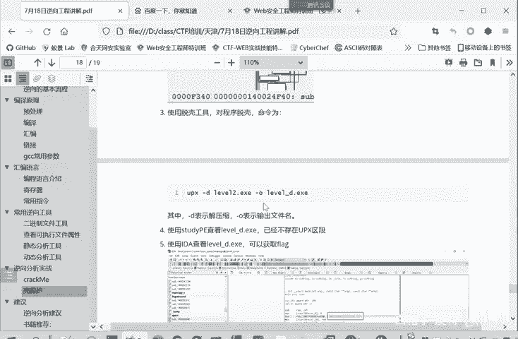

然后说CP查看，然后使用IDA来查看，就可以获取flag。这是这个通壳的体。