# 2024B站最系统的CTF入门教程！CTF-web,CTF逆向,CTF,misc,CTF-pwn,从基础到赛题实战，手把手带你入门CTF！！ - P36：逆向-书籍推荐 - 白帽子-皮特 - BV1m64y157UX

啊，最后呢是一些相关的书，大家可以看一下。C语言大家都学过，应该啊这可以看一下C和指针，这是讲C语言里面的指针，这是C语的精髓。其实我们汇编里面操作也是操作地址嘛，其实也是只是。第二个呢是汇编语言。

第三版，那是呃清华大学出版社一个出版的汇编语言的书。写的还很好的，基本上。你这就能看懂汇编员了。我们做这个逆项，其实很多时候不是要我们用汇编员来编程序，你自己写这样的程序。

这不是主要是你能够看懂这个汇编员。就行了。然后还有一个这个恶意代码分析时代，这是我们这个逆向分析里面。一个圣经吧，反正。就很全面的一个数。写的也很好，大家可以去看。然后剩下的这三本书就是优先看一下。

那剩下的。理解计算机系统啊，反馈编、加密解密、安卓软件这些。都可以都挺不错的。说。啊，然后今天的那个。啊，主要内容是这么做。然后看一下大家提问。啊，他说逆向工具中没有IDI是。啊，是的，是没有ID。

然后。我等等会儿再把IDA的那个。啊，压缩包也放上去，因为ID它本身也是。他其实也是付费的嘛。是吧这种传播。盗白软件呢相当于还是比较谨慎的。然后大家有没有什么疑问？嗯，大家有疑问呢。

相当于我们在就是在课堂上吧，也可以开语音交流，也可以发在我们聊天里面。或者说嗯哪里没太理解的，有什么建议也都可以提。Yeah。嗯。😊，🤧这边语言的命令可以拿你查。可以直接百度。就是。😊。

我比如说我看的时候呃，我看的这一条。我就我现在就不懂这个moveEEDX。EDIECS这个命令是什么？你直得在百度里面查就可以了。百度知道。即诶。

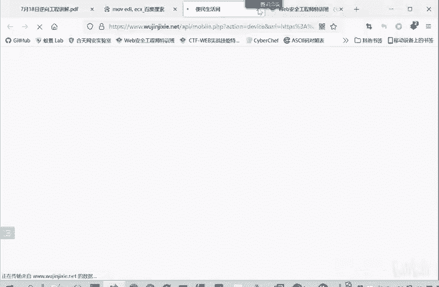

你直接在百度里面进行搜索就行了。

因为这个。ED一般都会搜这种简单的EAX。ET，x。类似于高级语言中的复值检验，你用A等于B，你搜索就行了。个别不会的就搜索。如果说你想要一个比较系统的汇编缘的基础，你看这本书，汇编缘第三版这本书就行。

电子版。我没有电子版，我。之前是买的说，这很久以前了。Okay。汇编就是。机器人的助机服。他就是你异训练的一个代表，只是那你异训练人。你们太难识别了。太不对人的友好了。所以就发明一个汇编语言。

告诉这这几个字符就代表了这一串017年。大家有那个有我们和田晚安实验室的一个会员吗？有这个我有我们玩实验室的会员，这里面也有很多我们CTF的题目。大家可以去做这个外部的先先不看逆向的。

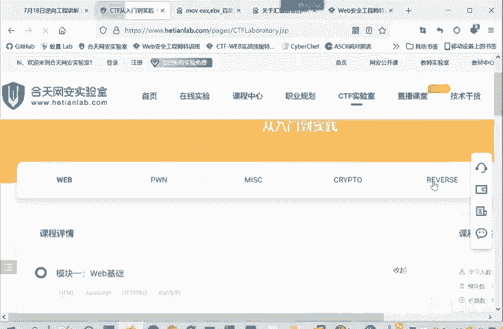

这里面有很多实验，后面还有很多的一很多的一个题目。

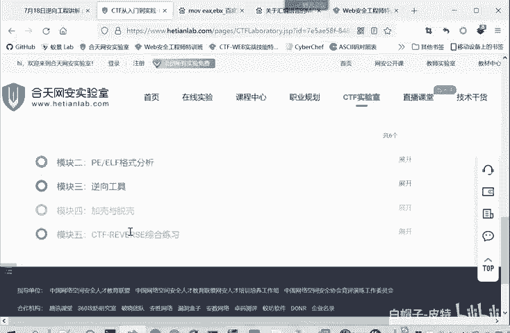

立想游乐园。

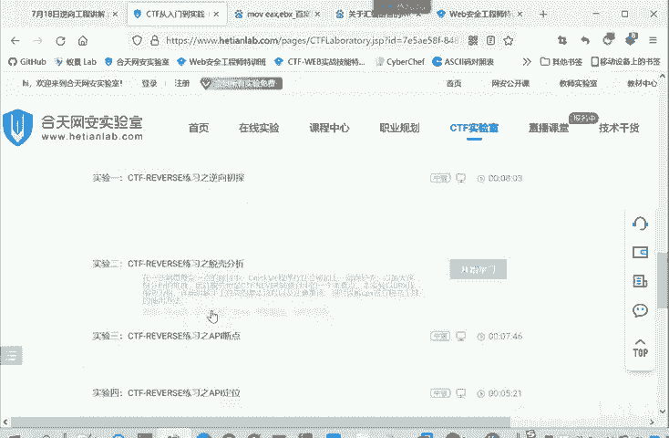

你看这也是脱壳的。这些。

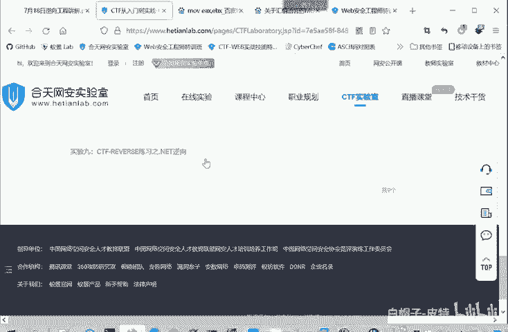

实验都是有解答的，大家可以去做一下。然后这个study PE和IDA有什么不同？

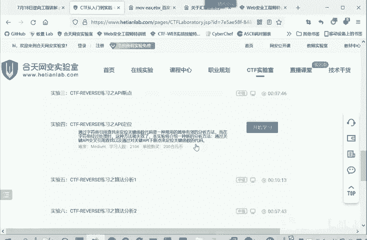

我们看一下。那 studyPE他去查看一下这个。实际上CIP是1个PE软件的一个分析工具。我们。PE这个文件的分析工具。因为每一种文件都是它的文件结构嘛。这个文件结构就是它这个相对于理解的网络协议一样。

然后CP就根据这文件结构，把相应的字段给提出来，他就知道这是啊什么32的新文件，它也能算出这是一个它的MT5值，它的文件类型。它的数据表这些都是根据PE文件的格式提取出来的信息。

他是查看这个PE文件这个信息，他这。比如告诉你啊哪里是代码段，这数据表里面啊P头。哪里是代码段，代码段的大小，然后数据段程序入口在哪？这些他是。通过这样来。分析，然后IDA呢是什么？

我是查看你二进制文件，然后把你二进制文件里面我读出哪一段是代码，哪一段是数据。然后代码段呢？这里。😡，他实际上就是二进制。那二进制我就根据二进制和这个汇编语言的对应关系转换成汇编语言。

那得到汇编语言之后呢，那IDA他自己设计的有算法，把这些汇编语言再反编译成C语言的为代码给你看。那这样得到一个反编译的CEI为代码。要给你看。那starDPE就没有这些具体的汇编命令。

这些就没有这些信息。3PE会分享吗？会分享。就是我们这个逆向分析，它大量的它要涉及到一个。比较底层的或者权限比较大的。一些功能。还有要分析病毒软件，所以说最好是放在我们虚拟基因里面进行一个分析。

我们这个win室。啊，这就放在个虚机里面，你可以保存快照。这样分析比较好。

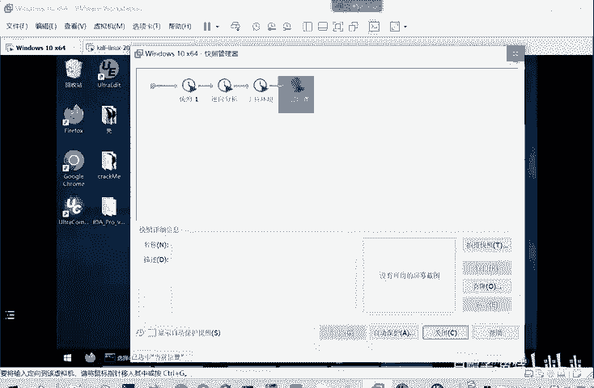

这虚拟机的windows系统。没有什么要求，一般就用win7win10，你不要最好不要用的太脑。如果用个windows叉P的话。微信也可以。主要就是你。啊，还就是推荐用V10呗，因为很多软件。

如果说你系统太老的话，他软件不支持了。winN7一般都是可以的。V10就是现在就更主流一些嘛。这个插件是装好的，这个插件就是。

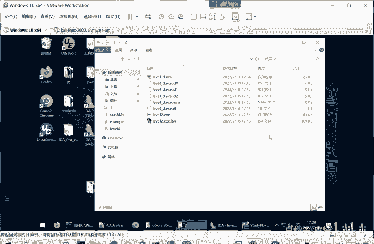

我们看一下ID。你要Kp这个插件。我是装在哪了？IDA这个插件就是。这就是可以配置这个插件。因为IDA它是支持pathon脚本的，它实际上是是pathon脚本哎。啊，这个P这个其实就在这个文件夹里面嘛。

把这个PY文件可以配点PY放在这个我看一下。应该是插件。放在这里。放在这个插件pl plus里面。然后你重启一下那个IDA就行了。我下的这个版本里面是有的。它是带有就是比较当多的插件的。

因为我们用的都是破解版嘛，所以它会附带一些功能。如果只你是用原版的话，那肯定是没有，这应该是一个get hub项目吧。我也我也没有查这个。因为我这里面直接就有了，所以我也没没有查这个。

包是在互联网上光下载这个K patch这个PY文件是在哪下载？就是后面我把把IDA和。垃圾PE。他放在微盘里面。呃。大家还有什么疑问吗？没关系，就。

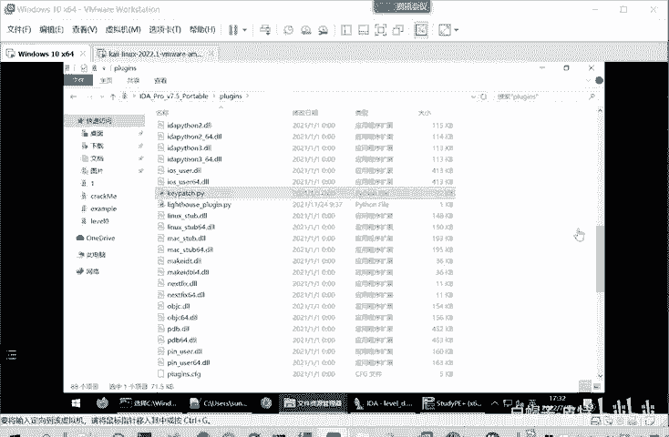

可以直接问。嗯，那大家没什么疑。没有会编员的钱。没有汇编语言的基础，所以逆想是不是非常困难？也可以这么说。是的，逆向本来就是我们CTF里面难度最大的板块。或者说之一吧，至少是前二了。

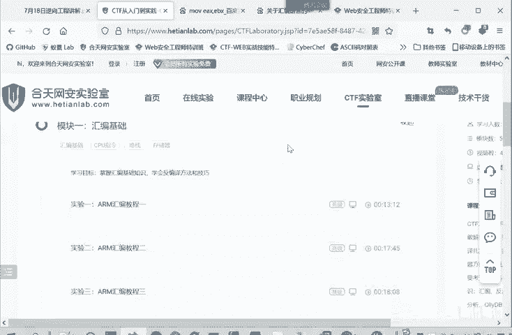

你看我们CTF的板块。外部抗抗和逆向是最难的。因为这是二进制，二进制就是你理解处理都是比较麻烦的。

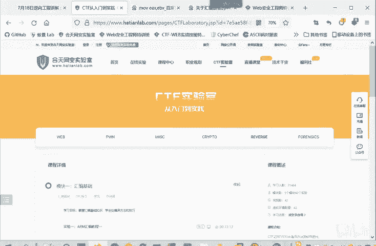

所以所以说逆向确实是需要汇编语。因为不是每不是每一个地方都能够进行一个反编译的。就我们反编译成C语源代码，不是每一个地方都可以这样反编译的，有时候还是要直接的去看C语源的代码，你就直接看汇编代码。

同时呢它这个反编译的过程，大家以后就做多了就要有这个意识。这个转换是IDA他写的算法转换的。他这个转换转换不是百分之百正确的。但是他99%的情况下都是正确的，可以这么说。虽然IDA是非常强大。

但是也不敢保证百分之百正确的。所以有时候你如果说实在是分析不对劲了。你还是要看一下这个汇编的代码，因为汇编的代码，它和机器码是一一对应的，这是准确的。再转向这个C语元的代码，它不是一一对应的关系。

他是是不一定准确的。只能说IDA是这方面是做的最好的软件了。其实汇编代码不难，大家看一下最后的那个汇编代码基础，那本书就课件最后的部分。这个汇编语言这本书就行了。基础的命密其实都很简单，大家学过C语。

汇编的命令。也很简单，大家重要重点要理解。汇编员里面。一个寻址寻找地址的方式。要寻址的。因为汇编缘它处理的是CPU里面的机一个内容嘛，它CPU里面内存。再告诉你哪一块地址啊，是什么什么内容。啊。

这一块这块地址处它是什么内容？你要。要进行一个巡。学会理解这个他寻址的一个方式。具体的那些语句其实都不复杂，看一遍。就差不多了。嗯，大家还有什么疑问吗？啊，那如果说大家暂时没有什么疑问的话。

就课程就先到这里，然后我把这个IDA和3PE放到微盘里面，大家去微盘里面下载。后续有什么问题的话，就在群里面提出来。不要怕问问题，什么问题都可以问。那我们的今天的课程就到这里，谢谢大家。那就下课了。

拜拜。

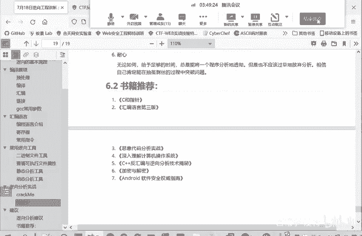

嗯。

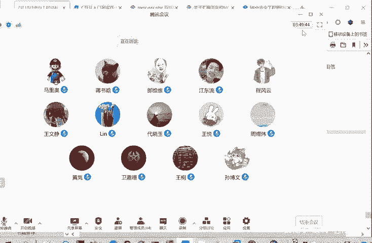

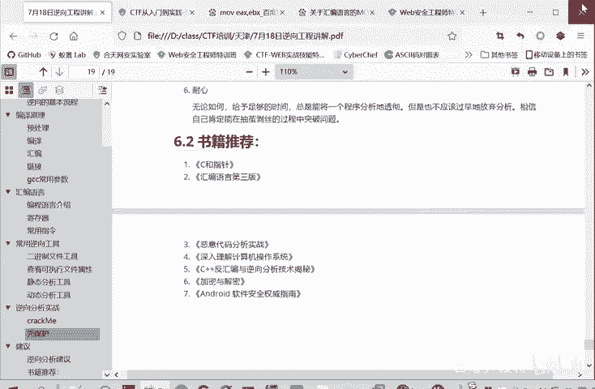

Okay。