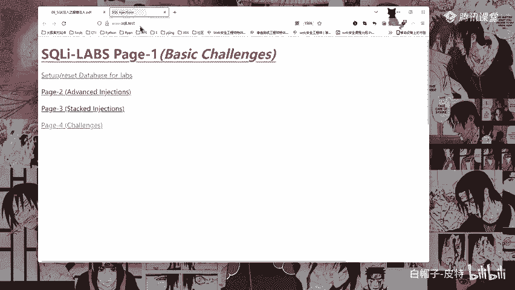
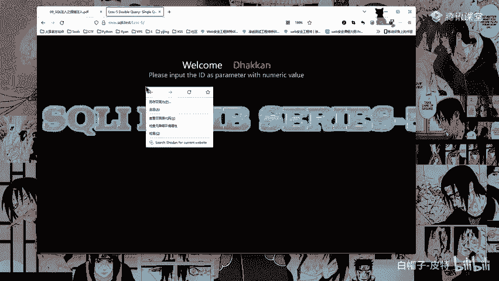

# 2024B站最系统的CTF入门教程！CTF-web,CTF逆向,CTF,misc,CTF-pwn,从基础到赛题实战，手把手带你入门CTF！！ - P37：认识报错注入 - 白帽子-皮特 - BV1m64y157UX

那么今天要给大家讲的是我们的报错注入啊，报错注入这个东西也比较简单啊，其实报错注入也不算难啊。好，我们讲我们今天的一个知识内容啊。报酬注入概念。首先报酬注入是circle注入的一种，页面上没有显示位。

但是会输出circle语句执行错误信息。比如my circle error这个函数的报错信息啊，这个就是其实也也类似于盲助啊，类似于盲助。为什么这么说呢？因为它没有回显位。但是它会有报错啊，它会有报错。

所以呢又叫做报错注入。那么盲住盲住就是在circle注入当中，circle语句执行后查询到的数据不能够回显到前端页面。此时我们需要利用一些方式来进行判断或者尝试这个过程称之为盲住啊。

这个前面应该也讲了circle报错注入就是利用数据库的某些机制人为的制造错误条件，使得查询结果能够出现在错误信息中。错误信息中啊，这种手段在联合查询受限，且能够返回错误信息的情况下比较好用。

所以这就是报错注入的使用场景。啊，在联合查询受限。而且能返回错误信息的情况下啊，这个是报错注入啊，报错注入。比如我们circle labb的第五关啊，第五关，我们这边也可以看一下啊，我这边唉。

看一下第五关。

第五关啊。我们这边拍个吧打开。

问号ID等于一执行下执行下，你看它只有一个UR in啊，它不像我们前面有什么你的什么loin name啊，password呀，这些，对吧？它只有这一个。然后呢，比如说我加个单引号。

加个单引号嗯他就有报错，他就有报错，有这样的一个报错信息啊，或者说随便写嗯。啊，随便写这里呢，它也就只有这个东西，只有这个东西啊。然后你看我写个A啊，直接写个A。他就没有显示对吧？它要么显示要么不显示。

但是它会输出报错信息啊，它会输出报错信息。这就是它的一个区别啊。如果说他没有这个报错信息，那么就是忙住了啊，那么就是忙住了。他有这个报错信息呢，就是报错注入啊，就是报错注入，这就是这个东西。好。

那么报错注入它的分类啊，报错注入它的分类。mycycl报错注入主要是利用my circle的一些逻辑漏洞。根据逻辑原因的不同，可以将my circle报错注入分为以下几类啊，什么b in呀。

这种什么类型溢出啊，然后这个什么叉 pass语法呀，然后这个count那个什么count啊 count count就是数量求数量，然后这个随机数加上group bygroup by分组分组啊。

导致组件重复啊，这个东西呢我们会讲啊会给大家讲，然后什么空间数据类型函数错误啊，这一些啊，那么首先啊这边主要给大家讲的是一个叉 pass叉 pass这个是用的比较多啊。

这个什么update叉 mail这个东西用的比较多。从my circle5。1。5开始，提供了两个叉ML查询和修改的函数，就是一个update叉ML括号啊，这个是函数啊，适用于5。5。5到5。5。

49的版本。然后这个呢这个什么这个东西啊，这个这个函数它就是适用于5。1。5以上的版本，可以通过叉ML函数报错来显示注入命令执行的结果。update叉L函数的结构是update叉L，然后中间是。

叉ml文档的名称啊，然后第一个参数是叉m文档的名称。第二个参数，第二个参数是叉pa格式的字符串。第三个参数是替换查找到符合条件的数据啊，这个是update叉m，然后这个函数啊，这个函数呢它只有两个参数。

一个参数就是也是这个东西啊，其实呢它就是少了第三个参数，与update叉m函数完全一样啊。所以呢后面只讲update叉m函数的使用。这个它的一个区别就是一个有三个参数，一个只有两个参数。

只有最后一个参数不一样。最后一个参数它没有。简而言之，叉ML updateate update叉L函数功能就是查找一个字符串并进行替换。而我们在叉 pass string啊。

也就是这个啊也就是这里啊这里这里第二个参数在第二个参数第二个参数传入不符合叉pa格式的特殊字符，并加上一些查询语句。那么myxicle就会把错误和查询语句的结果，报错显现出来。

这就是叉pa报错输入的原理。所以我们构造payload的时候啊，构造payload的时候，你的查询的语句要写在第二个参数这里，要写在第二个参数这里啊。注意事项啊，必须在叉 pass处。

也就是第二个参数的地方。传特殊字符mycyclcle才会报错，同时还需要加上我们需要注入的命令啊，没有那么多的位置。那么呢就使用到concact函数啊。

concact这个其实conact跟跟我们前面讲的group contact差不多啊。叉pa只会对特殊字符进行报错。这里我们可以使用16进制的0叉71啊，0叉71就是这个波浪线。

就是这个波浪线啊来进行利用。这个波浪线就是给相当于是给我们进行一个定位啊定位。pa只会报错32个字符，对于输出结果大于32个字符的命令。

就要使用sub string截取后分段输出函数说明啊1S2到SN就是将字符串S一S2SN合并为一个字符串，其实就跟我们groupcon一样作用。

sub stringSstar lens从字符串S的star位置截取长度为lan的字符串star从一开始从一开始，这个sub string每个函数里面它的一个下标不一样啊。有可能有可能在别的函数里面。

它这个start是从零开始，但是my circle里面这个start从一开始啊，从一开始。